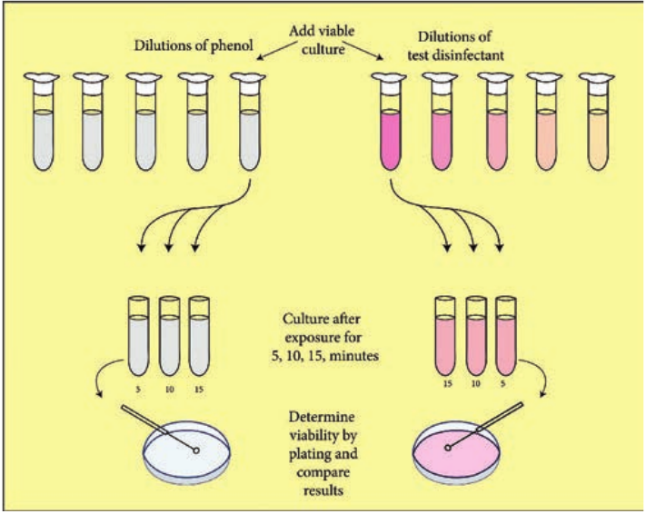
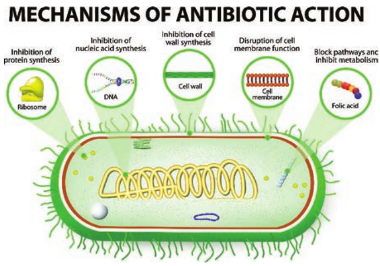
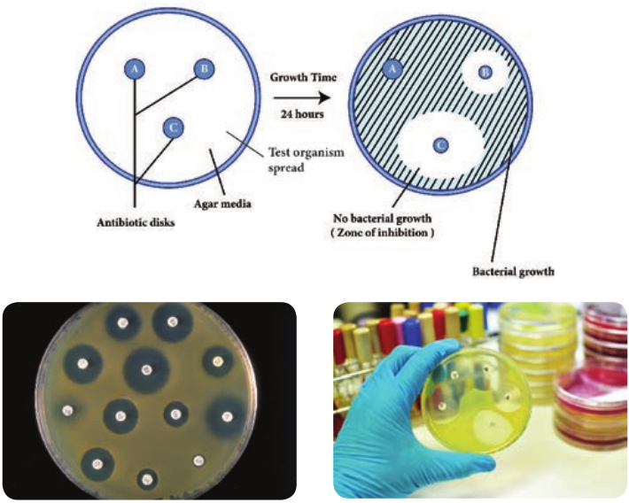
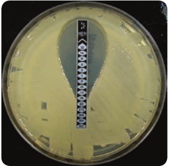
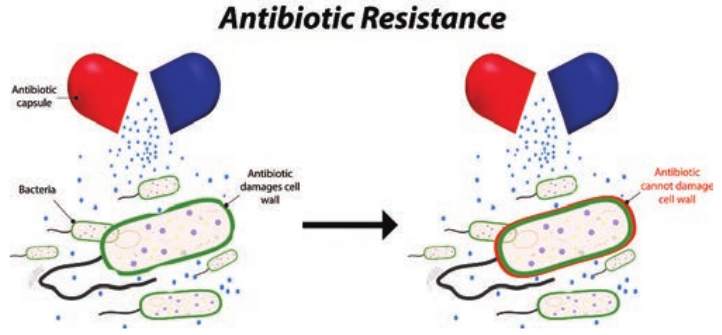

  

**Chapter Outline**

**3.1** Disinfectants, Antiseptics and Antibiotics

**3.2** Factors Influencing the Antimicrobial Activity of Chemical Agents

**3.3** Mode of Action of Chemical Agents

**3.4** Major Groups of Antimicrobial Chemical Agents

**3.5** Evaluation of Antimicrobial Chemical Agents

After studying this chapter the students will be able to,

_- Defines the terms disinfectants, antiseptics and antibiotics_

_- Describe major groups of antimicrobial chemical agents and uses of disinfectants._

_- Describe the factors related to effective disinfectants._

_- Discuss the classification of antibiotics and their mode of action._

_- Know the procedure used in antimicrobial susceptibility testing in clinical laboratory._

_- Know the resistance mechanisms developed by pathogens against antibiotic or chemotherapy drugs._

**Learning Objectives**

**Control of M Chem**

**Chapter**

**3**  

**3.6** Antibiotics

**3.7** Antimicrobial Susceptibility Testing

**3.8** Drugs Resistance Mechanisms

**icroorganisms by ical Methods**

Control of microorganisms is essential in order to prevent the transmission of diseases, infection, spoilage and to prevent unwanted microbial

contamination. Microorganisms are controlled by means of physical agents and chemical agent. In 11th standard, we learnt different physical methods of sterilization. Control by chemical agents refers to the use of disinfectants, antiseptics, antibiotics and chemotherapeutic antimicrobial chemicals. This chapter describes various chemical agents, their mode of action, and their evaluation.

Use of chemicals to sterilize objects and to control microbial pathogen from causing diseases has been in practice since centuries. A large number of chemicals are now available for this purpose. Commercial products which incorporate these chemicals are used in a variety of conditions and they usually differ in their mode of action. No single chemical agent is best for any and all purposes. Hence several classes of chemicals have been identified and new compounds are developed that possess destructive properties in terms of their suitability for practical application.

  

## Disinfectants, Antiseptics and Antibiotics

Disinfection is the elimination of microorganisms from inanimate objects or surfaces. The term disinfectant is used for an agent used to disinfect inanimate objects or surfaces but is generally toxic to use on human tissues. Antiseptic refers to an agent that kills or inhibits growth of microorganisms but is safe to use on human tissues.

Antibiotics produced by microorganisms which kill or inhibit the growth of other microbes.

**Table 3.1:** Basic terms used in Chemical steriliza **Term**

**Disinfection** The selective elimination of cert their transmission directed again the use directly on inanimate obj

**Antisepsis** Prevention of the growth or a or killing; applies to the use of

**\-cide** Suffix used to denote agents, us Commonly used terms are bacter term germicide is used if the agen An agent that kills bacterial spo

**\-static** Suffix used to denote agents, u do not necessarily kill the organ terms include bacteriostatic and

**Term Action** Algicide Agent that kills a Bactericide Agent that kills b Biocide Agent that kills l Fungicide Agent that kills f Germicide Chemical agent

specifically kills microorganisms

Sporicide Agent that kills b endospores

Virucide Inactivates virus lose the ability to  

Following Table gives few examples of antimicrobial chemical agents that destroy unwanted microorganisms.

**Disinfectants Antiseptics Antibiotics** Chlorine, Copper

Phenol, Tincture Iodine

Penicillin, Streptomycin

Basic terms used in chemical control of microorganism are mentioned in Table 3.1 and Table 3.2 Describes the difference between Bactericidal and Bacteriostatic

agents.

tion **Meaning**

ain undesirable microorganisms to prevent st their metabolism or structure; applies to ects. ctivity of microorganisms by inhibition chemicals on living tissue ually chemical, that kill. icide, fungicide, virucide, and algicide. The ts kill pathogens but not necessarily spores. res is a sporicide.

sually chemical, that prevents growth but ism or bacterial spores. Commonly used fungistatic.

**Examples** lgae Copper sulfate acteria Chlorohexidine, ethanol

iving organisms Hypochlorite (bleach) ungi Ethanol that pathogenic

Formaldehyde, silver, mercury

acterial Glutaraldehyde

es so that they replicate

Cationic detergents (qua- ternary ammonium salts of acetates, chlorides)

| Dis inf e c ta nts |Ant i s e pt i c s |Ant ibi ot i c s |
|------|------|------|
| C h lo r in e,C opp e r |Phe no l,Tin c tureIo din e |Penici l lin,St rep tomycin |

| Ter m |Me anin g |
|------|------|
| Dis inf e c ti on |The  selective e limination o f  certain  undesirable  microorganisms t o  prevent their  transmission  directed  against  their  metabolism  or  structure;  applies  to the use directly on inanimate objects. |
| Antis e ps is |P r e v en t io n  o f  t h e  g r o wt h  o r  ac t i v i t y  o f  micr o o r ga ni sm s  b y  in hi b i t io no r k i l lin g; a p p lies t o t h e u s e o f c h emic a l s o n li v in g t i s s ue |
| -ci d e |Suf f ix u s e d t o den ote a gen ts, u su a l ly c hemic a l, t hat k i l l.Commonly used terms are bactericide, fungicide, virucide, and algicide. The term germicide is used if the agents kill pathogens but not necessarily spores.An a gen t t hat k i l ls b ac ter i a l s p ores i s a s p or icide . |
| -s ta ti c |Suf f ix u s e d t o den ote a gen ts, u su a l ly c hemic a l, t hat p re ven ts g rowt h b utdo n ot n e ces s ar i ly k i l l t he o rga ni sm o r b ac ter i a l s p ores. C omm on ly u s e dter ms in clude b ac ter ios t at ic a nd f un g ist at ic. |

| Ter m |Act io n |E xa mpl es |
|------|------|------|
| A lg icide |Agen t t hat k i l ls a lgae |C opp er s u lfa te |
| B ac ter icide |Agen t t hat k i l ls b ac ter i a |C h lo rohexidin e, et hanol |
| Bio cide |Agen t t hat k i l ls li v in g o rga ni sm s |Hyp o ch lo r ite (b le ac h) |
| Fun g icide |Agen t t hat k i l ls f un g i |Et hanol |
| G er micide |C hemic a l a gen t t hatsp e cif ic a l ly k i l ls p at hog enicmicr o orga ni sm s |Formaldehyde, silver, mercur y |
| Sp or icide |Agen t t hat k i l ls b ac ter i a len dos p ores |Glut ara lde hyde |
| Vir ucide |Inac t iva tes v ir us es s o t hat t he ylos e t he a bi li t y t o r ep lic ate |C at io nic det er gen ts (q u a -ter nar y a mm oni um s a ltsof  acet ates, c h lo r ides) |
  

## Factors Influencing the Antimicrobial Activity of Chemical Agents

The following factors will affects the activity of a disinfectant or antiseptic and these should be borne in mind during use.

**a. The Concentration and kind of a chemical agent used** The higher the concentration of the germicide the greater will be the rate of killing. This is particularly important with the phenolic group of compounds, whose activity falls off very rapidly with dilution.

**b. Time of exposure to the agent** In general germicidal activity is increased with time and a sufficient exposure is imperative for efficient disinfection.

**c. Temperature at which the agent is used** An increase of temperature will also raise the rate of killing.

**d. Presence of Organic matter** Most germicides are reduced in activity by the presence of organic matter and particularly by the presence of proteins such as those in body fluids.

**Table 3.2: Difference between Bactericidal and B**

**Bactericidal** Bactericidal refers to agents that kill bacteria

Bacter growth

Action is irreversible Action Inhibit the cell wall formation of bacteria

Inhibi of bac

Do not work with the immune system of the host

Work preven

Minimal Bactericidal Concentration (MBC) refers to the concentration of the drug required to kill 99.99% of the bacterial population

Minim minim the ba

Examples include betalactam antibiot- ics, cephalosporins, and vancomycin

Examp chlora  

**e. Number of organisms present**

The larger the number of organisms, the greater will be the time required for disinfection.

**f. The kinds of microorganisms present - Presence of spores**

Spores are exceptionally resistant to the great majority of disinfection..

## Mode of Action of Chemical Agents

Chemical agents act on microorganisms by:

- They may damage the lipids and proteins of the cytoplasmic membrane of microorganisms.

- They may denature microbial enzymes and other proteins usually by disrupting the hydrogen and disulfide bonds that give the protein its 3-D shape. This blocks metabolism function.

acteriostatic

**Bacteriostatic** iostatic refers to agents that prevent the of bacteria is reversible

t DNA replication and protein synthesis teria with the immune system of the host to t the growth and reproduction of bacteria al Inhibitory Concentration (MIC) is the um drug concentration which inhibits

cterial growth

les include tetracyclines, spectinomycin, mphenicol, sulfonamides, etc.

| Bac teri ci d a l |Bac teri os ta ti c |
|------|------|
| B ac ter icid a l r ef er s t o a gen ts t hat k i l lb ac ter i a |B ac ter ios t at ic r ef er s t o  agen ts  t hat p re ven t t heg rowt h o f b ac ter i a |
| Ac t io n i s ir re ver si ble |Ac t io n i s r e ver si ble |
| In hi bit t he ce l l wa l l f or mat io n o fb ac ter i a |In hi bit  DNA  rep lic at io n  an d  prot ein  sy nt h esi sof  b ac t er i a |
| D o n ot w ork w it h t he imm un e sys temof t he h os t |Work w it h t he imm un e sys tem o f t he h os t t opre ven t the growt h and rep ro duc t io n of b ac ter i a |
| Minim a l B ac ter icid a l C oncen t ra t io n(MB C) r ef er s t o t he co ncen t ra t io n o ft he dr ug r e quir e d t o  k i l l 99.99% o f t heb ac ter i a l p opu l at io n |Minim a l I n hi bitor y C oncen t ra t io n (MI C) i s t heminim um dr ug co ncen t ra t io n w hic h in hi bitst he b ac ter i a l g rowt h |
| E xa mples in clude b et a l ac t am ant ibio t -ics, cep ha los p or in s, a nd va nco mycin |E xa mples  in clude  tet rac yclin es,  sp e c t in omycin,ch lo ra mphenico l, s u lf onamides, et c. |
  

## Major Groups of Antimicrobial Chemical Agents

A large number of chemical agents are in common use. Some of the more common groups are listed below.

**1\. Phenol and Phenolics**

Phenol was the first widely used chemical antiseptic and disinfectant. In 1867, Joseph Lister employed carbolic spray to reduce the risk of infection in surgical theatres. Phenol derivatives called phenolics contain altered molecules of phenol useful as antiseptics and disinfectants. The phenolics damage cell membranes and inactivate enzymes of microorganisms, while denaturing the proteins. Phenolics includes cresols, such as Lysol, as well as several bisphenols, such as hexachlorophene. Today phenol and phenolics such as cresol, xylenol, and orthophenyl phenol are used as disinfectants in laboratories and hospitals.

The commercial disinfectant Lysol is made of mixture of phenolics. Phenolics are tuberculocidal, effective in the presence of organic material, and remain active on surfaces long after application. However, they have a disagreeable odour and can cause skin irritation.

Hexachlorophene is one of the most popular antiseptics because it persists on the skin once applied and reduces skin bacteria for a long period. It is mainly used in soaps and creams. It is an ingredient of various dermatological preparation used for skin disorders.

**2\. Alcohols**

Alcohols are among the most widely used disinfectant and antiseptic. They are bactericidal and fungicidal but not  

sporicidal. Alcohols can destroy the lipid component of enveloped viruses. The two most popular alcoholic germicides are ethanol and isopropanol. They act by denaturing proteins and dissolving membrane lipids. The recommended optimum concentration of ethanol is 70%, but concentration between 60% and 95% are employed to kill germs as well. Thermometers and small instruments are disinfected by immersing in alcohol for 10 to 20 minutes.

**3\. Halogens**

Halogen compounds are broad spectrum compounds that are considered low toxicity, low cost and easy to use. Among the halogens, iodine and chlorine are important antimicrobial agents. Small quantities of drinking water can be disinfected with halazone tablets.

**a. Iodine** Iodine compound are broad spectrum and considered effective for a variety of bacteria, mycobacteria, fungi and viruses. The alcoholic tincture of iodine is highly active against gram positive organisms and so is used as a skin antiseptic. It stains the skin. Iodine combines with microbial protein and inhibits their function.

**b. Chloride** Chloride is also used as a gas to maintain a low microbial count in drinking water. Chlorine together with ammonia called chloramines are used to sanitize glasswall and eating utensils. Sodium hypochlorite (NaOCl) is one of the most widely used chlorine containing disinfectants. Low concentrations (2-500ppm) are active against vegetative bacteria, fungi and most

  

viruses. Rapid sporicidal action can be obtained around 2500ppm, however this concentration is very corrosive so should be limited in its use. High concentrations are also irritating to the mucous membranes, eyes and skin. Chlorine compounds are rapidly inactivated by light and some metals so fresh solutions should always be used. Hypochlorites should never be mixed with acids or ammonia as this will result in the release of toxic chlorine gas.

**c. Iodophores**

The combinations of iodine and organic molecules are called Iodophores. They include wescodine, betadine and previdone. These iodophore contains surface active agents. They cause less irritation to the skin than free Iodine and do not stain. They are used for cleaning wounds and as a general purpose laboratory disinfectant for discarded jars.

**4\. Heavy Metals**

For many years the ions of heavy metals such as mercury, silver, arsenic, zinc, and copper were used as germicides. More recently these have been superseded by other less toxic and more effective germicides. Many heavy metals are more bacteriostatic than bactericidal. There are a few exceptions. 1% solution of Silver nitrate is often applied to the eyes of infants to prevent ophthalmic gonorrhea. Silver sulfadiazine is used on burns. Copper sulfate is an effective algicide used in lake and swimming pools to retard the growth of algae.  

In many hospitals, Erythromycin is used instead of Silver nitrate because it is effective

against _Chlamydia_ as well as _Neisseria_.

Heavy metals combine with sulfhydryl (SH) groups of proteins and inactivate them. High concentration of metallic salts, particularly those of mercury, silver and copper coagulate cellular proteins that results in damage or death of the microbial cell. The most toxic heavy metals are the mercury, silver, and copper.

**5\. Quaternary Ammonium Compounds (Quats)**

The most widely used surface active agents are the cationic detergents, especially the quaternary ammonium compounds (quats).

Quaternary Ammonium compounds are strongly bactericidal against Gram positive bacteria and less active against gram negative bacteria. These include agents such as cetrimide, bromide and benzalkonium chloride. Their antibacterial activity is antagonized by soaps and certain organisms like _Pseudomonas_. They are useful for washing cutlery in catering industry and for cleaning wounds in hospitals. Savlon, a popular antiseptic, is a mixture of cetrimide and chlorohexidine and is active against Gram negative bacteria. They are used as skin disinfectants and as a preservative of ophthalmic solution.

The combined properties of germicidal activity and low toxicity, high solubility in water, stability in solution and non-corrosiveness have resulted in many applications of quaterneries as disinfectants and sanitizing agents.

  

Quats are also fungicidal, amoebicidal, and virucidal against enveloped viruses. They do not kill endospores or mycobacteria.

If you mouthwash bottle fills with foam when shaken, the mouthwash probably contains a quat.

**Infobits**

**6\. Aldehydes**

Aldehydes are highly effective, broad spectrum disinfectant. The most which typically achieve its anitimicrobial action by denaturing proteins and disrupting nucleic acids. Commonly used aldehydes are formaldehyde and glutaraldehyde. Formaldehyde is usually dissolved in water or alcohol before use. Formaldehyde is used as a surface disinfectat and a fumigant and has been used to decontaminate in animate objects. A concentration of 2% glutaraldehyde is an effective disinfectant. It is less irritating than formaldehyde and is used to disinfect hospital and laboratory equipments. Glutaraldehyde usually disinfects objects about 10 minutes but may require as long as 12 hours to destroy all spores.

**Disinfection of Rooms** Fumigation with gaseous disinfectants was at one time commonly performed after a room had been occupied by a patient with an infections disease. Sulphur-di-oxide, generated by burning sulphur was the popular agent for this purpose but it is effective only if the relative humidity is 60 percent or more.

**Infobits**  

These are highly reactive molecules that combine with nucleic acids and proteins and inactivate them. They disrupt the function of cell organelles and kill the cells probably by cross linking and alkylating the molecules. These are sporicidal and can be used as chemical sterilants.

**7\. Gaseous Sterilization**

Gaseous disinfectants (alkylating agents) are used for the sterilization or disinfection of hospital equipment that is bulky or heat labile. The most widely used gases are ethylene oxide, formaldehyde and β Propiolactone.

**Ethylene oxide (EtO)**

Ethylene oxide has a boiling point of 10.8°C. It is highly inflammable and explosive in pure form, but is safe to handle when mixed with Carbon dioxide. It is powerful in the killing of all bacteria, including tubercule bacilli and spores. It is an effective sterilizing agent because it rapidly penetrates packing materials, even plastic wrappers. To be potent, however, the humidity and temperature must be carefully controlled within narrow limits.

It is highly toxic on contact with the skin or mucous membrane. Materials that have been sterilized with ethylene oxide must be set aside in detoxification chambers for a few days to allow the gases to dissipate. It is frequently used to sterilize heart lung machines and plastic items like catheters.

  

Recently vapour – phase hydrogen peroxide has been used to decontaminate

biological safety cabinets.

**Formaldehyde** It is highly bactericidal. Formaldehyde is used as 40% formalin with humidity at around 50%. It causes irritation. It is used occasionally to fumigate rooms and disinfect respirators.

**Betapropiolactone (BPL)** This is occasionally employed as a sterilizing gas in the liquid form. It has been used to sterilize vaccines, tissue grafts, surgical instrument and enzyme as a sterilants of blood plasma, water, milk and as a vapour – phase disinfectant in enclosed spaces, short-term inhalation exposure to betapropiolactone causes severe irritation of the eyes, nose, throat and respiratory tract in humans.

BPL decomposes to an inactive form after several hours and is therefore not difficult to eliminate. It destroys microorganisms more readily than ethylene oxide but does not penetrate materials well and may be carcinogenic. For these reasons, BPL has not been used as extensively as EtO.

## Evaluation of Antimicrobial Chemical Agents

Testing of antimicrobial agents is a complex process regulated by two different federal agencies.

The U.S. Environmental Protection Agency regulates disinfectants, where as  

agents used on humans and animals are under the control of the Food and Drug Administration.

Testing of antimicrobial agents often begins with an initial screening test to see if they are effective and at what concentrations.

Laboratory techniques for the evaluation of antimicrobial chemical agents are conducted by one of the following three general procedures. In each procedure, the chemical agent is tested against a specific microorganisms referred to as the test organism.

**Agar Plate Method**

A plate of agar medium is inoculated with the test organism and the chemical agent is placed on the surface of the medium. The chemical solution is first impregnated in absorbent papers or confined by a hollow cylinder placed on the agar surface. Following incubation, the plate is observed for a zone of inhibition around the chemical agent. This is particularly suitable for semisolid preparations.

**Tube Dilution Methods**

Appropriately diluted water soluble liquid substances are dispensed into sterile test tubes and are inoculated with a measured amount of the test organism. At specified intervals, a transfer is made from this tube into tubes of sterile media that are then incubated and observed for the appearance of growth. It is necessary in this type of procedure to ascertain whether the inhibitory action is bactericidal and not bacteriostatic. This approach can also be used to determine the number of organisms killed per unit time by performing a plate count on samples taken at appropriate intervals.

  

**Phenol Coefficient Test**

Phenol coefficient is a measure of the bactericidal activity of a chemical compound in relation to phenol. Phenol coefficient is calculated by dividing the concentration of test disinfectant at which it kills the organism in 10 minutes and not in 5 minutes under the same conditions. This method is used for evaluating the efficiency of water- miscible disinfectants.

Series of 10 test tubes with 2ml of distilled water is taken (Figure 3.1).

Phenol is added to first test tube and dilution is made by transferring 1ml to next tube up to 5 dilutions. Similarly commercial disinfectant is also diluted. Pure culture of test organisms, such as _Staphylococcus aureus_ or _Salmonella typhi_, is added to test tubes. Subcultures from these tubes incubated at 37°C for 48 hours are examined for the presence or absence of growth at intervals of 5, 10 and 15 minutes. The highest dilution that kills the bacteria after 10 minutes, but not after 5 minutes is used to calculate the phenol coefficient (Table 3.3),

coefficient test

  

**Table 3.3: Illustration of phenol coefficient** determination

**Chemical Agent and Dilution**

**Presence of Growth in Subcultures (minutes)**

5 10 15 Phenol 1:80 1:90\*

1:100

\- + +

\- - +

\- - -

Test Chemical 1:400 1:450+

1:500

\- + +

\- - +

\- - -

Phenol dilution of 1:90 showed growth at 5 minutes but no growth at 10 minutes Test Chemical dilution of 1:450 showed growth at 5 minutes but no growth at 10 minutes phenol coefficient of test chemical as 450/90=5.

## Antibiotics
 The term ‘antibiotic’ was derived from ‘antibiosis’ which refers to the suppression of microorganisms due to secretion of toxic or inhibitory compounds by other microorganisms. Although antibiosis has been observed by many scientific workers fairly frequently towards the end of the nineteenth century, it was not until the discovery and development of Penicillin that a truly wide ranging search for antibiotics was initiated.

Antibiotics are not effective against viral infections such as the common cold.  

**Historical Development**

The first chemotherapeutic agent, discovered by Paul Ehrlich, was Salvarsan, used to treat syphilis.

Alexander Fleming discovered the first antibiotic, penicillin, in 1929; its first clinical trails were done in 1940.

Antibiotics are produced by species of Streptomyces, Bacillus, Penicillium and Cephalosporium.

1904 Ehrlich found that the dye trypan red was active against the trypanosome that causes African sleeping sickness and could be used therapeutically.

**Infobits**

Drugs such as the sulfonamides are sometimes called antibiotics although they are synthetic chemotherapeutic agents which are not synthesized using microbes.

**Classification of Antibiotics**

The antibiotics are usually classified on the basis of. 
- Target group of microorganism. 
- Antimicrobial spectrum an. 
- Mode of action

™ **Classification based on target group of microorganisms** Based on the target group, the antibiotics can be classified as antibacterial, antifungal and antiviral.

™ **Classification based on Antimicrobial spectrum** Antimicrobial spectrum or antibiotic spectrum refers to the range of

| C he mi c a lAge nt a ndD i luti on |Pres enc e o f G row th inSu b c u ltur es (min utes) |
|------|------|------|------|
| 5 |10 |15 |
| Phe no l1:801:901:100* |-++ |--+ |--- |
| Tes t C hemic a l1:4001:4501:500+ |-++ |--+ |--- |
  

effectiveness of antibiotics on different kind of microorganisms, i.e. the range of different kind of microorganisms that can be inhibited, killed, or lysed by a particular type of antibiotic.

The susceptibility of microorganisms to individual antibiotic varies significantly and on account of this, the antibiotics can be classified in two groups as,

**Broad – spectrum antibiotics** These attack different kinds of microbial pathogens and therefore find wider medical use. Antibacterial antibiotics of broad – spectrum are effective against both Gram positive and Gram negative bacteria. They also attack pathogens belonging to _Mycobacteria_, _Rickettsia_, and _Chlamydia_. Similarly, broad – spectrum antifungal antibiotics attack different type of fungal pathogens.

**Narrow – spectrum antibiotics** Narrow – spectrum antibiotics are categorized as those that are effective only against a limited variety of microbial pathogens. These antibiotics are quite valuable for the control of microbial pathogens that fail to respond to other antibiotics. For example, vancomycin is a narrow spectrum glycopeptide. It is an effective bactericidal agent for gram – positive penicillin resistant bacterial pathogens belonging to genera _Staphylococcus, Bacillus,_ and _Clostridium_.

### Mode of Action of Antibiotics

The mode of action of antibiotics varies as they damage pathogens in several ways (Flowchart 3.1). Some of the important  

actions of therapeutic drugs in microbial pathogens are as follows.

Cell wall synthesis, Protein synthesis, Nucleic acid synthesis, Cell membrane disruption and Metabolic pathways blockage.

**1\. Inhibition of Cell Wall Synthesis**

The most selective therapeutic antibiotics are those that interfere with the synthesis of bacterial cell walls. These drugs posses a high therapeutic index because bacterial cell walls have a unique structure which is not found in eukaryotic cells. The important cell wall attacking drugs are Penicillin, Cephalosporin, Ampicillin, Methicillin and Vancomycin.

**2\. Inhibition of Protein Synthesis**

Many therapeutic antibiotics discriminate between prokaryotic and eukaryotic ribosomes and inhibit protein synthesis. The therapeutic index of these drugs is fairly high, but not as favourable as that of cell wall synthesis inhibitors. Several of these drugs are medically useful and effective research tools because they block individual steps in protein synthesis. Some therapeutic drugs bind to 30S while others attach to 50S ribosomal subunits. Example Streptomycin, Chloramphenicol, Tetracyclin and Erythromycin

A chemotherapeutic agent destroys or inhibit the intracellular parasite

by penetrating the cells and tissues of the host in effective concentrations.

  

**3\. Inhibition of Nucleic Acid Synthesis**

Some antimicrobial drugs or antibiotics inhibit nucleic acid synthesis. These are not selectively toxic as other drugs. This is due to the fact that prokaryotic and eukaryotic nucleic acid synthesis mechanisms do not vary greatly. Example Quinolones, Novobiocin, Actinomycin and Rifampin

**4\. Disruption of Cell Membrane**

There are some antimicrobial drugs or antibiotics that act as cell membrane

Mode of Ac

Cell wall synthesis

Protein synthesis

Nuclei acid

synthes

**Flowchart 3.1:** Mode of

disorganizing agents. Polymyxins are such drugs of clinical importance.

E.g. Polymyxin B and Polymyxin E (colistin)

**5\. Blocking Metabolic Pathways**

Some therapeutic drugs act as antimetabolites and block the functioning of metabolic pathways. They competitively inhibit the key enzymes in the metabolic pathway. Example Sulfonamides,

tion

c

is

Metabolic pathways blockage

Cell membrane disruption

action of antibiotics

of Antibiotic action

| Mo de o f A c t io n |
|------|------|------|------|------|

  

Trimethoprim, Dapsone and Isoniazid (Figure 3.2).

## Antimicrobial Susceptibility Testing

Antimicrobial susceptibility tests are used to determine the type and quantity of antimicrobial agents used in chemotherapy. One of the most important functions of a clinical laboratory is to determine the antimicrobial susceptibility. Antimicrobial susceptibility of pathogens refers to the limitation of pathogens to grow in the presence of effective antibiotics. There are two methods that can be used to determine the susceptibility of a potential pathogen to antimicrobial agents. They are. 
- Disk diffusion metho. 
- Tube dilution method

**Disc Diffusion Method (Kirby – Bauer Test)**

William Kirby and Alfred Bauer, in 1966 first introduced the principle of measuring zones of inhibition around antibiotic discs to determine antimicrobial agent susceptibilities. It is a rapid, convenient method to determine the susceptibilities of microorganisms to antimicrobial agents and a most common procedure used in susceptibility testing in clinical laboratory.

Filter paper discs containing known concentrations of antimicrobial agents are placed onto the surface of an agar plate (Muller – Hinton agar medium) inoculated with the test bacterium (Figure 3.3). The plate is incubated for 16 to 18 hours, and the zones of inhibition are read around each  

paper disc. During the incubation periods, the antimicrobial agent diffuses through the agar, and a concentration gradient of agent is established. At some point in this gradient, growth of the susceptible bacteria is suppressed, and no growth is observed within a circular zone around disc. The size of a zone of inhibition must be compared to a standard Table for that particular drug before accurate comparisons can be made. Thus, enabling to classify pathogens as susceptible (S), intermediate or resistant (R) to a drug. The procedure is highly regulated and controlled by the clinical and laboratory standards institute (CLSI) and must be accompanied by a rigorous quality assurance program including performance by certified and/or licensed personnel when the results are to be reported in clinical settings.

**Minimal Inhibitory Concentration (MIC) Test**

The potency of an effective antimicrobial agent is expressed in terms of **minimal inhibitory concentration (MIC)**. It is the minimum concentration of drug that will **inhibit** the growth of pathogen. The MIC is determined by serial dilutions of antimicrobial agents in tubes with standard amount of bacteria. Turbidity (cloudiness) after incubation indicates bacterial growth and lack of turbidity indicates that the growth of bacteria is inhibited.

**E – test** This is another test to determine the minimum inhibitory concentration where a plastic strip containing a gradient of the antimicrobial agent is used (Figure 3.4). An elliptical zone of inhibitory concentration can be noted with the help of a scale printed on the strip.

  

owing sensitivity and resistance towards

**The Minimal Bactericidal Concentration (MBC) Test**

MBC test is similar to MIC, the minimal bactericidal concentration test is used to determine the amount of antimicrobial agent required to rather **kill** the pathogen. In MBC test, samples taken from MIC tubes are transferred to drug free plates. Bacterial growth in these subcultures indicates that some bacterial cells have survived antimicrobial drug. The lowest concentration of drug for which no growth occurs is the minimum bactericidal concentration.

  

The tube dilution method is considered accurate for determining susceptibility of a pathogen to precise quantities of antimicrobial agent. However, the method is time consuming, expensive, and not practical for use in most clinical laboratories for routine susceptibility testing.

**What is CRE?** CRE, which stands for carbapenem resistant Enterobacteriaceae, is the most fearsome family of germs because it is resistant even to last-resort antiboitics.

**Infobits**

## Drugs Resistance Mechanisms
 Some microbes respond predictably to certain drugs making selection of treatment easy. Other microbes may vary in their responses, and laboratory tests are usually required to ensure that the selected therapy is appropriate. Chemotherapeutic

effectiveness depends upon the sensitivity of the pathogen to the agent. Antibiotic resistance, however, may develop in microbes within the population. In fact, the history of chemotherapy has been closely paralleled by the history of drug resistance.

None of the therapeutic drugs (antibiotic) inhibits all microbial pathogens and some microbial pathogens possess natural ability to resist to certain antibiotics. Bacteria become drug resistant using several different resistance mechanisms. A particular type of resistance mechanism is not confined to a single class of drugs. Two bacteria may employ different resistance mechanisms to counter the same antibiotic. However, bacteria acquire drugs resistance using resistance mechanisms such as reduced permeability to antibiotic, efflux (pumping) antibiotic out of the cell, drug inactivation through chemical modification, target modification and development of a resistant biochemical pathway (Figure 3.5).

tance mechanisms

  

Methicillin-resistant staphylococcus aureus (MRSA) is a bacteria that is resistant to many antiobiotics. Staph and MRSA can cause a variety of problems ranging from are skin infections and sepsis to pneumonia to blood stream infections.

**Infobits**

**Summary**

Chemical control refers to the use of disinfectants, antiseptics, antibiotics and chemotherapeutic antimicrobial chemicals. Disinfection is the elimination of microorganism, but not necessarily endospores, from inanimate objects or surface. A disinfectant is an agents used to disinfect inanimate objects but generally to toxic to use on human tissues. An antibiotic is a metabolic product produced by one microorganisms that inhibits or kills other microorganism. Synthetic chemicals that can be used therapeutically.

An agent that is static in action inhibits the growth of microorganism. An agent that is cidal in action kills microorganism. Selective toxicity means that the chemical being used should inhibit or kill the intended pathogen without seriously harming the host. A broad spectrum agent is one generally effective against a variety of gram positive & gram negative bacteria. A narrow spectrum agent generally works against just Gram positive, gram negative or only a few bacteria.  

**Evaluation**

**Multiple choice questions**

1\. Identify the term that describes a disinfectant that can kill bacteria: a. Bactericidal b. Bacteriostatic c. Pathogenic d. Bacteriosis

2\. Which of the following is not a disinfectant containing a heavy metal? a. Silver b. Mercury c. Zinc d. Chlorine

3\. Which of the following is most effective for sterilizing mattresses and plastic petriplates? a. Chlorine b. Ethylene oxide c. Glutaraldehyde d. Ultraviolet radiation

4\. is used to prevent infection by killing or inhibiting pathogen growth on animal tissue. a. Bacteriostatic agent b. Sanitizer c. Disinfectant d. Antiseptic

5\. In the disk-diffusion assay, a large zone of inhibition around a disk to which a chemical disinfectant has been applied indicates of the test microbe to the chemical disinfectant. a. Susceptibility or Sensitivity b. Resistant c. Intermediate d. None of these

  

6\. Which of the following agents are used as a preservative in ophthalmic solution? a. Alcohol b. Quaternary ammonium salts c. Phenol d. Aldehydes

7\. Which of the following chemical lack penetrating power? a. Phenol b. Iodine c. Ethylene oxide d. Beta-propiolactone

8\. Polymyxins inhibits the growth of the microbes by carrying get which of the following actions? a. Inhibition of cell-wall synthesis b. Damage to cell membrane c. Inhibition of nucleic acid and

protein synthesis d. Inhibition of specific enzyme

systems 9. All of the following are sporicidal

except a. Glutaraldehyde b. Ethylene oxide c. Formaldehyde d. Alcohol

**Answer the following**

1\. Define Disinfectants/antiseptics/ antibiotics.

2\. Difference between Bacteriostatic and Bactericidal ?

3\. What is Iodophores ? 4. Explain the mode of action of chemical

agents against microorganisms?  

5\. Listout the major groups of antimicrobial chemical agents with an example.

6\. Give examples of antimicrobial chemical agent which act as both disinfectant and antiseptics ?

7\. Give an account on Gaseous sterilization ?

8\. Describe the test is used to evaluate antimicrobial agent ?

9\. How antibiotics the therapeutic drugs acts on target microorganisms?

10\. Through disc diffusion method how an antibiotic sensitivity of microorganism is evaluated and explain the test ?

11\. What is E – test?

