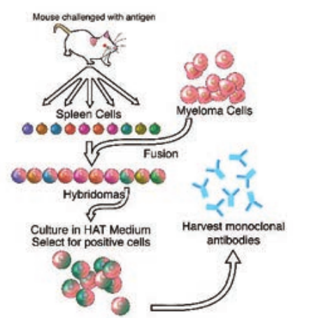
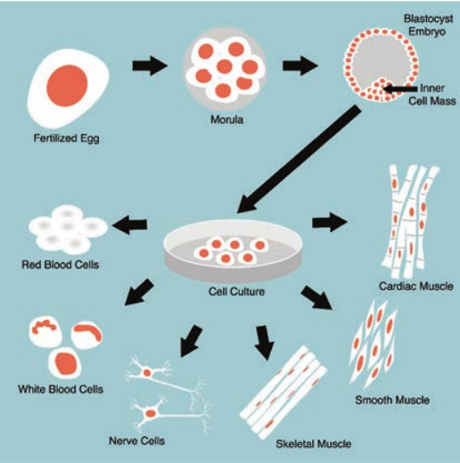
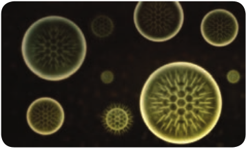

  

**Chapter Outline**

**1.1** Microbes in Space

**1.2** Immunology

**1.3** Molecular Biology and Genetic Engineering

**1.4** Nanoparticles Production Using Microbes

**1.5** Equipments

After studying this chapter the students will be able to,

_- Know the microbes in spac. 
- Learn about genetically modified_

_microbe. 
- Appreciate nanoparticles production_

_using microbe. 
- Know the important of microbiom. 
- Understand the applications of_

_automated machines in microbial identification_

**Learning Objectives**

**Developmen**

**Chapter**

**1**

The field of microbiology, critical to human beings, not only due to the infectious diseases caused by these microbes but because “good” microorganisms are necessary to live on the planet and their extraordinary diversity of structure, function, habitat  

**ts in Microbiology**

and applications are of paramount importance. Microorganisms (or microbes) inhabiting every corner of the globe, are indispensable to life

on Earth and are responsible for some of the deadliest human diseases and form the basis of many industrial processes. This field of study could be considered as one of the most important areas of knowledge, considering that the bacteria in and on our bodies outnumber our own cells.

Microbiology, an organismal discipline concerned with the properties of small forms of life or microorganisms. Bacteria neatly fit this definition, but what about fungi and algae? These two groups each contain members that are far from microscopic. On the other hand, certain animals, such as nematode worms, can be microscopic, yet are not considered to be the domain of the microbiologist. Viruses represent another special case; they are most certainly microscopic (indeed, most are submicroscopic), but by most accepted definitions they are not living. The concept of microbiology is remarkably broad in covering bacteria, protozoa and the viruses, which differ profoundly their structural and biological properties. Microbiology is without aquestion, a

  

branch of biology that possesses both unity and coherence.

The following list of specializations in microbiology will provide an insight on the significance of microbiology in the world today:

- Medicin. 
- Environmental scienc. 
- Food productio. 
- Fundamental Researc. 
- Agricultur. 
- Pharmaceutical Industr. 
- Genetic Engineering

The popular perception among the general public, however, remains one of infections and plagues. In reality, only a couple of hundred out of the half million or so known bacterial species, termed as pathogens with the potential to cause disease give rise to infections in humans and dominate the microbial world.

## Microbes in Space

The majority of experiments on microorganisms in space were performed using Earth-orbiting robotic spacecraft, Example: the Russian **_Foton_** satellites and the **_European Retrievable Carrier_** (EURECA) (121), or human-tended spacecraft, such as space shuttles (106, 107) and space stations, Example: **_MIR_** and the **_International Space Station_** (ISS).

Only twice, during translunar trips of **_Apollo 16_** and **_17_** in the early 1970s, were microorganisms exposed to space conditions beyond Earth’s magnetic shield, in the MEED (microbial ecology equipment device) facility and in the Biostack experiments. Arriving in space without any protection, _microorganisms_  

are confronted with an extremely hostile environment, characterized by an intense radiation field of galactic and solar origin, high vacuum, extreme temperatures, and microgravity.

1\. What are the sources of microorganisms in space?

2\. How do bacteria survey in space?

**HOTS**

Some bacteria were found in International Space Station and on the Mars Rover. Some bacteria and tiny microbes called tardigrades are able to survive for longer periods in space. This ability of surviving in extreme environmental condition leads to forward contamination. Sea planktons and other microorganisms have been identified in cosmonauts’ spacewalk samples.

In July 2016, Kate Rubins was the first to sequence DNA in space. NASA astronaut Peggy Whitson amplified and sequenced the DNA of bacteria that grew as colonies in the petri plate on the surface on the space station. In June 2018, Professor George Fox and his team have isolated genus _Bacillus_ from spacecraft assembly rooms at the Jet Propulsion Laboratory. They have sequenced the complete genomes of two strains, B. _safensis_ FO-36bT and B. _pumilus_ SAFR-032 and found that they are resistant to radiation.

Los Angeles in great news for India, scientists at NASA have named a new organism discovered by them after the much loved APJ Abdul Kalam. Till date, the new organism – a form of bacteria – has been found only on the International Space

  

Station (ISS) and has been found on earth. Researchers at the Jet Propulsion Laboratory (JPL) the foremost lab of NASA for work on inter-planetary travel discovered the new bacteria on the filters of the international space station (ISS) and named it Solibacillus kalam to honour the late president, who was a renowned aerospace scientist.

What could be source of microorgan- isms in space?

**HOTS**

## Immunology

Immunology is the study of the immune system and is a very important branch of the medical and biological sciences. The immune system protects us from infection through various lines of defence.

Important initial barriers to infection are physical (Example: the **skin**), enhanced by substances secreted by the body, such as saliva and tears, that contain molecules that can neutralise bacteria. The internal **mucosal tissues** (Example: **lungs & airways**, and the **gut**) are coated with mucus that is able to trap potential infectants. In the airways, mobile ciliate hairs work together to transport contaminants away from vulnerable areas. Tissues such as the skin, mucosal surfaces and airways also contain populations of immune cells that can respond to infectants that breach these physical defences.

In its most complex forms, the immune system consists of two branches: the **innate immune system** that utilises certain ‘hard-wired’ strategies to provide a rapid, general, response when alerted  

by certain typical signals of infection (essentially forming a first-line of defence); and the **adaptive immune system** that is able to develop highly specific responses (and a persistent ‘immune memory’) to target infection with extraordinary accuracy. Both systems work in close cooperation and, to an important extent, the adaptive immune system relies upon the innate immune system to alert it to potential targets, and shape its response to them.

**Vaccines currently in development include*. 
- A genetically-modified vaccine for the

treatment of pancreatic cancer. 
- A therapeutic vaccine that increases

the immune response against the HIV virus.

- A vaccine that protects infants against meningococcal disease, a leading cause of meningitis.

- An immunotherapeutic vaccine for the treatment of Alzheimer’s disease.

- A recombinant vaccine to prevent malaria. Evolving science has increasingly

enabled researchers to explore both promising therapeutic vaccines and new preventative agents for infectious diseases. Although the development process is extremely complex, advances in other scientific fields, such as genomics, are being leveraged in the development of new vaccines.

“Vaccines have been a major contributor in saving countless lives around the world,” said Castellani. “Vaccinations contribute to the public

  

health at large, and they make good economic sense. The many exciting candidates in the pipeline offer great hope for a healthier, more productive future.”

### Monoclonal Antibodies

mAb or moAb are identical immunoglobulins, generated from a single B-cell clone. These antibodies recognize unique epitopes, or binding sites, on a single antigen. Derivation from a single B-cell clones and subsequent targeting of a single epitope is what differentiates monoclonal antibodies from polyclonal antibodies

The traditional monoclonal antibody (mAb) production process usually starts with generation of mAb-producing cells (i.e. hybridomas) by fusing myeloma cells with desired antibody-producing splenocytes (Example: B cells). These B cells are typically sourced from animals, usually mice. After cell fusion, large numbers of clones are screened and

 Monoclonal antibody  

selected on the basis of antigen specificity and immunoglobulin class (Figure 1.1).

### Stem Cell & Therapy
 Stem cells are biological cells that can differentiate into other types of cells & they are found in multicellular organism. Stem cells are a class of undifferentiated cells that are able to differentiate into specialized cell types. Commonly, stem cells come from two main sources. 
- Embryos formed during the blastocyst

phase of embryological development (embryonic stem cells) and

- Adult tissue (adult stem cells). Both types are generally characterized

by their potency, or potential to differentiate into different cell types such as skin, muscle, bone, etc., (Figure 1.2).

**Stem-cell therapy** is the use of stem cells to treat or prevent a disease or condition. **Stem Cell Therapy** (SCT) is the treatment of various disorders, non-serious to life threatening, by using stem cells. These stem cells can be procured from a lot of different sources and used to potentially treat **more than 80 disorders**, including neuromuscular and degenerative disorders.

Hematopoietic disorders (Example: leukaemia, thallassemia, aplastic anemia, MDS, sickle cell anemia, storage disorders etc.) affect the bone marrow and manifest with various systemic complications. Stem cells from a donor (either from cord blood or bone marrow) are known to reconstitute the defective bone marrow and permanently overcome the disorder.

  

## Molecular Biology and Genetic Engineering

Molecular biology- is the study of the structure, function & makeup of the molecular building blocks of life. It focuses on the interactions between the various system of a cell, including the interrelationship of DNA, RNA & Protein synthesis &how these interaction are regulated. Bioscience, Molecular biology closely interrelate with the fields of Biochemistry, Genetics & Cell biology.

Molecular biology is a specialised branch of biochemistry, the study of the chemistry of molecules which are

 St  

specifically connected to living processes. Importance to molecular biology are the nucleicacids (DNA and RNA) and the proteins which are constructed using the genetic instructions encoded in those molecules. Other biomolecules, such as carbohydrates and lipids may also be studied for the interactions they have with nucleic acids and proteins. Molecular biology is often separated from the field of cell biology, which concentrates on cellular structures (organelles and the like), molecular pathways within cells and cell life cycles.

em cells

  

**Genetic Engineering**

Genetic Engineering is the act of modifying the genetic makeup of an organism. Modification can be generated by methods such as gene therapy, nuclear transplantation, transfection of synthetic chromosome or viral insertion.

The manipulation of genetic make up of living cells by inserting desired genes through a DNA vector, is the genetic engineering. The gene is a small piece of DNA that encodes for a specific protein. The gene is inserted into a \`vector DNA so that a new combination of vector DNA is formed. The DNA formed by joining DNA segments of two different organisms is called recombinant DNA. The organism whose genetic make up is manipulated using recombinant DNA technique, is called genetically manipulated organism (GMO).

Genetic engineering has many application in agriculture, animal science, industry and medicines (Figure 1.3).

 Genetic Engineering  

**Genetically Modified Organism (GMO)**

Organism genome has been engineered in the laboratory in order to favour the expression of desired physiological traits or the production of desired biological products. In conventional livestock production, crop farming, and even pet breeding, it has long been the practice to breed select individuals of a species in order to produce offspring that have desirable traits. In genetic modification, however, recombinant genetic technologies are employed to produce organisms whose genomes have been precisely altered at the molecular level, usually by the inclusion of genes from unrelated species of organisms that code for traits that would not be obtained easily through conventional selective breeding.

GMOs are produced through using scientific methods that include recombinant DNA technology and reproductive cloning. In reproductive cloning, a nucleus is extracted from a cell of the individual to be cloned and is inserted into the enucleated cytoplasm of a host egg. The process results in the generation of an offspring that is genetically identical to the donor individual. The first animal produced by means of this cloning technique with a nucleus from an adult donor cell (as opposed to a donor embryo) was a sheep named Dolly, born in 1996. Since then a number of other animals, including pigs, horses, and dogs, have been generated by reproductive cloning technology. Recombinant DNA technology, on the other hand, involves the insertion of one or more individual genes from an organism of one species

  

into the DNA (deoxyribonucleic acid) of another. Whole-genome replacement, involving the transplantation of one bacterial genome into the “cell body,” or cytoplasm, of another microorganism, has been reported, although this technology is still limited to basic scientific applications.

## Nanoparticles Production Using Microbes

Particles with one or more dimensions of the order of 100 nm or less. There are a large number of physical, chemical, biological, and hybrid methods available to synthesize different types of nanoparticles. Although physical and chemical methods are more popular in the synthesis of nanoparticles, the use of toxic chemicals greatly limits their biomedical applications, in particular in clinical fields. Therefore, development of reliable, nontoxic, and eco-friendly methods for synthesis of nanoparticles is of utmost importance to expand their biomedical applications. One of the options to achieve this goal is to use microorganisms to synthesize nanoparticles.

Nanoparticles are biosynthesized when the microorganisms grab target ions from their environment and then turn the metal ions into the element metal through enzymes generated by the cell activities. It can be classified into intra-cellular and extracellular synthesis according to the location where nanoparticles are formed. The intracellular method consists of transporting ions into the microbial cell to form nanoparticles in the presence of enzymes. The extracellular synthesis of nanoparticles involves trapping the  

metal ions on the surface of the cells and reducing ions in the presence of enzymes.

The biosynthesized nanoparticles have been used in a variety of applications including drug carriers for targeted delivery, cancer treatment, gene therapy and DNA analysis, antibacterial agents, biosensors, enhancing reaction rates, separation science, and magnetic resonance imaging (MRI). Many microorganisms can produce inorganic nanoparticles through either intracellular or extracellular routes. This section describes the production of various nanoparticles via biological methods following the categories of metallic nanoparticles including gold, silver, alloy and other metal nanoparticles, oxide nanoparticles consisting of magnetic and nonmagnetic oxide nanoparticles, sulfide nanoparticles, and other miscellaneous nanoparticles (Figure 1.4).

## Equipments

### Confocal Microscopy

Confocal microscopy offers several advantages over conventional optical microscopy, including shallow depth of field, elimination of out-of-focus glare, and the ability to collect serial optical sections from thick specimens. In the biomedical sciences, a major application

  

of confocal microscopy involves imaging either fixed or living cells and tissues that have usually been labeled with one or more fluorescent probes.

Confocal microscopy, most frequently **confocal laser scanning microscopy (CLSM)** or **laser confocal scanning microscopy (LCSM)**, is an optical imaging technique for increasing optical resolution and contrast of a micrograph by means of using a spatial pinhole to block out- of-focus light in image formation. Capturing multiple two-dimensional images at different depths in a sample enables the reconstruction of three-dimensional structures (a process known as optical sectioning) within an object. This technique is used extensively in the scientific and industrial communities and typical applications are in life sciences, semiconductor inspection and materials science.

Light travels through the sample under a conventional microscope as far into the specimen as it can penetrate, while a confocal microscope only focuses a smaller beam of light at one narrow depth level at a time. The CLSM achieves a controlled and highly limited depth of focus.

**Microbiome** The human microbi- ome is composed of communities of bacte-

ria, viruses and fungi that have a greater complexity than the human genome it- self. Genome sequencing technologies and metagenomic analysis has helped in our understanding of human micro- biome. This is useful in manipulation of gut microbiome to be used in the treat- ment of childhood diseases.  

### DNA Sequencing System

Sequencing means finding the order of nucleotides on a piece of DNA. Nucleotide order determines amino acid order, and by extension, protein structure and function (proteomics). An alteration in a DNA sequence can lead to an altered or non functional protein, and hence to a genetic disorder. DNA sequence is important to detect the type of mutations in genetic diseases and offer hope for the eventual development of treatment DNA.

**Methods of sequencing 1. Sanger dideoxy (primer extension/ chain-termination) method** Most popular protocol for sequencing, very adaptable, scalable to large sequencing projects. **2\. Maxam-Gilbert chemical cleavage method** DNA is labelled and then chemically cleaved in a sequence dependent manner. This method is not easily scaled and is rather tedious.

It provides an important tool for determining the thousands of nucleotide variations associated with specific genetic diseases, like Huntington’s, which may help to better understand these diseases and advance treatment.

**Summary**

Microorganisms (or microbes) inhabiting every corner of the globe, are indispensable to life on Earth and are responsible for some of the deadliest human diseases and form the basis of many industrial processes. Microbiology, an organismal discipline concerned with the properties of small forms of life or

  

microorganisms. Microbes could help solve crimes. Arriving in space without any protection, microorganisms are confronted with an extremely hostile environment, characterized by an intense radiation field of galactic and solar origin, high vacuum, extreme temperatures, and microgravity. Emerging infection is defined as those infections whose incidence in humans has increased in the past two decades or will increase in the future. It can be new, reemerging, drug resistant infections. This condition associated with many chronic diseases, including diabetes, Lupus multiple sclerosis symptoms of leaky gut are bloating, gas, cramps, inflammatory bowel disease, fatigue, food sensitivities, join pain, moodiness, irritability, sleepless, skin problem and eczema, psoriasis.

(https://www.sciencedaily.com/releases/ 2018/06/180627160249.htm) (http://tass.com/science/977591)

**Evaluation**

**Multiple choice questions**

1\. Size of the Nono particles varies from a. Less than 10nm b. 100nm or less c. 100nm or more d. none of these

2\. is an example for optical imaging technique a. CLSM b. LCSM c. both a and b d. TEM  

3\. First genetically produced animal by cloning technique is \_\_\_\_\_\_\_ a. Shally b. Dolly c. bally d. Vally

4\. ISS stands for a. International space station b. Indian space station c. Indian standard system d. None of these

**Answer the following** 1\. Short note on Microbes in space. 2. Brief account on Monoclonal

antibody. 3. What is r.DNA technology? 4. Discuss on Emerging microbes. 5. Describe about Nano particles and its

importance and its important in the field of medicine?

6\. Give the importance of stem cells? 7. List out the various instruments used

in Diagnostic microbiology. 8. Short note on genetically modified

foods. 9. Brief note on sequencing methods.

10\. Write about Vaccines and its importance.

