  

**Chapter Outline**

**11.1** Antigen Antibody Reactions

**11.2** Western Blot Techniques

**11.3** Hypersensitivity

**11.4** Transplantation

**11.5** Immunization/Vaccination

**11.6** Updated National Immunization Schedule Chart

After studying this chapter the students will be able to,

_- Understand the Antigen Antibody reactions_

_- Know the principle behind Western Blot techniques_

_- Learn about Hypersensitivity_

_- Gain knowledge about Transplantation_

_- Know Immunization/Vaccination_

_- Appreciate the Updated National Immunization Schedule chart._

**Learning Objectives**

**Im**

**Chapter**

**11**

The immune system refers to a collection of cells and proteins that function to protect the skin, respiratory passages, intestinal tract and other areas from  

**munology**

foreign antigens, such as microbes (organisms such as bacteria, fungi, and parasites), viruses, cancer cells, and toxins. The immune system works by

recognising the difference between one’s own body cells and alien cells, allowing it to destroy anything that could be potentially harmful. Immune deficiency diseases decrease the body’s ability to fight invaders, causing vulnerability to infections. In the previous year, we have elaborately discussed with the main components and function of the immune system. This chapter deals with the role of Immune system in both health and disease.

## Antigen Antibody Reactions

The interaction between antigen and antibody is called antigen-antibody reactions. It is abbreviated as Ag-Ab reaction. This reaction is the basis of humoral immunity. The antigen and the antibody react to form immune complex.

Ag + Ab ------------ Ag − Ab complex The reaction between antigen and

antibody is highly specific. It is compared to the lock and key system. The part of the antigen that combines with the antibody is called epitope or antigenic determinant. The part of antibody which combines with the antigen is called paratope or antigen

  

determining site. Most of the antibodies have two binding sites and IgM has 5–10 binding sites.

**Immunofluorescence**

When antibodies are mixed with the fluorescent dyes such as fluorescein or rhodamine, they emit radiation. This phenomenon of emitting radiation by antibodies labelled with fluorescent dye is called immuno fluorescence. This reaction is well observed under fluorescent microscope. It is used to locate and identify antigens in tissues.

**Types of Immunofluorescence**

- Direct metho. 
- Indirect method

**Direct Method**

In this method, the antibody labelled with fluorescent dye is directly applied on the tissue section. The labelled antibody binds with specific antigen. This can be observed under the fluorescent microscope.

**Indirect Method**

In this method, unlabelled antibodies are directly applied on the tissue sections which bind with the specific antigens. Then the antibody labelled with the fluorescent

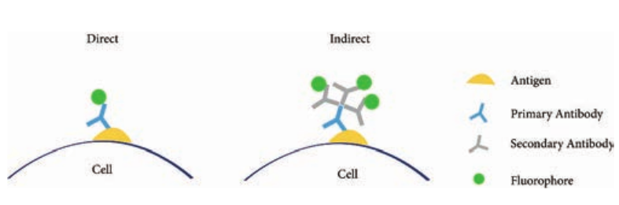

dye is added to the tissue. Anti-antibody specifically binds with already added or linked unlabelled antibody (Figure 11.1).

**ELISA (Enzyme Linked Immuno Sorbent Assay)**

**ELISA** (Enzyme-Linked Immuno Sorbent Assay) is a plate-based assay technique designed for detecting and quantifying substances such as peptides, proteins, antibodies and hormones. It is also known as Enzyme Immuno Assay (EIA).

In 1971, after the descriptions of Peter Perlmann and Eva Engvall at Stockholm University in Sweden, ELISA has become the system of choice when assaying soluble antigens and antibodies. All assays for antibody production depend upon the measurement of interaction of elicited antibody with antigen.

**Principle**

The **principle of ELISA** is very simple. The test is generally conducted in micro titre plates. (Figure 11.2 Micro titre plate).

If the antigen is to be detected the antibody is fixed in the micro titre plate and vice versa. Test sample is added in the microtitre plate, if there is presence of Ag or Ab in the test sample, there will

Immunofluorescence

  

be Ag-Ab reactions (with immobilized Ab or Ag). Later enzyme labelled antibody is added in the reaction mixture, which will combine with either test antigen or Fc portion of test antibody. The enzyme system consists of: 1. **An enzyme**: Horse Radish

Peroxidase(HRP), alkaline phosphatase which is labelled or linked, to a specific antibody.

2\. **A specific substrate**. 
- O-Phenyl-diamine-

dihydrochloride for peroxidas. 
- P nitrophenyl Phosphate- for

Alkaline Phosphatase

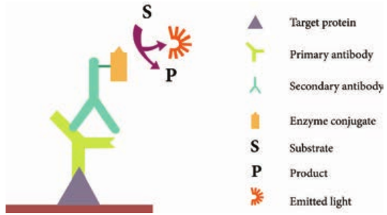

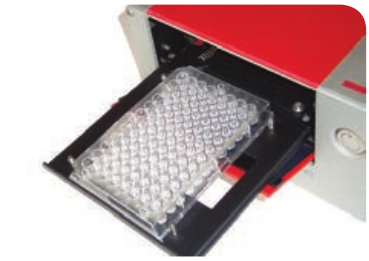

Substrate is added after the antigen- antibody reaction. The enzyme hydrolyses the substrate to give a yellow colour compound in case of alkaline phosphatase (Figure 11.3). The intensity of the colour is proportional to the amount of antibody or antigen present in the test sample, which can be quantified using ELISA reader (Figure 11.4 ELISA reader)

**Types**

There are **four kinds** of ELISA assay tests. They are: Direct ELISA, Indirect ELISA, Sandwich ELISA and Competitive ELISA (Figure 11.5).

steps in ELISA

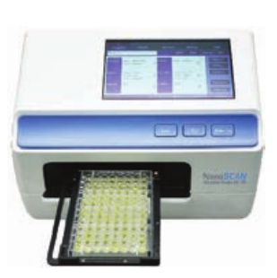

  

**i. Direct ELISA** An antigen is immobilized in the well of an ELISA plate. The antigen is then detected by an antibody directly conjugated to an enzyme such as HRP. Direct ELISA detection is much faster than other ELISA techniques as fewer steps are required. The assay is also less prone to error since fewer reagents and steps are needed, i.e. no potentially cross-reacting secondary antibody needed. Finally, the direct ELISA technique is typically used when the immune response to an antigen needs to be analyzed.

**ii. Indirect ELISA** Indirect ELISA is used to detect antibody. A known antigen is coated on the micro titre plate. If the patient’s serum contains antibody specific to the antigen, the antibody will bind to the antigen. After incubation the wells are washed and the enzyme labelled anti Human Gamma Globulin (HGG) is added to the well. Anti- HGG can react with antigen antibody complex. The substrate for the enzyme is added finally which is hydrolysed by the enzyme which develops a colour.

**iii. Sandwich ELISA** Sandwich ELISA is used to detect antigen. A known antibody is coated on the micro titre

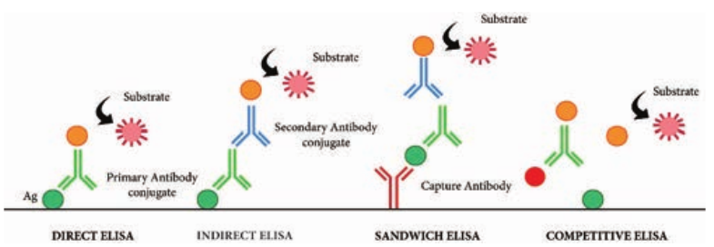

plate. A test antigen is added to each well and allowed to react with the bound antibody.

If the patient’s serum contains antigen specific to the antibody, the antigen will bind to the antibody. Specifically bound antigen and antibody will remain in the wells even after washing. The second antibody is added and allowed to react with bound antigen. Substrate is added to measure colour reaction.

**iv. Competitive ELISA** It is used for the detection of antigens. Antibody is first incubated with a sample-containing antigen. The antigen and antibody complex is added to the antigen coated microtitre well. If more antigen present in the sample, the less free antibody will be available to bind to the antigen coated well. Addition of an enzyme conjugated secondary antibody specific to the primary antibody can be used to determine the amount of primary antibody bound to the well. It is a quantitative test for the antigen detection.

**Application**

An ELISA test may be used to diagnose: HIV, Lyme disease, pernicious anaemia, Rocky Mountain spotted fever, rotavirus, squamous cell carcinoma, syphilis,

es of ELISA

  

toxoplasmosis, varicella-zoster virus, which causes chickenpox and Zika virus.

## Western Blot techniques

Macromolecules immobilized or fixed on nitrocellulose membrane i.e., blotted can be subjected to a variety of analytical techniques more easily. Southern blotting was the first blotting technique developed which made the analysis and recording of DNA easy. Later the technique was extended for analysis of RNA and proteins and they have acquired the jargon terms Northern and Western Blotting respectively. Western blotting is also known as immunoblotting because it uses antibodies to detect the protein. Western blotting is a quantitative test to determine the amount of protein in sample.

**Principle**

Western blotting technique is used for the identification of a particular protein from the mixture of a proteins. In this method, the proteins are first extracted from the sample. Extracted proteins are subjected to Poly Acryl - amide Gel Electrophoresis (PAGE). Transfer of proteins from poly acryl amide to the nitrocellulose paper is achieved by applying electric field. When radio labelled specific antibody is added on such membrane it binds to the specific complementary protein. Finally the proteins on the membrane can be detected by staining or through ELISA technique.

**Steps**

**Step I: Extraction of Protein** The most common protein sample used for Western blotting is cell lysate. The protein from the cell is generally  

extracted by mechanical means or by adding chemicals which can lyse the cell. The extraction step is termed as **tissue preparation**. Protease inhibitor is used to prevent the denaturing of proteins. Using spectroscopy the concentration of the protein sample is analysed and diluted in loading buffer containing glycerol. This will help the sample to sink in the well. Bromothymol blue is used as tracking dye and is used to monitor the movement of the sample.

**Step II: Gel electrophoresis** The protein sample is loaded in well of SDS-PAGE (Sodium dodecyl sulfate- poly-acryl amide gel electrophoresis). The proteins are separated on the basis of electric charge, isoelectric point, molecular weight, or combination of all these. Proteins are negatively charged, so they move toward positive (anode) pole as electric current is applied. Smaller proteins move faster than the larger proteins.

**Step III: Blotting** Blotting refers to the transfer of the protein from the gel to the nitrocellulose paper by capillary action. Electro blotting is done nowadays to speed up the process. In electro-blotting nitrocellulose membrane is sandwich between gel and cassette of filter paper and then electric current is passed through the gel causing transfer of protein to the membrane.

**Step IV: Blocking** The nitrocellulose membrane is non- specifically saturated or masked by using casein or Bovine serum albumin (BSA) before adding the primary antibody. This

  

blocking step is very important in western blotting as antibodies are also proteins and they are likely to bind to the nitrocellulose paper.

**Step V: Treatment with primary and secondary antibody** The primary antibody is specific to desired protein so it forms Ag-Ab complex. The secondary antibody is enzyme labelled and is against primary antibody (anti- antibody) so it can bind with Ag-Ab complex. Alkaline phosphatase or Horseradish peroxidase (HRP) is labelled with secondary antibody.

**Step VI: Treatment with suitable substrate**

Finally, the reaction mixture is incubated with specific substrate. The enzyme

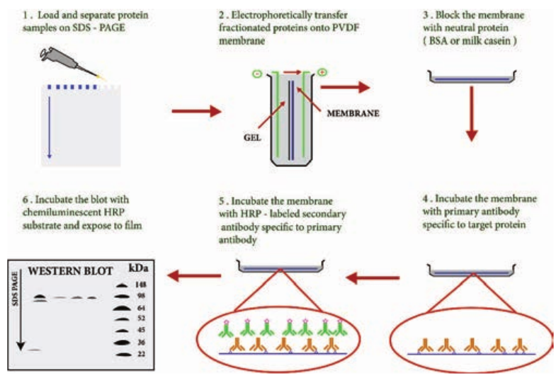

convert the substrate to give visible coloured product, so band of colour can be visualized in the membrane (Figure 11.6).

**Application**

1\. The size and concentration of protein in given sample is determined by western blotting.

2\. It is used in the detection of antibody against virus or bacteria in serum and helps in the disease diagnosis.

3\. Western blotting technique is the confirmatory test for HIV. It detects anti HIV antibody in patient’s serum.

4\. Useful to detect defective proteins.

n blot technique

  

## Hypersensitivity

Hypersensitivity is defined as the exaggerated immunological response leading to severe symptoms and even death in a sensitized individual when exposed for the second time. It is commonly termed as allergy. The substances causing allergic/ hypersensitivity is known as allergens. Example:. Drugs, food stuffs, infectious microorganisms, blood transfusion and contact chemicals.

**Classification of Hypersensitivity (Coombs and Gell Classification)**

Type I: Immediate (Atopic or anaphylactic) Hypersensitivity Type II: Antibody–dependent Hypersensitivity Type III: Immune complex mediated Hypersensitivity Type IV: Cell mediated or delayed Hyper- sensitivity

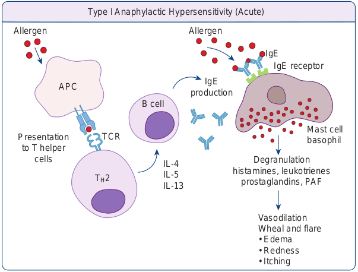

APC

B cell

A

IL-4 IL-5 IL-13

TH2

TCRPresentation to T helper

cells

Allergen

Type I Anaphylactic Hype  

**Type I: Immediate (Atopic or anaphylactic) Hypersensitivity** This type of hypersensitivity is an allergic reaction provoked by the re-exposure to a specific antigen. The antigen can make its entry through ingestion, inhalation, injection or direct contact. The reaction may involve skin, eyes, nasopharynx and gastrointestinal tract. The reaction is mediated by IgE antibodies (Figure 11.7). IgE has very high affinity for its receptor on mast cells and basophils. Cross linking of IgE receptor is important in mast cell trigerring. Mast cell degranulation is preceded by increased Ca++ influx. Basophils and mast cells release pharmacologically active substances such as histamines and tryptase. This causes inflammatory response. The response is immediate (within seconds to minutes). Hence, it is termed as immediate hypersensitivity. The reaction is either local or systemic.

hypersensitivity

IgE production

Mast cell basophil

llergen

IgE IgE receptor

Degranulation histamines, leukotrienes

prostaglandins, PAF

Vasodilation Wheal and flar. 
- Edem. 
- Rednes. 
- Itching

rsensitivity (Acute)

  

**Hay Fever** Allergic rhinitis is commonly known as hay fever. Allergic rhinitis develops when the body’s immune system becomes sensitized and overreacts to something in the environment like pollen grains, strong odour of perfumes, dust etc. that typically causes no problem in most people. When a sensitive person inhales an allergen the body’s immune system may react with the symptoms such as sneezing, cough and puffy swollen eyelids.

**Type II Hypersensitivity: Antibody dependent hypersensitivity** In this type of hypersensitivity reactions the antibodies produced by the immune response binds to antigens on the patient’s own cell surfaces. It is also known as cytotoxic hypersensitivity and may affect variety of organs or tissues. Ig G and Ig M antibodies bind to these antigens and form complexes. This inturn activates the classical complement pathway and eliminates the cells presenting the foreign antigen. The reaction takes hours to day (Figure 11.8).

**Drug induced haemolytic anaemia** Certain drugs such as penicillin, cephalosporin and streptomycin can absorb non-specifically to protein on surface of RBC forming complex similar to hapten-carrier complex. In some patients these complex induce formation of antibodies, which binds to drugs on RBC and induce complement mediated lysis of RBC and thus produce progressive anaemia. This drug induced haemolytic anaemia is an example of Type II hypersensitivity reaction.  

**Type III Hypersensitivity: Immune complex mediated hypersensitivity** When a huge amount of antigen enters into the body, the body produces higher concentrations of antibodies. These antigens and antibodies combine together to form insoluble complex called immune complex. These complexes are not completely removed by macrophages. These get attached to minute capillaries of tissues and organs such as kidneys, lung and skin (Figure 11.9). These antigen-antibody complexes activate the classical complement pathway leading to vasodilation. The complement proteins and antigen-antibody complexes attract leucocytes to the area. The leukocytes discharge their killing agents and promote massive inflammation. This can lead to tissue death and haemorrhage.

**Arthus reaction** It was first observed by Arthus. It is a local immune complex reaction occurring in the skin. Horse serum and egg albumin are the antigens that induce the arthus reaction. It is characterized by erythema, induration, oedema, haemorrhage and

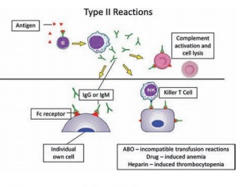

  

necrosis. This reaction occurs when antibody is found in excess. It appears in 2–8 hours after injection and persists for about 12–24 hours (Table 11.1).

**Type IV hypersensitivity: Cell Mediated Delayed Hypersensitivity** It is often called as delayed hypersensitivity reaction as the reaction takes two to three

Locally injeceted antigen in immune individual

with IgG antibody Local immune-complex

formation

Act infl

1-2 hours

Immune complex deposition i pathology is known as th

Experimentally induced Ty

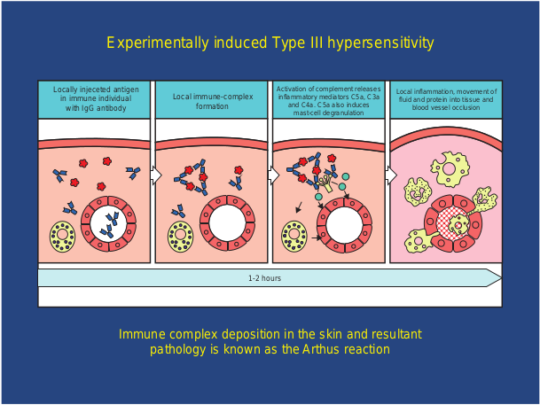

**Table 11.1:** Difference between Immediate Hyp

**Sn. No. Immediate Hypersensitivity** 1\. It appears and disappears rapidly 2. It is induced by antigens or haptens b

any route

3\. The reaction is antibody mediate B-cell response

4\. Passive transfer is possible with serum

5\. Desensitization is easy, but does no last long  

days to develop. Type IV hypersensitivity is involved in the pathogenesis of many autoimmune and infectious diseases such as tuberculosis and leprosy. T lymphocytes, monocytes and macrophages are involved in the reaction. Cytotoxic T Cells cause direct damage whereas the T helper cells secrete cytokines and activate monocytes

ivation of complement releases ammatory mediators C5a, C3a and C4a. C5a also induces

mast-cell degranulation

Local inflammation, movement of fluid and protein into tissue and

blood vessel occlusion

n the skin and resultant e Arthus reaction

pe III hypersensitivity

hypersensitivity

ersensitivity and Delayed Hypersensitivity

**Delayed Hypersensitivity** It appears slowly and last longer.

y Induced by infection, injection of antigen intra dermally or with adjuvants of by skin contact.

d The reaction is T-cell mediated response. Cannot be transferred with serum but can be transferred by lymphocytes

t Desensitization is difficult but long lasting.

|------|------|------|

|------|------|------|

|------|------|------|

|------|------|------|------|

| Sn. N o. |Imme di ate H y p ers ens itiv ity |D el aye d  Hy p er s en siti v it y |
|------|------|------|
| 1. |It a pp e ars a nd di s app e ars ra pid ly |It a pp e ars s lo w ly a nd l ast lo nger. |
| 2. |It i s in duce d b y a nt ig en s o r h apten s b yany r oute |Induce d b y inf e c t io n, in j e c t io nof a nt ig en in t ra der ma l ly o r w it had juva nts o f b y s k in co nt ac t. |
| 3. |Th e r e ac t io n i s a nt ib o dy m e di ate dB-ce l l r es p ons e |Th e r e ac t io n i s T -ce l l m e di ate dre sp ons e. |
| 4. |Passi ve t ra nsf er i s p os si ble w it h s er um |C ann ot b e t ra nsf er re d w it h s er um b utc an b e t ra nsf er re d b y l y mpho c yt es |
| 5. |D es en si t iza t io n i s e asy, b ut do es n otl ast lo ng |D es en si t iza t io n i s dif f ic u lt b ut lo ngla st i ng. |
  

and macrophages and cause the bulk damage (Figure 11.10).

**Tuberculin reaction (Mantoux Reaction)** When a small dose of tuberculin is injected intra dermally in an individual already having tubercle bacilli, the reaction occurs. It is due to the interaction of sensitized T cell and tubercle bacterium. The reaction is manifested on the skin very late only after 48–72 hours.

## Transplantation

Transfer of living cells, tissues or organs from one part of the body to another or from one individual to another is known as transplantation.

A tissue or organ that is removed from one site and placed to another site usually in a same or different individual is called graft. The individual who provides the graft is called donor and the individual who receives the graft is called host or recipient.

A. Delayed-type hypersensitivity

B. T cell-mediated cytolysis

APC presenting tissue antigen

Normal tissue

CD4+ T cell

CD T

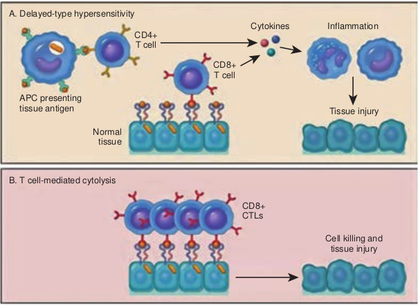

If the graft is placed into its normal anatomic location, the procedure is called orthotopic transplantation. If the graft is placed in a different site it is called heterotopic transplantation.

Transplantation is the only form of treatment for most end-stage organ failure. In clinical practice, transplantation is used to overcome a functional and anatomic deficit in the recipient. Transplantation of kidneys, hearts, livers, lungs, pancreas and bone marrow are widely done today.

**Methods of Transplantation**

- Auto grafting: The transfer of self tissue from one body site to another in the same individual

- Allografting: The transfer of organs or tissues from human to human

- Xenografting: The transfer of tissue from one species to another (Figure 11.11).

CD8+ CTLs

Cell killing and tissue injury

8+ cell

Cytokines Inflammation

Tissue injury

layed hypersensitivity

  

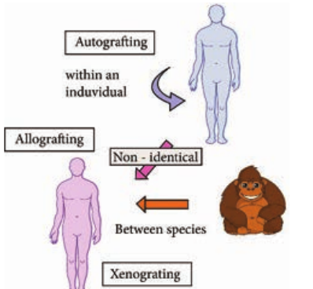

**Graft Acceptance**

When transplantation is made between genetically identical individuals the graft survives and lives as healthy as it is in the original places. When the graft tissue remains alive, it is said to be accepted and the process is called graft acceptance.

**Graft Rejection**

When transplantation is made between genetically distinct individual the graft tissue dies and decays. When the graft tissue dies, the graft is said to be rejected and the process is called graft rejection. It is of two types. They are

i. Host Verses Graft Reaction

ii. Graft Verses Host Rejection.

**Host Verses Graft Reaction (HVG)**

The graft tissue antigens induce an immune response in the host. This type of immune response is called host versus graft reaction.  

**Allograft Rejection**

**Types of allograft rejection*. 
- Acute rejection–Quick graft rejection.

It is due to stimulation of thymocytes and B lymphocytes

- Hyperacute rejection–It is a very quick rejection. It is due to pre-existing humoral antibodies in the serum of the host as a result of presensitization with previous grafts.

- Insidious rejection–It is a secret rejection due to deposition of immune complex on the tissues like glomerulus membrane that can be demonstrated in kidney by immune fluorescence.

**Mechanism of Allograft Rejection**

**Immunological contact** When tissue is implanted as graft, its antigen can pass into local lymph nodes of the host. The graft antigens then make contact with the lymphocytes of the host. Production of sensitized T cells and cytotoxic antibodies are produced in the host. This brings about graft rejection.

**First set rejection** When the graft is made between genetically different individuals, the graft gets blood supply from the host and it appears to be normal for the first 3 days. But on the 5th day, sensitized T cells, macrophages and a few plasma cells invade the graft. Inflammation starts in the graft. This leads to necrosis. It is similar to the primary immune response to an antigen.

**Second set rejection** When a graft is implanted in an individual who has already rejected a graft is second set rejection. This is similar to the secondary immune response of our body.

  

**Cell mediated cytotoxic reaction** The 1st set of rejection of allograft is brought about mainly by CMI response. In this process the cells involved in the cytotoxic mediated immunity involves. On stimulation of these cells interferon causes the lysis of the graft.

**Antibody mediated cytotoxic reaction** The 2nd set rejection of graft is brought about mainly by HMI response. This is one of the hyperacute rejection brought about by the antibodies. Complement, macrophages, mast cells, platelets, B cells bring about this reaction.

**Graft versus Host Rejection (GVH)** Sometimes the graft tissue elicits an immune response against the host antigens. This immune response is called graft versus host reaction. It occurs when. 
- Graft remains inside the host and the

host should not reject the graft. 
- The graft should have immune

competent T cells. 
- The transplantation antigens of the

host should be different from that of the graft.

A transplanted heart usually beats slightly faster than normal because the heart

nerves are cut during surgery.

**Mechanism of the graft rejection** The graft lymphocytes aggregate in the host lymphoid organs and are stimulated by the lymphocytes of the host. The stimulated lymphocytes produce lymphokines. Lymphocytes in turn activate the host  

T cell. Activated T cell further activates the B cells. The stimulated B cell reacts with the self antigen and causes the damage.

**How to prevent graft rejection?** Before transplantation the following things should be done to avoid graft rejection. 
- Perform blood grouping and Rh

groupin. 
- HLA typing should be don. 
- Immuno suppressive drugs should be

administere. 
- Suitable donor should be chosen

## Immunization/Vaccination

Father of Immunology is Edward Jenner. He produced the vaccine for small pox from cow pox virus. Vaccine is a substance that is introduced into the body to prevent the disease produced by certain pathogens. Vaccines consist of dead pathogens or live but attenuated (artificially weakened) organisms.

Immunization programmes and the development of new vaccines play an important role in protecting individuals against illness. Vaccination works by safely exposing individuals to a specific pathogenic microbe, artificially increasing their immunity to it.

**Vaccines are made from**

- Live micro-organisms that have been ‘treated’ so that they are weakened (attenuated) and are unable to cause disease.

- Dead micro-organisms. 
- Some part or product of the micro-

organism that can produce an immune response.

  

**Vaccine Types**

- **Live attenuated vaccines:** These vaccines contain modified strains of a pathogen that have been weakened but are able to multiply within the body and remain antigenic enough to induce a strong immune response. Example: Oral Polio vaccine

- **Heterologous vaccine:** These are a group of live attenuated vaccines produced from the strains that are pathogenic in animals and not in humans. It is a vaccine that confers protective immunity against a pathogen that shares cross-reacting antigens with the microorganisms in the vaccine. Example: Cow pox virus that protects against small pox in humans.

- **Killed inactivated vaccines:** These groups of vaccine are produced either by killing or inactivating the bacteria or virus by chemical treatment or heat. Example:; Polio virus

- **Sub unit vaccine:** The antigenic determinant / epitope (the very specific part of the microbe) is used to prepare the vaccine.

- **DNA Vaccines**: When the genes for microbe’s antigens are introduced into the body some cells will take up the DNA. The DNA then instructs those cells to make the antigen molecules. The cells secrete the antigens and display them on their surfaces. The body’s own cells become vaccine generating factories.  

**Routes of Administration**

- Deep subcutaneous or intramuscular route

– most vaccines

- Oral route – Oral BCG vaccine

- I n t r a d e r m a l route

– BCG vaccine

- Scarification – Small pox vaccine

- Intranasal route – Live attenuated influenza virus

**Types of Immunization** Immunization is of two types:

1\. Passive Immunization 2. Active Immunization

**1\. Passive Immunization*. 
- Passive immunization is produced

without challenging the immune system of the body. It is done by administration of serum or gamma globulins from a person who is already immunized to a non- immune person.

- Passive immunization is the administration of preformed antibodies either intravenously or intramuscularly.

- It is used to provide rapid protection in certain infections such as diphtheria or tetanus or in the event of accidental exposure to certain pathogens such as hepatitis B.

- It is also used to provide protection in immune compromised individuals. **Passive natural immunization** \-

acquired from the mother before and after birth. Before birth, immunity is transferred from mother to the fetus in the form of maternal antibodies through placenta. After birth, the antibodies (Ig A) are transferred through breast milk (Table 11.2).

  

**Passive artificial immunization** \- developed by injecting previously prepared antibodies using serum from humans or animals. This type of immunity is useful for providing immediate protection against acute infections like tetanus, measles etc.

**2\. Active Immunization** Active immunization is the administration of vaccines containing microbial products with or without adjuvants in order to obtain long term immunological protection against the offending microbe.

At present the normal route of vaccination in most instances is either intramuscular or subcutaneous.

Oral immunization is the method of choice for polio and _Salmonella typhi_ vaccines. However, there is an increasing awareness that this route

**Table 11.2:** Passive Immunization

**Infection Source of Antiser** Tetanus Immune human; horse

Diptheria Horse

Gas gangrene Horse

Botulism Horse

Varicella-Zoster Immune human

Rabies Immune human

Hepatitis B Immune human

Hepatitis A Pooled human Ig

Measles Immune human

Snakebite Horse

Some autoimmune disease

Pooled human ig  

of immunization may be the best for most immunizations since nearly all infectious agents gain entrance through the mucosal surfaces.

Active natural immunization involves activation of immune system in the body to produce antibodies. It is achieved in both clinical and subclinical infections.

Active artificial immunization is achieved by the administration of vaccines or toxoids.

**Antigen preparations** Most vaccines consist of attenuated organisms, killed organisms, inactivated toxins, or sub cellular fragments and more recently genes for antigens in viral ‘vectors’, and DNA itself. Thus, vaccines must be capable of targeting the immune system appropriately i.e. cellular/or humoral mechanisms (Table 11.3).

**um Indications** Post exposure (plus vaccine)

Post-exposure

Post-exposure

Post-exposure

Post-exposure in immunodeficiency

Post exposure (plus vaccine)

Post-exposure prophylaxis

Prophylaxis

Prophylaxis

Post-bite

Acute thrombocytopenia and neutropenia

| In fe ct io n |S our c e o f A ntis er um |Indi c ati ons |
|------|------|------|
| Tet anus |Imm un e h um an; h ors e |Pos t exp os ur e (p lus vaccin e) |
| Di pt her i a |Hors e |Pos t-exp os ur e |
| Ga s ga ng ren e |Hors e |Pos t-exp os ur e |
| B otu li sm |Hors e |Pos t-exp os ur e |
| Var ice l l a-Z os ter |Imm un e h um an |Pos t-exp os ur e inimm un o def icien c y |
| R abies |Imm un e h um an |Pos t exp os ur e (p lus vaccin e) |
| He pa ti ti s  B |Imm un e h um an |Pos t-exp os ur e p rophy l axi s |
| He pa ti ti s  A |Po ole d h um an I g |Prophy l axi s |
| Me asles |Imm un e h um an |Prophy l axi s |
| Sna kebit e |Hors e |Pos t-b ite |
| S ome a utoimm un ed is e as e |Po ole d h um an ig |Ac ute t hr omb o c yt op eni a a ndneu t rop eni a |
  

**Adjuvants** Nonliving vaccines, especially those consisting of small molecules require the inclusion of agents to enhance their effectiveness.

These adjuvants include microbial, synthetic and endogenous preparations having adjuvant activity, but at present only aluminium or calcium salts are generally used in humans.

Adjuvants should enable antigens to be slowly released, preserve antigen integrity, target antigen presenting cells and induce cytotoxic lymphocytes.

## Updated National Immunization Schedule Chart

Immunization/vaccination produce a response in the body that is similar to

**Table 11.3:** Antigen Preparations Used in Vacc

**Type of antigen Viruse** Normal heterologous organism Vaccinia (Co

Living attenuated organism

Measles Mumps Rubella Polio (Sabin Yellow fever Varicella-Zo

Whole killed organism Rabies Poli (Salk) Influenza

Inactivated toxin (toxoid)

Capsular polysaccharide

Surface antigen Hepatitis B  

the body’s response to a natural infection (Table 11.4). Immunization or vaccines can therefore protect the body from a disease before the disease has a chance to cause illness. Immunization has helped to reduce the impact of communicable disease on health and well being. Some diseases have been well controlled and other has been eliminated from some parts of the world because of vaccination. Stopping vaccination may lead to epidemic.

**Summary**

The reaction between antigen and antibody is highly specific. It is compared to the lock and key system. **ELISA** (Enzyme-Linked Immuno Sorbent Assay) is a plate-based assay technique designed for detecting and quantifying substances such as peptides,

ines

**Examples s Bacteria**

wpox) BCG Typhoid (New)

)

ster Pertussis Typhoid Cholera Diphtheria Tetanus Cholera (New) _Meningococcus Pneumococcus Haemophilus_ Typhoid (New)

| Ty p e o f a ntige n |E xa mp l es |
|------|------|------|
| Vir us es |Bac teri a |
| Nor ma l h et er olog ous o rga ni sm |Vaccini a (C owp ox) |
| L iv in g a tten u ate d o rga ni sm |Me asles |B CG |
| Mum ps |Typ hoid (N e w) |
| Rub el l a |
| Polio (Sa bin) |
| Yel lo w f e ver |
| Var ice l l a-Z os ter |
| Whole k i l le d o rga ni sm |R abies |Pe r tus s is |
| Poli (Sa l k) |Typ hoid |
| Inf luenza |C holera |
| Inac t iva te d t oxin (t oxoid) |Di pht her i a |
| Tet anus |
| C holera (N e w) |
| C aps u l ar p olys acc har ide |Meningococcu s |
| Pneumococcus |
| Haemophilus |
| Typ hoid (N e w) |
| Sur face a nt ig en |He pa ti ti s  B |
  

proteins, antibodies and hormones. There are **four kinds** of ELISA assay tests. They are: Direct ELISA, Indirect ELISA, Sandwich ELISA and Competitive ELISA. Western blotting technique is used for the identification of particular protein from the mixture of proteins. The most common protein sample used for Western blotting is cell lysate. Blotting refers to the transfer of the protein from the gel to the nitrocellulose paper by capillary action. The substances causing allergic/hypersensitivity is known as allergens. Allergic rhinitis develops when the body’s immune system becomes sensitized and overreacts to something in the environment like pollen grains, strong odour of perfumes, dust etc. Certain drugs such as penicillin, cephalosporin and streptomycin can absorb non-specifically

**Table 11.4:** National immunization schedule

**Sn. No.**

**Vaccine**

1\. BCG At birth 2. Hepatitis B-Birth dose At birth 3. OPV-O At birth 4. OPV 1, 2 & 3 At 6 week 5. Pentavalent 1, 2 & 3

(Diphtheria + Pertuss is + Tetanus + Hepatitis B + Hib)

At 6 week

6\. Inactivated polio vaccine At 6 & 14 7. Rotavirus (where applicable) At 6 week 8. Pneumococcal conjugate

vaccine (where applicable) At 6 week complete

9\. Measles/Rubella 1st dose At 9 com months

10\. DPT Booster-1 16–24 mo 11. Measles/Rubella 2nd dose 16–29 mo 12. OPV Booster 16–24 mo 13. DPT Booster – 2 5–6 years 14. TT 10 years &  

**Due age Route**

Intra dermal Intra muscular Oral

s, 10 weeks & 14 weeks Oral s, 10 weeks & 14 weeks Intra muscular

weeks Intra muscular s, 10 weeks & 14 weeks Oral s & 14 weeks. At 9

d months – booster Intra muscular

pleted months – 12 Subcutaneous

nths Intra muscular nths Subcutaneous nths Oral

Intra muscular 16 years Intra muscular

to protein on surface of RBC forming complex similar to hapten-carrier complex.

Transfer of living cells, tissues or organs from one part of the body to another or from one individual to another is known as transplantation. The graft tissue antigens induce an immune response in the host. This type of immune response is called host versus graft reaction. The ultimate goal of any immunization program is the eradication of the disease. Active natural immunization involves activation of immune system in the body to produce antibodies. It is achieved in both clinical and subclinical infections Immunization has helped to reduce the impact of communicable disease on health and well being.

| Sn . No. |Vac cine |D u e age |Route |
|------|------|------|------|
| 1. |B CG |At b ir t h |Int ra der ma l |
| 2. |Hep at it is B-B ir t h dos e |At b ir t h |Int r a  mu s c u l ar |
| 3. |OPV-O |At b ir t h |Ora l |
| 4. |OPV 1, 2 & 3 |At 6 w e eks, 10 w e eks & 14 w e eks |Ora l |
| 5. |Pen t ava len t 1, 2 & 3(Di pht her i a + P er tuss i s +Tet anus + H ep at it is B + H ib) |At 6 w e eks, 10 w e eks & 14 w e eks |Int r a  mu s c u l ar |
| 6. |Inac t iva te d p olio vaccin e |At 6 & 14 w e eks |Int r a  mu s c u l ar |
| 7. |R ot av ir us (w her e a pplic able) |At 6 w e eks, 10 w e eks & 14 w e eks |Ora l |
| 8. |Pneum o co cc a l co njuga tevaccin e (w her e a pplic able) |At 6 w e eks & 14 w e eks. A t 9co mplet e d m ont hs – b o os ter |Int r a  mu s c u l ar |
| 9. |Me asles/R ub el l a 1s t dos e |At 9 co mplet e d m ont hs – 12mont hs |Sub c ut ane ous |
| 10. |DPT B o os ter-1 |16–24 m ont hs |Int r a  mu s c u l ar |
| 11. |Me asles/R ub el l a 2n d dos e |16–29 m ont hs |Sub c ut ane ous |
| 12. |OPV B o os ter |16–24 m ont hs |Ora l |
| 13. |DPT B o os ter – 2 |5–6 y e ars |Int r a  mu s c u l ar |
| 14. |TT |10 y e ars & 16 y e ars |Int r a  mu s c u l ar |
  

**Evaluation Multiple choice questions**

1\. Antibody reacts with to give agglutination. a. Particulate antigen b. Hapten and antigen c. Antibody and

soluble antigen d. Carrier and antibody

2\. Anaphylaxis refers to a. Immediate hypersensitivity b. Hyposensitivity c. Delayed hypersensitivity d. Auto sensitivity

3\. Atopy occurs due to a. House dust b. Egg c. Pollen d. all the above

4\. In type II reaction, is involved. a. IgG antibody b. IgG and IgM antibodies c. IgM antibody d. IgE antibody

5\. acts as an ACP. a. Macrophage b. RBC c. T cells d. Mucosal cells

6\. Phagocytosis is enhanced by process. a. Pinocytosis b. Opsonisation c. Endocytosis d. None

7\. produce antibodies. a. T cells b. B cells c. Ts cells d. Plasma cells  

8\. Sabin is vaccine. a. Injection b. Recombination c. Oral d. Subunit

9\. is an injectable polio vaccine. a. Salk b. TAB c. Sabin d. BCG

**Answer the following** 1\. What do you understand by the term

antigen presentation? 2. Define: Pathogenicity. 3. Match the following:

a. MMR - Subunit vaccine b. Salk - Triple vaccine c. HBV - Recombinant vaccine d. Sabin - Killed vaccine e. Influenzae - Live vaccine

4\. What is meant by attenuation? 5. Describe toxin with examples. 6. Match:

a. Mast cell - Myelomaprotein b. Primary

immune - IgG

c. Secondary immune response

\- IgM

d. Secretory antibody

\- IgA

e. Plasma cell tumor

\- IgE

7\. Write a note on Lymphocytes. 8. Define the following:

a. Immunity b. Innate immunity c. Acquired Immunity d. Active immunity e. Passive immunity

