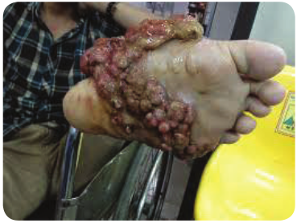
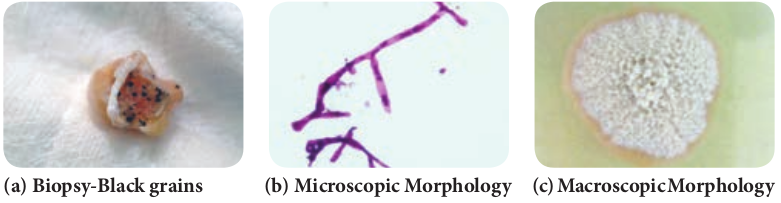

  

**Chapter Outline**

**9.1** Classification of fungi based on the Host parasitic Relationship

**9.2** Superficial Cutaneous Mycosis

**9.3** Subcutaneous Mycoses

**9.4** Systemic Mycosis

**9.5** Opportunistic Mycosis

After studying this chapter the students will be able to,

_- Identify the pathogenic fungi most commonly causing disease by using advanced techniques. Fungal infection is common in developing countries so we should be aware of prevention and treatment of fungal infections._

_- Study the taxonomy, structure and classification of medically important fungi._

_- Study mycosis, its pathogenesis, clinical feature, treatment and prophylaxis._

_- Study about the collection, processing of the sample and molecular diagnosis of fungal infections._

**Learning Objectives**

**Medic**

**Chapter**

**9**  

**al Mycology**

The branch of biology that deals with the study of fungi is known as **“Mycology”**. The term is derived from Greek work **‘Mykes’**

means **mushroom** and **‘Logos’** means **study**. Medical Mycology is the study of fungal infection, epidemiology, ecology, pathogenesis, diagnosis and treatment in human beings**. Raymond Jacques Sabouraud (1864–1936)** is the father of Medical Mycology.

**9.1** **Classification of Fungi based on the Host Parasitic Relationship**

Based on the host parasitic relationship the fungi are grouped into three types.

**a. Commensalism:** The fungus neither gets benefit nor harmed by the host parasitic relationship.

**b. Mutualism:** The fungus benefited from the host parasitic relationship.

**c. Parasitism:** The host is harmed by the fungus in host parasitic relationship.

### Mycoses
 Diseases caused by the medically important fungi are called Mycoses. Based on their wide spectrum of adaptability, fungi causing human mycoses can be categorized into:

  

**a. Pathogenic fungi:** The ability of the fungi to adapt to skin flora and cause infection.

**b. Opportunistic fungi:** When the immune status of the host is reduced, fungi will induce or cause infection.

**c. Toxigenic fungi:** Toxins produced by fungi are responsible for the illness or death of patients after ingestion of the contaminated food.

**d. Allergenic fungi:** Allergens are secreted by the fungi which cause allergic reaction in the human beings.

Mycoses are classified according to the specific site of involvement. **a. Superficial Mycoses:** The infection

is limited to the outer most layers of the skin and its appendages. Example: Malassezia and Piedra infection

**b. Cutaneous Mycoses:** The infection extends deeper into the epidermis and it also invades hair and nails. Example: Dermatophytoses.

**c. Sub cutaneous Mycoses:** The infection extends to dermis, subcutaneous tissue and muscles by any traumatic injury. Example: Mycetoma

**d. Systemic Mycoses**: The infection originates from lungs and later spreads systemically to other organs. Systemic mycoses along with the opportunistic fungal infection are known as deep mycoses. Example: Cryptococcosis

**e. Opportunistic Mycoses:** The infection occurs when the immune status of the individuals is altered. It is common among immune compromised and immune suppressed patients. Example: Candidiasis  

**Aeromycology**

The Aeromycology is the study of air borne fungi, its types and the seasonal variations of allergenic fungal spores in the environment.

There are certain fungal pathogens which cause infections associated with workers in mycological laboratories. To avoid this safety procedures and equipments safety levels or bio safety levels (BSL) are used. BSL - 1 is used for low - risk microorganisms and BSL - 4 is used for highly risk pathogens.

**Medical Mycology in India** In India, the fungal infections are known since the ancient civilization mentioned in **Aryan documents such as Atharva Veda** Mycetoma is described as Padavamikam meaning ant hillfoot this was observed by John Gill in Madurai district of Tamil Nadu in 1842 which was designated as ‘**Madura foot**’.

**Infobits**

### Characteristics of Fungi

Fungi are heterotrophic organisms that exist as saprophytes, commensal or parasites. They are found on decaying vegetative matter and also in soil. Morphological features, cell structure, reproduction, nutritional requirement and thermal dimorphism in the pathogenic fungi are described as follows:

**i. Morphological Features** Fungi are eukaryotic with well defined cell wall and intra cellular membrane bound organelles. The cell wall is composed of polysaccharides and chitin. Fungi vary in

  

size and shape. They are broadly divided into two main groups. **a. Yeasts:** The yeasts are unicellular

organisms which reproduce by asexual process known as **budding** or by **fission**. The cell develops a protuberance that enlarges and separates from the parental cell. The yeasts produce chains of elongated cells known as **Pseudohyphae**. Some yeasts reproduce by sexual process Example: _Cryptococcus neoformans_. Germ tube is special morphology found in _Candida albicans_. Some are commensal without any medical significance.

**b. Molds:** The molds grow by apical extension, forming an interwoven mass called as **Mycelium,** branching filaments known as **hyphae**. Hyphae that grow on the surface are called **vegetative hyphae**. They are responsible for the absorption of nutrients. The hyphae that project above the surface are called **aerial hyphae** and they produce

**Figure 9.1: (a)** Morphology of yeast  

specialized reproductive structures called as **conidia**.

Can you cultivate the molds at home?

**HOTS**

Depending on cell morphology fungi are divided into four types, they are **Yeasts:** These are unicellular organisms that divide by budding (Figure 9.1a & b). Example: _Cryptococcus neoformans_ (Pathogenic), _Saccharomyces cerevisiae_ (Non pathogenic). **Yeast – like fungi:** These fungi reproduce by budding but fails to separate and hence elongation takes place forming pseudohyphae. Example: _Candida_ species (Pathogenic). **Molds:** These fungi produce spores which germinate to form vegetative hyphae (Figure 9.2). Example: Dermatophytes, _Aspergillus, Penicillium, Mucor_. **Dimorphic fungi:** These Fungi exist in both yeast at 37°C and filamentous form at 25°C. This Phenomenon is known as **Fungal dimorphism** (Figure 9.3). Example: _Histoplasma capsulatum_**,** _Blastomyces dermatitidis_.

**(b)** Microscopic view of yeast

  

**Phaeoid fungi:** Most of true pathogenic fungi are dimorphic fungi which are composed of darkly coloured hyphal form known as **dematiaceous fungi**. Some are yeast like and also known as black yeasts.

**Vegetative Structures:** Several structures are formed by the vegetative mycelia that have no reproductive value but are important for the differentiation of fungi eg. Chlamydospores and Arthrospores. Chlamydospores are thick walled, resistant to adverse conditions and are larger than other cells. Arthrospores are rectangular spores which are thick walled that are disposed on maturity.

**ii. Cell structure a. Capsule:** Fungi produce an extra

cellular polysaccharide in the form of capsule. Example: _Cryptococcus_.

**b. Cell wall:** Fungi possess a multilayered rigid cell wall exterior to the plasma lemma. The cell wall is made up of chitin, a water insoluble, homopolymer of N-acetyl glucosamine. Chitin synthase is responsible for the bio synthesis of chitin.

**c. Plasmalemma:** Cytoplasmic membrane or plasmalemma encloses complex cy-

tosol. It is composed of glycoprotein, lipids and ergosterol.

**d. Cytosol:** Cytosol comprises of mitochondria, microtubules, ribosomes, golgi apparatus, double membrane endoplasmic reticulum and Nucleus. The nuclei of the fungi are enclosed by a membrane and contain most of cellular DNA.

**iii. Reproduction of fungi** Spores play a major role in reproduction. There may be asexual or sexual cell divisions. **a. Asexual Reproduction:** The asexual

reproduction involves, budding or fission or mitosis. Fungi produce more than one type of asexual spores. They are microspores (microconidia) and macrospores (macroconidia). Spores that are present inside sporangium are

Blastomyces dermatitidis

Coccidiodes immois

Histoplasma capsulatum

Paracocoididodes brasilensis

Dimorphic fungi

25°C 37°C

  

known as **sporangiospores** and those that are borne exogenously are called **conidiospores** (Figure 9.4)**.** Based on the arrangement of conidia they are classified as Acropetal, Basipetal and Sympodial.

**b. Sexual Reproduction:** The process of sexual reproduction typically consists of plasmogamy (cytoplasmic fusion), Karyogamy (union of two nuclei) and meiosis (haploid formation). Anamorphs and Telomorphs are the 2 phases of sexual reproduction

**c. Mycelia Sterile:** Mycelia sterile are fast growing molds that do not produce spores or conidia. They are medically significant fungi and are difficult to identify

**iv. Growth and nutrition** Fungi are ubiquitous in nature and grow readily in the presence of nitrogen and carbohydrates. Medically significant fungi are Mesophilic. The optimum temperature _invitro_ for majority of the pathogenic

Sporongium

Sporongiosphere

Sporongiosphere

Sporongiospores

Cosnocylic hyphae

Rhizoids  

fungi is between 25°C and 37°C. The fungi prefer acidic pH; do not require light for their growth. All fungi are heterotrophs requiring organic nutrients. They absorb their nutrient and do not ingest food. Medically significant fungi are facultative parasites, capable of causing disease or living on dead organic matter.

## Superficial Cutaneous Mycoses

The superficial cutaneous fungal infections involve the outer most layers of skin and its appendages like hair and nails. The causative agents colonize on epidermis or supra - follicular portions of hair and do not penetrate into deeper layers.

The genus **_Malassezia_** is responsible for the superficial infection of the skin. _Malassezia furfur_ is lipophilic yeast. It is a commensal of normal skin in the sebaceous glands of warm - blooded vertebrates. It may be pathogenic under certain conditions usually causing skin

Spores of fungi

Conidiospores

Conidiospores

Phiolides

Conidiospores or Conidia

|------|------|------|------|------|------|
| Conidiospores |
| PhiolidesConidiospores |

  

conditions like Pityriasis versicolor, Seborrheic dermatitis, Atopic dermatitis, Malassezia folliculitis and systemic infection. Symptoms include macular, erythematous, hyper pigmented or hypo pigmented lesions with fine scaling.

**Tinea nigra** is responsible for the superficial cutaneous infection of the skin. _Hortaea werneckii_ is the phaeoid (dematiaceous) fungi causes infection on the palms and soles. It is also commonly termed as _Tinea nigra palmaris_ and _Tinea nigra plantaris._ Symptoms includes brown to black deeply pigmented non - scaly, macular lesions affecting skin of the palms and occasionally soles.

**Piedra** causes superficial infection of hair shaft. The word **Piedra** is derived from Spanish word **Stone**. There are two types of Piedra based on causative fungi and characteristics of nodules. They are **Black piedra** caused by _Piedraia hortae_ and **White piedra** caused by _Trichosporon_ species. The symptoms include development of firm, irregular nodules of fungal elements cemented to the hair. The piedra can be distinguished on the basis of shape, size and pigmentation of fungal cells of nodules which are found around hair cortex.

## Cutaneous Mycoses

Dermatophytoses are the most common cutaneous fungal infection seen in man and animals affecting skin, hair and nails. The fungi can invade the keratinized tissues of skin and its appendages and they are collectively known as **Dermatophytes** or **Tinea** or **ring worm** infection. The dermatophytes are hyaline septate  

molds. They are divided into three main anamorphic genera depending on their morphological characteristics.

**i. _Trichophyton_** \[Cause infection in skin, hair and nails\]

**ii. _Microsporum_** \[Cause infection in skin and hair\]

**iii. _Epidermophyton_** \[cause infection in skin and nail\]

The fungal species affecting humans are known as **anthropophilic**. Those inhabitating domestic and wild animals as well as birds are called **zoophilic**. Fungi species from soil are known as **geophilic** dermatophytes.

What are the sources of dermatophytes?

**HOTS**

### Pathogenesis and Pathology

The dermatophytes grow within dead keratinized tissue and produce keratinolytic proteases, which provide means of entry into living cells. Fungal metabolic products cause erythema, vesicles and pustule on the site of infection. Some dermatophytes species like soil saprobes digest the keratinaceous debris in soil and are capable of parasitizing keratinous tissues of animals.

### Clinical Features

The clinical manifestations of Dermatophytoses are also called **Tinea or Ringworm** depending on the anatomical site involved. Following are the common clinical conditions produced by dermatophytes:

  

**1\. Tinea Capitis:** This is an infection of the **shaft of scalp hairs**. It can be inflammatory (eg. Kerion, Favus) or non - inflammatory (Black dot, Seborrheic dermatitis). The infected hairs appear dull and grey (Figure 9.5a). Breakage of hair at follicular orifice which creates patches of alopecia with black dots of broken hair. It is caused by _Trichophyton_ species.

**2\. Tinea Corporis:** This is an infection on the **glabrous (non - hairy) skin** of body. Erythematous scaly lesions with sharply marginated raised border appear on the infected areas (Figure 9.5b). It is caused by _Trichophyton rubrum_.

**3\. Tinea Imbricata:** It forms concentric rings of scaling on the **glabrous skin**, leading to lichenification. It is caused by _Trichophyton_ _concentricum_

**4\. Tinea Gladiatorum:** This infection is common among wrestlers and athletes. Lesions are seen on **arms, trunk or head and neck**. It is caused by _Trichophyton_ _tonsurans_.

**5\. Tinea Incognito:** It is steroid modified Tinea caused as a result of misuse of corticosteroids in combination with topical antimycotic drugs.

**(a) Tinea Capitis (b) Tinea C**

**6\. Tinea Faciei:** This is an infection of **skin of face** except beard. Erythematous annular plaques are formed. It is one of the forms of Tinea incognito.

**7\. Tinea Barbae:** This is the infection of the **beard and moustache** areas of the face. This is also called **barber’s itch.** It is caused by _Trichophyton_ _mentagrophytes_, _Trichophyton_ _rubrum_ and _Microsporum_ _canis_. Erythematous patches on the face with scaling appear and these develop folliculitis.

**8\. Tinea Pedis:** This is an infection of the **foot, toes and interdigital web spaces**. This is seen among the individuals wearing shoes for long hours and known as **Athlete’s foot** (Figure 9.5c). Erythema and scaling associated with itching and burning sensation appear with thin fluid discharging from small vesicles. It is caused by _Trichophyton_ _mentagrophytes_, _Trichophyton_ _rubrum_ and _Epidermophyton_ _floccosum._

**9\. Tinea Cruris:** This is an **infection of the groin** in men who use long term tight fitting garments. Erythematous

**orporis (c) Tinea Pedis**

ions of Dermatophytes

  

sharp margin lesions known as Jock itch. It is caused by _Trichophyton_ _rubrum_ and _Epidermophyton_ _floccosum._

**10\. Tinea Manuum:** This is an infection of the **skin of palmar** aspect of hands. It causes hyperkeratosis of the palms and fingers. It is caused by _Trichophyton_ _mentagrophytes_, _Trichophyton_ _rubrum_ and _Epidermophyton_ _floccosum._

**11\. Tinea Unguium:** This is an infection of the **nail plates**. The infection spreads on the entire nail plate infecting the nail bed. It results in opaque, chalky or yellowish thick ended nail. It is caused by _Trichophyton_ _mentagrophytes_, _Trichophyton_ _rubrum_ and _Epidermophyton_ _floccosum._

Figure 9.6 shows the microscopic view of major determatophytes

**How do dermatophytes cause disease in humans?**

**Dermatophytosis** is a common contagious **disease caused** by fungi **known as dermatophytes**. **Dermatophytes** belong to a group of **organisms** that are able to break down the keratin in tissues such as the epidermis, hair, nails, feathers, horns and hooves.

**Infobits**

### Laboratory Diagnosis

**i. Samples** Skin scrapings, hair and nail samples were collected  

**a. Direct Examination** Samples are subjected to KOH (10%) wet mount, the affected site were disinfected with alcohol before collecting the clinical specimen. **b. Fungal culture** The samples are inoculated on Sabouraud dextrose agar (SDA) with antibiotics and cycloheximide and are incubated at 25°C–35°C. The colony morphology can be identified.

The three genera of dermatophytes are _Trichophyton_, _Microsporum_ and _Epidermophyton_ (Table 9.1). They are identified based on morphology of the macro conidia, micro conidia, their shape, position on the spore bearing hyphae such as spiral hypha, racquet hypha, nodular pectinate body.

**ii. Special Techniques 1. Wood’s Lamp Examination** Clinical samples are exposed to Wood’s lamp. Wood’s glass consists of Barium silicate containing 9% Nickel oxide. It transmits long wave ultra violet light with a peak of 365nm that shows a characteristic fluorescence produced by the samples. The patterns of fluorescence are bright green, golden yellow and coral red. _Microsporum_ species and _Trichophyton_ species are differentiated using this technique.

**2\. Hair brush sampling Technique** It involves brushing the scalp with a sterile plastic hair brush, which is then inoculated into an appropriate culture medium by plates, is incubated at 25°C–35°C. The colony morphology can be identified.

  

**Table 9.1:** Microscopic and macroscopic chara

**S.No Dermatophytes Macro conidia M**

1\. _Trichophyton_ Rare, thin-walled, smooth

Ab

2\. _Microsporum_ Numerous, thick-walled, rough

Rar

3\. _Epidermophyton_ Numerous, smooth-walled

Ab

**(a) T._rubrum_**

**(d) M._gypseum_**

**(b) T._mentag_**  

cteristics of Dermatophytes.

**icro conidia Macroscopic Morphology – SDA**

undant

e

sent

of major Dermatophytes

**(e) E._flocossum_**

**_rophytes_ (c) M._canis_**

| S.N o |D erma top hy tes |Macr o c oni di a |Mi cr o c oni di a |Ma c ro s c op i cMor p ho l o g y – S DA |
|------|------|------|------|------|
| 1. |Tr ichophy ton |R are, t hin-wa l le d,s mo ot h |Abu nd ant |
| 2. |Mic rospo r um |Num er ous,t hic k-wa l le d,rou g h |R are |
| 3 . |Epi de r mophy ton |Num er ous,sm o ot h-wa l le d |Abs en t |
  

**D e r m a t o p h y t e infections**, also known as tinea, are the most common fungal

**infections** of the skin, hair, and nails. The term “**dermatophyte**” refers to fungal species that infect keratinized tissue, and includes members of the _Trichophyton, Microsporum_, and _Epidermophyton_ genera

**3\. Hair perforation Test** It is used to differentiate _T. mentagrophytes and T. rubrum._ Wedge-shaped perforations in the hair shaft are observed in hair infected with _T. mentagrophytes._

**4\. Urease Test** It is used to differentiate between _T. mentagrophytes_ and _T_. _rubrum_. _T. mentagrophytes_ hydrolyzes urea and becomes deep red, showing positive result.

**iii. Treatment** Whitfield’s ointment is used for all Tinea infections. Oral griseofulvin is the drug of choice for nails and scalp infections. Itraconazole and terbinafine may be given as pulse therapy.

## Subcutaneous Mycoses

The fungal infections are characterized by development of lesions at the site of infection by the traumatic inoculation in the subcutaneous tissues. Examples are Mycetoma, Sporotrichosis, Chromoblastomycosis and Rhinosporidiosis.  

### Mycetoma

Mycetoma is a slowly progressive, chronic granulomatous infection of skin and subcutaneous tissues with involvement of under lying fasciae and bones usually affecting the extremities. Mycetoma is commonly called **Madura foot or Maduramycosis** (Figure 9.7). They are classified into two categories, namely **eumycetoma** cased by **fungi** and **actinomycetoma** caused by higher bacteria of class **actinomycets**.

### Pathogenesis and Pathology

The causative agent of Mycetoma is commonly present in saprobic soil source and is transmitted by accidental trauma by thorns or by injury into the subcutaneous tissue. It is common among farmers with minor trauma and abrasions of the skin. Use of wicks for removal of earwax is responsible for Mycetoma of the ear.

Is mycetoma occupational disease?

**HOTS**

  

**9.4.3** **Classification of Mycetoma**

Mycetoma is classified on the basis of the causative agent. **Aerobic actinomycetes** causes **actinomycetoma** whereas **hyaline and phaeoid fungi** cause **eumycetoma.**

### Clinical Features

The clinical entity depends upon the age of the lesions and to size, shape and color of the grains. The painless localized swollen lesions with purulent fluid lead to the secondary bacterial infections. Important features of Mycetoma are as follows:

i. Tumor like swelling ii. Multiple draining sinuses

iii. Presence of grains or granules in sinuses.

### Laboratory Diagnosis

**i. Samples** The clinical samples collected in Mycetoma is usually grains, pus exudates or biopsy.

**a. Direct Examination** Grams staining, modified Ziehl – Neelson staining, LPCB and KOH wet mount are used to visualize the organisms.

The grains should be washed, crushed and cultured on different media. Crushed grains are examined (Figure 9.8a).

**KOH mount**

**(a) Biopsy-Black grains (b) Microscopic M**

Eumycotic grains show thick 2–6 µm hyphae with large globose swollen cells with or without chlamydospores. Actinomycotic grains show thin filaments of 0.5–1 µm with coccoid or bacillary forms.

**Gram stain** Actinomycetoma grains show Gram- positive branching filamentous bacteria with branches (Figure 9.8b).

**Ziehl - Neelson stain** _Nocardia_ species show red pink acid fast filamentous bacteria.

**b. Culture** Crushed grains are washed several times with normal saline without antibiotics and inoculated on to **Sabouraud dextrose agar, blood agar, Lowenstein -Jensen** media and brain-heart infusion agar. The plates are incubated at 25°C, 37°C and 44°C for various organisms (Figure 9.8c).

**ii. Treatment** 1\. Ketoconazole 200 mg and Itraconazole

100mg are given for 8–24 months to treat eumycetoma.

2\. Sulfonamides, tetracylines, streptomy- cin, amoxicillin are administered to treat actinomycetoma.

**orphology (c) Macroscopic Morphology**

iagnosis of Mycetoma

  

## Systemic Mycoses

Systemic mycoses are caused by dimorphic fungi; these infections are acquired by inhalation of spores. These primarily involve the respiratory system and are self-limiting and asymptomatic. If symptomatic, it spreads to other parts of body through circulation. These infections are caused by **true fungal pathogens**. Systemic and opportunistic infections together cause **Deep mycoses**.

The organisms have a mycelial form when grown on fungal culture and have yeast form in the tissue. The examples of systemic mycoses are Histoplasmosis, Blastomycosis.

### Histoplasmosis

Histoplasmosis is caused by dimorphic fungus **_Histoplasma capsulatum_**. The fungi live inside the cells of the reticuloendothelial system, where they grow within macrophages and giant cells. This infection is also known as **Darling’s disease**.

### Pathogenesis and Pathology

The infection with H. _capsulatum_ develops when conidia or mycelial fragments are inhaled and converted into yeasts in alveolar macrophages in the lungs. The oval yeast cells parasitize macrophages, which are activated by T lymphocytes resulting in localized granulomatous inflammation.

H. _capsulatum_ is dimorphic fungi - justify

**HOTS**  

### Clinical Features

The disease is mostly asymptomatic. The development of symptom or symptomatic disease appears to depend on the intensity of exposure to conidia and cellular immune response of the host. The disease may be classified as follows.

1\. Acute pulmonary Histoplasmosis – Fever, headache, chills, sweating, chest pain, cough and dyspnoea

2\. Chronic pulmonary Histoplasmosis – Ulcerative lesions of the lips, mouth, nose, larynx and intestines

3\. Cutaneous, mucocutaneous Histoplasmosis – Mucous lesions on skin, abdomen wall and thorax.

4\. Disseminated Histoplasmosis – Fever, anoxia, anemia, leucopenia constant hepatosplenomegaly and multiple lymphadenopathies.

### Laboratory Diagnosis

**i. Samples** Specimens collected are sputum, bone marrow and lymph nodes, cutaneous and mucosal lesions and peripheral blood film.

**a. Direct Examination** Thick and thin smears should be prepared from peripheral blood, bone marrow and stained with Calcofluor white, Giemsa or Wright stains.

The fungus is small, oval yeast like cells, 2–4 µm in diameter, within the mononuclear or polymorpho nuclear cells and occasionally in giant cells.

**b. Fungal culture** The clinical samples is inoculated on Sabouraud dextrose agar (SDA) and

  

Brain-heart infusion (BHI) agar with antibiotics and actidione at 25°C and 37°C. On Sabourad dextrose agar the colonies appear albino or brown. The albino type consists of white, fine aerial hyphae and brown type consists of flat colonies with light tan or dark brown in color in seven days. At 37°C the colonies grow as granular to rough, mucoid and cream-colored turning tan to brown in 14 days.

**ii. Treatment** Amphotericin B is given for the treatment of disseminated and other severe forms of Histoplasmosis.

## Opportunistic Mycoses

The opportunistic systemic mycoses are infections found in patients with underlying pre disposing conditions. It is produced by non pathogenic or contaminant fungi in a host, where the immunological defense mechanisms are weakened by endogenous causes like cancer, leukemia or exogenous causes like immunosuppressive therapy and AIDS. The examples of opportunistic mycoses are Candidiasis, Cryptococcosis, Aspergillosis and zygomycosis.

### Candidiasis

Candidiasis is the commonest fungal disease found in humans affecting **mucosa, skin, nails and internal organs** of the body. It is caused by yeast like fungi called _Candida albicans_. The infection may be acute or chronic, superficial or deep and found mainly as secondary infection in individuals with immune compromised condition.  

The **fungus _candida albicans_** is responsi- ble for most **vaginal** yeast infections. Your

vagina naturally contains a balanced mix of yeast, including candida, and bacteria. Certain bacteria (lactoba- cillus) act to prevent an **overgrowth** of yeast. But that balance can be disrupted.

**Pathogenesis and Pathology**

Some of the virulence factors contributing to pathogenicity are toxins, enzymes and adhesion. The organism adheres to the epithelial and endothelial cells by proteinase production. Then the yeast cells of _Candida_ encounter a particular host tissue and colonization takes place at the local site or they invade deeper into the host tissue and induce various clinical symptoms.

**Clinical Features**

The _Candida_ species are found as commensal on mucosal surfaces of the body. They cause disease as and when conditions are favourable. This yeast like fungi colonizes mucocutaneous surfaces, which can be portals of entry into deeper tissues when the host defenses are compromised. They may cause a simple lesion to event the life threatening systemic infection.

The clinical manifestations of Candidiasis are divided into two broad categories. They are:

**1\. Infectious Diseases a. Mucocutaneous Involvement i. Oral Candidiasis –** Most common form of _Candida_ colonizes on the oral cavity.

  

Oral thrush is infection of the buccal mucosa, gums, tongue. Reddening of the mucous membrane gives dry, smooth metallic taste and burning at the local site (Figure 9.9). **ii. Alimentary Candidiasis –** _Candida_ colonizes on the oesophagus causing oesophagitis. It is mostly asymptomatic or it may cause burning pain in the epigastrium or throat.

**b. Cutaneous Dermatitis i. Diaper Dermatitis –** _Candida_ that colonize on the cutaneous layer causes cutaneous Candidiasis, leading to maculopapules vesicles with erythematous rash. This is common among infants and known as **Diaper rash**. **ii. Intertrigo –** This is an **i**nflammatory lesion of the skin folds due to candidal infection.

**c. Systemic Involvement** The _Candida_ colonizes in various organs and causes various manifestations through the blood stream. Clinical features are found to be Urinary tract C**andidiasis, Candiduria, Endocarditis, Pulmonary** **Candidiasis, Arthritis, Osteomyelitis, Meningitis, Candidemia** and **Septicemia.**

**2\. Allergic Diseases** Allergic manifestation is caused due to the metabolites of _Candida_. The cutaneous allergies are **urticaria** and **eczema**, and **bronchial asthma**.

**Laboratory Diagnosis**

**i. Samples** Specimens collected are mucous membrane from the mouth, vagina, skin and sputum based on the site of involvement.

**a. Direct Examination** Gram staining LPCB, and KOH wet mount are used to visualize the yeast cells.

Presence of yeast cells approximately 4.8 µm with budding and pseudo hyphae are observed. Other stains like periodic acid - Schiff stain and Gomori’s methylamine silver stain are also used to observe the fungal elements in tissue.

**b. Fungal culture** The clinical specimens can be cultured on Sabouraud dextrose agar (SDA) with antibiotics and incubated at 25°C and 37°C (Figure 9.10). The colonies appear in 3–4 days as cream coloured, smooth and pasty.

Some of the species of _Candida_ are _Candida albicans, Candida tropicalis, Candida krusei_ and _Candida glabrata_.

**ii. Special Test Germ tube test** The culture of Candida species is treated with sheep or normal human serum and inoculated at 37°C for 2 to 4 hours. A drop of suspension is examined on the slide. The germ tubes are seen as long tube–like projections extending from

  

the yeast cells. The demonstration of the germ tube is known as Reynolds – Braude phenomenon.

**Biochemical tests** Sugar fermentation and assimilation tests are used for the identification of Candidal species. C_.albicans_ ferments Glucose and Maltose and assimilates Glucose, Maltose, Sucrose, Lactose and Galactose.

**Chlamydospores formation** Candida isolates are grown on corn meal, agar (CHN) or rice starch agar (RSA) and incubated at 25°C for 2–3 days. The formation of large, thick walled terminal chlamydospores is demonstrated in C._albicans_ and C. _dubliniensis_.

**iii. Treatment** 1\. 1% gentian violet is locally applied to

the affected areas. 2. The azole creams like Clotrimazole,

Miconazole, Ketoconazole and Econazole are also used**.**

### Cryptococcosis

Cryptococcosis is an acute, sub acute or chronic fungal disease caused by encapsulated yeast called _Cryptococcus_

_neoformans_. It is pathogenic to man and animals. It causes opportunistic infection, involving the lungs and disseminates to extra pulmonary sites through circulation to different body organs particularly to central nervous system causing **Meningoencephalitis**.

**What does Cryptococcus cause? Meningitis** can be caused by different germs, including bacteria, **fungi**, and viruses. Two types of fungus can cause **cryptococcal meningitis** (CM). They are called Cryptococcus neoformans (C. _neoformans_) and Cryptococcus gattii (C. _gattii_). This disease is rare in healthy people.

**Infobits**

**Pathogenesis and Pathology**

Cryptococcal infection occurs through inhalation of small forms or basidiospores. The fungus may remain dormant in the lungs until the immune system weakens and then can disseminate to the central nervous system and other body sites.

ology **(b)** Microscopic Morphology

  

**Clinical Features**

The clinical features of Cryptococcosis depend upon the anatomical sites.

**i. Pulmonary Cryptococcosis** The respiratory route is usually the portal of entry for propagules in Pulmonary Cryptococcosis that subsequently disseminate to extra pulmonary sites. The symptoms are dry cough, dull chest pain and milder or no fever with small gelatinous granules all over the lungs.

**ii. CNS Cryptococcosis** This is an infection of brain and meninges leading to Meningoencephalitis. Nitrogenous source such as asparagines and creatinine present in cerebrospinal fluid enrich the yeast. The symptoms are nausea, dizziness, impaired memory, blurred vision and photophobia. The enlarged granulomatous cerebral lesions are called **cryptococcoma**.

**iii. Visceral Cryptococcosis** This infection usually spreads from a primary focus to invade the optic nerve and meninges. Visual loss in patients is due to intra cranial pressure. There are two distinct patterns of visual loss namely; rapid visual loss (within 12 hrs) and slow visual loss (within weeks to months).

**Laboratory Diagnosis**

**i. Samples** Specimens collected are mainly serum, CSF and other body fluids.

**a. Direct Examination** 10% Nigrosin or India ink staining, Gram staining and LPCB are used to visualize the yeast cell.

Biopsy material is stained with periodic acid - Schiff and Gomoris’s methylamine silver stain to observe the fungal cells in the tissue. Round budding yeast cells with a distinct halo gelatinous capsule can be seen (Figure 9.11a). Gram positive budding yeast cells are demonstrated by Gram staining.

**b. Fungal Culture** The clinical specimens can be cultured on Sabouraud dextrose agar, Bird Seed agar and incubated at 37°C. The colonies are mucoid, cream to buff - colored in SDA (Figure 9.11b), whereas brown colored due to conversion of the substrate into melanin by Phenoloxidase in BSA (Figure 9.11c).

**ii. Treatment** 1\. Amphotericin B, Flucytosine is given

together as induction and maintenance therapy.

2\. Fluconazole is also recommended.

monstration **(b)** On SDA **(c)** On BSA

  

**S a c c h a r o m y c e s cerevisiae Fungemia**: An Emerging **Infectious** Disease. Saccharomyces cerevisiae is well known

in the baking and brewing industry and is also used as a probiotic in humans. However, it is a very uncommon cause of infection in humans.

**Summary**

This chapter dealt with the general classification of fungi in relationship with the host cells, classification of mycoses and also about the vegetative and reproductive structure, its growth and nutrition. Medically important fungi such as Dermatophytoses, Mycetoma, Histoplasmosis, Candidiasis and Cryptococcosis its pathogenesis, clinical features and laboratory diagnosis were discussed.

**Evaluation**

**Multiple choice questions**

1\. is the father of Medical Mycology a. Pasteur b. Raymond Jacques Sabouraud c. Robert koch d. Anton de Bary

2\. is an example for deep mycoses a. Systemic b. Opportunistic c. Both d. None of these  

3\. is an example for dimorphic fungi a. _Histoplasma_ b. _Mucor_ c. Cryptococcus d. None of these

4\. Phaeoid fungi is also called as a. Black yeast b. White yeast c. Moulds d. None of these

5\. Tinea Barbae is also called as a. Athlete’s foot b. Onchomycosis c. Barber’s itch d. None of these

6\. Tear shaped micro conidia is found in a. _T.mentagrophytes_ b. _T.rubrum_ c. _T.vercossum_ d. None of these

7\. is called as Madura foot a. Piedra b. Tinea pedis c. Mycetoma d. None of these

8\. is known as Darling’s disease a. Cryptococcosis b. Histoplasmosis c. Candidiasis d. None of these

9\. Diaper rash is caused by a. Dermatophytes b. Histoplasmosis c. Candidiasis d. None of these

10\. Demonstration of is called as Reynolds – Braude phenomenon a. Arthrospore b. Chlamydospore c. Germ tube d. None of these

**Answer the following**

1\. Define Mycology. 2. What is host parasitic relationship?

  

3\. What are toxigenic fungi? 4. Discuss about the types of mycoses? 5. Define Aeromycology? 6. What is Pseudohyphae? 7. What are Dimorphic fungi? 8. Brief note on vegetative structure of

fungi. 9. Account on reproduction of fungi.

10\. Short note on taxonomy of fungi? 11. What are the clinical features of

dermatophytes? 12. Define Ringworm infection. 13. Differentiate dermatophytic

fungi based on macroscopic and microscopic morphology

14\. What is maduramycosis.  

15\. Short note on classification of mycetoma.

16\. Define deep mycoses 17. Elaborate on clinical feature of

histoplasmosis. 18. What is Opportunistic mycosis. 19. Discuss on Lab diagnosis of

Candidiasis? 20. Define Germtube. 21. What is Cutaneous dermatitis? 22. Note on Meningoencephalitis. 23. What is Capsulated yeast? 24. Brief account on clinical feature of

Cryptococcosis. 25. Differentiate between _Candida_ and

_Cryptococcus._

