  

**Microb**

**Chapter**

**4**

After studying this chapter the students will be able to,

_- Identify the role of ATP in cellular activities._

_- Define metabolism and describe the fundamental differences between catabolism and anabolism._

_- Explain oxidation – reduction reaction._

_- List and provide examples of three types of phosphorylation reactions that generates ATP._

_- Describe the Carbohydrate, Lipid, Protein and its pathways (Glycolysis, Krebs cycle, electron transport chain)_

_- Electron transport chain and chemiosmotic model for ATP generation._

_- Understand about the types of fermentation and its products._

_- Describe the mechanism of enzymatic activity and significance of microbial enzymes._

**Learning Objectives**

**Chapter Outline**

**4.1** Metabolism

**4.2** Energy of Chemical Reaction  

**ial Metabolism**

**4.3** Generation of ATP

**4.4** Carbohydrate Catabolism

**4.5** Tricarboxylic Acid Cycle

**4.6** Electron Transport Chain

**4.7** Lipid Catabolism

**4.8** Protein Metabolism

**4.9** Fermentation

**4.10** Enzymes

All living organisms are constantly in need of energy to function. The life support activity of even the most structurally simple organism involves a large

number of complex biochemical reactions. Living cells carry out three major types of processes namely **Chemical Process, Transport Process** and **Mechanical Process**. In chemical processes, energy is required to synthesize complex biological molecules from much simpler molecules. Transport processes require energy to take up nutrients, eliminate waste, and maintain ion balance. Mechanical processes require energy to change the physical location of structures within cells. Even during resting state, a substantial amount of energy is needed for fundamental functions of cells. All living system obeys the laws of thermodynamics. This law analyzes energy

  

changes in a collection of matter called system (a cell or a plant).

The energy exchanges between the system and the surrounding balance each other. All chemical reactions in cells involve energy transformation. (For example: Photosynthetic bacteria transform radiant energy into chemical energy). In living cells thermodynamic changes are essential for biological function such as growth, reproduction, photosynthesis and respiration. Microorganisms obtain energy and nutrients for their survival and reproduction through metabolism. The microbial species and ecological niche can often be differentiated from each other based on metabolic characteristics. The metabolic reaction often allows the use of micro organisms in fermentation process and biogeochemical cycle.

Three fourth of the energy is derived from carbohydrate that we consume and

Glucose is the major fuel for all living organisms.

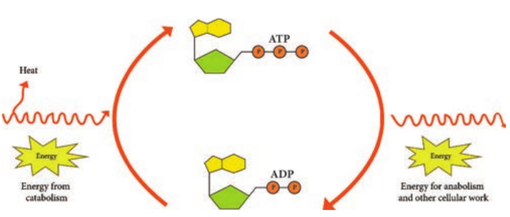

## Metabolism
 The term Metabolism refers to the sum of all bio chemical reactions that occur within a living cell. Chemical reaction either release energy or require energy. Metabolism can be viewed as an energy balancing act. It can be divided into two classes of chemical reactions namely **Catabolism** and **Anabolism**.

**Catabolism:** It is called catabolic or degradative reactions because complex organic compounds are broken down into simples ones. Catabolic reactions are generally hydrolytic reactions. It is enzyme regulated chemical reaction that release energy and they are exergonic Example: Break down of sugar into Carbon dioxide and water in cells.

**Anabolism:** It is called anabolic or biosynthetic reactions because complex organic molecules are formed from simples ones. Anabolic process often involves dehydration, are bio-synthetic reactions (Figure 4.1). It is enzyme regulated energy requiring reaction and they are endergonic. Examples: Formation of proteins from amino acids.

d anabolic reactions

  

Catabolic reactions furnish the energy needed to drive anabolic reactions. This coupling of energy requiring and energy releasing reactions is made possible through the molecule Adenosine tri-phosphate (ATP).

## Energy of Chemical Reaction

Light energy is trapped by phototrophs during photosynthesis, in which it is absorbed by bacteriochlorophyll and other pigments and converted to chemical energy for cellular work. The energy is required by the bacterium for synthesis of cell wall or membrane, synthesis of enzymes, cellular components, repair mechanism, growth and reproduction.

Some change of energy occurs whenever bonds between atoms are formed or broken during chemical reactions. When a chemical bond is formed, energy is required. Such a chemical reaction which requires energy is called an endergonic reaction (energy is directed inward). When a bond is broken, energy is released. A chemical reaction that release energy is an exergonic reaction (energy is directed outward).

During chemical reaction energy is either released or absorbed and the quantum of energy liberated or taken up is useful energy and is referred to Free Energy Change (ΔG) of the reactions.

### High Energy Phosphate

Adenosine Tri-Phosphate (ATP) is the principal energy carrying molecule of all cells and is indispensable to the life of the cell. It stores the energy released by some chemical reactions, and it provides the energy for reactions that require  

energy. ATP consists of an adenosine unit composed of adenine, ribose with three phosphate groups. In ATP and some other phosphorylated compounds, the outer two phosphate groups are joined by an **anhydride bond**.

Some of the other high energy nucleotides involved in biochemical processes are given in Table 4.1.

**Table 4.1:** High energy nucleotides involved in biosynthesis

**Name of the Nucleotide**

**Biosynthesis**

Uridine triphosphate (UTP)

Polysaccharide

Cytidine triphosphate (CTP)

Lipid

Guanidine triphosphate (GTP)

Protein

Nutrients are broken from highly reduced compounds to highly oxidized compounds within the cells. Much of the energy released during oxidation - reduction reactions is trapped within the cell by the formation of ATP. A phosphate group is added to ADP with the input of energy to form ATP. ATP + H2O ADP + pi (ΔG° = −7.3 K Cal/mol) ATP + H2O AMP + ppi (ΔG° = −10.9 K Cal/mol)

ATP is ideally suited for its role as an energy currency. It is formed in energy trapping and energy generating processes such as photosynthesis, fermentation, and aerobic respiration. In bacterial and archeal cells, most of the ATP is formed on the cell membrane, while in eukaryotes the reactions occur primarily in the mitochondria (Figure 4.2).

| Name o f theNuc le otide |Bi os y nthes is |
|------|------|
| Ur idin e t r iphos phate(UTP) |Polys acc har ide |
| Cyt idin e t r iphos phate(CTP) |L ipi d |
| Gu anidin e t r iphos phate(GTP) |Protein |
  

### Oxidation – Reduction Reactions

Oxidation is the removal of electrons (e−) from an atom or molecule and is often an energy producing reaction. Reduction of a substrate refers to its gain or addition of one or more electrons to an atom or molecule. Oxidations and reduction are always coupled. In other words, each time one substance is oxidized, another is simultaneously reduced. F2 + 2e− 2F−

H2 + 2e− 2H+ + 2e−

NAD+ + 2H+ + 2e− NADH + H+

## Generation of ATP
 Much of energy released during oxidation reduction reaction is trapped within the cell by the formation of ATP. A phosphate group is added ADP with the input of energy to form ATP. The addition of a phosphate to a chemical compound is called phosphorylation.

Organism uses three different mechanisms of phosphorylation to generate ATP from ADP. They are

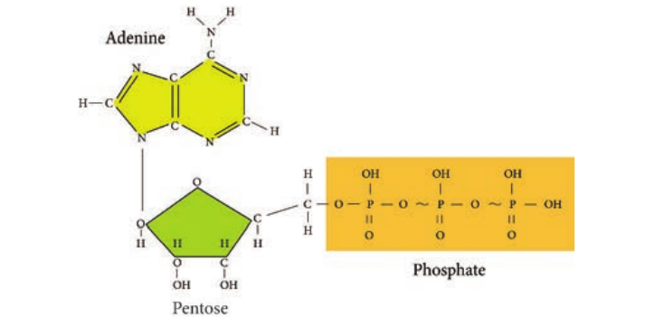

### Substrate Level Phosphorylation

It is a metabolic reaction that results in the formation of ATP or GTP by the direct transfer of a phosphoryl group to ADP or GDP from another phosphorylated compound.

Alkaline phosphatase is a heat sensitive enzyme in milk which is used as an

indicator in Pasteurization.

### Oxidative Phosphorylation

In this reaction, electrons are transferred from organic compounds to molecules of Oxygen (O2) or other inorganic molecules through a series of different electron carriers (Example: NAD+ and FAD). Then the electrons are passed through a series of different electron carriers to oxygen. The process of oxidative phosphorylation occurs during electron transport chain (Figure 4.3).

ture of ATP

  

### Photophosphorylation

It occurs only in photosynthetic cells which contain light trapping pigments. Example: In photosynthesis, photosynthetic pigment, Chlorophyll is involved in the synthesis of organic molecules especially sugars, with the energy of light from the energy poor building blocks like Carbon dioxide and water. In phototropic bacteria (purple, green sulphur bacteria, Cyanobacteria), photosynthetic pigments bateriochlorophylls are involved in ATP production.

## Carbohydrate Catabolism

Most microorganisms oxidize carbohydrates as their primary source of cellular energy. Carbohydrate catabolism

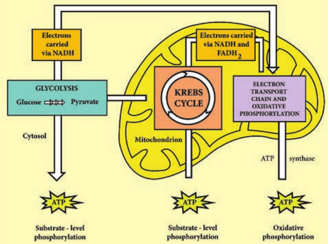

is the breakdown of carbohydrate molecule to produce energy and is therefore of great importance in cell metabolism. Glucose is the most common carbohydrate energy source used by cells.

To produce energy from glucose, microorganism use two general processes namely Respiration and Fermentation.

### Cellular Respiration

Respiration is defined as an ATP generating process in which organic molecules are oxidized and the final electron acceptor is an inorganic compound. In aerobic respiration, the final electron acceptor is Oxygen and in anaerobic respiration the final electron acceptor is an inorganic molecule like NO3, SO4

2− other than Oxygen.

osphorylation

  

The aerobic respiration of glucose typically occurs in three principal stages. They are

™ Glycolysis

™ Krebs cycle

™ Electron transport chain

**Glycolysis** Glycolysis is the process of splitting of sugar molecule, where the glucose is enzymatically degraded to produce ATP. Glycolysis is the oxidation of glucose to pyruvic acid with simultaneous production of some ATP and energy containing NADH. It takes place in the cytoplasm of both prokaryotic and eukaryotic cells. Glycolysis occurs in the extra mitochondrial part of the cell cytoplasm. Glycolysis was discovered by Emden, Meyerhof and Parnas. So, this cycle is shortly termed as EMP pathway, in honour of these pioneer workers. This cycle occurs in animals, plants and large number of microorganisms. Glycolysis does not require oxygen, it can occur under aerobic or anaerobic condition. Glycolysis is a sequence of ten enzyme catalyzed reactions.

**Aerobic condition** Glucose Pyruvate CO2

\+ H2O

**Anaerobic condition** Glucose Pyruvate Fer- mented products

C6H12O6 +2 NAD + 2 ADP + 2 P 2 CH3 COCOOH + 2 ATP +

2 NADH + 2 H+

(Pyruvic acid)

Since glucose is a six carbon molecule and pyruvate is a three carbon molecule, two molecules of pyruvate are produced for each molecule of glucose that enters

Glycolysis Respiration O2

Glycolysis Fermentation  

Glycolysis. Net energy production from each glucose molecule is two ATP molecules The Glycolysis pathway consists of two phases. They are

1\. The preparatory/Investment phase, where ATP is consumed

2\. The pay off phase where ATP is produced (Figure 4.4).

1\. In the preparatory stage, two molecules of ATP are utilized and then glucose is phosphorylated, restructured, and split into two 3 carbon compounds namely Glyceraldehyde-3-phosphate and Dihydroxyacetone phosphate.

2\. In pay off phase or energy conserving stage, the two 3 carbon molecules are oxidized in several steps to 2 molecules of pyruvic acid and two molecules of NAD+ are reduced to NADH, thus four molecules of ATP are formed by substrate level phosphorylation.

Two molecules of ATP are needed to initiate Glycolysis and four molecules of ATP are generated at the end of the process. Therefore, the net gain of Glycolysis is two ATP for each molecule of glucose oxidized.

**Alternatives to Glycolysis** Many bacteria have another pathway in addition to Glycolysis for the oxidation of glucose. Some of the common pathways that occur in most of the bacteria are

- Pentose phosphate pathway (PPP) or Hexose Mono Phosphate shunt

- Entner –Doudoroff Pathway

Does Glycolysis require Oxygen?

**HOTS**

  

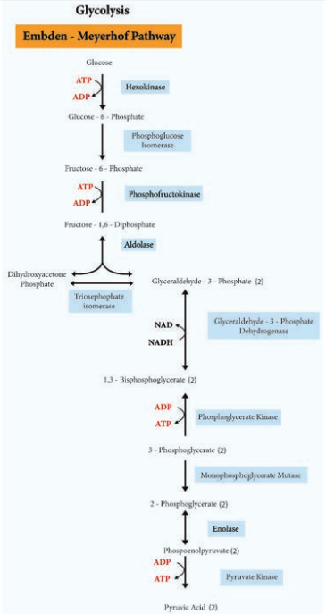

lysis Pathway

  

Strips used in Glu- cometer a chemical called glucose oxidase which reacts with the

glucose in the blood sample and is con- verts it into an acid called gluconic acid.

## Tricarboxylic Acid Cycle(TCA)

TCA cycle was first elucidated by Sir Hans Adolf Krebs, a German Biochemist in 1937. It is also known as Tricarboxylic acid cycle, Citric acid cycle or Amphibolic cycle. In prokaryotic cells, the citric acid cycle occurs in the cytoplasm; in eukaryotic cells it takes place in the matrix of the mitochondria.

The process oxidizes glucose derivatives, fatty acids, and amino acids to carbon dioxide (CO2) through a series of enzyme controlled steps. The purpose of the Krebs cycle is to collect high energy electrons from these fuels by oxidizing them, which are transported by activated electron carriers such as NADH and FADH2 to electron transport chain. The Krebs cycle is also the source for the precursor of many other molecules and is therefore an amphibolic pathway (both anabolic and catabolic reactions take place in this cycle) and therefore, it can be used for both the synthesis and degradation of bio molecules. Pyruvate + CoA-SH + NAD+

Pyruvate dehydrogenase complex

Acetyl CoA + Co2 + NADH Pyruvate cannot enter the Krebs cycle directly. In a preparatory step, it must lose one molecule of CO2 and becomes a two-carbon compound. This process is called decarboxylation. The two-carbon  

compound, called acetyl group, attaches to coenzyme A through a high-energy bond, the resulting is a complex known as acetyl coenzyme (acetyl CoA). During this reaction, pyruvic acid is also oxidized and NAD+ is reduced to NADH by pyruvate dehydrogenase complex (PDHC). This multi enzyme complex is responsible for the conversion of pyruvate to acetyl-coA. Therefore PDHC contribute to linking the Glycolysis pathway to the citric acid pathway.

Pyruvate dehydroge- nase deficiency is a common cause of lactic acidosis in new born

and often present with poor feeding.

The Krebs cycle generates a pool of chemical energy (ATP, NADH, and FADH2) from the oxidation of Pyruvic acid and it loses one carbon atom as CO2 and reduces NAD+ to NADH. The resulting two carbon acetyl molecule is joined to Co enzyme A. Acetyl CoA transfers its acetyl group to a 4C compound (oxaloactate) to make a 6C compound (Citrate) and the Coenzyme A is released which goes back to the link reaction to form another molecule of acetyl CoA. Oxaloacetate is both the first reactant and the product of the metabolic pathway (creating a loop).

After citrate has been formed, the cycle machinery continues through seven distinct enzyme catalyzed reactions that produce in order isocitrate, α – ketoglutarate, succinyl CoA, succinate, fumarate, malate and oxaloacetate.

At the end of Krebs cycle, each pyruvic acid produces 2 CO2, 1 ATP (substrate

  

level phosphorylation), 3 NADH and 1 FADH2. Then NADH and FADH2 can be oxidized by electron transport chain to provide more ATPs.

## Electron Transport Chain

An electron transport chain consists of a sequence of carrier molecules that are capable of oxidation and reduction. In

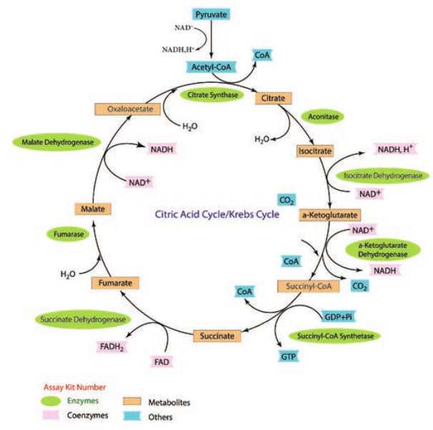

Eukaryotic cell, the ETC is contained in the inner membrane of mitochondria or chloroplast membrane, whereas in prokaryotic cells, it is found in plasma membrane or cytoplasmic membrane.

The ETC is carried out through a series of electron transporters embedded in the inner mitochondrial membrane that transfer electrons from electron donors NADH

Krebs cycle

  

and FADH2 to acceptor such as molecular Oxygen. In the process, protons are pumped from the mitochondrial matrix to the inner membrane space, and eventually combine with O2 and H+ to form water (Figure 4.6).

Why each NADH makes 3 ATPs and each FADH2 makes 2 ATPs?

**HOTS**

As the electrons flow through the chain, much of their free energy is conserved in the form of ATP. The process by which energy from electron transport is used to make ATP is called as oxidative phosphorylation. Respiratory chain is an electron transport chain where a pair of electrons or hydrogen atoms containing electron from the substrate oxidized is coupled to reduction of oxygen to water. The mitochondrial system is arranged

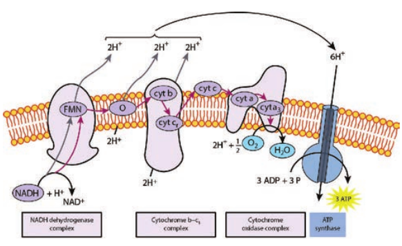

into three complexes of electron carriers. They are 1. **Flavoproteins:** These proteins contain

flavin, a coenzyme derived from riboflavin (Vit B12). One important flavoprotein is flavin mono nucleotide.

2\. **Ubiquinones (coenzyme Q):** These are small non protein carriers.

3\. **Cytochromes:** These are proteins with iron containing group, capable of existing alternately as reduced (Fe2+) and oxidized form (Fe3+). Cytochromes involved in ETC include cyt (b),cyt c1, cyt c, cyt a, cyt a3.

The first step in electron transport chain is the transfer of high energy electrons from NADH to FMN. This transfer actually involves the passage of hydrogen atom with 2 e− to FMN, which then picks up an additional H+ from the surrounding aqueous medium.

d Chemiosmotic mechanism of ATP

  

As a result of the first transfer, NADH is oxidized to NAD+, and FMN is reduced to FMNH2.

In the second step, FMNH2 passes 2 H+ to the other side of the mitochondrial membrane and passes 2 e− to coenzyme Q. As a result, FMNH2 is oxidized to FMN. Coenzyme Q also picks up additional 2H+ from the surrounding aqueous and releases to other side of the membrane.

In the next step, electrons are passed successively from coenzyme Q to cyt b1, cyt c1, cyt c, cyt a, cyt a3. Each cytochrome in the chain is reduced, as it picks up electrons and is oxidized as it gives up electrons. The last cytochrome cyt a3 passes its electrons to molecular O2 which picks up protons from the surrounding medium to form H2O.

FADH2 derived from the Krebs cycle is another source of electrons. Thus at the end of ETC, NADH pumps three protons (synthesizes 3ATPs) whereas FADH2 pumps only two protons (synthesizes 2ATPs).

### Chemiosmotic Mechanism of ATP

Chemiosmotic mechanism of ATP synthesis was first proposed by the Biochemist, Peter Mitchell in 1961. In ETC, when energetic electrons from NADH pass down the carriers, some of the carriers (proton pumps) in the chain pump \[actively transport\] protons across the membrane to inner membrane space. Thus in addition to a concentration gradient, an electrical charge gradient is created. The resulting electro chemical gradient has potential energy called proton motive force.  

The proton diffuses across the membrane through protein channels that contain an enzyme called ATP synthase. When this flow occurs, energy is released and is used by the enzyme to synthesize ATP from ADP and phosphate.

At the end of the chain, electrons join with protons and O2 in the matrix fluid to form H2O. Thus O2 is the final electron acceptor. ETC also operates in photophosphorylation and is located in thylakoid membrane of Cyanobacteria (BGA), and of eukaryotic chloroplasts. Overview of Aerobic respiration (Figure 4.7):

™ Electron transport chain regenerates NAD and FAD which can be used again in Glycolysis and Krebs cycle.

™ Various electrons transfer in the electron transport chain generates about 34 ATP, (10 NADH = 10 × 3 = 30 + 2 FADH2 = 2 × 2 = 4).

™ A total of 38 ATP molecules is generated from one molecule of glucose oxidized in prokaryotes, whereas in eukaryotes, 36 molecules of ATP is generated because in eukaryotes, some energy is lost when electrons are shuttled across the mitochondrial membranes that separate Glycolysis (in the cytoplasm) from the electron transport chain (Table 4.2). There is no such separation exists in prokaryotes.

C6H12O6 + 6CO2 + 38ADP + 38Pi 6CO2 + 6H2O + 38 ATP

  

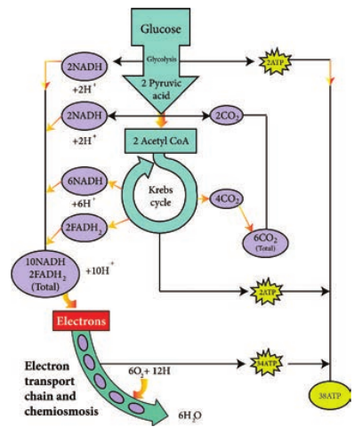

1 NADH = 3 ATPs and 1FADH2 = 2 ATP

**Glycolysis** 1\. Oxidation of glucose to Pyruvic acid. 2. Production of 2 NADH

**P** 2 6

**Preparatory step** 1\. Formation of acetyl CoA produces

2NADH

6

**Krebs cycle** 1\. Oxidation of succinyl CoA to

succinic acid 2. Production of 6 NADH 3. Production of 2 FADH

2

18 4

**To**

**Table 4.2:** Net gain of ATP produced during ae  

aerobic respiration

**reparatory step** ATP (substrate level phosphorylation) ATP (Oxidative phosphorylation in ETC)

ATP (Oxidative phosphorylation in ETC)

ATP (Substrate level phosphorylation)

ATP (Oxidative phosphorylation in ETC) ATP (Oxidative phosphorylation in ETC)

**tal 38 ATP**

robic respiration of glucose in prokaryotes

| G l yc o l ysi s1. O xid at io n o f g lucos e t o P y r uv ic acid .2. P ro duc t io n o f 2 N AD H |Pr e p ar ato r y  s te p2 ATP (s ubs t ra te le vel p hos phor y l at io n)6 ATP (O xid ative p hosphor ylation in E TC) |
|------|------|
| Pr e p ar ato r y  s te p1.  For mat io n o f acet y l C oA p ro duces2NAD H |6 ATP (O xid ative phosphor ylation in E TC) |
| K re bs c ycl e1.  Oxid at io n o f s uccin y l C oA t osuccinic acid2. P ro duc t io n o f 6 N AD H3. P ro duc t io n o f 2 F AD H |2 ATP (S ubs t ra te le vel p hos phor y l at io n)18 ATP (Oxidative phosphor ylation in ETC)4 ATP (O xid ative phosphor ylation in E TC)Tota l 38 A TP |
  

## Lipid Catabolism

Microorganisms frequently use lipids such as triglyceride or triacylglycerol (esters of glycerol and fatty acids) as common reserve energy sources. These can be hydrolyzed to glycerol and fatty acid by microbial lipases. The glycerol is then phosphorylated and oxidized to Dihydroxyacetone phosphate and then catabolized in the Glycolysis pathway. Fatty acids from triacylglycerols and other lipids are often oxidized in the β-oxidation pathway. In this pathway fatty acids are degraded to acetyl CoA (2C segment), then it enters into the TCA cycle.

**Bubble Test:** Bubbles are a positive result for the presence of catalase. If an

organism can produce catalase, it will produce bubbles of oxygen when hydrogen peroxide is added to it.

One of the major environmental problems today is hydrocarbon contamination resulting from the activities related to the petrochemical industry. Several bacteria can use hydrocarbon as a feed and reduce pollution.

_Pseudomonas putida_ (Super Bug) _Alcanivorax borkumens, Mycobacterium, Brevibacterium, Aspergillus, Penicillium, Candida lipolytica_ are the most active agents in petroleum degradation and they work as primary degraders in oil spilled environment. These organisms are mainly in involved in bioremediation which reduce environmental pollution

**Infobits**  

## Protein Catabolism

Many microbes use protein as their source of carbon and energy. Pathogenic microorganisms secrete protease enzyme that hydrolyze proteins and polypeptides to amino acids which are then transported into the cell and catabolized. Protease (Peptidase or proteinase) helps in proteolysis (Figure 4.8). These proteolytic enzymes break the long chains of proteins into peptides and eventually into amino acids. The enzymes are classified based on the sites at which they catalyse the cleavage of proteins as exopeptidase and endopeptidase.

The protein catabolism involves two reactions namely,

- Deamination an. 
- Transamination Deamination is the removal of the

amino group from an amino acid. Transamination is the transferring of amino group from an amino acid to an amino acid acceptor.

The organic acid resulting from deamination can be converted to pyruvate, acetyl CoA or TCA cycle intermediates to release energy. Excess nitrogen from deamination may be excreted as ammonium ion.

Various metabolic processes such as blood coagulation, fibrinolysis, comple-

ment activation, phagocytosis and blood pressure control are regulated by proteases.

  

## Fermentation

In 1856 fermentation, reaction was first demonstrated by Louis Pasteur in yeast. The study of fermentation and its practical uses is named as Zymology. Any energy releasing metabolic process that takes place only under anaerobic condition is called fermentation. It can also be defined as a metabolic process that release energy from a sugar or other organic molecule. It does not require oxygen or an electron transport system, and uses an organic molecule as the final electron acceptor. Fermentation reaction yields only a small amount of energy (2 ATP).

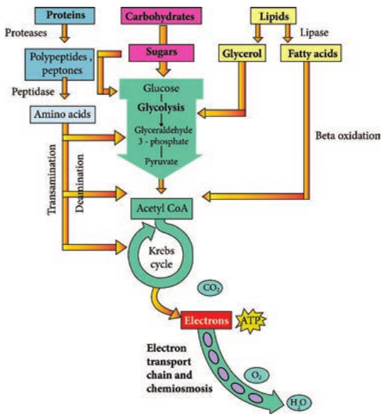

Anaerobes do not use an electron transport chain to oxidize NADH to NAD+ and therefore use fermentation as alternative method to maintain a supply of NAD+ for the proper function of normal metabolic pathways. Facultative anaerobes can use fermentation under anaerobic condition and carryout aerobic respiration when oxygen is present. Fermentation reoxidizes NADH to NAD+ by converting pyruvic acid into various organic acids.

During fermentation, NADH is converted back into the coenzyme NAD+ so that it can be used again for Glycolysis

otein , Carbohydrates and Lipids

  

(Figure 4.9). Organic electron acceptors such as pyruvate or acetaldehyde react with NADH to form NAD+, producing CO2 and organic solvent like ethanol. Fermentation can be classified as Lactic acid fermentation and alcohol fermentation.

Aquifex (water maker) of Aquificae is a diverse collection of bacteria that live

in harsh environmental settings. These can produce water by oxidizing hydrogen.

### Lactic acid fermentation

During Glycolysis, in the first step of lactic acid fermentation, a molecule of glucose is oxidized to 2 molecules of pyruvic acid and it generates the energy. In the next step pyruvic acid is reduced by NADH to form lactic acid. _Lactobacillus_ and _Streptococcus_ are some of the lactic acid producing genera (Figure 4.10).

1

2ADP+2P 2ATP

Glucose

2 Ethanol

NAD+

NAD+ NADH NADH

3-

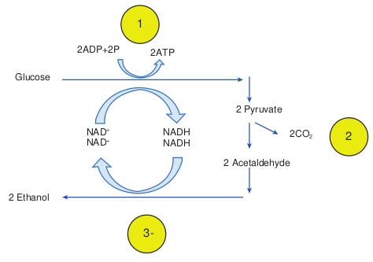

Milk is converted into fermented products such as curd, yogurt and cheese. The fermentation of lactose in milk by these bacteria produces lactic acid which acts on milk protein to give yogurt its texture and characteristic tart flavour. Here lactase enzyme is produce by the bacteria which convert the lactose into lactic acid.

Builds up of Lactic acid in muscle cells causes muscle cramp.

**Homolactic acid fermentation** In this type of fermentation, organism produces lactic acid alone. So it is referred to as homolactic fermentation. Glucose + 2ADP + 2P Lactic acid

\+ 2 ATP

**Heterolactic acid fermentation** In this type of fermentation, organism produces Lactic acid as well as other acids or alcohol. So it is known as hetero

2

2 Pyruvate

2 Acetaldehyde

2CO2

nge of NADH and NAD+

  

fermentation or heterolactic and often uses the pentose phosphate pathway. G + ADP + p Lactic acid + ethanol

\+ CO2 + ATP

Why do cells need to ferment when they get 2ATPs from Glycolysis?

**HOTS**

### Alcohol Fermentation

Alcohol fermentation begins with the Glycolysis which yields two molecules of pyruvic acid and two molecules of ATPs. In the next step, the two molecules of pyruvic acid are converted to two molecules of acetaldehyde and two molecules of CO2.

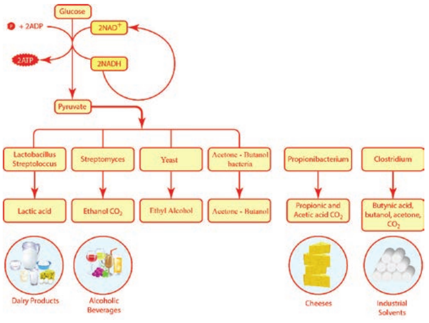

The acetaldehydes are then reduced by NADH to form ethanol. The ethanol and CO2 produced by the yeast Saccharomyces is used in alcoholic beverages and to raise bread dough respectively.

## Enzymes

Life is an intricate meshwork involving a perfect coordination of a vast majority of chemical reactions. This is due to the presence of some catalysts synthesized inside the body of the organism. The term ‘enzyme’ was coined by Friedrich Wilhen Kuhne (1878) to designate these biological catalysts. The name ‘enzyme’ (en – in, zyme – yeast) literally means ‘in yeast’. The name of enzyme usually ends in – ase. Example: Cytochrome

ts of microbial fermentation

  

dehydrogenase. The study of enzyme is called Enzymology.

Enzymes are proteins or large biomolecules that can catalyze certain biochemical reactions for metabolic process within the cell. The substances that can speed up a chemical reaction without being permanently altered itself are called catalysts. Enzymes accelerate the rate of chemical reactions. The molecule upon which enzyme may act are called substrate and the enzyme convert the substrate into different molecules known as products. The enzyme serves as biological catalyst (Table 4.3).

Tyrosinases are syn- thesized by _Agaricus bisporus,_ which is involved in melano-

genesis (pigmentation of skin and hair).

**Class Type of Chemical Reaction** Oxido- reductase

Oxidation-reduction in which oxygen and hydrogen are gained or lost

Xred

Transferase Transfer of functional groups, such as an amino group, acetyl group, or phosphate group

X − P

Hydrolase Hydrolysis (addition of water) X − Y

Lyase Removal of groups of atoms without hydrolysis

X − Y

Isomerase Rearrangement of atoms within a molecule

X − Y

Ligase Joining of two molecules (using energy usually derived from breakdown of ATP)

X + Y

**Table 4.3:** Enzyme Classification Based on Typ  

### Characteristics of Enzymes Enzymes

- are highly substrate specifi. 
- are reused at several time. 
- synthesized within the cells are

determined by gene. 
- speed up the chemical reactio. 
- decrease the activation energy

needed to star. 
- act as a biocatalyst

Proteins have four levels of structure (i) primary (sequence of amino acids), (ii) secondary (regular coils or pleats linked by peptide bonds), (iii) tertiary overall three dimensional structure of a polypeptide linked by disulphide bonds) and (iv) quatenary structure (two or more polypeptides chains). Like all proteins, enzymes are composed of one or more long chain of inter connected amino acids.

**Infobits**

**Reactions Examples** \+ Yox Xox + Yred Cytochrome oxidase,

lactate dehydrogenase

\+ Y X + Y − P Acetate kinase, alanine deaminase, transaminase, phosphotransferase

\+ H2O X − H + Y − OH

Lipase, sucrose

X + Y Oxalate decarboxylase, isocitrate, lyase

− Z X − Z − Y Glucose-phosphate isomerase, alanine racemase

\+ ATP X − Y + ADP + pi

Acetyl-CoA synthetase, DNA ligase

e of Chemical Reaction

| C l ass |Ty p e o f C he mi c a l R e ac ti on |Re ac ti ons |E xa mpl es |
|------|------|------|------|
| Oxido-re du c t as e |Oxid at io n-r e duc t io n in w hic hoxyg en a nd h ydr og en a rega in e d o r los t |Xr  + Y  X  + Y ded ox ox re |Cyt o chr ome o xid as e,l ac t ate de hydr og en as e |
| Tra nsf era s e |Tra nsf er o f f un c t io na l g roups,suc h a s a n a min o g roup, acet y lg roup, o r p hos phate g roup |X − P + Y   X + Y − P |Acet ate k inase,alanin e de amin ase,transamin ase,phosphotransfera se |
| Hyd rol as e |Hydr olysi s (addi t io n o f wa ter) |X − Y + H O X − H + Y − O H2 |L ip as e, s ucr os e |
| Lyas e |R em ova l o f g roups o f a tomsw it hout h ydr olysi s |X − Y   X + Y |Ox a l ate de c arb oxy l as e,is o ci t ra te, l ya s e |
| Is omera s e |R e ar ra ngem en t o f a tomsw it hin a m ole c u le |X − Y − Z   X − Z − Y |Glucos e-p hos phateis omera s e, a l anin eracem as e |
| L iga s e |Joining of two molecules (usingenergy usually derived frombreakdown of ATP) |X + Y + A TP X − Y + AD P + p i |Acet y l-C oAsy nt het as e, D NAliga s e |
  

Low level of catalase plays a major role in greying process of human hair.

### Structure of Enzymes

Enzymes are generally globular proteins that range in molecular weight from about 10,000 to several million. Each enzyme possesses a unique sequence of amino acid that causes it to fold into a characteristic three dimensional shape with a specific surface configuration. This enables it to find the correct substrate from large number of diverse molecules in the cell.

A molecule acted upon by an enzyme is called a substrate. Enzymes are specific and act on specific substrates and each enzyme catalyzes only one reaction. Enzyme consists of a protein portion, named apoenzyme and a non protein component, named cofactor (Figure 4.11).

Apoenzyme (Protein portion) (Inactive form)

\+ Cofactor (Non protein) (Inactive form)

Holoenzyme (Active enzyme)

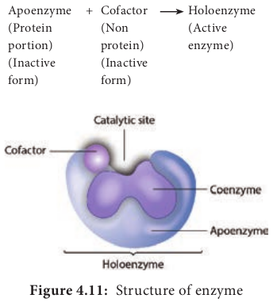

The region of an enzyme where substrate molecules bind and undergo a chemical reaction is its active site. Each active site is specially designed in response to their substrate; as a result most enzymes have specificity and can only react with particular substances. After the formation of enzyme substrate complex (Figure 4.12), forces exerted on the substrate by the enzyme cause it to react and become the product of the intended reaction.

Example: Sucrase catalyses the hydrolysis of sucrose to glucose and fructose.

Apoenzyme is the inactive form of the enzyme which gets activated after binding with a cofactor. Coenzymes are small organic molecules that can be loosely bound to an apoenzyme and they transport chemical group from one enzyme to another.

Cofactor is a chemical compound or metallic ion that is required for enzyme activity. Example: NAD+ is derived from

  

vitamin B. Some cofactors are metal ions including iron (Fe), copper (Cu), magnesium (Mg), manganese (Mn), Zinc (Zn), calcium (Ca) and cobalt. If the cofactor is tightly or firmly attached to the apoenzyme it is called a prosthetic group. The prosthetic group may be organic \[such as vitamin, sugar, and lipid\] or inorganic \[such as metal ion\] but is not composed of amino acids.

The complete enzyme consisting of the apoenzyme and its cofactor is called the holoenzyme.

**Table 4.4:** Industrial application of microbial e

**Industries Enzymes Microbial S** Pharmaceutical industry

- Glucose oxidase

- Streptokinas. 
- Proteas. 
- coagulase

- _Penicillium notatum_

- _Streptococ. 
- _Clostridiu. 
- _Staphyloc_

_aureus_ Dairy Industr. 
- Catalase

- Lactas. 
- _Aspergillu. 
- _Lactobaci_

Baking Industry

- Amylas. 
- Lipase

- _Bacillus su. 
- _Candida L_

Polymer Industry

- Lipas. 
- Peroxidase

- _Candida s. 
- _Pseudomo_

Leather Industry

- Protease Lipase

- _Bacillus sp. 
- _Aspergillu_

Textile Industry

- Cutinas. 
- Collagenas. 
- Laccase

- _Pseudomo. 
- _Clostridiu_

_histolyticu_

Recombinant DNA technology

- DNas. 
- Ligase

- _Escherich. 
- _Actinomy_  

### Microbial Enzymes

Many microbes synthesize and excrete large quantities of enzymes into the surrounding medium. Using this feature of these tiny organisms many enzymes like Amylase, Cellulase, Catalase, Protease, and Lipase are produced commercially.

Microbial enzymes are extensively used in food processing, preservation, washing powder preparation, leather industry, and paper industry and in scientific research (Table 4.4).

nzymes

**ources Application**

_ci m spp occus_

- To detect free glucose level in diabetic patients

- Anti coagulant. 
- Conversion of fibrinogen to

fibrin

_s niger llus spp_

- Remove Hydrogen peroxide in milk (detoxification)

- Increase sweetness in milk _btilis ipolytica_

- Increase bread shelf lif. 
- Enhances flour quality and

dough stability _pp nas spp_

- Polyester preparatio. 
- Formation of cross links

_p s spp_

- Unbarring of hides, degreasing and softening of leather

_nas spp m m_

- Cotton Scourin. 
- Wool Finishin. 
- Bleach terminatio. 
- Fabric dyeing

_ia coli cetes_

- Nuclease enzyme that break phosphodiester bond of DNA or RNA

- Joins the nick in DNA fragments

| Ind us tri es |E nzy mes |Mi cr obi a l S our c es |App l ic atio n |
|------|------|------|------|
| Phar maceu t ic a li ndu st r y |- Glucos eoxid as e- St re ptok i nas e- Prote as e- co agu l as e |- Pe nic illiumnotatum- Strep toc oc c i- C lostr idium  s pp- Staphyloc oc c u saure u s |- To det e c t f re e g lucos e le velin di ab et ic p at ien ts- Ant i co agu l ants- C onver sio n o f f ibr in og en t of ibr i n |
| D air y I ndust r y |- C at a l as e- L a c t as e |- Asper g illu s n iger- L ac tob ac illu s  s pp |- R em ove H ydr og en p er oxidein mi l k (det oxif ic at io n)- Incr e as e sw e et nes s in mi l k |
| B a k i ng In dust r y |- Amy l as e- L ip as e |- B ac ill u s  s ubtil i s- C andida  L ipo ly tic a |- Incr e as e b re ad s helf lif e- En hances f lo ur q u a li t y a nddo ug h s t abi li t y |
| Poly me rIn dust r y |- L ip as . 
- Per oxid as e |- C andida  spp- Ps eu domonas s pp |- Polyes ter  prep ara t io n- For mat io n o f cr os s lin ks |
| L ea th e rIn dust r y |- Prote as e L ip as e |- B ac illu s  spp- Asp e rg illu s  spp |- Unb ar r in g o f hides,deg re asin g a nd s of tenin g o fle at her |
| Text i leIn dust r y |- Cut i nas e- C ol l age nas e- L acc as e |- Ps eu domonas s pp- C lostr idiumhi stol y tic um |- C otton S co ur in g- Wo ol Fini shin g- Ble ac h t er min at io n- Fabr ic d yein g |
| R e c om bi nantDNAte chn olog y |- DNas e- L iga s e |- E s ch e r ichia  c oli- Ac tino mycet es |- Nuc le as e enzy me t hat b re a kphos pho dies ter b ond o fDNA o r RN A- Join s t he nic k in D NAf ra g men ts |
  

_Idoenella sakaiensis_ is a bacterium capable of breaking down PET plastics. The bacterium first uses PETase to break down the PET plastic. This has potential importance in the recycling process of PET plastics.

**Infobits**

Lipase is used in the determination of triglyceride and blood cholesterol level.

Lipase producing microorganism have been found in industrial wastes, vegetable oil processing factories, diary plants and soil contaminated with oil.

### Enzyme Regulation

Inhibitors: An enzyme inhibitor is a molecule that binds to an enzyme and decreases its activity (Flowchart 4.1). This adverse affect of inhibitors on the rate of enzymatically catalyzed reactions are called inhibition.

**Flowchart 4.1:** Types of Inhibition

**Inhibition**

Reversible

Competitive

Irreversible

Uncompetitive

Allosteric

Mixed

Non-competitive  

An irreversible inhibitor inactivates an enzyme by binding covalently to a particular group at the active site. A reversible inhibitor inactivates an enzyme by non covalent, more easily reversible interactions. Competitive inhibitor is any compound that bears a structural resemblance to a particular substrate for binding at the active site of an enzyme. Non competitive inhibitors do not compete with the substrate for the enzyme’s active site; instead, they interact with another part of the enzyme. Uncompetitive inhibitors bind only to the enzyme substrate complex without binding to the free enzyme (Figure 4.13).

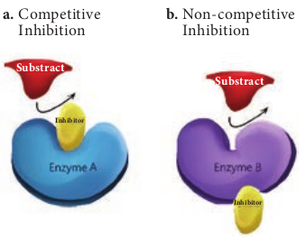

**a.** Competitive Inhibition

**b.** Non-competitive Inhibition

**Substract Substract**

**Inhibitor**

**Inhibitor**

Administration of the enzyme DNase I to the lungs of cystic fibrosis patients

decrease the viscosity of the mucus and the breathing is made easier.

**Feedback inhibition** In Feedback inhibition, the final product allosterically inhibits the enzyme that catalyses the first stage in the series

|------|

  

of reactions. This process is used to regulate the synthesis of amino acids (Flowchart 4.2). Example: Threonine deaminase is the first enzyme in the conversion of Threonine to Isoleucine. Isoleucine inhibits Threonine deaminase through feedback inhibition.

**Substrate**

**Product Enzyme 1**

**Intermediate 1**

**Enzyme 2**

**Intermediate 2**

**Enzyme 3**

**Intermediate 3**

**Enzyme 4**

**Intermediate 4**

**Product**

**Flowchart 4.2:** Feedback Inhibition

**Fe ed**

**ba ck**

**In hi**

**bi tio**

**n**

### Uses of Microbial Enzymes

Microbial enzymes ar. 
- helpful to save energy and prevent

pollutio. 
- highly specifi. 
- be immobilized and reuse. 
- inexpensive and more stabl. 
- easily extracted and purifie. 
- genetically manipulated to yield higher

quality

**Summary**

The sum of all chemical reactions within a living organism is known as Metabolism.  

Biochemical pathway that functions in both anabolism and catabolism are called amphibolic pathways, meaning that they are dual purpose. The energy of catabolic reactions is used to drive anabolic reactions. The energy for chemical reactions is stored in ATP. The chemical reactions are catalyzed by different enzymes. Enzymes catalyze chemical reactions by lowering the activation energy. Most of the cells energy is produced from the oxidation of carbohydrates. During respiration organic molecules are oxidized. Energy is generated from the ETC. In aerobic respiration, O2 function as the final election acceptor. In anacrobic respiration, the final electron acceptor is an inorganic molecule NO2-, SO42- other than O2.

Complete oxidation of glucose molecule takes place in 3 sequential reactions.

¾ Glycolysis occurring in cytoplasm ¾ Krebs cycle occurring is mito

chondrial matrix ETC (Oxidative Phosphorylation) occurring is inner mitochondrial matrix. In aerobic prokaryotes, 38 ATP molecules can be produced from complete oxidation of a glucose molecule in glycolyins, krebscycle, and ETC. In eucaryotes 36 ATP molecules are produced from complete oxidation of a glucose molecule. In incomplete oxidation of glucose molecules will revolt in fermentation, O2 in anaerobic condition. Various commercial products are produced from pyruvic acid. Lipid can be catabolised by lipase which hydrolyze lipid into glycerol and fatty acid. Then fetly acids are catabolised by Beta oxidation. Proteins can be catabolised by Deamination and

  

Transamination process into amino acids. Carbohydrate, Fat, Protons can all be the source of electrons and protons for respiration. Microbial enzymes are extensively used in food processing, preservation, paper industry and in scientific research.

**Evaluation**

**Multiple choice questions**

1\. High energy transfer compounds are capable of a. Accepting large

amount of free energy

b. Transferring large amount of free energy

c. Measuring free energy d. None of the above

2\. In an aerobic respiration the terminal electron acceptor is a. oxygen b. nitrogen c. hydrogen d. nitrate

3\. Utilizable energy or energy is available to do work is termed as a. free energy b. Utilisable energy c. Kinetic energy d. Thermal energy

4\. The reactant in glycolynis is a. Pyruvic acid b. Citric acid c. glucose d. Glucose-6-phosphate  

5\. The correct sequence of anaerobic reactions in yeast is

a. Glucose Cytoplasm pyruvate Mitochondria Ethanol + CO2

b. Glucose Cytoplasm pyruvate Cytoplasm Lactic acid

c. Glucose Cytoplasm pyruvate + Energy Mitochondria CO2 + H2O

d. Glucose Cytoplasm pyruvate Cytoplasm Ethanol + CO2

6\. For every one molecule of sugar glucose which is oxidized molecule of pyruvic acid are produced. a. 1 b. 2 c. 3 d. 4

7\. Assertion (A) : In substrate level phosphorylation ATP is generated when a high energy phosphate is directly transferred from a phosphorylated compound (substrate) to ADP.

Reason (R) : Phosphoenol pyruvic acid pyruvic acid

a. A is true, A is supported by R

b. A is false, but R is not supported by A

c. Both A and R are false

d. A is true, R is false 8. Which one of the following is correct

a. Apoenzyme + Cofactor = Holoenzyme

b. Holoenzyme + Coenzyme = Apoenzyme

c. Apoenzyme + Holoenzyme = Coenzyme

d. Coenzyme + Cofactor = Holoenzyme

ADP ATP

  

9\. Identify the correct match.

a. Catalase - 1. Detect Blood glucose level

b. Glucose oxidase

\- 2. Break down of H2O2

c. Protease - 3. Clot the plasma d. Coagulase - 4. Leather

manufacture

10\. Statement A: Oxidation of glucose to pyruvic acid yield only 4 ATP by substrate level phosphorylation.

Statement B: The total ATP which is produced through TCA is 24.

a. Statement A is true, B is false

b. Both A and B are true

c. A is false, B is true

d. Both A and B are false

**Answer the following**

1\. Define metabolism 2. Write the difference between

catabolism and Anabolism. 3. ATP is an energy storage compound,

where does it get this energy from? 4. What is holoenzyme? 5. What is Active site? 6. Explain the structure of ATP. 7. Write about the types of

phosphorylation.  

8\. Mention the classification of enzymes based on chemical reaction.

9\. Define fermentation. 10. Write about the types of fermentation

with few examples. 11. Mention the importance of the

enzymes. 12. Write short note on the component of

the enzyme. 13. Explain the enzyme regulation

mechanism. 14. Explain EMP pathway or glycolytic

pathway. 15. Describe TCA cycle. 16. Explain electron transport chain. 17. These are three mechanism for the

phosphorylation of ADP to ATP. Write the name of the mechanism in the following reaction given below.

1 An electron liberated from chlorophyll by light, is passed down an ETC

?

2 Cytochrome c passes two electrons to cyt a

?

3 Phosphoenol pyruvic acid

pyruvic acid

?

18\. Name the stages of aerobic respiration?

| 1 |An e le c t ron li b era te d f romch lo rophy l l b y lig ht, i s p ass e ddo w n a n E TC |? |
|------|------|------|
| 2 |Cyt o chr ome c p ass es t woele c t rons t o c yt a |? |
| 3 |Phos pho en ol p y r uv ic acidpy r uv ic acid |? |
