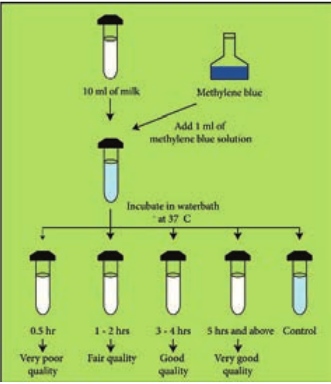
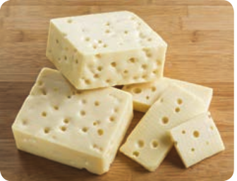
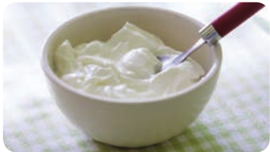

  

**Chapter Outline**

**5.1** Food Microbiology **5.2** Food Spoilage **5.3** Food Borne Disease **5.4** Food Preservation Methods **5.5** Dairy Microbiology **5.6** Cheese **5.7** Yogurt **5.8** Curd

After studying this chapter the students will be able to,

_- Know the sources of microorganisms in food_

_- Understand the factors that influence growth of microorganisms in food_

_- Learn about the food spoilag. 
- Appreciate the food preservation_

_method. 
- Learn and compare food poisoning_

_and food intoxicatio. 
- Classify the food borne disease. 
- Understand the microbial standards_

_and grading of mil. 
- Know the fermented milk products_

_like cheese, yoghurt and curd_

**Learning Objectives**

**Food M**

**Chapter**

**5**  

## Food Microbiology

The field of food microbiology is very broad, encompassing the study of microorganisms which have both beneficial and deleterious effects on

the quality and safety of raw and processed foods. The primary tool of microbiologists is the ability to identify and quantitate food- borne microorganisms. Microorganisms in food include bacteria, molds, yeasts, algae, viruses, parasitic worms and protozoans.

Microorganisms are associated with the food we eat in a variety of ways. They may influence the quality of our food. Naturally occurring foods such as fruits and vegetables normally contain some microorganisms and may be contaminated with additional organisms during handling and processing. Food can serve as a medium for the growth of microorganism, and microbial growth may cause the food to undergo decomposition and spoilage. Food may also carry pathogenic microorganisms which when ingested can cause disease. When food with microorganisms that produce toxic substances is ingested, it results in food poisoning. Some microorganisms are used in the preparation and preservation of food products.

**icrobiology**

  

**FSSAI:** Food Safety and Standards Authority of India (FSSAI) is an

autonomous body established under the ministry of health and family welfare, Government of India. FSSAI maintains the food quality levels in order to ensure safety and provides satisfaction to every consumer.

### Classification of Foods

Foods may be classified as **a. Fresh foods** These are foods which have not been preserved and not spoiled yet. For example; vegetables, fruits and meat spoil immediately after harvesting or slaughtering. **b. Preserved foods** Foods are preserved by adding salt, sugar, acetic acids and ascorbic acids. Example: Jam, Pickles. In this way their shelf life is improved. **c. Canned foods** In canning, food products are processed and sealed in the air tight containers. It provides longer shelf life ranging from one to five years. Example: Baked beans, Olives. **d. Processed foods** During food processing, original nature of food is changed or altered. It is done by Freezing, Canning, Baking and Drying. Example: Breakfast cereals, Cakes, Biscuits and Bread. **e. Fermented food products** These foods are subjected to fermentation by the action of microorganisms. Example: Kefir, Cheese.  

### Sources of Microorganism in Food

The primary sources of microorganisms in food include, 1. Soil and water 2. Plant and plant products 3. Food utensils 4. Intestinal tract of human and animals 5. Food handlers 6. Animal hides and skins 7. Air and dust

### Factors that Influence Growth of Microorganisms in Food

Many factors influence the growth of the microorganisms in food. Some of the factors are intrinsic and some others are extrinsic. **1\. Intrinsic factors** The intrinsic factors include pH, moisture content, oxidation – reduction potential, nutrient status, antimicrobial constituents and biological structures. **a. pH:** Every microorganisms has a minimal or maximal, and an optimal pH for its growth. Microbial cells are significantly affected by the pH of food because they apparently have no mechanism for adjusting their internal pH. In general, yeasts and molds are more acid tolerant than bacteria. Foods with low pH values (below 4.5) are usually not readily spoiled by bacteria and are more susceptible to spoilage by yeast and molds. Most of the microorganisms grow best at pH value around 7.0. **b. Moisture content:** The preservation of food by drying is a direct consequence of removal of moisture, without which

  

microorganisms do not grow. The water requirement of microorganism is defined in terms of the water activity (aw) in the environment. Water activity is defined as the ratio of the water vapour pressure of food substrate to the vapour pressure of pure water at the same temperature. The water activity of most fresh food is above 0.99. The minimum value of aw for the growth of the microorganisms in foods should be around 0.86. **c. Oxidation reduction (O/R) potential** The oxygen tension or partial pressure of oxygen around a food and the O-R potential or reducing and oxidizing power of the food itself influence the type of organisms which can grow and the changes produced in the food. The O-R potential of the food is determined by,

i. The O-R potential of the original food. ii. The poisoning capacity (the resistance

of the food against change). **d. Nutrient Content** The kinds and proportions of nutrients in the food are all important in determining what organism is most likely to grow. Consideration must be given to (i) foods for energy (ii) foods for growth and (iii) accessory food substances or vitamins which may be necessary for energy or growth. **e. Antimicrobial constituents** The stability of foods against attack by microorganism is due to the presence of certain naturally occurring substances that have been shown to have antimicrobial activity. Some species contain essential oils that possess antimicrobial activity. Among these are allicin in garlic, eugenol in cloves and cinnamon.  

**2\. Extrinsic factors** These include those properties of the storage environment that affect both the foods and microorganisms present in them. Storage temperature, pH, presence and concentration of gases in the environment are some of the extrinsic factors that affect the growth of microorganisms.

**Food Corporation of India:** FCI is an organization created and run

by Government of India. FCI is a statutory body established through Food Corporation Act, 1964 to meet the following objectives of food policy. Effective price support operations for safeguarding the interests of the farmers.

## Food Spoilage

Spoilage of food can be defined as any visible or invisible change which can make food or product derived from food unfit for human consumption. Spoilage of food not only causes health hazard to the consumer but also causes great economic losses. Spoilage leads to loss of nutrients from food and cause change in original flavor and texture. It is estimated that about 25% of total food produced is spoilt due to microbial activities despite a range of preservation methods available. Food spoilage is considered as a complex phenomenon where by a combination of microbial and bio-chemical activities take place. Due to such activities various types of metabolites are formed which aid in spoilage (Figure 5.1).

  

**i. Perishable foods** These foods are readily spoiled; require special preservation and storage condition for use. This includes, foods such as dairy products, eggs, poultry, meat, fish, fruits and vegetable. These foods get spoiled easily by natural enzymes. **ii. Semi – perishable foods** This class of foods if properly stored can be used for a longer duration. These foods include processed cereals, pulses and their products like flour, semolina, parched rice and popcorn. Shelf life of these products depends on the storage temperature and moisture in the air. Foods like potato, onion, nuts, frozen foods and certain canned foods can be stored for a week to  

a couple of months at room temperature without any undesirable changes in the products. **iii. Non – perishable foods** These foods remain stable for long period unless handled improperly. Non- perishable foods include sugar, jaggery, hydrogenated fat, vegetable oil, ghee, whole grains, dhals, whole nuts and processed foods like dry salted fish/meat, papads, canned foods, jams and murabbas. These foods do not spoil unless they are handled carelessly.

### Causes of Food Spoilage

Food and water may be infected by germs. Fly carries germs to food. There are various factors which are responsible for food spoilage such as. 
- Microorganis. 
- Insect. 
- Rough handlin. 
- Transpor. 
- improper storag. 
- enzyme activity (Chemical reaction. 
- unhygienic condition. 
- physical changes, such as those caused

by freezing, burning, drying pressure. Signs of food spoilage include difference

in appearance from the fresh food such as a change in colour, a change in texture and an unpleasant odour or taste.

1\. Why do concentrated citrus juices prevent spoilage problems?

2\. Name a few organisms responsible for food spoilage.

**HOTS**

  

## Food Borne Disease

Food borne disease has been defined by the world health organization (WHO) as a disease of an infectious or toxic nature caused by or thought to be caused by the consumption of food or water. The term “food poisoning” as applied to diseases caused by microorganisms is used very loosely to include both illness caused by the ingestion of toxins elaborated by the organisms and those resulting from infection of the host through the intestinal tract. A further classification of food borne disease is shown in flowchart 5.1.

All these food – borne diseases are associated with poor hygienic practices.

**Flowchart 5.1:** Types o

Food intoxication

Bacterial Food Poisoning (Bacterial

food intoxication)

Fungal Food poisoning

(mycointoxication

Viral dise Example: Polio,

A& E Gastro viruse

**Food Pois**

Botulism Example: Clostridium

botulinum

Staphylococcal – poisoning

Example: Staphylococcus aureus

Mushroom Example: A  

Whether by water or food transmission, the fecal – oral route is maintained, with the food providing the vital link between hosts. Fomites, such as sink faucets, drinking cups, and cutting boards, also play a role in the maintenance of fecal – oral route of contamination.

There are two primary types of food related diseases: food – borne infections and food intoxications or food poisoning.

Name some of the uncooked foods that have been implicated in food borne disease transmission?

**HOTS**

f Food – Poisoning

s)

ase: Hepatitis enteritis s

Bacterial diaseases: Example: Shigellosis (Bacillary dysentry) Escherichia Cholera

Brucellosis

Algal Food poisoning (phycointoxication)

Food infection

**oning**

Fish poisoning Example: Gymnodynium

poisoning manita

| Mushr o om p ois onin gE xa mple: A mani t a |Fi sh p ois onin gE xa mple: G y mn o dy ni um |

| Fo o d inf |
|------|------|------|------|------|------|------|------|------|------|------|
| Fo o d in to |xic at io n |e c t io n |

| nin go dy ni um |
| (m |A lga l F o o d p(p hyco in toonin gni t a E xa |
| B ac terPois oninfo o d in |i a l F o o dg (B ac ter i a ltoxic at io n) |Fun ga l Fp oi s onyco in to |o o di ngxic at io ns) |ois onin gxic at io n) |
| BE xa mple: Cb o |MuE xa |shr o om p oismple: A ma |Fi sh p ois omple: G y mn |
| otu li smlos t r idi umtu lin um |

  

### Food Borne Infection

**Food borne infection** involves the ingestion of the pathogen followed by growth in the host, including tissue invasion and/or the release of toxins. The major diseases of this type are summarized in table (5.1).

### Food Poisoning

Food borne intoxication (or) food poisonings is caused by ingesting food containing toxins formed by bacteria which resulted from the bacterial growth in the food item. Food poisoning refers to the toxicity introduced into food by microorganisms and their products.

Microbial growth in food products also can results in food intoxication.

**Table 5.1:** Major Food – Borne Infectious Diseas

**S.No Disease Organism I a**

1\. Salmonellosis _Salmonella_ _typhimurium_

_S_. _enteritidis_

8–

En cy

2\. Campylobacteriosis _Campylobacter_ _jejuni_

U to

3\. Listeriosis _L_. _monocytogenes_ V R an ne el

4\. Diarrhea and colitis _Escherichia coli_, includes serotype 0157:H7

24 to an he

5\. Shigellosis _Shigella sonnei_, S. _flexneri_

24

6\. Acute gastroenteritis

_Vibrio_ _parahaemolyticus_

16  

Intoxication produces symptoms shortly after the food is consumed because growth of the disease – causing microorganism is not required. Toxins produced in the food can be associated with microbial cells or can be released from the cells.

Food poisoning is caused by various factors as follows. 1. Microorganism of plant food products. 2. Microorganism of Animal food

products. 3. Microorganism of processed food. 4. Standard chemicals added to the food. 5. Excess use of preservatives in food. 6. Presence of higher population of

Microorganism in food.

es

**ncubation period nd characteristics**

**Major Foods Involved**

48 hr

terotoxin and totoxins

Meat, poultry, Fish, eggs, dairy product.

sually 2–10. Most xin heat labile

Milk, or, poultry product, water.

arying periods. elated to meningitis d abortion wborns and the

derly.

Meat products, especially pork and milk.

–72 hrs Entero xigenic Positive d negative strains : morrhagic colitis

Cooked ground beef, raw milk

–72 hrs Egg products, puddings

–48 hr Sea food, shellfish

| S.N o |Dis e as e |Org anis m |Inc ub ati on p eri o dand cha r ac teris ti cs |Majo r F o o ds I nvolv e d |
|------|------|------|------|------|
| 1. |Sa lm onel losi s |S almo nellat y phimur iumS .  enter itidi s |8–48 hrEn ter otoxin a ndc yt otoxin s |Me at, p ou lt r y, Fi sh,eg gs, d air y p ro duc t. |
| 2. |C ampy lo b ac ter iosi s |C ampylobac te rjej uni |Usu a l ly 2–10. M os ttoxin h e at l abi le |Milk ,  o r,  p oul tr ypro duc t, wa ter. |
| 3. |L ister iosi s |L .  mo no c y to g e ne s |Var y in g p er io ds.R el ate d t o m enin g it isand  a b or t i onne w b or ns  a nd  t heelder ly. |Me at p ro duc ts,es p e ci a l ly p ork a ndmi l k. |
| 4. |Di ar rhe a a nd co li t is |E s ch e r ichia  c oli ,in cludes s er ot yp e0157:H7 |24–72 hr s En ter otoxig enic P osi t iveand n ega t ive s t ra in s :hem or rhag ic co li t is |C o oke d g roun d b e ef ,ra w mi l k |
| 5 . |Shig el losi s |Shige lla s onnei , S.f lexn er i |24–72 hr s |Eg g p ro duc ts,puddin gs |
| 6 . |Ac utega st ro en ter it is |Vibr ioparahae mo ly tic u s |16–48 hr |S e a  f o o d,  shel l f ish |
  

7\. Toxin produced by various types of Microorganism.

## Food Preservation Methods

Foods can be preserved by a variety of methods. It is vital to eliminate or reduce the populations of spoilage and disease – causing microorganisms and to maintain the microbiological quality of a food with proper storage and packaging. Contamination often occurs after a package or can is opened and just before the food is served. This can proved an ideal opportunity for growth and transmission of pathogens, if care is not taken. Preservation of food is the process by which food is stored by special methods. Cooked or uncooked food can be preserved in different ways to be used later Table 5.2. Some methods of preservation are: **1\. Freezing** Food kept in a refrigerator remains fresh for some day. Germs do not grow easily in cool places. We preserve food items, like milk, fruit, vegetable and cooked food by keeping them in a refrigerator. **2\. Boiling** By this method, we can preserve food for a short period of time. Germs in milk are killed by pasteurization. It is done by boiling milk for sometimes and then cooling it quickly. **3\. Salting** Add salt to preserve pickles and fish. **4\. Sweetening** Sugar act as a preservative when added in large quantities. For example, food can be stored for a long time in the form of  

jams, jellies and murabbas (Figure 5.2) by adding sugar.

**6\. Canning**

In this method, food is processed and sealed in airtight cans. Food items like vegetables, seafood, and dairy product are preserved through this method.

**Advantages of food preservation**

- Germs do not grow easily in preserved food and make it safe to eat.

- Preservation enables us to enjoy seasonal fruits like strawberries and mangoes even during the off season.

**Disadvantages**

- Excess salt and sugar are used in the preservation of food which is not good for health.

- Some methods of food preservation may lead to loss of nutrients.

  

**“Typhoid Fever and Canned Meat”** Minor errors in canning have led to major typhoid outbreaks. In 1964 canned beef produced in South America was cooled, after sterilization with non chlorinated water. The vacuum created when the cans were cooled drew _Salmonella typhi_ into some of the cans, which were not completely sealed. This contaminated product was later sliced in an Aberdeen, Scotland, Food store and the meat slicer became a continuing contamination source the result was a major epidemic that involved 400 people. The _Salmonella typhi_ was a South American strain and eventually the contamination was traced to the contaminated water used to cool the cans. This emphasizes the importance of careful food processing

and handling to control the spread of disease during food production and preparation.

**Infobits**

**Table 5.2:** Basic Approaches to Food preservat

**S.No Approach** 1\. Removal of

microorganisms Avoidance of micro centrifugation.

2\. Low temperature Refrigeration, Freez 3. High temperature Partial or complete

(pasteurization and 4. Reduced water

availability Water removal, as w spray dryers or heat addition of solutes s

5\. Chemical – based preservation

Addition of specific acids, nitrates, sulfu

6\. Radiation Use of ionizing (gam 7. Microbial product –

based inhibition The addition of sub control food – born  

ion

**Examples of process** bial contamination, physical filtration,

ing heat inactivation of microorganisms canning ith Lyophilization or freeze drying use of ing drums decreasing water availability by uch as salt or sugar. inhibitory compounds (Example: organic r dioxide) ma rays) and non ionizing (UV) radiation

stances such as bacteriocins to foods to e pathogens

**Principles of Food preservation** In accomplishing the preservation of foods by the various methods, the following principles are involved. 1. Prevention or delay of microbial

decomposition. a. By keeping out microorganism

(asepsis) b. By removal of microorganism.

Example: Filtration c. By hindering the growth and

activity of microorganism Example: Low temperature, drying, anaerobic conditions or chemicals.

d. By killing the microorganism Example: Heat or radiation

2\. Prevention or delay of self – decomposition of the food. a. By destruction or inactivation of

food enzymes Example: Blanching b. By prevention or delay of purely

chemical reactions Example: Prevention of oxidation by means of antioxidants.

| S.N o |App ro a c h |E xa mpl es o f p ro c ess |
|------|------|------|
| 1. |R em ova l o fmicr o orga ni sm s |Avoid ance o f micr obi a l co nt amin at io n, p hysic a l f i lt ra t io n,cen t r if uga t io n. |
| 2. |L ow t em p era tur e |R ef r ig era t io n, F re e zin g |
| 3 . |Hig h t em p era tur e |Par t i a l o r co mplet e h e at in ac t iva t io n o f micr o orga ni sm s(p asteur iza t io n a nd c annin g |
| 4 . |R e duce d wa terav ai l abi l it y |Water r em ova l, a s w it h Lyophi liza t io n o r f re e ze dr y in g u s e o fspra y dr yer s o r h e at in g dr um s de cr e asin g wa ter a va i l abi li t y b yaddi t io n o f s olutes s uc h a s s a lt o r s uga r. |
| 5. |C hemic a l – b as e dpres er va t io n |Addi t io n o f s p e cif ic in hi bitor y co mp oun ds (E xa mple: o rga nicacid s, ni t ra tes, s u lf ur dio xide) |
| 6. |R adi at io n |Us e o f io nizin g (ga mm a ra ys) a nd n on io nizin g (UV ) radi at io n |
| 7. |Micr obi a l p ro duc t –b as e d in hi bit io n |Th e addi t io n o f s ubs t ances s uc h a s b ac ter io cin s t o f o o ds t oco nt rol f o o d – b or ne p at hog en s |
  

3\. Prevention of damage because of insects, animals, mechanical causes, etc.

## Diary Microbiology

The area of dairy microbiology is large and diverse. The bacteria in dairy products may cause disease or spoilage. Some bacteria may be specifically added to milk for fermentation to produce products like yoghurts and cheese (Figure 5.3).

### MILK

Milk is the fluid, secreted by mammals for the nourishment of their young ones. It is in liquid form without having any colostrum. The milk contains water, fat, protein and lactose. About 80–85% of the protein is casein. Due to moderate pH (6.4–6.6), good quantity of nutrients and high water content, milk an excellent nutrient for the microbial growth. (Flowchart 5.2).

### Composition and Properties

Milk is considered to be the “Most nearly perfect” food for man and hence is one of the most important ingredients of the  

diet. It is an extremely complex mixture and usually contains (Table 5.3).

### Sources of Microorganisms in Milk

¾ Three sources contribute to the microorganism found in milk the udder interior, the teat exterior and its immediate surroundings, and the milking and milk handling equipment.

¾ Bacteria that get on to the outside of the teat may be able to invade the opening and hence the udder interior. The organisms most commonly isolated are _Micrococcus, Streptococci_ and the diptheroid _Corynebacterium_ _bovis_. Aseptically taken milk from a healthy cow normally contains low number of organisms, typically fewer than 102–103 cfu ml-1

**Yoghurt Evaporated milkRaw milk**

**Dried milk Cream Sweetened condensed**

**milk**

**Milk powder**

**Pasteurized milk**

**Cheese**

T, p

H , a

w

T, pH

T, a

T, a T

T

T

pH–Hydrogen ion concentration **T–**Elevated temperature H–Reduced water pressure aw–water activity

**Flowchart 5.2:** Various products obtained from raw milk

| , pH, aT |T |
|------|------|
| R aw miT, a |l kT |
  

¾ The udder exterior and its immediate environment can be contaminated with organisms from the cow’s general environment. Heavily contaminated teats have been reported to contribute up to 105 cfu ml-1 in the milk. Contamination from bedding and manure can be source of human pathogens such as _E.Coli, Campylobacter, Salmonella, Bacillus spp._ and _Clostridia spp._

¾ Milk – handling equipment such as teat cups, pipe work, milk holders and storage tanks is the principal source of the microorganisms found in raw milk. _Micrococcus_ and _Enterococcus_.

**Table 5.3:** Complex mixture

**S.No Composition Approximate**

**percentage** 1\. Liquid (Water) 87% 2. Solids 13% 3. Fat 4% 4. Protein 3.3% 5. Lactose

(Milk Sugar) 5%

6\. Ash content (Vitamins and minerals)

0.7%

**Table 5.4:** Microbiological Standard and Gradin

**S.No Product Temperature Bacte**

1\. Grade A raw milk for pasteurization

Cooled to 50ºF and maintained there at until processed

Indivi milk s 100,00 comb produ

2\. Grade A pasteurized milk products

Cooled to 45ºF or less

Milk a 20,000 not ex  

### Microbiological Standard and Grading of Milk

In India, raw milk is graded by Bureau of Indian standards (BIS) 1977. The Indian standard institute (ISI) has prescribed microbiological standard for quality of milk.

¾ Coliforms count in raw milk is satisfactory if, coliforms are absent in 1:100 dilution.

¾ Coliforms count in pasteurized milk is satisfactory is coliforms are absent in 1: 10 dilution (Table 5.4).

**Grading of milk** The quality of milk is judged by certain standards and it is known as grading milk. Grading of milk is based upon regulations pertaining to production, processing and distribution. This includes sanitation, pasteurization, holding conditions and microbiological standards. The U.S public health secrine publication “Milk ordinance and code” shows the following chemical, bacteriological and temperature standards for grade A milk and milk products.

g of Milk

**rial count/ml Chemical and others**

dual producer hould not exceed 0/ml prior to

ining with other ce of milk

Antibiotics should be less than 0.05 unit/ml

nd Milk products /ml coliforms limit ceeding 10/ml

Phosphates less than 1mg/ml

| S.N o |C om p o siti on |Approxima tep erc entage |
|------|------|------|
| 1. |L iq uid (W ater) |87% |
| 2. |S olid s |13% |
| 3. |Fat |4% |
| 4. |Protein |3.3% |
| 5. |L ac tos e(M i l k S uga r) |5% |
| 6. |Ash co nten t(Vit amin s a ndmin era ls) |0.7% |

| S.N o |Pro duct |Temp er atu re |Bac teri a l c oun t/m l |C he mi c a l a nd o the rs |
|------|------|------|------|------|
| 1. |Grade Ara w mi l k f orp asteur iza t io n |C o ole d t o 50ºFan d  m ai nt ai ne dt her e a t un t i lpro ces s e d |Indi v id u a l p ro ducermi l k s hou ld n ot ex ce e d100,000/m l p r io r t oco mbinin g w it h o t herpro duce o f mi l k |Ant ibio t ics s hou ld b eles s t han 0.05 uni t/m l |
| 2. |Grade Ap asteur ize dmi l k p ro duc ts |C o ole d t o 45ºFor les s |Mi l k a nd M i l k p ro duc ts20,000/m l co lif or ms limi tnot ex ce e din g 10/m l |Phos phates les s t han1m g/m l |
  

### Methylene Blue dye Reduction Test (MBRT)

Methylene blue dye reduction test commonly known as MBRT test is used as a quick method to access the microbiological quality of raw and pasteurized milk. This test is based on the fact that the blue colour of the dye solution added to the milk get decolorized when the oxygen present in the milk get exhausted due to microbial activity. The sooner the de colorization, more inferior is the bacteriological quality of milk assumed to be MBRT test may be utilized for grading of milk which may be useful for the milk processor to take a decision on further processing of milk. **Procedure** The test has to be done under sterile conditions. Take 10ml milk sample in sterile MBRT test tube. Add 1 ml Methylene Blue dye solution (dye concentration 0.005%). Stopper the tubes with sterilized rubber stopper and carefully place them in a test tube stand dipped in a serological water bath maintained at 37°C, records this time as the beginning of the incubation period. Decolourization is considered complete when only a faint blue ring (about 5mm) persists at the top (Figure 5.4).

Recording of Results – During incubation, observe colour changes as follows:

**Table 5.5:** Microbiological Quality of Milk

**S.No Grade Methylene blue reductas** 1\. Very good 5 and above 2. Good 3–4

3\. Fair 1–2

4\. Very poor 0.5  

a. If any sample is decolourized on incubation for 30 minutes, record the reduction time as MBRT 30 minutes.

b. Record such readings as, reduction times in whole hours. For example, if the colour disappears between 0.5 and 1.5 hour readings, record the result as MBRT 1 hour, similarly, if between 1.5 and 2.5 hours as MBRT-2 hour and so on.

c. Immediately after each, reading, remove and record all the decolourized samples and then gently invert the remaining tubes if the decolourization has not yet begun (Table 5.5).

**e test in hrs Total plate count/ml** Not exceeding 0.2 million Between 0.2 to1.0 million

Between 1–5 million

over 5 million

| S.N o |Gr a d e |Me th y l ene b lu e r e du c tas e t es t in hrs |Tota l p l ate c oun t/m l |
|------|------|------|------|
| 1. |Ver y g o o d |5  a nd  ab ove |Not ex ce e din g 0.2 mi l lio n |
| 2 . |G ood |3–4 |B et we en 0.2 t o1.0 mi l lio n |
| 3. |Fai r |1–2 |B et we en 1–5 mi l lio n |
| 4. |Ver y p o or |0.5 |over 5 mi l lio n |
  

## Cheese

There are about 2000 varieties of cheese made from mammalian milk. Cheese is thought to have originated in south western Asia some 8000 years ago. The Romans encouraged technical improvements and stimulated the development of new varieties during their invasion in Europe between 60 B.C and A.D. 300. The cheese name is derived from Latin name _caseus_ (Figure 5.5).

They are two groups of cheese, fresh cheese and ripened cheese. The fresh cheese are made up of milk coagulated by acid or high heat. Example: cottage

Major categories and Examples of Fermented **Category**

i. Lactic Fermentations Mesophilic Thermophilic Therapeutic

Buttermilk cu Tetmjolkyme Yogurt, Laban Bifighurt, Ac

ii. Yeast-lactic fermentations Kefir, Koumis iii. Mold – lactic

fermentations Villi

**Infobi**  

cheese. Ripened cheese are made through lactic acid bacterial fermentation and coagulated by an enzyme preparation. The curd is removed and salted and whey is separated. The salted curd is held in controlled environment. During this process, various physical and chemical changes occur to give a characteristic flavour and texture. So the mammalian origin of milk influences the flavour and aroma of a natural ripened cheese.

**Microbiology of cheese** A large number of microorganisms plays a role in the ripening process. On the first day of cheese making process, the microbial number in the starting material ranges from one to two billion. Therefore, the production declines because of insufficient oxygen, high acidity and the presence of inhibitory compounds that are produced as the cheese ripens. It is mainly the action of their cellular enzymes on lactose, fat and proteins that creates the ripened cheese flavour. The gas forming culture of _Propionibacterium shermanii_ is essential

Milk Products **Typical Examples**

ltured buttermilk Langofil, r , Zabadi Bulgarian buttermilk

id ophilur milk, Yakult

s, Acidophilus-yeast milk

**ts**

| C ate g or y |Ty pi c a l E xa mp l es |
|------|------|
| i. L ac t ic F er men t at io nsMes ophi licTh er mophi licTh era p eu t ic |Butter mi l k c u ltur e d b utter mi l k L angof i l,Te tm jo lk y me rYogur t, L ab an, Z ab adi B u lga r i an b utter mi l kBif ig hur t, A cid o phi lur mi l k, Ya ku lt |
| i i. Ye ast-l ac t ic f er men t at io ns |Kef ir, K oumi ss, A cido phi lus-y e ast mi l k |
| iii . Mold – l ac t icfer men t at io ns |Vill i |
  

for giving swiss cheese its eye, or holes and flavour (Figure 5.6).

The specificity of cheese depends upon the varieties of microorganisms used. The process of cheese making, involves nine steps: a. Preparing the milk b. Forming a curd. c. Cutting d. Cooking e. Separating the whey

**Soft cheese**

Soft, Smooth and creamy texture the manufacturing process. Exa

**Semi-soft cheese**

A little more firm and compa contains the largest variety of ch

**Firm cheese**

Cheese in the category is consid pressed to remove as much whey creates a firm cheese. Example:

**Table 5.6:** Types of Cheese  

f. Salting the residue g. Applying microbes h. Pressing the curd i. Ripening the young cheese

**Types of Cheese** Cheese can be divided among different categories or types, according to their firmness. There are various system for classifying cheese and there are variations within each system (Table 5.6).

## Yoghurt or Bulgarian Milk

Yoghurt is derived from a Turkish word ‘Jugurt’ which is the most popular fermented milk in the world now – a – days. It is made from milk, skimmed milk or flavoured milk. For the preparation of yoghurt, the milk should be free from contamination. The solid content (not fat should be between 11–15% which can be obtained by adding skin or whole milk powder in fresh

. Soft cheese is not pressed or cooked during mple: Camembert

ct than soft cheese, the semi-soft category eese. Example: Havarti

ered to be an “all purpose” cheese. Cheese is as possible after the curdling process which

Cheddar

  

**Hard cheese**

Hard cheese has a moisture con the cheese to lose some of its m Example: Romano

**Blue cheese** Cow, sheep or goats milk with a from spores from Penicillium ro injected into the cheese curds. advised to eat blue cheese. Exam

**Fresh, un ripened or infant cheese**

Fresh cheese is not ripened, ag process or at any point during t very short shelf life. Example: C

**light or lite cheese** Light cheese is made by reducin cheese rubbery in texture and m cheese. Light cheese has a high m shelf life. Example: Cheese with

**Processed cheese**

This cheese is created by meltin solids or water, food colouring shies, cheese spreads “swokies”.

milk that normally contains 8% solids. the product can be further improved by adding small amount of modified gums which bind water and impart thickening to the product. At this stage the size of the fat particles in the milk should be around 2µm because this improves the milk’s viscosity, product’s stability. The milk is then heated at 80–90ºC for 30 min., starter culture is added to it. Heating improves the milk by inactivating immunoglobulins, remove excessive oxygen to produce micro aerophilic environment which support the growth of starter culture. Besides, heating also induce the interactions between whey  

tent of less than 50% due to the cheese being oisture content and have a stronger flavour.

blue or green-blue mold. The mold is derived queforti, Penicillium glaucum or other being People who are allergic to penicillin are not

ple: Roquefort

ed or fermented during the manufacturing he lifespan of the cheese. Fresh cheese has a ottage cheese, Cream cheese.

g the amount of butterfat which makes the uch less flavourful than full fat versions of

oisture content which makes it have a shorter 7% Milk Fat, Cheddar which 19% Milk fat.

g together blend of grated cheese, milk, milk and seasonings. Example: Processed cheese

or serum proteins and casein which increase yoghurt viscosity. The milk is now cooled to 40–43ºC so as to allow fermentation using starter organisms such as _Streptococcus_ _salivarius_ sub _sp_. _thermophilus_ and _Lactobacillus delbruckii_ sub _sp_. bulgaricus together at a level of 2% by volume (106– 107 cfu/ml). It is to be carried out for about 4h during which lactose is converted into lactic acid, pH decreases to a level of 6.3 – 6.5 to 4.6 – 4.7. The flavour in yoghurt is due to acetaldehyde which should be present at 23 – 41 mg/kg (Figure 5.7).

  

**Kefir:** Kefir is in fact, fermented milk, produced by a mixed lactic acid bacteria

and alcoholic yeast. The microflora responsible is not spread uniformly throughout the milk but is supplemented as discrete kefir grains. The Kefiran i.e. large layers of polysaccharide material folds upon to produce a cauliflower like Florets produce Kefir. The capsular homo fermentative _Lactobacillus_ _kefiranolaciens_ produces Kefiran. Lactobacillus Kefir contributes the required effervescence in the product.

## Curd

Curd is a dairy product obtained by curdling or coagulating milk with rennet or an edible acidity substance such as lemon juice or vinegar and then draining off the liquid portion called whey milk that has been left to sour (raw) milk alone or pasteurized milk with added lactic acid bacteria or yeast (Example: _Lactobacillus_  

_acidophilus_) will also naturally produce curds and sour milk cheese is produced this way. The increased acidity causes the milk protein (casein) to tangle into solid masses or curds in cow’s milk, 80% of the protein and caseins (Figure 5.8).

**Uses*. 
- Enhances healthy digestio. 
- improves immunit. 
- For stronger bones and teet. 
- Helps to lose weigh. 
- Beauty benefits of curd – for healthy

and Radiant skin, prevent premature wrinkles remove dark spots and dandruff.

**Summary**

Micro organisms are associated, in a variety of ways with all of the food we eat. They may influence the quality, availability and quantity of our food naturally occurring foods such as fruits and vegetables normally contain same micro organisms and may be contaminated with additional organisms during handling. Many factors that influence the growth of the micro

  

organisms in food some of the factors are intrinsic and some others are extrinsic factors. Food poisoning refers to the toxicity introduced into food by micro organism and their product. Food intoxication or food poisoning results from ingestion of foods containing performed microbial toxins. Foods can be preserved by a variety of methods. It is vital to eliminate or reduce the populations of spoilage and disease causing micro organisms and to maintain the micro biological quality of a food with proper storage and packaging.

Food borne disease has been defined by the world health organization (WHO) as a disease of an infectious or toxic nature caused by or thought to be caused by the consumption of food or water. Food borne infection involves the ingestion of the pathogen followed by growth in the host, including tissue invasion the release of toxins. The bacteria in diary products may cause disease or spoilage. Some bacteria may be specifically added to milk for fermentation to produce products like yoghurt and cheese.

**Evaluation**

**Multiple choice questions**

1\. The primary sources of micro organisms in food include

i. Soil and water

ii. Food utensils

iii. Food handlers

iv. Air and dust

a. (i) and (ii)

b. (ii), (iii)

c. (i), (ii), (iii) and (iv)

d. None of the above  

2\. The micro organisms grow best at PH value around a. 4.0 b. 7.0 c. 3.4 d. 9.2

3\. The aw of most fresh food is above

a. 0.99 b. 0.88 c . 0.77 d. 0.66

4\. The minimum value of aw for the growth of the micro organisms in foods should be around a. 0.99 b. 0.86 c. 0.78 d. 0.50

5\. Choose mismatched pair: Asepsis – Keeping out of Micro

organisms Filteration – Removal of Micro

organisms Heat (or) Radiation – Killing the Micro organisms Prevention of Damage – Blanching

6\. Milk is contain % of the case in protein. a. 90–95% b. 80–85% c. 60–65% d. 50–100%

**Answer the following**

1\. What is food spoilage? 2. What is perishable food? 3. Define food poisoning. 4. Define food intoxication. 5. What is food borne infection? 6. List out the sources of micro organism

in food. 7. Tabulate the major causes of food

spoilage. 8. Explain food poisoning.

  

9\. What are the advantage and disadvantages of food spoilage.

10\. Write about the bacterial food infection.

11\. Explain – Milk. 12. Tabulate – the micro biological

quality of milk. 13. What are the factors that influence

growth of micro organisms in food? 14. Write about the causes of food

spoilage. 15. Classify the Food intoxication?

**Student Activity**

**To study the growth of fungus** Take a piece of bread. Make it moist and keep days observe it after 3–4 days. Record your o

**To understand the principle of food preserv** Take two apples. Keep one apple in the fridg your observation.  

16\. List out the methods of food preservation?

17\. What are the principles of food preservation?

18\. Classify the food poisoning? 19. Describe the Food-Borne

intoxications. 20. Write about bacterial food borne

disease? 21. Write about the composition of milk. 22. What are the sources of milk. 23. Write about MBRT.

it in a warm corner of the room for 3–4 bservation.

**ation** e and one outside for 2–3 days. Record

