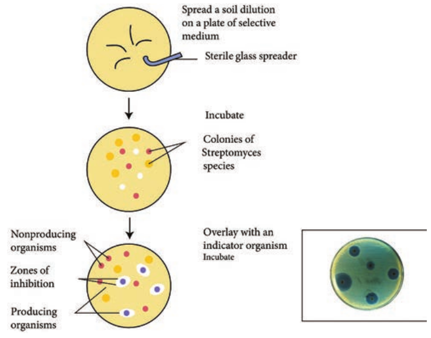
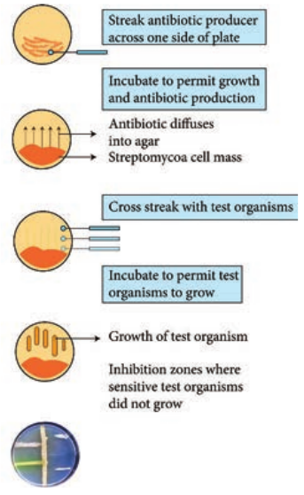
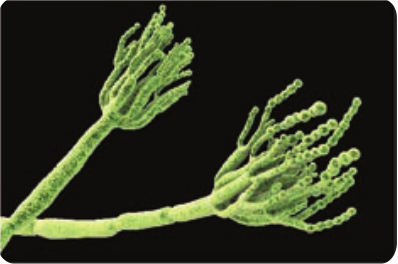
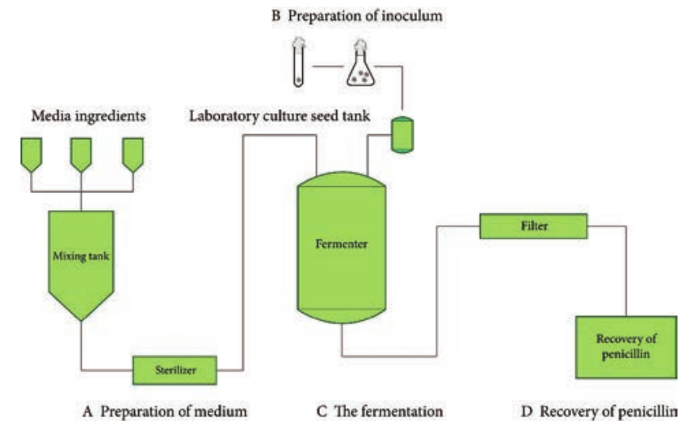
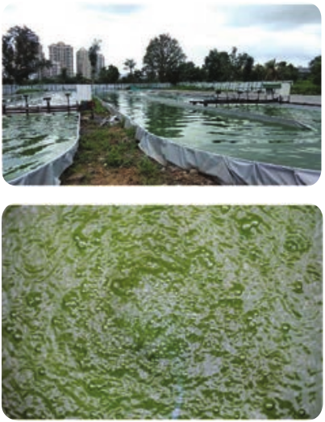

  

**Industri**

**Chapter**

**6**

After studying this chapter the students will be able to,

_- Know the concepts involved in industrial microbiology and the production of industrially important products by microorganisms._

_- Understand the primary and secondary screening process._

_- Gain knowledge in the field of strain improvement of microorganisms._

_- Describe the structure components and function of a fermentor._

_- Known the principles behind fermentation medium, fermentation process, upstream processing and downstream processing._

_- Know the values of microorganism used in the production of penicillin citric acid, wine and single cell protein._

_- Analyze the basics behind immobilization of microorganisms_

**Learning Objectives**

**Chapter Outline**

**6.1** Industrially Important Microorganisms and their Products

**6.2** Screening of Industrially Important Microorganism  

**al Microbiology**

**6.3** Strain Improvement

**6.4** Preservation of Industrially Important Microorganisms

**6.5** Fermentors

**6.6** Industrial Production of Penicillin

**6.7** Industrial Production of Wine

**6.8** Industrial Production of Single Cell Protein

**6.9** Industrial Production of Citric Acid

**6.10** Immobilization

Industrial microbiology is a branch of science that deals with the study and uses of various microorganisms that are responsible for the

production of many products which has industrial and economic applications. Man has been using many microorganisms for the production of foods, (bread, cheese, yogurt, pickles)–beverages (beer, wine) for many centuries. The birth of industrial microbiology largely began with the studies of Pasteur on fermentation. The term Fermentation originates from a Latin verb “Fervere” which literally means to boil. In alcohol production, CO2 (gas bubbles) Figure 6.1 are formed during boiling of liquid.

  

## Industrially Important Microbes and their Products
 Microorganisms have the powerful capacity to produce numerous products, during their life cycle. Flowchart 6.1 shows the production of valuable metabolic products during the growth of microorganisms on a suitable medium under controlled environmental conditions. Microbial products are often classified as primary and secondary metabolites.

Primary metabolites consist of compounds related to the synthesis by microbial cells in the growth phase. Primary metabolites such as amino

Nutrie

Primary metabolites

Essential metabolites

Amino acids Nucleotides

Vitamins

Metabolic products Ethanol Acetone

Latic acid.

**Flowchart 6.1:** Various metabolites pro  

acids, vitamins, enzymes, organic acids and nitrogenous bases are produced by wide variety of microorganisms. These primary metabolites are essential for the growth of microorganisms and they are produced during Logarithmic phase. Secondary metabolites do not play a role in development, growth and reproduction of microorganisms. They are produced at the end of growth phase near stationary phase. They usually accumulate during the period of nutrient limitation or waste product accumulation that follows the exponential phase. These compounds have no direct relationship to the synthesis of cell materials and normal growth. They are the end products of the primary metabolism. Products such as steroids, alkaloids, antibiotics are secondary metabolites.

Excessive production of the primary and secondary metabolites produced by the microorganisms are useful in the large scale in industrial production. Unlike primary metabolites, secondary metabolites are produced in small quantities and their extraction is difficult (Figure 6.2).

nt

Secondary metabolites

Antibiotics Alkaloids Gibberlins Pigments

Bio organic Steroids

Amino Acids Ascorbic acid

duced in Industrial fermentation

| Nut r ien t |
|------|------|------|------|------|

| ar y S e c onoli tes met ab |
| Pr i m d ar y met ab oli tes |

| Pr i mar ymet ab oli tes |
|------|------|------|------|------|------|

| E smetAminNucV |
| Met ab olicpro du c t sEt hanolAcet oneL at ic acid . |s e nti alab oli teso acid sle ot idesit amin s |

|------|------|------|------|------|
| AA |
| Bio o rSter omin o As co rb |ga nicid scid sic acid |
| Ant ibio t icsA l ka lo id sGibb er lin sPig men ts |

  

Some industrially important products are,

- microbial cells (living or dead), microbial biomass and components of microbial cells

- microbial metabolite. 
- intracellular or extracellular

enzyme. 
- modified compounds that has been

microbiologically transformed, and

**Table 6.1:** Industrially important microorganism **Product Microorganisms** Vitamin B12 _Streptomyces_ Lactic acid _Lactobacillus delbrueckii_ Citric acid _Aspergillus niger_ Acetic acid _Acetobacter_ Ethanol _Saccharomyces_ Penicillin _Pencillium chrysogenum_  

- recombinant products through the DNA recombinant technology. (Table 6.1 shows some industrially important microorganisms)

The nutritional yeast is called food yeast. The yeast cells are killed during

manufacturing, and not alive in the final product. It is used in cooking; it has a cheesy, nutty or savory flavour. Yeast S. _cerevisiae_ is used as food yeast. It is a vegan food, available in both fortified (with some vitamins) and unfortified form.

The industrial production of commercial products is carried out by fermentation process. The term fermentation is defined scientifically in a strict sense as a biological process that occurs in the absence of oxygen (anaerobic). In industrial sense any process mediated by or involving microorganisms in which a product of economic value is obtained is called fermentation. The term Industrial fermentation also means large scale cultivation of microorganisms even though most of them are aerobic.

s **Uses** Vitamin supplements Chemical reagents Food preservative Vinegar, solvent Chemical reagents drinks

Antibiotic

| Pro duct |Mi cr o org anis ms |Use s |
|------|------|------|
| Vit amin B12 |Streptomyces |Vit amin s upplem en ts |
| L ac t ic acid |L ac tob ac illu s  d elbr ueckii |C hemic a l r e agen ts |
| Ci t r ic acid |Asper g illu s n iger |Fo o d p res er va t ive |
| Acet ic acid |Acet obac te r |Vin ega r, s olven t |
| Et hanol |S acc haromyce s |C hemic a l r e agen ts dr in ks |
| Penici l lin |Pen ci llium c hr ys ogen um |Ant ibio t ic |
  

There are many microbiological processes that occur in the presence of air (aerobically) yielding incomplete oxidation products. Examples: i) the formation of acetic acid (vinegar) from alcohol by vinegar bacteria ii) citric acid from sugar by certain molds such as Aspergillus niger. These microbial processes are often referred to as fermentations, although they do not decompose in the absence of air.

The German Eduard Buchner, winner of the 1907 Nobel Prize in chemistry, determined that fermentation was actually caused by a yeast secretion that he termed zymase. The experiment for which Buchner won the Nobel Prize consisted of producing a cell– free extract of yeast cells and showing that this “press juice” could ferment sugar. This finding dealt yet another blow to vitalism by demonstrating for the first time that fermentation could occur outside living cells.

**Infobits**

## Screening of Industrially Important Microorganism

**Isolation of industrially important microorganisms** Success of fermentation depends upon the isolation of microorganism. The microorganisms are isolated from their natural habitats like soil, lakes, river mud or even in unusual habitats or environments such as extreme cold, high altitude, deserts, and deep sea and petroleum fields and are tested directly for the product formation and isolated or it can be genetically modified. Different  

types of microorganisms are isolated by different methods.

Different microbes with desired activity are isolated using various culture techniques. The next step after isolation of microorganisms is the selection or screening. For the successful fermentation process, selection of microorganisms is the prime important step. Screening includes primary screening and secondary screening.

**Primary screening:** The elementary steps that are performed to select the desired organisms and eliminate the undesirable organisms are termed as primary screening. Methods such as crowded plate technique, auxanography and enrichment culture technique are some of the techniques used in primary screening. For screening of antibiotic producing organisms crowded plate technique is described here,

**Crowded plate technique** 1\. Soil is serially diluted 2. The serially diluted sample is spread

on the nutrient agar plates 3. The plates are incubated and the agar plate

having 300 to 400 colonies are observed for antibiotic producing activity

4\. The ability of a colony to exhibit antibiotic activity is indicated by the presence of a zone of inhibition surrounding the colony

5\. The technique is improved by using test organism

6\. The antibiotic produced by the organisms in the soil may inhibit the growth of test organism

  

7\. The formation of inhibitory zones around certain colonies indicates their antibiotic sensitivity

8\. The diameter of the zones of inhibition is measured in millimeters. Crowded plate technique is depicted in the diagram (Figure 6.3).

**Enrichment isolation** The process of enrichment provides a suitable condition to support the growth of microorganisms. It allows the growth of the specific microbe while inhibiting the other non-target microbe. The growth of target microorganisms is enriched by providing sole carbon source. For screening microorganisms degrading

the compound, different inhibitors are employed which have the ability to block a specific metabolic pathway of the non– target microbe. pH and temperature are also adjusted favoring the growth of desired microorganisms. Soil Calcium carbonate enrichment technique is used for isolation of secondary metabolite producing microorganisms (actinomycetes).

**Secondary screening** It is very useful in sorting out microorganisms that have real commercial value from many isolates obtained during primary screening.

plate technique

  

Why microorganisms are exploited more than plant and animal cells for production of commercial products?

**HOTS**

1\. As primary screening allows the detection and isolation of microorganisms which posses, potentially interesting industrial applications. It is further followed by secondary screening, to check the capabilities and gain information about these organisms.

2\. Through primary screening only few or many microorganism that produce a industrially important product, are isolated. The information about the product formed is very less. So, through secondary screening, further sorting out is performed. In this method, only microorganisms with real commercial value are selected and those that lack the potential are discarded.

3\. Secondary screening should yield the types of information which are needed in order to evaluate the true potential of a microorganisms industrially usage.

4\. Secondary screening may be qualitative and quantitative in its approach.

5\. It is done by using paper, thin layer or other chromatographic techniques.

6\. The product’s physical, clinical, and biological properties are determined.

7\. It detects gross genetic instability in microbial cultures.  

8\. It gives information about the number of products produced in a single fermentation.

9\. It determines the optimum conditions for growth or accumulation of a product associated with particular culture.

10\. It gives information about the different components of the fermentation medium.

11\. It helps in providing information regarding the product yield potential of different isolates.

12\. It reveals whether microorganisms are capable of a chemical change or it destroys their fermentation product.

There are various methods employed for secondary screening which includes test conducting on petridish containing solid media or by using flasks or small fermentors containing liquid media, giant colony technique, and filtration method liquid medium method (using Erlenmeyer flask). Here giant colony technique is explained in detail.

**Giant Colony Technique** The Streptomyces culture is inoculated onto the central areas of petriplates containing a nutritious agar medium or they are streaked in a narrow band across the centre of plates. The plates are then incubated until growth and possibly, sporulation have occurred. Strains of micro organisms to be tested for possible sensitivity to the antibiotics (the test organisms) are then streaked from the edges of the plates up to but not touching the _Streptomycete_ growth. The plates are further incubated to allow the growth of the test organism. The growth of the

  

test organism inhibited by antibiotic in the vicinity of the _Streptomycete_ is then measured in millimeters. These _Streptomycetes_ that have produced antibiotics with observable microbial inhibition spectrum are retained for further testing (Figure 6.4).

The microbes used in the industrial microbiology should have following characters. 1. The strain should be a high–yielding

strain. 2. The strain should have stable

biochemical and genetical characteristics.

3\. It should not produce undesirable substances.

4\. It should be easily cultivated on large scale. The strain should be in pure culture,

free from other microorganisms including Bacteriophages. These characters are screened for the production of desirable products from microorganisms.

## Strain Improvement

Improvement of the production strain(s) offers the great opportunities for cost reduction without significant capital outlay in industries. Moreover, success in making and keeping a fermentation industry competitive depends greatly on continuous improvement of the production strain(s). Improvement usually resides in increased yields of the desired metabolite. The science and technology of manipulating and improving microbial strains, in order to enhance their metabolic capacities for biotechnological applications, are referred to as strain improvement.

**Need for strain improvement** Microbes exist in the nature produce certain compounds of biological interest. However the industrial application of producing those compounds by natural strains is not an economical one so, wild strains are changed by the changing their gene pattern or by regulating their enzymes production. As a result, the specific product is produced in excess.

Knowledge of the function of enzymes, rate limiting steps in pathways, and environmental factors controlling synthesis further helps in designing screening strategies.

  

**Attributes of Improved strains** 1\. Assimilate inexpensive and complex

raw materials efficiently. 2. Alter product ratios and eliminate

impurities or by products in downstream processing.

3\. Reduce demand on utilities during fermentation (air, cooling water, or power).

4\. Provide cellular morphology in a form suitable for product separation.

5\. Create tolerance to high product concentration.

Protoplast fusion is defined as wall less nature of plant, bacter by either mechanical or enzym protoplasmic contents which a  

6\. Shorten fermentation times.

7\. Overproduce natural products or bioactive molecules not synthesized naturally for example insulin.

8\. Excrete the product to facilitate product recovery.

Generally wild strains of microorganisms produce low quantities of commercially important metabolites. So, genetic improvements have to be made and new strains need to be developed for any substantial increase in the product formation in a cost effective manner.

fusion of two different protoplasts. A cell ia, fungal is called protoplast. It is re moved

atic means. Protoplast has nucleus other re surrounded by cytoplasmic membrane.

  

An organism is isolated from soil, which is a very low yielding one. How will you enhance the production activity?

**HOTS**

The following techniques at practical genomic level help to improve the microbial strain. They are:

1\. Selection of mutants 2. Recombination 3. Regulation 4. Genetic engineering 5. Protoplast fusion

## Preservation of Industrially Important Micro Organisms

The selected microorganism of industrial interest must be preserved in its original form for any further use and research. There are dif ferent methods for microbial preservation. Suitable methods are selected based on the: a. Type of micro-organism b. Effect of the preservation method on

the viability of micro-organism c. Frequency at which the cultures are

with drawn d. Size of the microbial population to be

pre served e. Availability of resources f. Cost of the preservation method.

Followings are some of the methods of microbial preservation:

**a. Desiccation** This involves removal of water from the cul ture. Desiccation is used to preserve  

actinomycetes (a form of fungi-like bacteria) for very long period of time. The microorganisms can be preserved by desiccating on sand, silica gel, or paper strips.

**b. Agar Slopes** Microorganisms are grown on agar slopes in test tubes and stored at 5 to −20 °C for six months. If the surface area for growth is cov ered with mineral oil the micro- organisms can be stored for one year.

**c. Liquid Nitrogen** This is the most commonly used technique to store micro-organisms for a long period. Stor age takes place at temperatures of less than -196 °C and even less in vapour phase. Micro organisms are made stationary and suspended in a cryoprotective agent before storing in li quid nitrogen.

**d. Drying** This method is especially used for sporulating microorganisms (organisms that produce spores). They are sterilized, inoculated, and incubated to allow microbial growth, then dried at room temperature. The resultant dry soil is stored at 4° to 5 °C.

**e. Lyophilization** This process is also known as freeze- drying. The microbial culture is first filled in ampoules (glass vessels) and frozen, then dried under vacuum. This is a most convenient technique, since it is cheap to store and easy to ship. The disadvantage is that it is difficult to open the freeze dried ampoules; also, several subcul tures have to be done to restore the original characteristics of the microorganisms.

  

## Fermentors

The main function of a fermenter is to provide a suitable environment in which an organism can efficiently produce a target product. Most of them are designed to maintain high biomass concentrations, which are essential for many fermentation processes. Fermentor design, quality of construction, mode of operation and the level of sophistication largely depend upon the production organism, the optimal operating conditions required for target product formation, product value and the scale of production. The performance of any fermenter depends on many factors, but the key physical and chemical parameters that must be controlled are agitation rate, oxygen transfer, pH, and temperature and foam production.

What will happen if antifoam agents are not used in the Fermentation process?

**HOTS**

### Basic Design of a Fermenter

The materials used for construction of fermenter withstand repeated steam sterilization and are nontoxic. The reaction vessel is designed to withstand vacuum or else it may collapse while cooling. The internal surface is smooth and corrosion resistant. Either stainless steel or glass is used for construction.

Conventional bioreactors are cylindrical vessels with dome top and bottom (Figure 6.5).

It is surrounded by a jacket and sparger at the bottom through which air is introduced. The agitator (for mixing of cells and medium) shaft is connected to a motor at the bottom. It has ports for pH, temperature, dissolved Oxygen sensors for regulation. Antifoam agents like animal vegetable oil, lard oil, corn oil and soya bean oil are used to control the foam. Modern fermentors are usually integrated with computers for efficient process monitoring and data acquisition. Parts of the fermenter and their functions are given in Table 6.2.

of a fermenter

  

**Table 6.2:** Components of fermenter and their u **S. no Parts of fermenter** 1 Impeller (agitator) To stir the med

settling down an Impeller speed d

2 Sparger (aerator) Introduce steri fermentation pr

3 Baffles (vortex breaker) Disrupt vortex 4 Inlet Air filter Filter air before 5 Exhaust Air filter Trap and preven 6 Rota meter Measure flow ra 7 Pressure gauge Measure pressu 8 Temperature probe Measure and m

during the proc 9 Cooling jacket To maintain the

process 10 pH probe Measure and m 11 Dissolved oxygen probe Measure dissolv 12 Level probe Measure the lev 13 Foam probe Detect the prese 14 Sampling point To obtain samp 15 Valves Regulates and c

There are different types of fermentor used in industrially micro biology which includes.

1\. Stirred tank bioreactor 2. Tower bioreactors 3. Air lift bioreactors 4. Packed–bed bioreactors 5. Fluidized bed bioreactors 6. Photo bioreactors

### Media Used in the Industrial Productions

**Fermentation Medium** Most fermentation requires liquid media,  

ses: **Functions**

ia continuously and hence prevent cells from d distribute oxygen throughout the medium. ecreases as the size of the fermenter increases

le oxygen to the media in case of aerobic ocess

and provide better mixing it enter the fermenter t contaminants from escaping te of Air or liquid

re inside the fermenter onitor change in temperature of the medium ess temperature of the medium throughout the

onitor pH of the medium e oxygen in the fermenter el of medium nce of the foam

les during the process ontrols the flow of liquids and gases

often referred to as broth, although some solid-substrate fermentations are also operated. Fermentation media must satisfy all the nutritional requirements of the microorganism and fulfill the technical objectives of the process. Animal fats and plant oils are also incorporated into some media, often as supplements to the main carbon source.

Medium used for large scale production should have the following characteristics.

1\. It should be cheap and easily available.

2\. It should maximize the growth of the microorganism productivity and the rate of formation of the desired product.

3\. It should minimize the formation of undesired products.

| S. no |Par ts o f f erme nter |Func ti ons |
|------|------|------|
| 1 |Imp el ler (a g it ator) |To s t ir t he m e di a co nt in uo usly a nd h en ce p re ven t ce l ls f roms et t lin g dow n and dist r ibute oxyg en t hr oug hout the me di um.Imp el ler sp e e d decr e as es as the size of the fer men ter incr e as es |
| 2 |Sp arger (aera tor) |Int ro duce s ter i le  o xyg en t o t he m e di a in c as e o f aer obicfer men t at io n p ro ces s |
| 3 |B af f les (v or tex b re a ker) |Di sr upt v or tex a nd p rov ide b et ter mixin g |
| 4 |In let A ir f i lter |Fi lter a ir b ef ore  i t en ter t he f er men ter |
| 5 |E xh aust A ir f i lter |Tra p a nd p re ven t co nt amin ants f rom es c apin g |
| 6 |R ot a m et er |Me asur e f lo w ra te o f A ir o r liq uid |
| 7 |Pres sur e ga ug e |Me asur e p res sur e in side t he f er men ter |
| 8 |Tem p era tur e p rob e |Me asur e a nd m oni tor c hange in t em p era tur e o f t he m e di umdur in g t he p ro ces s |
| 9 |C o olin g j ac ket |To m ain t ain t he t em p era tur e o f t he m e di um t hr oug hout t hepro ces s |
| 10 |pH p rob e |Me asur e a nd m oni tor pH o f t he m e di um |
| 11 |Di ss olve d o xyg en p rob e |Me asur e di ss olve o xyg en in t he f er men ter |
| 12 |Le vel  p robe |Me asur e t he le vel o f m e di um |
| 13 |Fo am  p rob e |D et e c t t he p res en ce o f t he f o am |
| 14 |Sa mplin g p oin t |To o bt ain s amples d ur in g t he p ro ces s |
| 15 |Valve s |R egu l ates a nd co nt rols t he f lo w o f liq uid s a nd ga s es |
  

**Table 6.3:** Some common substrates used in the **Carbon so**

Molasses It is a byproduct o carbohydrates It also trace elements. (Exa

Malt extract It is an aqueous ext starch, dextrin cellulose They can be metab

the industrial prod Whey It is a byproduct of

alcohol, SCP, vitam Methanol ethanol Methanol in the ch

bacteria yeast. Met acetic acid product

Hydro molasses It is a byproduct in Sulphate waste liquor It is a spent sulfite

It is used in the p _cerevisiae_, and in th

**Nitrogen s** Inorganic: Ammonium salts and ammonia

It is a cheap source

Urea (Organic) It is a good and che Corn steep liquor (Organic)

It is formed during several amino acids

Yeast extract It is rich in amino a Soy meal It is a left out residu

seeds. It is used in a Peptones The proteins hydro

of peptones include

It should contain carbon source, nitrogen source, energy source, micro nutrients required for the industrial production. Table 6.3 shows common substances used in the industrial fermentation process.

Waste products from other industrial processes such as molasses, ligno cellulosic waste, and corn steep liquor are generally used as substrates for industrial fermentation.

Apart from carbon and nitrogen sources, some other components like minerals, vitamins, growth factors are also used in Industrial fermentations.  

industrial fermentation process: **urce** f sugar industry. It is a cheap source of contains nitrogenous substances, vitamins, mple:) sugar cane, beetroot molasses ract of malted barley olized by microorganism. They used for

uction of alcohol dairy industry used in the production of in B12, lactic acid, gibberllic acid eapest substrate. It is utilized only by few hanol is used for SCP. Ethanol is used for ion glucose production from corn liquor form the paper pulping industry. roduction of ethanol by _Saccharomyces_ e growth of _Torula utilis_ as a feed

**ources** of nitrogen

ap source of organic source starch production from corn. It is rich in

cids, peptides vitamins e on preparing soybean oil from soybean ntibiotic production

lysates are called as peptones. The source s meat, cotton seeds and sunflower seeds

**Minerals** Normally, sufficient quantities of cobalt, copper, iron, manganese, molybdenum, and zinc are present in the water supplies, and as impurities in other media ingredients. For example, corn steep liquor contains a wide range of minerals that will usually satisfy the minor and trace mineral needs.

**Vitamins and growth factors** Many bacteria can synthesize all necessary vitamins from basic elements. For other

| C arb on s our c e |
|------|------|
| Mol ass e s |It  is  a  byproduct  of  sugar  industr y.  It  is  a  cheap  source  of carbohydrates It also contains nitrogenous substances, vitamins, trace elements. (Example:) sugar cane, beetroot  molasses |
| Ma lt ext rac t |It i s a n aq ue ous ext rac t o f m a lte d b arle y |
| st arch, dext r in ce l lu los e |Th e y c an b e m et ab olize d b y micr o orga ni sm. Th e y u s e d f ort he in dust r i a l p ro duc t io n o f a lco hol |
| Whe y |It i s a b yp ro duc t o f d air y in dust r y u s e d in t he p ro duc t io n o fa lco hol, SCP, v it amin B12, l ac t ic acid , g ibb er l lic acid |
| Met hanol et hanol |Met hanol in t he c he ap es t s ubs t ra te. I t i s u t i lize d o n ly b y f e wb ac ter i a y e ast. M et hanol i s u s e d f or SCP. E t hanol i s u s e d f oracet ic acid p ro duc t io n |
| Hydr o m ol ass es |It i s a b yp ro duc t in g lucos e p ro duc t io n f rom co r n |
| Su lphate wa ste liq uo r |It i s a s p en t s u lf ite liq uo r f or m t he p ap er p u lpin g in dust r y.It i s u s e d in t he p ro duc t io n o f et hanol b y  S acc haromyce sce re v i siae , a nd in t he g rowt h o f  Tor ul a  u til i s  a s a f e e d |
| Nitro ge n s our c es |
| Inorga nic: A mm oni ums a lts a nd a mm oni a |It i s a c he ap s our ce o f ni t rog en |
| Ure a (Or ga nic) |It i s a g o o d a nd c he ap s our ce o f o rga nic s our ce |
| C or n  ste ep  liq uo r(Or ga nic) |It i s f or me d d ur in g s t arch p ro duc t io n f rom co r n. I t i s r ic h ins e vera l a min o acid s |
| Ye ast ext rac t |It i s r ic h in a min o acid s, p ep t ides v it amin s |
| S oy  m e a l |It i s a lef t o ut r esid ue o n p rep ar in g s oy b e an o i l f rom s oy b e ans e e ds. I t i s u s e d in a nt ibio t ic p ro duc t io n |
| Pep tones |Th e p rotein s h ydr olys ates a re c a l le d a s p ep tones. Th e s our ceof p ep tones in cludes m e at, co tton s e e ds a nd s unf lo wer s e e ds |
  

bacteria, filamentous fungi and yeasts, they must be added as supplements to the fermentation medium. Most natural carbon and nitrogen sources also contain at least some of the required vitamins as minor contaminants. Other necessary growth factors, amino acids, nucleotides, fatty acids and sterols, are added either in pure form or, for economic reasons, as less expensive plant and animal extracts.

**Precursors** Some fermentation must be supplemented with specific precursors, notably for secondary metabolite production. When required, they are often added in controlled quantities and in a relatively pure form. Examples: Phenyl acetic acid or phenylacetamide added as side chain precursors in penicillin production.

### Large Scale Production

**Basic Steps of Industrial Fermentation** Successful development of a fermentation process and fermentors requires major contributions from a wide range of other  

disciplines, particularly biochemistry, genetics, molecular biology, chemistry, chemical engineering and process engineering, mathematics and computer technology. A typical operation involves both upstream processing (USP) and downstream processing (DSP) stages (Figure 6.6).

### Upstream Processing

It is the first step in which biomolecules like bacteria or other cells are grown in a fermentor. Upstream processing involves inoculation development, scale up, medium preparation and sterilization of media and fermentation process.

**Inoculum development** It is a preparation of a population of micro organisms from a stock dormant culture to a state useful for inoculating a final production fermentor.

It is a critical stage in fermentation process.

It is a stepwise sequence employing increasing volume of media.

Inoculum media is usually balanced for rapid cell growth and not for product formation.

**Inoculum scale up** It is the preparations of the seed culture in amounts sufficient to be used in the larger fermenter vessel. It involves growing the microorganisms obtained from the pure stock culture in several consecutive fermenter. By doing this, the time required for the growth of microbes in the fermenter is cut down, so that the rate of productivity is increased. The seed culture obtained is then used for inoculation in

  

fermentation medium. The size of the inoculums is generally 1–10% of the total volume of the medium.

In general, fermentation/ bioprocess techniques are developed in stages starting from a laboratory and finally leading to an industry. The phenomenon of developing industrial fermentation process in stages is referred to as scale–up. Scale–up is necessary for implementing new fermentation technique developed using mutant organisms.

The very purpose of scale–up is to develop optimal environmental and operating conditions at different levels for a successful fermentation industry where conditions like substrate concentration agitation and mixing, aeration, power consumption and rate of Oxygen transfer are studied. In a conventional scale–up, a fermentation technique is developed in 3–4 stages. The initial stage involves a screening process using Petri dishes or Erlenmeyer flasks followed by a pilot project to determine the optimal operating conditions for a fermentation process with a capacity of 5–200 litres. The final stage involves the transfer of technology developed in the laboratory to industry. (Figure 6.7)

It has to be continuously noted that a fermentation process that works well at the laboratory scale may work poorly or may not work at all on industrial scale. Therefore it is not always possible to blindly apply the laboratory conditions of a fermentation technique developed to industry.

At the laboratory scale, one is interested in the maximum yield of the product for unit time. At the industry level, besides the product yield, minimal operating cost is another important factor for consideration.

**Preparation and sterilization of media** According to the specific industrial production basic components needed to carry out fermentation are selected as per the required volume.

Medium components should be free from contamination. So all the medium components employed in the fermentation process are sterilized. Sterilization is mostly carried out by applying heat and to lesser extent other physical methods, chemical methods (disinfectants) and radiation (using UV rays, γ rays). Batch Sterilization is carried out at 121°C (20 to 60 mins) where as continuous sterilization is done at 140°C for (30 to 120 secs). Much energy is wasted on batch sterilization on compared with continuous sterilization nearly 80 to 90% of energy saved during this process. Air and heat sensitive components are sterilizied by membrane filters.

**Fermentation Process** It involves the propagation of the microorganism and the production of the desired product. Fermentation process is divided depending on the feeding strategy of the culture and medium as follows.

i. Batch Fermentation

  

ii. Continuous Fermentation iii. Fed batch Fermentation

**i. Batch Fermentation** The medium and culture are initially fed into the vessel and it is then closed. After that, no components are added apart from Oxygen. The pH is adjusted during the course of process by adding either acid or alkali. The fermentation is allowed to run for a predetermined period of time and the product is harvested at the end. Foaming is controlled by adding antifoam agents such as palm oil or soybeans oil. Heat generated is regulated by providing water circulation system around the vessel for heat exchange.

**ii. Continuous fermentation** This is an open system. It involves the removal of culture medium continuously and replacement of them with a fresh sterile medium in a bioreactor. In this method, homogenously mixing reactors which include chemo stat and turbid stat bioreactors are used. Examples: production of antibiotics, organic solvents, beer, ethanol and SCP.

**iii. Fed batch system** It is a combination of both batch and continuous systems. In this, additional nutrients are added to the fermentors as the fermentation is in progress. This extends the time of operation, but the products are harvested at the end of the production cycle as in batch fermenter.

Why does industry prefer continuous culture?

**HOTS**  

Followed by the fermentation, production, products are harvested or separated by downstream processing.

### Downstream Processing

The various processes used for the actual recovery of useful products from fermentation or any other industrial processes are called downstream processing. The cost of downstream processing (DSP) is often more than 50% of the manufacturing cost, and there is product loss at each step of DSP. Therefore, the DSP should be efficient, involve as few steps as possible and be cost-effective. Methods involved in the downstream processing are outlined in the flowchart (6.2). Table 6.4 shows Difference between upstream and downstream processing.

**Table 6.4: Difference between upstream** (usp) and downstream (dsp) processing

**USP DSP** USP overall makes the procurement and maintenance of inoculum

DSP depends upon selection of cost– effective media

USP involves in strain improvement to enhance and yield

DSP concentrates on media optimization for maximum productivity yield and profit

It is a continuous development of selected strains to increase the economic yield

For DSP, fermentation conditions are optimized for the growth of micro organism or the production of a desired product

| U SP |D SP |
|------|------|
| US P o vera l lma kes t hepro c ur em en t a ndmain ten ance o fin o c u lum |DS P dep en ds u p ons ele c t io n o f cos t–ef fe c t ive m e di a |
| US P in volvesin s t ra inim provem en tto en hance a ndy ie ld |DS P co ncen t ra tes o nme di a o pt imiza t io nfor m axim umpro duc t iv it y y ie ldand  pr of it |
| It i s a co nt in uo usde velo pmen t o fs ele c te d s t ra in sto in cr e as e t hee co nomic y ie ld |For  D SP,fer men t at io nco ndi t io ns a reopt imize d f or t heg rowt h o f micr oorga ni sm o r t hepro du c t i on  of   adesir e d p ro duc t |
  

**Flowchart 6.2:** Downstream processing method

Enzymatic method

Chemical Method

Physical Method

Desired Product i

Brot

Intracellular Product Extracellul

Cell Disruption (Physical, Chemical, Enzymatic Methods)

Ultrasonication Osmotic shock Heat shock Homogenizatio nimpingement Grinding with glass beads

Alkalies Organic solvents Detergents

Lysozyme Glucanase Mannase Protease

Purification by chromatography (gel-filtration,

ion-exchange, affinity, hydrophobic interaction

Formulation (drying, freeze-drying, crystallization)  

s

Solid –Liquid Separation (Flotation, Flocculation, Filtration, Centrifugation

n Culture Broth

h With Solids And Liquid

ar Product Whole Organism

)

Concentration (evaporation, liquid-liquid extraction, membrane filtration, precipitation, adsorption)

Final product

| D esir e d P ro duc t in C u ltur e B rot h |
|------|------|------|------|

| Int race l lu l ar P ro duc t E xt race l lu l ar P ro duc t |Whole Or |
|------|------|------|------|------|------|

| C el l Di sr upt io n(P hysic a l, C hemic a l,Enzy mat ic M et ho ds) |
| Brot h W it h S |

| olid s A nd L iq uid |

| Enzy mat icme t ho d |
|------|------|

| C oncen t ra t io n(e va p ora t io n,liq uid-liq uid ext rac t io n,mem bra ne f i lt ra t io n,pre c ipit at i on ,ad s or pt io n) |
|------|------|------|
| yhyf f ini t y,terac t io n) |
| Pur if ic at io n bchr omatog ra p(g el-f i lt ra t io n,io n-ex change, ahydr ophobic in |

| Pur if ic at io n b ychr omatog ra phy(g el-f i lt ra t io n,io n-ex change, a f f ini t y,hydr ophobic in terac t io n) |
|------|------|------|

| For mu l at i on(dr y in g , f re e ze-dr y in g ,cr ys t a l liza t io n) |

  

## Penicillin Production
 Penicillin is a broad spectrum antibiotic. Penicillin is first obtained from the mould, _Penicillium notatum_ (Figure 6.8).

_Penicillium chrysogenum_ is a high yielding strain, used for the commercial production of penicillin. This strain is highly unstable, so the spore suspensions are maintained in a dormant state to prevent contamination. Most penicillin form filamentous broth and hence is difficult to mix and it hinders oxygen transfer due to their high viscosity. This is avoided by using bubble columns air lift reactors which agitates the medium providing even oxygen distribution. Penicillin has a basic structure 6-amino penicillanic acid 6-(APA). It consists of a thiazolidine ring with a condensed β-lactum ring. It carries a variable side chain in position 6. Natural penicillins are produced in a fermentation process without adding any side chain precursors. If a side chain precursor is added to the broth, desired penicillin is produced and it is called bio- synthetic penicillin.

Semi synthetic penicillin is one in which, both fermentation and chemical approach are used to produce useful pencillins. It can be taken orally and active against gram negative  

bacteria. (eg) Amphicilin. Nowadays, semi synthetic pencillins makeup the bulk of the penicillin market.

In later (1939) using (Flemings’ work) Howard Florey and Ernst Chain managed to purify penicillin in a powdered form. In 1941, they successfully treated a human. In 1943, they produced penicillin on a large scale. This helped immensely to treat causalities during the 2nd World War ww1 that had bacterial inflations due to their wounds.

**Infobits**

The main objective of producing semi synthetic penicillin is to generate

compounds with improved properties. (eg) acid stability, Resistance to enzymic degradation, broader spectrum of activity. Here side chain is removed to form (6- APA) via immobilization in a column of penicillin acylase. Penicilln G is converted to (6-APA) and phenyl acetic. Then it is chemically to acylated produce Semi Synthetic Pencillin.

New kinds of synthetic penicillin can also be produced which are readily absorbed by the intestine compared to natural penicillin. Example: Phenithicilin.

The initial strain of Penicillium chrysogenum (NRRL, 1951) was low yielding strain and so it is was treated with mutagenic agents such as X-rays, UV right and some other repeated methods to get a high yielding strain Q-176.

  

**Production methods** Penicillin production is done by one of the following.

1\. Surface culture 2. Submerged fermentation process

**Inoculum Production Inoculation methods** To inoculate fermentation medium one of the following methods can be employed. 1. Using dry spores to seed the

fermentation medium. 2. Making suspension along with non

toxic wetting agent like Sodium lauryl sulphate and inoculating germinated organism

3\. Using pellet inocula obtained by the germination of spores The lyophilized spores (or) spores

in well sporulated frozen agar slant are suspended in water or in a dilute solution of a nontoxic wetting agent.

(1:10,000 sodium lauryl sulphonate) ↓

Spores are then added to a bottles containing wheat bran solution

It is incubated for 5-7 days at 24°C for heavy sporulation.

↓ The resulting spores are then transferred

to production tank ↓

The micro organism in the inoculum tank is checked for contamination.

**Production process**

The production tanks are inoculated with a mycelial growth.

↓ Production medium contains

following medium components.  

Carbon source as Lactose, Nitrogen source as Ammonium sulphate, Acetate or Lactate (Corn steep liquor is the cheap and easy source of nitrogen)

Mineral sources as K, P (Potassium di hydrogen phosphate), Mg, S (Magnesium sulphate), Zn, Cu(Copper sulphate) (Corn steep liquor supply some of these minerals)

Precursor (Example: phenyl acetic acid) is added to the medium

↓ Antifoam agent (Example: corn or

soybean oil) is added before sterilization

The sufficient aeration and agitation is given and are incubated at 25°C to 26°C for 3 to 5 days at PH range of 7 to 7.5

**Penicillin Production** Process of penicillin production occurs in three phases:

First phase: Growth of mycelium occurs in this phase where the yield of antibiotic is low. The pH increases due to the release of NH3. Second phase: In this phase, intense synthesis of penicillin occurs due to rapid consumption of Lactose and Ammonium nitrogen. The mycelial mass increases and the pH remain unchanged (Figure 6.10).

Third phase: In this phase, the concentration of antibiotics decreases in the medium. Autolysis of mycelium starts, liberating Ammonia leading to slight rise in pH. **Recovery**

After penicillin fermentation, the broth is filtered on rotary vacuum filter

↓ Mycelium is separated

  

↓ To the broth sulphuric acid or

phosphoric acid is added ↓

Penicillin is converted into anionic form ↓

It is extracted in counter current solvent extractor, by using organic

solvent, amyl acetate, methyl isobutyl (ketone)

↓

## Industrial Production of Wine

An alcoholic distilled beverage is produced by concentrating alcohol from fermentation by distillation. Beer or ale is produced by the fermentation of malted grains. Wine is prepared from grapes belonging to species _Vitis vinefera_. It is also produced from other fruits like peach, pear, dandelion and honey. Generally wine  

It is then back extracted with water from the organic solvent by adding

potassium or sodium hydroxide ↓

Shifts between water and solvent aid in the purification of penicillin

↓ The resulting sodium or potassium

penicillin is then crystallized ↓

Then it is washed, dried and used for commercial purpose

ion of Penicillin

contains 16% of alcohol. Wine production from crushed grapes is called enology. The various forms of wine are listed below in the table 6.5.

Red wine is extracted from the skin of red grapes containing red pigment (anthocyanin). During the preparation of red wine, all the anthocyanin pigments are solubilized by the extract. Pink wine

  

is obtained from either pink grapes or red grapes in which fermentation last for only 12 to 36 hour and only less amount of anthocyanin pigments are solubilized. White wine is prepared from the white grapes or from the red grapes in which pigment involved in colouring is removed.

**Generally yeasts are the natural microbiota of grapes** Both wild yeast and cultivated yeast are involved in the wine fermentation. Natural yeast is not potable because they do not produce much wine and are less alcohol tolerant and produce undesirable compounds, affecting the quality of the wine.

The cultivated wine yeast, _Saccharomyces ellipsoideus_, is used for commercial production. Figure 6.10 shows steps involved in wine production **Table 6.5: Shows different varieties of**

wine Red wine It has red pigments

White wine It does not contain red pigments

Rose wine It has less red pigments

Dry wine It has more alcohol content

Sweet wine It has more sugar content

Fortified wine It is fortified with other alcoholic beverage

Sparkling wine It has considerable amount of CO2

Still wine It does not contain carbon dioxide

Distilled wine Brandy (alcohol content 21%)

Table wine It has low alcohol and sugar content  

Aqu-aori is the concept that oceans and other bodies of water, might impart

unique characteristics on the aging process of submerged wine in water. The ocean provides a unique environ- ment with cold temperatures, constant pressure, and little to no light and con- stant motion.

**Steps involved in Wine production**

Grapes are stemmed, cleaned and crushed

↓

| R e d w in e |It h as r e d p ig men ts |
|------|------|
| Whi te w in e |It  do es  not co nt ain  re dpig men ts |
| R os e w in e |It h as les s re d p ig men ts |
| Dr y w in e |It h as m ore a lco holc onte nt |
| Swe et w in e |It h as m ore s uga rc onte nt |
| For t if ie d  w in e |It is for t if ie d wit h ot hera lco holic b e vera ge |
| Sp ark lin g w in e |It h as co nsidera bleamoun t o f C O2 |
| Still  w i ne |It do es n ot co nt ainc arb on dio xide |
| Di st i l le d w in e |Bra ndy (a lco holco nten t 21%) |
| Table w in e |It h as lo w a lco hol a ndsuga r co nten t |
  

Sodium or Potassium Meta – bisulphate is added to check the undesirable

microorganism ↓

Must (crushed grapes) is treated with Sulfur dioxide to kill the wild yeasts and

bacteria or sometimes pasteurized to destroy the natural microbiota

↓ Must is inoculated with _Saccharomyces_

_ellipsoideus_ (2.5%) and selected fermentation is carried from 50 to

50000 gallons at 20 to 24°C ↓

Oak, cement, stone glass lined metal are used as fermentor

↓ Temperature and time required for fermentation White wine: 10–21°C,

7–12 days; Red wine: 24–27°C, 3–5 days ↓

In red wine production, after three to five days of fermentation, sufficient tanin and

colour is extracted from the pomace and the wine is drawn off for further fermentation

↓ Racking improves flavour and aroma,

where wine is separated from the sediment containing yeast cells as precipitate form

↓ The wine is subjected to aging at lower temperature. Ageing process is typically

much longer for red wine than white wine ↓

Wines are clarified in a process called fining. Fining is done by filtration

through casein, tannin, diatomaceous earth or bentonite clay, asbestos,

membrane filters or centrifugation ↓

The wine produced is placed in casks, tank and bottles  

Saccharomyces is called Brewing Yeasts, or Baker’s Yeast. The brewing strains can be classified into two groups. The ale strains (_Saccharomyces cerevisiae_) and the lager strains (_Saccharomyces pastorianus_ or _Saccharomyces carlsbergenris_). The ale strains are top fermenting strains. Lager strains are hybrid strains of _Saccharomyces cerevisiae_ and _Saccharomyces eubayanus_ and are often referred to as bottom fermenting. (_Saccharomyces_ yeasts can form symbiotic matrices with bacteria and are used to produce Kombucha, Kefir, and Ginger beer).

**Infobits**

After wine production, cork should be used for preventing the entry of air into the bottles. The presence of air allows the growth of vinegar bacteria that convert the ethanol to acetic acid. The final alcohol content of wine varies depending upon the sugar content of the grapes, length of the fermentation and type of strain used.

## Industrial Production of Single Cell Protein

Single cell protein refers to the microbial cells or total protein extracted from pure microbial cell culture (monoculture) which can be used as protein supplement for humans or animals. During ancient times, the tribes in the Central African Republic used a spiral shaped Cyanobacterium named _Spirulina platensis_ as food. They collected it as mats from the bottom of seasonally dried up ponds and shallow waters around Lake Chad and dried them in the sun and made small cakes called “Dihe”.

  

**Zymology:** Zymology also known as “Zymurgy” (from the Greek–means, the workings of fermentation) is an applied science which studies the biochemical process of fermentation and its practical uses. It includes selection of fermenting yeast and bacteria, species and their use in brewing, wine making, fermenting milk and other fermented foods. The wine yeast Zymurgist one who studies or practices zymurgy; a knowledgeable brewer.

**Infobits**

During the World war II, when there were shortage in proteins and vitamins in the diet, the Germans produced yeasts and a mould named _Geotrichum candidum_ was used as food.

The term Single Cell Protein was coined by C.L Wilson (1966) at Massachusetts Institute of Technology (MIT), to represent the cells of algae, bacteria, yeasts and fungi, grown for their protein contents. The name was introduced by Prof. Scrimshow of MIT in 1967. The organisms like _Pseudomonas facilis_, P. _flava, Chlorella, Anabaena, Spirulina, Chlamydomonas_, and _Agaricus_ are commonly used for SCP production. Large scale production of SCP is shown in the Figure 6.11

There are several methods available for SCP production. In the Japanese method, flat tray is used with artificial sunlight algae are cultivated in shallow ponds with mechanical stirrers or in deeper ponds (not more than 20–30 cm deep) with circulation pumps. Optimum, light  

is an important parameter for maximum growth of SCP. _Scenedesmus_ sp. grows 20 times faster in optimum light than in natural conditions. Optimum temperature and optimum pH is varied according to the strain and intensity of light. Example: _Spirulina_ is cultivated at 25–35ºC with pH 9.5. Table 6.6 shows different types of microorganisms and substrates used for SCP production.

**Steps involved in SCP production** Provision of carbon source with added

nitrogen, CO2, ammonia, trace minerals for growth

↓ Prevention of contamination by using sterilized medium and fermentation

equipments ↓

Selected microorganism is inoculated in a pure form

  

**Some Commercial P Sl. No. Product Micro Or**

1\. Baker’s yeast, beer, wine, ale, bread

_Saccharomyce_

2\. Soy sauce _Saccharomyce_ 3\. Sour French bread _Candida mille_ 4\. Commercial alcohol

(ethanol) _Saccharomyce Kluyveromyce_

5\. Riboflavin _Eremotherium_ 6\. Microbial protein _Candida utilis_

_Saccharomyce_

**Infobi**

↓

Adequate aeration and cooling is provided

↓

Microbial biomass is harvested and recovered by flocculation or

centrifugation flocculants

↓

Harvested algae are dewatered and dried on open sand beds

↓

Processing biomass and enhancing it for use and storage

Advantages of using microorganisms for SCP production: 1. Microorganisms grow at a very rapid

rate under optimal culture conditions. 2. The quality and quantity of protein

content in microorganisms is better compared to higher plants and animals.  

**roducts of Yeast ganism Uses** _s cerevisiae_ Baking industry brewing

industry _s rouxii_ Food Condiment _ri_ Baking _s cerevisiae s fragilis_

Fuel, Solvent

_ashbyi_ Vitamin supplement _s lipolytica_

Microbial protein from petroleum products. Animal food supplement (single cell protein) from paper-pulp waste

**ts**

3\. A wide range of raw materials which are otherwise wasted, can be fruitfully used for SCP production

4\. The culture conditions and the fermentation processes are very simple.

5\. Microorganisms can be easily handled and subjected to genetic manipulations.

Pruteen was the 1st commercial SCP used as animal feed additive with 72% of protein.

Pruteen was produced from bacteria named _Methylophilus mehylotrophus_ cultured on methanol.

In India, National Botanical Research Institute (NBRI) and the Central Food Technological Research Institute (CFTRI) are involved in the production of SCP.

In CPFTRI, SCP is produced from algae cultured on sewage.

| Sl .  N o. |Pro duct |Mi cr o Org anis m |Use s |
|------|------|------|------|
| 1. |B a ker ’s y e ast, b e er,w in e, a le , b re ad |S acc haromyce s  ce re v i siae |B a k in g in dust r y b re w in gi ndu st r y |
| 2. |S oy s auce |S acc haromyce s  r ou x ii |Fo o d C ondim en t |
| 3. |S our F ren ch b re ad |C andida  m ille r i |B a k i ng |
| 4. |C omm er ci a l a lco hol(et hanol) |S acc haromyce s  ce re v i siaeKluy ve romyces  f rag ili s |Fue l, S olven t |
| 5. |R ib of la vi n |Ere mothe r ium  a shby i |Vit amin s upplem en t |
| 6. |Micr obi a l p rotein |C andi da  u tili sS acc haromyce s  l ipoly tica |Micr obi a l p rotein f romp et roleum p ro duc ts.Anim a l f o o d s upplem en t(sin g le ce l l p rotein) f romp ap er-p u lp wa ste |
  

**Table 6.6:** List of microorganisms and substrates used for SCP production

**Microorganisms Substrates** Bacteria _Pseudomonas_ sp. _Methylomonas_ sp.

Alkanes Methanol

Yeast _Candida utilis Lactobacillus_ _bulgaricus_

Sulfite liquor Whey

Fungi _Aspergillus niger Trichoderma viridae_

Molasses Straw, starch

Algae _Spirulina maxima Scenedesmus acutus_

Carbon di oxide Carbon di oxide

Actinomycetes _Nocardia_ Alkanes Mushroom _Agaricus bisporus Volvariella volvacea_

Compost, rice straw Cotton straw

During the cultivation of SCP, care must be taken to prevent and control the contamination by other micro organisms, which produce mycoxins or cyanotoxins. This is controlled by using the fungus _Scytaliclium acidophilum_ which grows at a low PH. It allows the hydrolysation of paper wastes to a sugar medium and also creates aseptic condition at low cost.

## Industrial Production of Citric Acid
 Citric acid is obtained from citrus fruits; pineapple etc., and after the development of microbial fermentation, citric acid production becomes very cheap, easy and cost effective. 70% of citric acid produced is used in food and beverage industry. Many microbial strains such as fungi _Aspergillus flavus, Aspergillus niger_ and _Trichoderma viridae_, yeast _Hansenulla polymorpha_  

and _Candida lipolytica_ are generally are involved in the production of citric acid.

Citric acid production can be carried out in the following three methods.

a. Koji process or solid state fermentation b. Liquid surface culture c. Submerged fermentation

**Media used in citric acid production** Citric acid production is carried out by using carbohydrates and n–alkenes. Generally beet molasses, cane molasses, sucrose, commercial glucose and starch hydrolysate are used as carbohydrate sources. The carbohydrate material is diluted and mixed with a nitrogen source (ammonium salts or urea) and the pH and temperature are adjusted according to the process.

**Inoculum development** Fungal strains that are used for production are stored in soil or silica gel in the form of spores. Spores are suspended in a freshly prepared sterile water containing Tween 80 and after a period of growth, it can be used as inoculum for large scale production.

**Steps involved in citric acid production Production Medium**

Sucrose, beet molasses, used as carbon source need pretreatment, as it contains excessive amount of trace metals. So ferrocyanide or ferricyanide is added to the production medium before sterilization. Inorganic salts, carbon, hydrogen, oxygen trace metals. Nitrogen, potassium, phosphorus, sulphur and magnesium are taken in Aluminum or stainless steel shallow pans or tray (5–20 cm deep).

↓ Inoculated with spores of A. _niger_ by blowing over the strains of _Aspergillus niger_ for fermentation

| Mi cr o org anis ms |Su bs tr ates |
|------|------|
| B ac ter i aPs e udom on a s  s p.Met hylomo na s  s p. |A l ka nesMet hanol |
| YeastC andi da  u tili sL ac tob ac illu sbu lg ar ic u s |Su lf ite liq uo rWh e y |
| Fu ng iAsper g illu s n igerTr ic hode r ma  v ir ida e |Mol ass e sSt ra w, s t arch |
| A lgaeSpir ulin a  m a x im aS ce ne desmu s  ac utu s |C arb on di o xideC arb on di o xide |
| Ac t in omycet esNoc ardia |A l ka nes |
| Mush ro omAga r icu s b i spor u sVolva r ie lla  vo lva cea |C omp os t, r icest r awC otton s t ra w |
  

↓ The medium is kept at 28–30ºC with relative humidity 40–60% and aerated with purified air for 8–12 days

↓ Citric acid produced is determined by checking the pH or the total acid content of the broth.

↓ Fermented liquid is drained off and processed further for the recovery of citric acid

Influence of trace metals in citric acid production:

Citric acid production is highly influenced by the trace metals. Particularly, iron and manganese in excess amount affect the citric acid production. They affect the cellular morphology and change pellets to filamentous growth (i.e.,) from productive form to unproductive form.

**Infobits**

**Recovery** The mycelial mat is pressed.

↓ Milk of lime (calcium carbonate) is added so calcium citrate is formed.

↓ Again sulphuric acid is added, so calcium

sulphate is formed.

↓ The remaining citric acid solution is filtered and washed. Finally the

impure solution of citric acid subjected to treatment with activated carbon

and finally pure form of citric acid is  

collected.

**Uses** It is used as a Acidulant in food, (Jams, Preserved fruits, Fruit drinks) and pharmaceutical industries. 1. It is mainly used in food and beverage

industry (Jams, preserved fruits, fruit drinks)

2\. It is used is pharmaceuticals, and other industrial processes

3\. Citrate and citrate esters are used as plasticizers

4\. It is used as a chelating and sequestering agent (Tanning of animal skins) Generally citric acid obtained from

citrus fruits, pineapple etc., After the development of microbial fermentation, citric acid production becomes very cheap and easy cost effective.

## Immobilization

It is technique used for the physical or chemical fixation of plant, animal cells, organelles, enzymes or other proteins (monoclonal antibodies) onto a solid matrix or retained by a membrane, in order to increase their stability and make possible their repeated or continued use.

The immobilized enzyme is defined as the enzyme physically confined or localized in a certain defined region of space with retention of its catalytic activity which can be used repeatedly and continuously.

The selection of appropriate carrier and immobilization procedure is very essential procedure is very essential for the immobilization technique.

  

Various types of materials like cellulose, dextran, agarose, gelatin, albumin polystyrene, Calcium alginate polyacrylamide, collagen carrageenan and polyurethane, inorganic materials (brick, rand, glass, and ceramics, magnetic) are used for immobilization.

The linkage is mediated by ionic bonds, physical absorption or bio specific binding.

**The immobilization methods can be classified into four categories**

i. Carrier–binding ii. Cross–linking

iii. Entrapping iv. Combining

Among all these methods entrapping is discussed in brief.

**Entrapping** The enzymes, cells are not directly attached to the support surface, but simply trapped inside the polymer matrix. Entrapping is carried out by mixing the biocatalyst into a monomer solution followed by a polymerization. It is done by change in temperature or by chemical reactions.

**Advantages of immobilization** 1\. Immobilized growing cells serve as self

proliferating and self regenerating bio catalyst

2\. They are stable 3. They are used either repeatedly in

a series of batch wise reactions or continuously in flow systems.  

The technique of immobilized enzymes may increase the use of enzymes in industry for product modification. Why? Give reason.

**HOTS**

**Summary** Industrial microbiology is a branch, of microbiology that deals with the study and uses of various microorganisms. The birth of industrial microbiology largely began with the studies of Pasteur on fermentation. Various products of both primary and secondary metabolites are produced by different microorganisms. Both primary and secondary screening is involved in the isolation of industrially important microorganisms. The isolated strains are modified for higher yield through various procedures (example) protoplast fusion. Thus strain improvement improves the fermentation efficiency. Fermentation is carried under a suitable parameters, in a controlled environment is called Fermentor. Fermentation process involves both cup stream processing and downstream processing. In cup stream processing, inoculum preparation scale up, preparation of medium and sterilization of media, are carried out.

**Evaluation**

**Multiple choice questions**

1\. The term fermentation originates from a Latin verb

a. Wear b. Fervere c. Severe d. Cheer

  

2\. metabolites are produced in small quantities during industrial production. a. Secondary metabolites

b. Primary metabolites

c. Tertiary metabolites

d. Neutral metabolites

3\. The microbes used in the industrial microbiology has these qualities

Statement A: The strain should have stable biochemical and genetical characteristics. Statement B: It is a high yielding strain. a. Statement A alone is true

b. Statement B alone is true

c. Statement A and B are true

d. Both A and B are false

4\. Match the following: A. Lactic acid 1. Penicillium

chrysogenum B. Citric acid 2. Lactobacillus

delbrukeii C. Penicillin 3. Saccharomyces D. Ethanol 4. Aspergillus niger a. A4 B2 C1 D3 b. A2 B4 C1 D3 c. A1 B3 C4 D2 d. A2 B4 C3 D1

5\. is an example for primary screening. a. Photography b. Cinematography c. Auxanography d. Telegraphy  

6\. Strain improvement is the technology of (Assertion) Manipulating and improving microbial strains. (Reason) It is done by Recombination and Protoplast fusion. a. Statement (A) is not supported by (R) b. Statement A is supported by (R) c. Statement (A) alone correct d. Statement (B) alone is correct

7\. Match the following: A. Penicillin 1. Aspergillus niger B. Wine 2. Penicillium

chrysogenum C. Citric acid 3. Scenedesmus D. Single cell 4. Saccharomyces protein cerevisiae a. A4 B1 C2 D3 b. A3 B2 C1 D4 c. A2 B4 C1 D3 d. A2 B3 C4 D1

8\. are produced at the end of the growth phase or stationary phase. a. Tertiary b. Secondary c. Primary d. All the above

**Answer the following**

1\. Define Fermentation? 2. What is bioreactor? 3. What is racking? 4. Define fining? 5. What are primary metabolites? Give

one example? 6. What are secondary metabolites?

Give example? 7. What are the characteristics of

microbes in industrial microbiology? 8. Define primary screening with

example.

  

9\. Define secondary screening with example.

10\. Crowded plate technique. Explain. 11. Giant colony technique–Explain in

detail. 12. Write salient features of secondary

screening. 13. What is strain development? What

are the attributes of improved strains? 14. List any five methods of preservation

of micro organisms. 15. Explain the components of fermentor. 16. What is cup stream processing? 17. Define downstream processing? 18. Difference between upstream and

downstream processing. 19. Write the steps in downstream

processing? 20. Write the components of fermentor

and its function. 21. Explain the various types of

fermentation median components used in Industrial microbiology?

22\. Explain penicillin production any two process.

23\. Define semi synthetic penicillin? 24. What are the different types of wine? 25. How will you prepare white wine

from red grapes? 26. Explain the steps in wine production? 27. List the steps involved in SCP

production. 28. What are the disadvantages of SCP? 29. Explain the steps involved in citric

acid production. 30. What are the uses of citric acid.  

**Student Activity** 1\. Ask the students to prepare wine

by using the grapes available in the super market.

2\. Fermentor design and their components.

3\. Wine production

