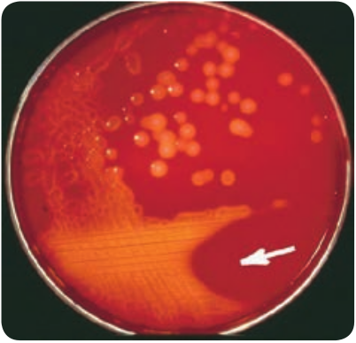
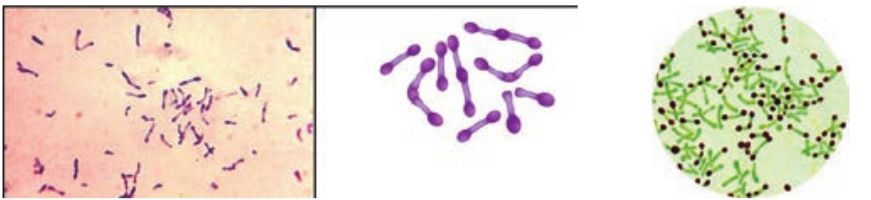
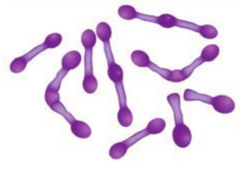
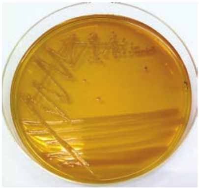
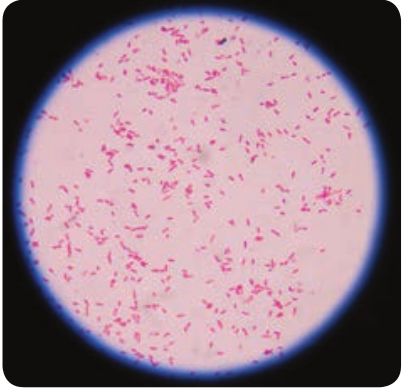
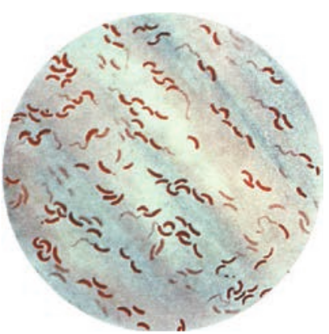
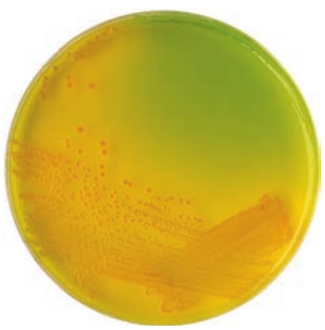
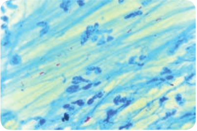
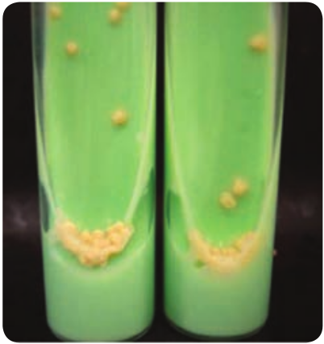
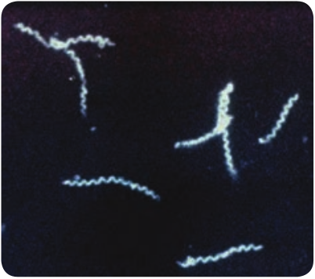

  

**Chapter Outline**

**7.1** Pathogenic Attributes

**7.2** Routes of Entry

**7.3** _Staphylococcus aureus_

**7.4** _Streptococcus pyogenes_

**7.5** _Neisseria meningitidis_

**7.6** _Corynebacterium diphtheriae_

**7.7** _Clostridium tetani_

**7.8** _Shigella dysenteriae_

After studying this chapter the students will be able to,

_- Understand the importance of Medical bacteriology._

_- Describe the pathogenesis of various bacterial diseases such as skin, respiratory infection, food poisoning, diarrhea and dysentery diseases, STD and zoonotic diseases._

_- Know the collection of appropriate clinical specimens and laboratory diagnosis of various bacterial infections._

_- Specify how bacterial infections are prevented and treated with appropriate antibiotics._

**Learning Objectives**

**Medica**

**Chapter**

**7**  

**7.9** _Salmonella typhi_

**7.10** _Vibrio cholerae_

**7.11** _Mycobacterium tuberculosis_

**7.12** _Treponema pallidum_

**7.13** _Leptospira interrogans_

**l Bacteriology**

Medical Bacteriology is the subset of Medical microbiology, which deals with the study of bacterial pathogens. It includes the pathogenesis,

diagnosis, treatment and prevention of various bacterial diseases. **Robert Koch** is considered as the **Father of Bacteriology.**

## Pathogenic Attributes

The host-parasite relationship is determined by the interaction between host factors and the infecting pathogens. Pathogenicity refers to the ability of a pathogen to produce disease. Virulence is the ability of the pathogen to cause disease.

Adhesion, invasiveness (Streptococcal infections), Bacterial toxins (endotoxins and exotoxins), capsule enzymes (proteases, collagenase, coagulase and other enzymes). These are already explained in the XI Standard text book.

  

## Route of Entry

To establish an infection, pathogen must first enter the host. Normal defense mechanisms and barriers (For example Skin, mucus, ciliated epithelium, lysozyme) make it difficult for the pathogen to enter the body.

Sometimes these barriers are break through for example cut in the skin, wound, tumor, ulcer which provides portal of entry for the bacteria. Some bacterial pathogens have the means to overcome the barriers through various virulence factors and invade the body.

Certain bacteria are infective when introduced through optimal route. The various route of entry of pathogens, which are cut or abrasion or wound (skin), Ingestion, Inhalation, arthropod bite, sexual transmission and congenital transmission. These are already explained in the XI Standard text book. The various bacterial pathogens, its pathogenesis clinical symptoms, laboratory diagnosis, control, prophylaxis and treatment with appropriate antibiotics are discussed below.

## _Staphylococcus Aureus_ (Pyogenic Cocci)

The genus _Staphylococcus_ is included in the family Micrococcaceae. _Staphylococcus_ is a normal flora of skin and mucous membranes, but it accounts for human infections, which is known as staph infection. The name _Staphylococcus_ was derived from a Greek word, **‘staphyle’** means **bunch of grapes** and **‘kokkos’** means **berry**. _Staphylococcus aureus_ is a pathogenic species that causes pyogenic infections in human.  

### Morphology

- _Staphylococci_ are gram positive spherical cocci, (0.8µm–1.0µm in diameter) arranged characteristically in grape like clusters (Figure 7.1).

- They are non-motile and non-sporing and few strains are capsulated.

The grape like cluster formation in _Staphylococcus aureus_ is due to cell division

occurring in three perpendicular planes, with daughter cells tending to be remaining in close proximity.

### Cultural Characteristics

- They are aerobes and facultative anaerobes, optimal temperature is 37°C and optimum pH is 7.4–7.6.

- They grow on the following media and shows the characteristic colony morphology (Table 7.1 & Figure 7.2).

**Table 7.1:** Staphylococci aureus colony morphology on various media

**Media Colony Morphology** Nutrient Agar Colonies are circular,

smooth, convex, opaque and produces golden yellow pigment (most strains).

Blood Agar Beta haemolysis

Mannitol salt Agar (MSA)

It is a selective medium for S. _aureus_ produces yellow colored colonies due to fermentation of mannitol

| Me d i a |C ol ony  M or ph ol o g y |
|------|------|
| Nut r ien t A ga r |C olo nies a re cir c u l ar,sm o ot h, co nvex, o p aq ueand p ro duces g oldenyel lo w p ig men t (m os tst ra in s). |
| Blo o d A ga r |B et a h aem olysi s |
| Manni tol s a ltAga r (MSA) |It i s a s ele c t ive m e di umfor S.  a ure u s  p ro ducesyel lo w co lo re d co lo niesdue t o f er men t at io n o fmanni tol |
  

### Virulence Factors

1\. Peptidoglycan → It is a polysaccharide polymer. It activates complement and induces the release of inflammatory cytokines.

2\. Teichoic acid → it facilitates adhesion of cocci to the host cell surface.

3\. Protein A → It is chemotactic, antiphagocytic, anticomplementary and induce platelet injury.

4\. **Toxins:** a. Hemolysins – It is an exotoxin, those

lysis red blood cells. They are of four types namely α-lysin, β-lysin, γ- lysin and delta lysin.

b. Leucocidin – It damages PMNL (polymorphonuclear leucocytes) and macrophages.

c. Enterotoxin – It is responsible for manifestations of Staphylococcus food poisoning.

d. Exfoliative toxin – This toxin causes epidermal splitting resulting in blistering diseases.

e. Toxic shock syndrome toxin – TSST is responsible for toxic shock syndrome.

5\. **Enzymes:** _S. aureus_ produces several enzymes, which are related to virulence of the bacteria. a. Coagulase – It clots human plasma

and converts fibrinogen into fibrin. b. Staphylokinase – It has fibrinolytic

activity. c. Hyaluronidase – It hydrolyzes

hyaluronic acid of connective tissue, thus facilitates the spread of the pathogens to adjacent cells.

d. Other enzymes – S. _aureus_ also produces lipase, nucleases and proteases

### Pathogenicity

S. _aureus_ is an opportunistic pathogen which causes infection most commonly at sites of lowered host resistance. (Example: damaged skin)

Mode of Transmission: _Staphylococcus_ infections are transmitted by the following ways.

  

Why many hospitalized patients are at increased risk for opportunistic infection?

**HOTS**

Staphylococcus Infections

Direct Contact

Fomites (inanimate objects)

Airborne droplets. (Sneezing or coughing)

Staphylococcal diseases may be classified as

Staphylococcal infection

Cutaneous infections

Deep infections

Food poisoning

Nosocomial infections

Skin exfoliative

diseases

Toxic shock syndrome

(TSS)

It includes the following infections, which are as follows: **Cutaneous infections:** Wound (injury), burn infections (tissue injury caused by heat), pustules (A small elevated skin lesions containing pus), furuncles (boil forms around a hair follicle and contains  

pus), styes (a painful swelling of hair follicle at eyelids), carbuncles (painful cluster of boils of the skin), Impetigo (skin infection with vesicles, pustules which ruptures), pemphigus neonatorum (an auto immune diseases that affect skin and mucous membranes)

**Deep infections:** It includes Osteomyelitis (inflammation of bones), tonsillitis (inflammation of tonsils), pharyngitis (inflammation of pharynx) sinusitis (inflammation of sinuses), periostitis (inflammation of membrane covering bones), bronchopneumonia (inflammation of lungs), empyema (collection of pus in the body cavity), septicemia (blood poisoning caused by bacteria and its toxins), meningitis (inflammation of meninge), endocarditis (inflammation of endocardium), breast and renal abscess.

**Food Poisoning:** Staphylococcal food poisoning may follow 2–6 hours after the ingestion of contaminated food (preformed enterotoxin). It leads to nausea, vomiting and diarrhea.

**Nosocomial infection:** S_. aureus_ is a leading cause of hospital acquired infections. It is the primary cause of lower respiratory tract (LRT) infections and surgical site infections and the second leading cause of nosocomial bacteremia, pneumonia, and Cardiovascular infections.

**Exfoliative diseases:** These diseases are produced due to the production of epidermolytic toxin. The toxin separates the outer layer of epidermis from the underlying tissues leading to blistering disease. The most dramatic manifestation

| Cut ane ous inf e c t io ns |
|------|------|

| D e e p inf e c t io ns |

| Foodp oi s on i ng |

| Nos o co mi a linf e c t io ns |

| Sk i n exf oli at ived is e as e s |

| Toxic s ho cks y nd rome(T SS) |

  

of this toxin is scalded skin syndrome. The patient develops painful rash which slough off and skin surface resembles scalding.

Why most infections acquired through the skin are non-communicable diseases?

**HOTS**

**Toxic shock syndrome toxin:** It is caused by TSST-1 and characterized by high fever, hypotension (low blood pressure), vomiting, diarrhea and erythematous rash. TSS became widely known in association with the use of vaginal tampons by menstruating women but it occurs in other situations also.

### Laboratory Diagnosis

**Specimens:** The clinical specimens are collected according to the nature of Staphylococcal infections, which is given in the (Table 7.2).

**Table 7.2:** Clinical specimen collected for Staphylococcal infections

**Infections Clinical Specimens** Suppurative lesions

Pus

Respiratory infections

Sputum

Septicemia Blood

Meningitis CSF

Food poisoning Faeces, food or vomitus

Specimens should be transported immediately to the laboratory and processed.  

**Direct Microscopy:** Gram stained smears of clinical specimens is done, where gram positive cocci in clusters were observed. **Culture:** The collected specimen is inoculated on selective media-MSA and the media incubated at 37°C for 18–24 hours. Next day culture plates are examined for bacterial colonies, which are identified by gram staining, colony morphology and biochemical tests such as a. Catalase test: The genus _Staphylococci_ are

catalase positive. This test distinguishes _Staphylococcus_ from _Streptococcus_ (catalase negative).

b. Coagulase test: This test helps in differentiating a pathogenic strain from non-pathogenic strain_. S. aureus_ is coagulasepositive (Figure 7.3).

### Treatment

Benzyl penicillin is the most effective antibiotic. Cloxacillin is used against beta lactamase. Producing strains (β-lactamase

| Inf e c ti ons |C lini c a l S p e cime ns |
|------|------|
| Suppu r at ivelesio ns |P us |
| R es pira tor yinf e c t io ns |Sputu m |
| S ep t icemi a |Bl ood |
| Menin g it is |C SF |
| Fo o d p ois onin g |Faeces, food or vomitus |
  

is produced by few strains of S. _aureus_ which cleaves β – lactam ring of penicillin). Vancomycin is used against MRSA (Methicillin Resistant _Staphylococcus aureus_) strains.

**Topical applications:** For mild superficial lesions, topical applications of bacitracin or chlorhexidine is recommended.

**Control measures**: Proper sterilization of medical instruments must be done. Intake of antibiotics must be taken under proper medical advice. The detection of source & carriers among hospital staff, their isolation and treatment should be practiced.

## _Streptococcus Pyogenes_ (Flesh eating Bacteria)

The genus _Streptococcus_ includes a large and varied group of bacteria. They inhabit various sites, notably the upper respiratory tract. However, some species of which _Streptococcus_ pyogenes is the most important and are highly pathogenic. The name _Streptococcus_ is derived from **Greek** word **‘Streptos’** which means twisted or coiled.

### Morphology

- They are Gram positive, spherical or oval cocci and arranged in chains (0.6µm–1µm)

**Year Scientist** 1874 The odor Billroth _Str_ 1884 Friedrich Julius

Rosenbach Th an  

- They are non – motile, non – sporing. Some strains are capsulated (Figure 7.4).

### Cultural Characteristics

- They are aerobe and facultative anaerobe. Optimum temperature is 37°C and pH is 7.4 to 7.6

- They grow only in media enriched with blood or serum. It is cultivated on blood agar. On blood agar, the colonies are small, circular, semitransparent, low convex, with an area of clear hemolysis around colonies (Figure 7.5).

- Crystal violet blood agar – a selective medium for _Streptococcus_ _pyogenes._

**Contributions** _eptococci_ were discovered e cocci were isolated from human lesions d gave the name _Streptococcus pyogenes_

| Year |S c i en ti st |C ontr i buti on s |
|------|------|------|
| 1874 |Th e o do r B i l lr ot h |Strep toc oc c i  w er e di s co ver e d |
| 1884 |Fr ie dr ic h J u li usR os en b ac h |The co cci w ere i s olated f rom human lesio nsand ga ve t he n ame  Streptococcu s pyogen es |
  

**Classification**

The aerobic and facultative anaerobic _Streptoc_ properties. Three types of haemolytic reactio which are:

Aerobic and Facultative A (Based on Haemoly

Alpha haemolytic

Incomplete haemolytic

Beta haemoly

Comple haemoly

Based on serological grouping of carbo organisms, they are classified into 20 Lancefi

_Streptococcus_ pyogenes is beta haemolytic

**Infobi**

### Antigenic Structure

**Capsule:** It inhibits phagocytosis **Cell wall:** The outer layer of cell wall consists of protein and lipoteichoic acid

which helps in attachment to the host cell. Middle layer of cell wall consists of Group Specific C – Carbohydrate that is used for Lancefield grouping. Inner layer of cell wall is made up of peptidoglycan which has pyrogenic and thrombolytic activity. **Toxins and Enzymes:** _Streptococcus pyogenes_ produces several exotoxins and enzymes which contribute to its virulence. **Toxins and Hemolysins:** _Streptococci_ produces two types of hemolysins which are Streptolysin O and Streptolysin S. **Erythrogenic toxin:** (Pyrogenic exotoxin) – The induction of fever is the primary effect of this toxin and it is responsible for the rash of scarlet fever. **Enzymes:** The various enzyme of _Streptococcus pyogenes_which exhibits virulence activity are listed in Table 7.3.

_occus_ are classified based on haemolytic ns are observed on blood agar medium,

naerobic Streptococci tic properties)

tic

te tic

Gamma haemolytic

No haemolytic

hydrate C antigen of Beta haemolytic eld groups (A to H & K to V) organism which is included in Group A.

**ts**

| Aer obic a nd F ac u lt at ive A naer obic S t rep to co cci(B as e d o n H aem olyt ic p rop er t ies) |
|------|------|------|------|------|
| ha  B elyt ic haem o |Ga mmhaem o |
| A lp t a haem o lyt ic |alyt ic |

| A lpha haem olyt ic |
|------|------|

| Inco mplet ehaem olyt ic |

|------|------|
| C omplet ehaem olyt ic |

|------|------|
| Nohaem olyt ic |
  

**Table 7.3:** Enzymes of _Streptococcus pyogenes_ a

**Enzymes** streptokinase (fibrinolysin) It promotes t

the convers facilitates the fibrin barrier

Deoxyribonucleases It liquefy the thick pusand streptococca

Hyaluronidase It breaks do favors spread spaces.

Other enzymes NADase, lip other enzym

**Streptokinase:** It is given intravenously for the treatment of early myocardial

infarction and other thromboembolic disorders. _Streptococcus equisimilis_ is the source of streptokinase used for thrombolytic therapy in patients.

### Pathogenesis

_Streptococcus pyogenes_ is intrinsically a much more dangerous pathogen than _Staphylococcus aureus_ and has a much greater tendency to spread in the tissues.

**Mode of transmission:** Streptococcal infections are transmitted by the following ways:

Transmission of Streptococcal

infection

Direct Contact

Fomites

Airborne droplets

Carriers  

nd its virulence nature

**Virulence nature** he lysis of human fibrin clot by catalyzing ion of plasminogen into plasmin. It spread of infection by breaking down the around the lesions. highly viscous DNA that accumulate in responsible for thin serous character of

l exudates wn hyaluronic acid of the tissues and of streptococcal lesion along intercellular

ase, amylase, esterase, phosphates and es

_Streptococcal_ diseases may be broadly classified, and it is shown in flowchart 7.1

_Streptococcal_ diseases

- Respiratory tract infection

- Skin Infection. 
- Streptococcal toxic shock syndrome

- Deep infection. 
- Genital infections

- Acute Rheumatic fever

- Acute glomerulo- nephritis

Suppurative diseases

Non-suppurative complication

**Flowchart 7.1:** Classification of _Streptococcal_ diseases

**Suppurative Infections**

**1\. Respiratory tract infection a. Streptococcal sore throat:** Sore throat (acute tonsillitis and pharyngitis) is the

| E nzy mes |Vir u l enc e na tur e |
|------|------|
| st rep tok in as e (f ibr in olysin) |It p romotes t he l ysi s o f hum an f ibr in c lo t by c at a lyzin gt he co nver sio n o f p l asmin og en in to p l asmin. I tfaci li t ates t he spre ad o f inf e c t io n by bre a k in g dow n thef ibr in b ar r ier a roun d t he lesio ns. |
| D e oxy r ib onuc le as es |It liq uef y t he hig h ly v is co us D NA t hat acc um u l ate int hic k p us and r es p onsi ble f or t hin s er ous c harac ter o fst rep to co cc a l exud ates |
| Hya lur onid as e |It b re a ks do w n h ya lur onic acid o f t he t issues a ndfa vors spre ad of st rep to co cc a l lesio n alo ng inter ce l lu l arsp aces. |
| O t her enzy mes |NAD as e, li p as e, a my l as e, es tera s e, p hos phates a ndot her enzy mes |

| Non-s upco mplic |
|------|------|------|------|------|
| Suppu r at ived is e as e s |pura t iveat io n |

| Dir e c t C ont ac t |
|------|
| Fomites |
| Airb or ne dr oplets |
| C ar r ier s |
  

most common streptococcal diseases. Tonsillitis is more common in older children and adults. The pathogen may spread from throat to the surrounding tissues leading to suppurative (pus – formation) complication such as cervical adenitis (inflammation of a lymph node in the neck) otitis media (inflammation of middle ear), quinsy (ulcers of tonsils) Ludwig’s angina (purulent inflammation around the sub maxillary glands) mastoiditis (inflammation of mastoid process). **b. Scarlet fever:** The disease consists of combination of sore throat and a generalized erythematous (redness of skin or mucous membranes) rash.

**2\. Skin infections a. Erysipeals:** It is an acute spreading lesion. The skin shows massive brawny oedema with erythema it is seen in elderly persons or elders. **b. Impetigo: (Streptococcal pyoderma)** It is a skin infection that occurs most often in young children. It consists of superficial blisters that break down and eroded areas whose surface is covered with pus. It is the main cause leading to acute glomerulonephritis in children. **c. Necrotizing fasciitis:** It is an invasive, infection characterized by inflammation and necrosis of the skin, subcutaneous fat and fascia. It is a life-threatening infection.

The strain which cause necrotizing fasciitis to have been named as “Flesh

eating bacteria or” killer bacteria.  

**3\. Streptococcal toxic shock syndrome** Streptococcal pyrogenic exotoxin leads to streptococcal toxic shock syndrome (TSS). It is a condition in which the entire organ system collapses, leading to death.

**4\. Genital infections** _Streptococcus pyogenes_ is an important cause of puerperal sepsis or child bed fever (infection occur when bacteria infect the uterus following child birth)

**5\. Deep infection** _Streptococcus pyogenes_ may cause pyaemia (blood poisoning characterized by pus forming pathogens in the blood) septicemia (A condition in which bacteria circulate and actively multiply in the bloodstream) abscess in internal organs such as brain, lung, liver and kidney.

**Non – Suppurative Complication**

_Streptococcus pyogenes_ infections are sometimes followed by two important non – suppurative complications which are, acute rheumatic fever and acute glomerulonephritis. These complications occur 1–4 weeks after the acute infection and it is believed to be the result of hypersensitivity to some streptococcal components.

**1\. Rheumatic fever** It is often preceded by sore throat and most serious complication of haemolytic streptococcal infection. The mechanism by which _Streptococci_ produce rheumatic fever is still not clear. A common cross – reacting antigen exist in some group A streptococci and heart, therefore, antibodies produced in response to the

  

streptococcal infection could cross react with myocardial and heart valve tissue, causing cellular destruction.

**2\. Acute glomerulonephritis** It is often preceded by the skin infection. It is caused by only a few “nephritogenic types (strains)”. It develops because some components of glomerular basement membrane are antigenically similar to the cell membranes of nephritogenic streptococci. The antibodies Formed against _Streptococci_ cross react with glomerular basement membrane and damage. Some patients develop chronic glomerulonephritis with ultimate kidney failure.

Why are some staphylococcal skin infections similar to streptococcal skin infection?

**HOTS**

### Laboratory Diagnosis

**Specimens:** Clinical specimens are collected according to the site of lesion. Throat swab, pus or blood is obtained for culture and serum for serology. **Direct Microscopy:** Gram stained smears of clinical specimens is done, where Gram positive cocci in chains were observed. It is indicative of streptococcal infection. **Culture:** The clinical specimen is inoculated on blood agar medium and incubated at 37° C for 18–24 hours. After incubation period, blood agar medium was observed for zone of beta – haemolysis around colonies. **Catalase test:** _Streptococci_ are catalase negative which is an important  

test to differentiate _Streptococci_ from_Staphylococci_. **Serology:** Serological tests are done for rheumatic fever and glomerulonephritis. It is established by demonstrating high levels of antibody to streptococci toxins. The standard test is antistreptolysin Otitration. ASOtitres higher than 200 units are indicative of prior Streptococcal infection.

### Treatment and Prophylaxis

- Penicillin G is the drug of choice. 
- In patients allergic to penicillin,

erythromycin or cephalexin is used. 
- Antibiotics have no effect on

established glomerulonephritis and rheumatic fever.

- Prophylaxis is indicated only in the prevention of rheumatic fever, it prevents streptococcal reinjection and further damage to the heart.

- Penicillin is given for a long period in children who have developed early signs of rheumatic fever.

**Myth:** Eating choc- olate encourages the development of acne.

**Fact:** It is the oils and fats in many chocolate products, and not chocolate itself, that promote sebum production and subsequent acne. Chocolate in low-fat chocolate milk and in fat-free chocolate candies does not encourage acne. Acne suffers do not need to give up chocolate, they need to reduce their lipid consumption.

  

## _Neisseria Meningitides_ (Meningococcus)

The genus _Neisseria_ is included in the family _Neisseriaceae_ (Figure 7.6)_._ It contains two important pathogens _Neisseria meningitidis_ and _Neisseria gonorrhoeae_, both the species are strict human pathogens. _N. meningitides_ causes meningococcal meningitis (formerly known as cerebrospinal fever).

The word **Meningitis** is derived from Greek word **‘meninx’** means membrane and **‘itis’** means inflammation. It is an inflammation of meanings of brain or spinal cord. Bacterial meningitis is a much more severe disease than viral meningitis.

### Morphology

They are Gram negative diplococci (0.6µm–0.8µm in size) arranged typically in pairs, with adjacent sides flattened.

They are non – motile, capsulated (Fresh isolates).

Cocci are generally intracellular when isolated from lesions (Figure 7.7).

### Cultural Characteristic

They are strict aerobes, but growth is facilitated by 5–10% CO2 and high

**Table 7.4:** Colony morphology of _Neisseria Meningitides_ on media

**Name of the media**

**Colony Morphology**

Chocolate agar Colonies are large, colorless to grey opaque colonies.

Mueller Hinton agar

Colonies are small, round, convex grey, translucent with entire edges. The colonies are butyrous in consistency and easily emulsified.

humidity. The optimum temperature is 35°C–36°C and optimum pH is 7.4–7.6. They are fastidious pathogens, growth occurs on media enriched with blood or serum. They grow on the following media and show the characteristic colony morphology (Table 7.4).

### Pathogenesis

_N. meningitidis_ is the causative agent of meningococcal meningitis, also known as pyogenic or septic meningitis. Infection is most common in children

Normal meninges

Infected meninges

What is Meningitis?

| Name o f theme di a |C o l ony Mor ph ol o g y |
|------|------|
| C ho co l ate a ga r |C olo nies a re l arge,co lo rles s t o g re yop aq ue co lo nies. |
| Mue l ler H in tonag ar |C olo nies a re sm a l l,roun d, co nvex g re y,t ra nslucen t w it hen t ir e e dg es. Th eco lo nies are but y rousin co nsi sten c y a nde asi ly em u lsif ie d. |
  

and young adults. Meningococci are strict human pathogens. Human nasopharynx is the reservoir of _N.meningitidis._ The pathogenesis is dicussed in the flowchart 7.2. Source of infection – Airborne droplets Route of entry – Nasopharynx Site of infection – Meninges Incubation period – 3 days

### Laboratory Diagnosis

**Specimens:** CSF, blood, nasopharyngeal scrapings from petechiae lesions are the specimens collected from pyogenic meningitis patients. **Direct Microscopy:** CSF is centrifuged, and smear is prepared from the deposit for gram staining. Meningococci are Gram negative diplococci, present mainly inside polymorphs and many pus cells are also seen. **Culture:** The centrifuged deposit of CSF is inoculated on chocolate agar. The plate is incubated at 36°C under 5–10% CO2 for 18–24 hours. After incubation period, meningococcusis identified by gram staining, colony morphology and biochemical reactions. _N. meningitides_ is catalase and oxidase positive (Figure 7.8).

The meningococci gain entry in the nasopharynx and attaches to the epithelial cells with pili. They are engulfed by epithelial cells of mucosa and penetratesintonearby blood vessels, thereby damaging the epithelium and causes pharyngitis.

Cocci spread from the nasopharynx to meninge by travelling along the perineural sheath of the olfactory nerve, through the cribriform plate to the subarachnoid space or through blood stream.

Pathogen entering the blood vessels rapidly permeates the meninges and produce meningitis (most complication in children). It is marked by the following clinical manifestations, which are fever, sore throat, headache, stiff neck, and vomiting convulsions (fits).

The pathogen sheds endotoxin into the generalized circulation, which damages the blood vessels and leads to vascular collapse, hemorrhage, petechiae lesion (a small red or purple spot caused by bleeding into the skin).

A few develop sudden meningococcemia **(water house – friderichsen syndrome)** characterized by shock, disseminated intravascular coagulation and multisystem failure.

It has a violet onset, with fever, chills, shock and coma. Generalized intravascular clotting, cardiac failure, damage to adrenal glands and death occurs within a few hours.

**Flowchart 7.2:** Pathogenesis of _Neisseria Meningitides_

  

### Treatment and Prophylaxis

Penicillin – G is the drug of choice. In penicillin allergic cases, chloramphenicol is recommended. 
- Monovalent and polyvalent vaccines

(capsular polysaccharide) induce good immunity in older children and adults.

- Conjugate vaccines are used for children below the age of 2 years.

## _Corynebacterium Diphtheriae_

Several species of the genus _Corynebacterium_ are normal flora of skin, upper respiratory tract (URT), urogenital and intestinal tract. The most important member of the genus is _C. diphtheriae_ the causative agent of diphtheria, a localized inflammation of the throat with greyish white pseudomembrane and a generalized toxemia due to the secretion and dissemination of a highly potent toxin.

The name _Corynebacterium diphtheria_ is derived from **Greek word ‘Coryne’** – “Club shaped swellings” or“Knotted rod” **‘Diphthera’** – Leather.

### Morphology

- They are Gram positive slender rods, pleomorphic club shape or coryneform

bacterium Non – motile, non – sporing and non – capsulated (Figure 7.9a & b).

- The bacilli are arranged in a characteristic fashion in angular fashion resembling the letters V or L. This has been called Chinese letter or cuneiform arrangement (Figure 7.10).

- They are club shaped due to the presence of metachromatic granules at one or both ends. These granules are composed of polymetaphosphates and represent energy storage depots.

_ium diphtheriae_ **(b)** Albert’s staining

  

### Cultural Characteristics

- They are aerobic and facultative anaerobe. Optimum temperature is 37°C and pH 7.2.

- They grow on the following media and show the characteristic colony morphology (Table 7.5).

**Table 7.5:** Colony Morphology of _Corynebacterium diphtheriae_ on cultural media

**Media Colony Morphology** Loeffler’s Serum slope

They grow on this medium very rapidly. Colonies appear after 6–8 hours of incubation. The colonies are small, circular white or creamy and glistening

Tellurite Blood Agar

Grey or black colonies. Based on colony morphology on tellurite medium, three main biotypes – Gravis, Intermedius and Mitis.

**Toxin*. 
- The pathogenicity is due to production

of a very powerful exotoxin by virulent strains of diphtheria bacilli.

- The toxigenicity of diphtheria bacillus depends on the presence of a tox+ gene which can be transferred from one bacterium to another by lysogenic bacteriophages, of which beta phage is the most important.

**Properties** The diphtheria toxin is a heat – labile protein and has a molecular weight of about 62,000 Dalton. It consists of two fragments.  

a. Fragment A (24,000 Dalton) – It has all enzymatic activity.

b. Fragment B (38,000 Dalton) – It is responsible for binding the toxin to the target cells.

**Mode of Action** The toxin acts by inhibiting protein synthesis, specifically fragment A inhibits polypeptide chain elongation in the presence of NAD by inactivating the elongation factor (EF – 2) the toxin has special affinity for myocardium, adrenal gland and nerve endings.

### Pathogenicity

Source of infection – Airborne droplets Route of entry – Upper respiratory tract Incubation period – 3–4 days Site of infection – Faucial (nasal, otitis, conjunctival, laryngeal, genital) diphtheria is most commonly seen in children of 2–10years.

Faucial diphtheria is the most common type. The infection is confined to humans only. The toxin has both local (flowchart 7.3) as well as systemic effects.

**Systemic effects** The toxin diffuses into the blood stream and causes toxemia. It has got affinity for cardiac muscle, adrenal and nerve endings. It acts on the cells of these tissues.

### Clinical Manifestations

1\. Laryngeal obstruction, asphyxia (it is a condition of severe deficient supply of oxygen, causing suffocation).

2\. Diphtheritic myocarditis (inflammation of heart muscle), polyneuropathy

| Me d i a |C ol ony  M or ph ol o g y |
|------|------|
| L o ef f ler ’sS er um s lo p e |Th e y g row o n t hi sme di um v er y ra pid ly.C olo nies a pp e ar a f ter6–8 h our s o f in c ub at io n.Th e co lo nies a re sm a l l,cir c u l ar w hi te o r cr e amyand g li stenin g |
| Tel lu r it eBlo o d A ga r |Gre y o r b l ac k co lo nies.B as e d o n co lo nymor pholog y o n t el lur iteme di um, t hr e e m ainbio t yp es – G ra v is,Inter me di us a nd M it is. |
  

(damage of multiple peripheral nerves), paralysis of palatine (the top part of the inside of the mouth) and ciliary muscles.

3\. Degenerative changes in adrenal glands, kidney and liver may occur.

### Laboratory Diagnosis

**Specimen:** Two swabs from the lesions are collected. One swab is used for smear preparationand other swab for inoculation on culturemedia. **Direct microscopy:** Smears are stained with both Gram stain and Albert stain. a. Gram Staining – Gram positive slender

rods were observed. b. Albert staining – Club shaped with

metachromatic granules were observed.

The bacilli enters through URT and it remains confined to the site of entry where they multiply and produces diphtheria toxin

The membrane extends from oropharynx to larynx and into trachae. The mechanical obstruction of the trachae by psedudomembrane can cause suffocation and death.

The toxin causes local necrotic changes along with superficial inflammatory reaction. The necrosed epithelium together with fibrinous exudate, leucocytes, erthrocytes and bacteria consitute the greyish psedudomembrane, which is a characteristic feature of diphtheritic infection.

**Flowchart 7.3:** Localized effect of diphtheria toxin  

**Culture:** The swabis inoculated on Loeffler’s serum slope, after overnight incubation at 37°C, the plates were observed for characteristic colonies, which are identified by gram staining.

### Prophylaxis

Diphtheria can be controlled by immunization. Three methods of immunization are available (Table 7.6).

### Treatment

The specific treatment for diphtheria consists of administration of antitoxin with dose of 20,000–100, 000 units of ADS intramuscularly and antibiotic therapy using penicillin.

## _Clostridium Tetani_

The genus _Clostridium_ consists of anaerobic, spore forming Gram positive bacilli. The spores are wider than the bacterial bodies, giving the bacillus a swollen appearance resembling a spindle. The name _Clostridium_ is derived from the word **‘kluster’ (a spindle**). Most species are saprophytes found in soil, water and decomposing plant and animal matter. Some of the pathogens are normal flora of intestinal tract of human and animals.

The genus _Clostridium_ includes bacteria that causes 3 major diseases of human – **Tetanus, gas gangrene and food poisoning**. _Clostridium_ pathogenicity is mainly due to production of a powerful exotoxin.

_Clostridium_ of medical importance may be classified based on diseases they produce, which is given the Table (7.7).

  

**Table 7.7:** Clostridium sp. causing pathogenic diseases.

**Organisms Diseases** _Clostridium tetani_ Tetanus _Clostridium perfringens_ Gas gangrene _Clostridium botulinum_ Food poisoning

### Morphology

They are Gram positive spore forming rods. The spores are spherical and terminal in position giving a drumstick appearance. They are motile and non – capsulated.

### Culture Characteristics

- They are obligate anaerobes, optimum temperature is 37°C and pH is 7.4.

- It grows on ordinary media, but growth is enhanced by addition of blood and serum. _Clostridia tetani_ grows on the following media and show the characteristic colony morphology (Table 7.8).

### Toxins

_Clostridium tetani_ produces two distinct toxins namely, a. Tetanolysis (haemolysin) b. Tetanospasmin (neurotoxin)

**Table 7.6:** Immunization for diphtheria

**Immuniz Active Passive** DPT (Triplevaccine) 3 doses of 0.5ml each are given intramuscular route at an interval of 4–6 weeks after birth. Booster dose of DPT are given at 18 months and at the age of 5.

500–1000 units theritic serum, ( ministered subc  

**Tetanolysis*. 
- Heat labile and oxygen labile toxin. 
- It lysis erythrocytes and also acts as

neurotoxin.

**Tetanospasmin*. 
- It is heat labile and oxygen stable

powerful neurotoxin. 
- It is protein in nature. consisting of

a large polypeptide chain (93,000 Dalton) and a smaller polypeptide chain (52,000 Dalton) joined by a disulphide bond.

- **Mode of Action:** Tetanospasminis a neurotoxin, which blocks the release of

**ation Combined**

of Antidiph- ADS) is ad- utaneously.

It consists of administration first dose of adsorbed toxoid on one arm, while ADS is given on another arm.

**Table 7.8:** Colony characteristics of _Clostridium tetani_

**Media Colony Morphology** Blood agar They produce α – hemolysis

which subsequently develop into β – hemolysis (due to tetanolysis) it produces swarming growth.

Cooked meat broth (CMB)

Growth occurs as turbidity with gas formation. The meat is not digested but becomes black on prolonged incubation

| Imm uniza ti on |
|------|------|------|
| Ac ti ve |Pass iv e |C om bi n e d |
| DPT (Tr iple vaccin e)3 dos es o f 0.5m l e ac h a reg iven in t ra mus c u l ar r outeat a n in ter va l o f 4–6 w e eksaf ter b ir t h. B o os ter dos e o fDPT  are  g iven  at  18  mont hsand a t t he a ge o f 5. |500–1000 uni ts of Ant idi ph -t her it ic s er um, (ADS) i s ad -mini ster e d s ub c ut ane ously. |It co nsi sts o f admini st ra t io nf ir st dos e of ads orb e d toxoidon o ne a r m, w hi le ADS i sg iven o n a not her a r m. |

| Org anis ms |Dis e as es |
|------|------|
| C lostr idium  t etani |Tet anus |
| Clostridium per fringens |Ga s ga ng ren e |
| C lostr idium  b otulinum |Fo o d p ois onin g |

| Me d i a |C ol ony  M or ph ol o g y |
|------|------|
| Blo o d a ga r |Th e y p ro duce α – h em olysi sw hic h s ubs e quen t ly de velo pinto β – h em olysi s (d ueto t et anolysi s) i t  pro ducesswa r min g g rowt h. |
| C o oke d mea t  b roth(CMB) |Growt h  o cc ur s a s  turb idi t yw it h  ga s  for mat io n. Th eme at i s n ot dig es te d b utb e co mes bl ac k on prolo nge di nc ub at i on |
  

inhibitory neurotransmitters (glycine and gamma – amino butyric acid) across the synaptic junction. The toxin acts presynaptically, the abolition of spinal inhibition causes uncontrolled spread of impulses in CNS (Central Nerves System). This results in muscle rigidity and spasms (due to the simultaneous contraction of agonists and antagonists, in the absence of reciprocal inhibition Figure 7.11).

### Pathogenesis

_Clostridium tetani_ is the causative organism of tetanus or lock jaw disease. pathogenesis of _Clostridium tetani_ was discussed in detail in flowchart 7.4. Source of infection – Soil, dust, faeces. Route of entry – Through wound Incubation period – 6–12 days

### Clinical Feature

It includes, pain and tingling at the site of wound, Lock jaw ortrismus (It is reduced opening of the jaws), Risus sardonicus (mouth kept slightly open), Dysphasia (impairment of the ability to speak or to understand language) and acute asphyxia.

### Laboratory Diagnosis

**Specimens:** Wound swab, exudates or tissue from wound.

**Myth:** Rust causes tetanus if introduced into a wound – for example, by stepping on a rusty nail.

**Fact:** Rusty nails are more likely to be contaminated with tetanus endospores because they have been exposed to soil and dust longer than new, rust free nails. Any object that causes a wound, rusty or not, can inoculate the tissue with the bacterial endospores of _C. tetani_. Rust itself neither causes tetanus nor makes it worse.

**Microscopy**: Gram staining shows Gram positive bacilli with drumstick appearance. **Culture:** The clinical specimen is inoculated on blood agar and incubated at 37°C for 24–48 hours under anaerobic conditions. The colonies are confirmed by gram staining, where it shows gram positive bacilli with drumstick appearance.

### Treatment

Tetanus patients are treated in special isolated units, to protect them from noise and light which may provoke convulsions. The spasm can be controlled by diazepam

_Clostridium difficile_ is the causative agent of **antibiotic associated colitis.** It is an acute colitis with or without

pseudo membrane formation. It is an important complication in patients on oral antibiotic therapy. Many antibiotics have been incriminated but lincomycin and clindamycin are particularly prone to cause pseudomembranous colitis.

  

**Table 7.9:** Immunization for tetanus **Active immunization Passive imm**

a. Tetanus toxoid (TT) b. DPT

Antitetanus seru Human Antitetan immunoglobulin

Tetanus develops by the contamination of wound with _Clostridum tetani_ spores. The spores germinate in reduced oxygen tension (anaerobic environment).

The toxin blocks synaptic inhibition in the spinal cord. It acts presynaptically.

The toxin affects most of the voluntuary muscles in the body, causing muscle rigidity and spasma due to uncontrolled contractions.

The first symptoms appears in head and neck because of shorter length of cranial nerves. Masseter muscles are first affected causing ‘Lock Jaw’.

The vegetative cell grows and produces a potent neurotoxin called tetanospasmin. The toxin is absorbed from the site of its production and enters into the blood stream. It ascends to central nervous systems (CNS) through motor nerves.

In severe cases progressive spasm of the back or extensor muscles produces opisthotonos (extreme arching of the back) usually death occurs due to respiratory paralysis.

**Flowchart 7.4:** Pathogenesis of _Clostridium tetani_  

**unization Combined prophylaxis** m (ATS) us

s (HIIG)

Tetanus toxoid in one arm and ATS or HTIG in another arm.

(0.1–0.2 mg/kg) injection. Antibiotic therapy with penicillin or metronidazole should be done for a week or more.

### Prophylaxis

It is done by the following methods, which are as follows. **a. Surgical prophylaxis:** It aims at

removal of foreign body, blood clots and damaged tissue in order to prevent anaerobic conditions favorable for the germination of spores.

**b. Immunoprophylaxis:** Tetanus is a preventable disease. Immune prophylaxis is of 3 types, which is given in the (Table 7.9).

**Clostridial Toxins As Therapeutic Agents** Botulinum toxin is the most poisonous substance known, is being used for the treatment of specific neuromuscular disorders characterized by involuntary muscle contraction. Since approval of Botulinum toxin (botox) by the FDA in 1989 for 3 disorders – Strabismus (crossing of the eyes), blepharospasm (spasmodic contraction of eye muscles) and hemifacial spasm (contraction of one side of the face).

In 2000, dermatologists and plastic surgeons began using Botox to eradicate wrinkles caused by repeated muscle contractions as we laugh, smile or frown.

**Infobits**

| Ac tiv e imm uniza ti on |Pass iv e imm uniza ti on |C ombine d p rophy l axis |
|------|------|------|
| a.  Tet anus t oxoid (T T)b. D PT |Ant itet anus s er um (A T S)Hu ma n Ant ite t anusimm un og lo bu lin s (HII G) |Tet anus t oxoid in o near m a nd AT S o r HTI G inanot her  ar m. |
  

## _Shigella Dysenteriae_ (Dysentery Bacillus)

The genus _Shigella_are exclusively parasites of human intestine and other primates. _Shigella dysenteriae_ is the causative agent of bacillary dysentery or shigellosis in humans. It is a diarrheal illness which is characterized by frequent passage of bloodstained mucopurulent stools. The four important species of the genus _Shigella_ are: _Shigella dysenteriae, Shigella flexneri, Shigella sonnei and Shigella boydii._

### Morphology

_Shigella_ are short, Gram negative rods (0.5µm× 1–3 µm in size)**.** They are non – motile, non – sporing and non – capsulated (Figure 7.12).

### Cultural Characteristics

- They are aerobes and facultative anaerobes. Optimum temperature is 37°C and optimum pH – 7.4.

- They can be grown on the following media and show the characteristic colony morphology (Table 7.10 & Figure 7.13).

**Table 7.10:** Colony morphology of Shigella

**Media Colony**

**Morphology** Nutrient Agar Colonies are circu-

lar, convex smooth and translucent

MacConkey Agar Colourless colonies

SS – Agar Colourless colonies  

### Toxins

_Shigella dysenteriae_ produces toxins, which is of 3 types, namely, endotoxin, exotoxin and verocytotoxin. The mode of action of these toxins is illustrated in the Table 7.11.

### Pathogenesis

The pathogenic mechanism of _Shigella dysenteriae_is discussed below in flowchart 7.5. Source of Infection – Patient or carriers Route of entry – faecal – oral route

| Me d i a |C o l ony Mor ph ol o g y |
|------|------|
| Nut r ien t A ga r |C olo nies a re cir c u -l ar, co nvex sm o ot hand t ra nslucen t |
| MacC on ke y A ga r |C olo ur les s co lo nies |
| SS – A ga r |C olo ur les s co lo nies |
  

Site of infection – Large intestine Incubation Period – Less than 48 hours (1–7 days) Mode of transmission – Food, finger, faeces and flies

### Clinical Manifestations

- Frequent passage of loose, scanty faeces containing blood and mucus.

- Abdominal cramps and tenesmus (straining to defecate).

- Fever and vomiting.

- Hemolytic uremic syndrome (It is a condition caused by the abnormal destruction of red blood cells).

**Table 7.11:** Various toxins of _Shigelladysenteriae_

**Toxins Mode of Action**

Endotoxin It is released after autolysis, it has irritating effect on intestinal wall which causes diarrhea and subsequently intestinal ulcers.

Exotoxin It is a powerful toxin and acts as Enterotoxin as well as neurotoxin. **As Enterotoxin** – It induces fluid accumulation **As Neurotoxin** – It damages the endothelial cells of small blood vessels of CNS which results in polyneuritis and coma

Vero cytotoxin

It acts on Vero cells  

_Sh. dysenteriae_ causes bacillary dysentery. The pathogen enters into the host by the ingestion of contaminated food.

As the pathogen multiples it produces toxins, it stimulates an inflammatory reaction and causes extensive tissue destruction. It leads to necrosis of surface epithelial cells.

The necrotic epithelia, become soft and friable and are sloughed off leaving behind transverse superficial ulcers.

Abdominal cramps and pain are caused by the disruption of the muscular function of the intestine

The degeneration of intestinal villi and local erosion causes bleeding, heavy mucous secretion resulting in bacillary dysentery

The bacilli reaches large intestines and adheres to the epithelial cells of villi. It multiples inside the cell and penetrates into lamina propria.

**Flowchart 7.5:** Pathogenesis of _Shigella dysenteriae_

### Laboratory Diagnosis

**Specimens:** Fresh stool is collected. **Direct Microscopy:** Saline and Lugol’s iodine preparation of faeces show large number of pus cells, and erythrocytes.

| Toxins |Mo de  o f  Act io n |
|------|------|
| En do toxin |It i s rele as e d af ter a utolysi s,it h as ir r it at in g ef fe c t o nin tes t in a l wal l whic h caus esdi ar rhe a a nd s ubs e quen t lyin tes t in a l u lcer s. |
| E xotoxin |It i s a p ower f u l t oxin a ndac ts a s En ter otoxin a s w el las n eur otoxin.As  Ent erot ox i n  – It inducesf luid acc um u l at io nAs N e ur otoxin  –  Itd amages t he en do t heli a lce l ls o f sm a l l b lo o d v es s elsof CNS w hic h r es u lts inp oly neur it is a nd co ma |
| Veroc yt otoxin |It ac ts o n Ver o ce l ls |
  

**Culture:** For inoculation, it is best to use mucus flakes (if present in the specimen) on MacConkey agar and SS agar. After overnight incubation at 37°C, the plates are observed for characteristic colonies, which is confirmed by Grams staining and biochemical reactions.

### Treatment and Prevention

- Uncomplicated shigellosis is a self – limiting condition that usually recovers spontaneously.

- In acute cases, oral rehydration therapy (ORT) is done.

- In all severe cases, the choice of antibiotic should be based on the sensitivity of prevailing strain.

- Many strains are sensitive to Nalidixic acid and Norfloxacin.

- Improving personal and environmental sanitation.

- The detection and treatment of patients and carriers.

## _Salmonella Typhi_ (Eberthella Typhi)

The genus _Salmonella_ consists of bacilli that parasites the intestines of vertebrates and human beings. It causes **Enteric fever**, which includes **Typhoid** and **Paratyphoid fever**. The most important species of the genus is _Salmonella typhi_ which causes typhoid fever.

### Morphology

Salmonellae are Gram – negative rods (1– 3µm× 0.5 µm in size). They are motile with peritrichous flagella, non – capsulated and non – sporulated (Figure 7.14).  

### Cultural Characteristics

They are aerobic and facultative anaerobe, optimum temperature - 37°C and pH is 7–7.5.

They grow on the following media and show the following characteristic colony morphology (Table 7.12).

**Table 7.12:** Colony morphology of _Salmonella typhi_

**Media Colony Morphology** Nutrient Agar

Colonies are large, circular, smooth, translucent

MacConkey Agar

Colourless colonies (non – lactose fermenters)

SS – Agar Colourless colonies with black centered.

### Pathogenicity

_Salmonella typhi_ causes typhoid fever and its pathogenesis is discussed in flowchart 7.6. Source of infection – food, feces, fingers, flies

| Me d i a |C ol ony  M or ph ol o g y |
|------|------|
| Nut r ien tAg ar |C olo nies are large, circ u l ar,sm o ot h, t ra nslucen t |
| MacC on ke yAg ar |C olo ur les s co lo nies (n on– l ac tos e f er men ter s) |
| SS – A ga r |C olo ur les s co lo nies w it hbl ac k cen ter e d. |
  

The bacilli reaches the small intestine and attach to the epithelial cells of intestinal villi and penetrate to the lamina propria and submucosa

The infection is acquired by ingestion of contaminated food and water

The pathogen enters the mesenteric lymph nodes, multiply there and enters blood stream through the thoracic duct

A transient bacteraemia follows and internal organs like liver, gall bladder, spleen, bone marrow, lungs, lymph nodes and kidneys are infected

The bacilli multiply abundantly in the gall bladder (bile juice) and are dischared continuously into the intestine involving peyer’s patches and ileum.

These bacilli are phagocytosed by neutophils and macrophages. They resist intracellular killing and multiply within these cells.

It becomes inflamed, necrosed and slough off, leaving behind typhoid ulcers. These ulcers may lead to two major complication, which are Intestinal perforation and haemorrhage.

**Flowchart 7.6:** Pathogenesis of _Salmonella typhi_

Route of entry – faecal oralroute (ingestion) Incubation period – 7–14 days  

### Clinical Manifestations

- The illness is usually gradual, with headache, malaise (feeling of discomfort), an2orexia (loss of appetite), coated tongue, abdominal discomfort with either constipation or diarrhea.

- Hepatosplenomegaly (enlargement of liver and spleen), step ladder pyrexia (continuous fever) and rose – spots (during 2nd or 3rd week).

### Laboratory Diagnosis

**Specimens:** Blood, stool and urine are the clinical samples collected from typhoid patients. The selection of relevant specimen depends upon duration of illness, which is very important for diagnosis (Table 7.13 & Figure 7.15).

**Table 7.13:** Specimen collection for typhoid.

**Duration of disease**

**Specimen examination**

**% Positivity**

1st Week Blood culture 90 2nd Week Blood culture

Faeces culture Widal test

75 50 Low titer

3rd Week Widal test Blood culture Faeces culture

80–100 60 80

| D u r ati on of dis e as e |Sp e cime nexa mina ti on |% Po siti v it y |
|------|------|------|
| 1  Weekst |Blo o d c u ltur e |90 |
| 2  Weeknd |Blo o d c u ltur eFae ces c u ltur eWid a l t es t |7550L ow t iter |
| 3  Weekrd |Wid a l t es tBlo o d c u ltur eFae ces c u ltur e |80–1006080 |
  

The bacteriological diagnosis of enteric fever consists of the following methods, which are. 
- Isolation of the bacill. 
- Demonstration of antibodies

**Isolation of the bacilli** The typhoid bacilli are isolatedfrom the following clinical specimens which are tabulated (Table 7.14). **Demonstration of Antibodies:** Slide – agglutination: The isolate is identified by slide agglutination with ‘O’ and ‘H’ antisera. **Widal Test:** It is an agglutination test for detection of agglutinins ‘H’ and ‘O’ in patients with enteric fever. Salmonella antibodies start appearing in the serum at

**Table 7.14:** Isolation method of typhoid bacill

**Specimen culture** Blood culture 5–10 ml of

blood cultur or bile broth taurocholate Pale colonies used for mot

Clot Culture (An alternative method to blood culture)

5 ml of bloo allowed to clo rod and adde which digest released from MacConkey a

Faeces culture Faeces sampl agar, DCA or for 24 hours, which is conf

Urine culture Urine sampl inoculated in media.  

the end of 1st week and rise sharply during the 3rd week of enteric fever.

### Prophylaxis

Various types of vaccine and their doses are given in Table 7.15.

**Table 7.15:** Various types of vaccine and their doses.

**Vaccine Doses** TAB – Vaccine

2 doses of 0.5 ml at an interval of 4–6 weeks

Typhoral 3 doses on alternate days. It gives 65–96% protection for 3–5 years and is safe

typhim – Vi

A single dose of 25µg

i from various clinical specimens.

**Isolation methods** blood is collected and inoculated into e bottle containing taurocholate broth . After overnight incubation at 37°C the broth is subculture on MacConkey agar. (NLF) appear on MacConkey which is

ility and biochemical reactions. d is collected into a sterile test tube and t. The clot is broken up with a sterile glass d to bile broth containing streptokinase, s the clot and there by the bacilli are

the clot. Then it is subcultured on gar.

e are inoculated directly on MacConkey’s SS agar. The plates are incubated at 37°C then characteristic colonies are observed irmed by gram staining. es are centrifuged, and the deposit is to enrichment media and then on selective

| Vac cine |D os es |
|------|------|
| TAB –Vaccin e |2 dos es of 0.5 ml at an inter va lof 4–6 w e eks |
| Typ hora l |3 dos es o n a lter nate d ays. I tg ives 65–96% p rote c t io n f or3–5 y e ars a nd i s s afe |
| t yp him –Vi |A sin g le dos e o f 25µg |

| Sp e cime n c u ltur e |Is o l ati on me tho ds |
|------|------|
| Blo o d c u ltur e |5–10  m l o f b lo o d i s  co l le c te d a nd in o c u l ate d in toblo o d c u ltur e b ott le co nt ainin g t aur o chol ate b rot hor b i le b rot h. A f ter o ver nig ht in c ub at io n a t 37°C t het aur o chol ate b rot h i s s ub c u ltur e o n M acC on ke y a ga r.Pa le co lo nies (NLF) a pp e ar o n M acC on ke y w hic h i sus e d f or m ot i li t y a nd b io chemic a l r e ac t io ns. |
| C lo t C u ltur e (A n a lter nat ivemet ho d t o b lo o d c u ltur e) |5 m l o f b lo o d i s co l le c te d in to a s ter i le t es t t ub e a nda l lo we d to clo t. Th e clo t is broken up wit h a ster i le g l assro d  and  adde d  to  bi le  brot h  co nt ainin g  st rep tok in as e,w hic h dig es ts t he c lo t a nd t her e b y t he b aci l li a rerele as e d f rom t he c lo t. Th en i t i s s ub c u ltur e d o nMacC on ke y a ga r. |
| Fae ces c u ltur e |Fae ces s ample a re in o c u l ate d dir e c t ly o n M acC on ke y’saga r,  D CA  or  SS  aga r.  Th e  pl ates  are  in c ub ate d  at  37°Cfor 24 h our s, t hen c harac ter ist ic co lo nies a re o bs er ve dw hic h i s co nf ir me d b y g ra m s t ainin g . |
| Ur in e c u ltur e |Ur in e s amples a re cen t r if ug e d, a nd t he dep osi t i sin o c u l ate d into enric hm en t me di a and t hen on s ele c t iveme di a. |
  

### Treatment and Control Measures

- Antibacterial therapy has been very effective in the treatment of patients.

- Ampicillin, amoxicillin and cotrimoxazole are useful in the treatment of typhoid fever.

- At present, ciprofloxacin is the drug of choice.

- Typhoid fever can be effectively controlled by sanitary measures for disposal of sewage, clean water supply and supervision of food processing and handling.

Why is proper hand washing considered the most important element in controlling communicable infections?

**HOTS**

## _Vibrio Cholerae_

_Vibrio_ is one of the curved rod bacteria, prominent in the Medical Bacteriology. They are present in marine environment and surface waters worldwide. _Vibrio_ is a member of the family Vibrionaceae. The most important member of this genus is _Vibrio cholerae_, the causative agent of cholera. The term _Vibrio_ is derived from **Vibrare** (Latin word) which means “**to shake or vibrate**” and the word **Cholera** is derived from **Chole** (Greek word) which means, “**to bile**” (Figure 7.16).

### Morphology

_Vibrio cholerae_ is gram negative, curved or comma shaped, (1.5um x 0.2–0.4um in size) non – capsulated. The organism  

is very actively motile with a single polar flagellum and the characteristic movement is called as **darting motility**. In stained smears of mucus flakes from acute cholera patients, the Vibriois seen arranged in parallel rows. This was described by Robert Koch as **“fish in stream”** appearance.

### Culture Characteristics

_Vibrio cholera_ is strongly aerobic. It grows best in alkaline media with the optimum temperature 37°C and pH 8.2. It is non- halophilic, therefore, cannot grow in media with a concentration of sodium chloride more than 7% (Figure 7.17). Some of the media in which _Vibrio cholerae_ are cultivated are tabulated below in Table 7.16.

**Table 7.16:** Colony morphology of Vibrio _cholerae_ on various media

**Media Colony morphology** Nutrient agar The colonies are moist,

translucent round disks (1–2mm in diameter) with a bluish tinge in transmitted light.

MacConkey agar

The colonies are colorless at first but become reddish on prolonged incubation due to late fermentation of lactose.

Thiosulphate citrate bile sucrose agar (pH 8.6)

It is used as a selective medium for isolation of _Vibrios_. It produces large yellow convex colonies due to sucrose fermentation.

| Me d i a |C ol ony  m or ph ol o g y |
|------|------|
| Nut r ien t a ga r |Th e co lo nies a re m oist,t ra nslucen t roun d di sks(1–2mm  in  di amet er)w it h a b lui sh t in ge int ra nsmi tte d lig ht. |
| MacC on ke yag ar |Th e  co lo nies  areco lo rles s a t f ir st b utb e co me  re ddi sh  onprolo nge d in c ub at io ndue to late fer men t at io nof l ac tos e. |
| Thios u lphateci t ra te b i lesucr os e a ga r(pH 8.6) |It i s u s e d a s a s ele c t iveme di um  for  is ol at io nof Vibr ios . I t p ro ducesl arge  yel lo w  co nvexco lo nies d ue t o s ucr os efer men t at io n. |
  

### Enterotoxin

_Vibrios_ multiplying on the intestinal epithelium produce an enterotoxin called **Cholera toxin**. It is also known as **Choleragen** (or CT). This toxin molecule is approximately 84,000 Dalton and consists of two major subunits namely A and B There is only one subunit in A (1A) whereas there are five subunits in B (5B) (Figure 7.18).

**Mode of Action*. 
- The B (binding) units of enterotoxin

get attached to the GM1 (Ganglioside membrane receptors I) on the surface of jejunal epithelial cells (target cells).

- The A (active) subunits then enters the target cell and dissociates into 2 fragments, A1 & A2. The A2 fragment links biologically active A1 fragment to the B – subunit.

- The A1 fragment causes prolonged activation of cellular adenylate cyclase which in turn accumulates cAMP in the target cell. This leads to outpouring of large quantities of water and electrolytes into small intestinal lumen. Thus, resulting in profuse watery diarrhea.

Natural infection of _Vibrio cholerae_ occurs only in human beings

  

### Pathogenesis

The pathogenic mechanism of _Vibrio cholerae_ is discussed below in flowchart 7.7. Source of Infection – contaminated water or food Route of entry – fecal – oral route Site of infection – small intestine Incubation period – few hours to 5 days (usually 2–3 days)

_Vibrio cholerae_ causes cholera, which is an acute diarrheal disease.

In humans, _Vibrio_ enter orally through contaminated water or food. The ingested pathogens pass through the acid barrier of the stomach & multiply in the small intestine.

In the small intestine, the _Vibrio_ penetrate the mucous barrier & adhere to the microvilli of the epithelial cells & multiply there.

The _Vibrio_is strictly epipathogen& do not penetrate deep into the guts and there is no bacteremia. The virulence of _Vibrio cholerae_ is due to cholera toxin (the mechanism is described earlier in the section 7.10.3 – enterotoxinmode of action)

The toxin also inhibits intestinal absorption of sodium and chloride.

The clinical manifestations & complications are due to massive water and electrolyte depletion.

The voided fluids areodourless and contains flecks of mucus, hence it is known as Rice watery stool

**Flowchart 7.7:** Pathogenesis of _Vibrio cholerae_  

The loss of water during cholera is about 20–30 litres per day.

Why is cholera the most severe form of gastroenteritis?

**HOTS**

### Clinical Feature

Dehydration, anuria (absence of urine excretion), muscle cramps, hypokalemia (low blood potassium) & metabolic acidosis (low serum concentration of bicarbonates).

### Laboratory Diagnosis

**Specimen:** Stool **Direct microscopy:** It is not a reliable method for rapid diagnosis, the characteristic darting motility of the vibrio can be observed under dark – field microscope. **Culture:** Stool sample is directly inoculated on MacConkey agar and TCBS agar. The plates are examined after overnight incubation at 37°C for typical colonies of _Vibrio cholera_, and the colonies are identified by gram staining and oxidasetest.

### Prophylaxis

**1\. General Measures*. 
- Purification of water supplie. 
- Improvement of environment

sanitatio. 
- Infected patients should be

isolated, and their excreta must be disinfected

  

**2\. Vaccines:** Two types of oral vaccines have been tried recently. 
- Killed oral whole cell vaccine. 
- Live oral vaccines

### Treatment

1\. Oral Rehydrationtherapy: The severe dehydration & salt depletion can be treated by oral rehydration therapy (as recommended by WHO).

2\. Antibiotics: It is of secondary importance, oral tetracycline was recommended for reducing the period of Vibrio excretion.

An ideal cholera vaccine is yet to be found.

## _Mycobacterium Tuberculosis_ (Tubercle Bacillus)

The genus _Mycobacterium_ is distinguished by its thick, complex, lipidrich waxy cell walls. This high lipid content (Mycolic acids) imparts the characteristic of acid fastness or resistance to decolorizationby a strong acid after staining with carbol fuchsin. Many of the Mycobacterial species are saprophytes but several species are highly significant human pathogens. _Mycobacterium tuberculosis_ is the causative agent of tuberculosis (TB) It is a killer disease and ranks as one of the most serious infection diseases of the developing countries. TB is primarily a disease of the lungs but may spread to other sites of the body.  

The name _Mycobacterium tuberculosis_ is derived form,

- Mycobacterium (Greek) – Fungus like bacterium

- Tuberculosis (Latin) – Swelling or Knob

### Morphology

They are acid fast bacilli, slightly curved rods, it may occur singly or in small clumps. They are non–motile, non–sporing, and non-capsulated.

### Cultural Characteristics

They are obligate aerobe, optimum temperature is 37°C and optimum pH is 6.4–7.0. The pathogen grows on an enriched culture media – Lowenstein Jensen medium. The colonies appear in about 2–3 weeks. The colonies are dry, rough, raised, irregular colonies with a wrinkled surface. Initially creamy white and becoming yellowish later (Figure 7.19).

### Pathogenesis

Human tuberculosis is divisible into two form, they are Primary TB and Secondary

  

TB. The pathogenesis of Primary Tuberculosis is described in flowchart 7.8. Source of infection – Airborne droplets Route of entry – Respiratory tract Incubation period – 3–6 weeks.

Non-resident macrophage are also attracted to the site of infection and these macrophages are engulfs the fubercle bacilli. The bacilli were carried through the lymphatic to the local hilar lymph node.

Tubercle bacilli enter the host commonly by inhalation. When bacilli are inhaled, the bacilli enters into the alveolar macrophage, where they can grow and multiply.

Within 10 days of infection, T-lymphocytes produces lymphokines which activate macrophages and leads to form granuloma, around the foci of infection.

The activated marophages are termed epithelioid cells, which fuse to form multinucleate giant cells.

In the lymph nodes, cell mediated immunity (CMI) is stimulated. The CMI response helps to prevent the further spread of pathogen.

The granuloma contains necrotic tissue and dead macrophage which is referred as caseation. Granuloma formation is usually sufficient to limit the primary infection.  

The lung lesions is frequently found in the lower lobe and called as ghon focus. The ghon focus together with enlarged hilar lymph nodes is called primary complex.

In some persons, the lesions become dormant and produce dense scar tissue which may become calcified. Some bacilli remain in a dormant form as persisters which, when reactivated, cause post primary TB.

In a minority of cases, the ghon focus ruptures into a blood vessel. Then the bacilli spread throughout the body with the formation of numerous granulomas and known as miliary TB.

**Flowchart 7.8:** The pathogenesis of Primary Tuberculosis

**Secondary TB – (Post primary TB)** It is caused by reactivation of the primary lesion or by exogenous reinfection. Granulomas of secondary TB most often occur in the apex of the lungs. The necrotic element of the reaction causes tissue destruction and the formation of large area of caseation termed tuberculomas. The presence of caseous necrosis and cavities are two important clinical manifestations of secondary TB. The cavities may rupture into blood vessels, spreading the bacilli throughout the body and break into airways, releasing the pathogen in aerosols and sputum - called as open tuberculosis (Figure 7.20).

### Clinical Symptoms

It includes, cough that lasts for more than 2–3 weeks, weight loss, fever, night sweat and loss of appetite.

  

_M. tuberculosis_ the world’s most deadly pathogen why?

**HOTS**

### Laboratory Diagnosis

**Specimen:** In case of pulmonary tuberculosis the most usual specimen is sputum. **Direct Microscopy:** Smear is made from the sputum specimen and stained by Ziehl – Neelson technique. It is examined under oil immersion objective lens. The acid fast

bacilli appear as bright red bacilli against a blue background.

**Culture:** The specimen is inoculated onto LJ – medium and incubated at 37°C for 2 weeks the tubercle bacilli usually grow in 2–8 weeks. The bacterial growth is confirmed by Ziehl – Neelsonstaining.

**1\. Tuberculin Skin test Mantoux test:** This method has been used routinely. In this test 0.1 ml of PPD (Purified protein derivative) containing 5 TU (Tuberculin unit) is injected intradermally on the flexor aspect of forearm (Figure 7.21) The site is examined after 48–72 hours and induration are measured (diameter in mm).

**Positive test:** Indurations of diameter d10 mm or more is considered positive.

**Negative test:** Indurations of 5 mm or less is negative.

**2\. Gene Xpert MTB** It is an automated diagnosis test it detects DNA sequences specific for _M. tuberculosis_ and rifampicin resistance by PCR. Results can be obtained within 2 hours.

### Treatment

The antitubercular drugs include two types of agents which are;

antoux test

  

Bactericidal agents – Rifampicin (R), Isoniazid (H), Pyrazinamide (z), Streptomycin.

Bacteriostatic agents – Ethambutol (E). The regimen for treating TB consists of an intensive phase of 2 months of isoniazid, rifampin, pyrazinamide and ethambutol, followed by a continuation phase of 4 months of isonizid and Rifampin.

### Prophylaxis and Control Measures

The BCG (Bacille – Calmette – Guerin) **administered** by intradermal injection of the live attenuated vaccine. The immunity may last for about 10 years.

The prevention of TB can be done by the following general measures such as

1\. Adequate nutrition. 2. Practicing good hygiene (washing

hands) 3. Health education. 4. Cover the mouth with a tissue when

you cough or sneeze.

**Drug Resistance Tuberculosis MDR-TB:** Multidrug resistance tuberculosis refers to resistance to rifampian and Isoniazid. MDR-TB is a global problem especially in HIV- patients. **XDR-TB:** Exensively drug resistance tuberculosis refer M.tuberculosis strains which are resistant to any fluoroquinolone and at lecest one of 3 injectable second line drugs (Kanamycin, Capreomycin and Amikarin), in addition to Isoniazid and rifampicin.

**Infobits**  

24 March is celebrated as World Tuberculosis day

## _Treponema Pallidum_

_Treponema pallidum_ is included in the family _Spirochaetaceae_. They are slender spirochaetes with fine spirals having pointed ends. Some of them are pathogenic for humans, while others are normal flora in mouth and genitalia. These pathogens are strict parasites and the diseases caused by Treponema are called Treponematoses. _Treponema pallidum_ is the causative agent of syphilis. The name _Treponema pallidum_ is derived from **Greek** words, which means, **Trepos** – Turn **Nema** –Thread and **Pallidum** – Pale staining.

### Morphology

It is thin, delicate spirochete with tapering ends, about 10µm long and 0.1–0.2 µm wide. It has about ten regular spirals, which are sharp and angular, at regular intervals of about 1µm. They are actively motile (endoflagella), exhibiting rotation around the long axis, backward and forward movements and flexion of the whole body. It cannot be seen under light microscope and does not take ordinary bacterial stains. It can be seen under the dark ground (Figure 7.22) or phase contrast microscope. It can be stained by silver impregnation method.

### Culture

- Pathogenic Treponema cannot be grown in artificial culture media.

  

- _Treponema pallidum_ strains (Nichol’s strain) are maintained in rabbit testes.

### Pathogenesis

Source of infection – Human beings (patients) Mode of transmission – Sexual contact Site of entry – Through minute abrasions/ cuts on skin or mucosa Incubation period – 10–90 days

- _Treponema pallidum_ causes venereal syphilis, which is acquired by sexual contact. The pathogen enters the human body through cut on the skin or mucosa of genital areas.

- The clinical disease sets in after an incubation period of about a month. There are 3 clinical stage of venereal syphilis, namely – primary, secondary and tertiary syphilis.

**Primary syphilis*. 
- A papule appears on the genital area

that ulcerates, forming a chancre of primary syphilis called hard chancre.

- The chancre is covered by thick exudates, very rich in spirochetes.

- The regional lymph nodes are swollen, discrete, rubbery and non – tender.

- Even before the chancre appears, the spirochetes spread from the site of entry into the lymph and bloodstream, so the patient may be infectious during the late incubation period.

- The chancre invariably heals within 10–40 days, even without treatment, leaving a thin scar.

**Secondary syphilis*. 
- Secondary syphilis sets in 1–3

months after the primary lesion heals. During this interval, the patient is asymptomatic.

- The secondary lesions are due to widespread multiplication of the spirochetes and dissemination through the blood.

- Secondary syphilis is characterized by appearance of papular skin rashes, mucous patches in the oropharynx and condylomata (a raised growth on the skin resembling a wart).

- The lesions are abundant in spirochetes and the patient is most infectious during the secondary stage.

- There may be retinitis (inflammation of the retina of the eye), meningitis, periostitis, and arthritis.

- Secondary lesions usually undergo spontaneous healing, in some cases taking as long as 4 or 5 years.

- After the secondary lesions disappear, there is a period of dormant known as **latent syphilis** the patient does not show any clinical symptoms but with positive serology.

  

**Tertiary syphilis*. 
- After several years, manifestations

of tertiary syphilis appear. These consist of cardiovascular lesions including aneurysms (enlargement of an artery), gummata (a small rubbery granuloma that has a necrotic centre) and meningovascular manifestations. Tertiary lesions contain few spirochetes.

- In few cases, neurosyphilis such as tabesdorsalis or general paralysis of the insane develops. These are known as late tertiary or quaternary syphilis.

**Congenital syphilis** In congenital syphilis, the infection is transmitted from mother to fetus by crossing the placental barrier.

**Non – Venereal syphilis** It may occur in doctors or nurses due to contact with patients lesion during examination. The primary chancre occurs usually on the fingers.

### Laboratory Diagnosis

The diagnosis of syphilis includes a. Demonstration of Treponemes b. Serological tests **Specimen:** Exudates are collected from the chancre. Blood (serum) is collected for serology.

**Demonstration of Treponemes a. Dark ground microscopy:** The wet film

is prepared with exudates and examined under dark ground microscope. Under dark field examination _Treponema pallidum_ appears motile spiral organism.  

**b. Treponemes in tissues:** It can be demonstrated by silver impregnation method of staining.

**Serological tests** Non – Treponemal tests – In the standard tests for syphilis includes; a. VDRL – Venereal Diseases Research

Laboratory test. b. RPR – Rapid Plasma Reagain

(Figure 7.23). VDRL or RPR tests are used for

serological screening for syphilis and more useful for the assessment of cure following treatment.

TRUST – Toluidine red unheated serum test, modified form of RPR test.

**Treponemal Tests:** The treponemal tests includes a. TPHA – Treponema pallidum

hemagglutination assay b. FTA –ABS – Fluorescent treponemal

antibody absorption test. These two tests are used to confirm the

diagnosis.

  

### Treatment and Preventive Measure

**In early syphilis** a. Benzathine benzyl penicillin,

24 lakhs units intramuscularly in a single dose.

b. Alternatively, doxycycline 100 mg twice a day orally for 15 days.

**In late syphilis** Benzathine benzyl penicillin 24 lakhs units, intramuscularly once weekly for 3 weeks. 
- Avoiding sexual contact with an

infected individual. 
- Use of sex barriers (condoms).

## Leptospira Interrogans

Spirochaetes of the genus _Leptospira_ are actively motile, delicate and possess numerous closely wound spirals with characteristic hooked ends. Several Leptospires are saprophytes, while many are potential pathogens of rodents, domestic animals and humans. The genus Leptospira consists of two important species, which are _Leptospira interrogans_ and _Leptospira biflexa._

_Leptospira interrrogans_ is the causative agent of leptospirosis, a zoonotic disease. The word Leptospira is derived from Latin word ‘Leptos’ = fine or thin and ‘spira’ = Coil and interrogans = Question mark (The shape of this spirochete accounts for its name)

### Morphology

- They are spiral bacteria (5–20µm × 0.1µm) with numerous closely set coils.  

Their ends are hooked and resemble umbrella handles.

- They are actively motile by rotatory movements.

- They cannot be seen under light microscope due to its thinness, best observed by dark fieldmicroscopy (Figure 7.24), phase contrast and electron microscope.

- They stain poorly with aniline dyes, it may be stained with giemsa stain or silver impregnation techniques.

### Antigenic Structure

Leptospires show considerable antigenic cross reaction. a. Genus – Specific somatic antigen – It

is present in all members of the genus. b. Surface antigens – This antigen is used

to classify Leptospira into serogroups and serotypes.

  

### Pathogenicity

Source of infection: Contaminated water Route of entry: Through cuts or abrasions on skin or mucosa Incubation period: 6–8 day. 
- **_Leptospira interrogans_** causes a

zoonotic disease named Leptospirosis. It is transmitted to humans by direct or indirect contact with water, contaminated by urine of carrier animals (rat and dog).

- Leptospira enter the body through cuts or abrasions on skin or through mucous membranes of the mouth, nose or conjunctiva.

- After an incubation period of 6–8 days. There is onset of febrile (related to fever) illness with Leptospira in blood (Septicemic phase) which lasts for 3–7 days.

- The organisms disappear from the blood and invades liver, kidney, spleen, meninges producing meningeal irritation such as headache, vomiting.

- The pathogen persists in the internal organs and most abundantly in the kidney. Severe Leptospirosis (Weil’s disease) is associated with Fever, conjunctivitis (inflammation of conjunctiva), albuminuria (presence of albumin in the urine), jaundice and hemorrhage. It is a fatal illness with hepatorenal (Kidney failure with severe liver damage).

**Clinical manifestations*. 
- In severe cases, vomiting, headache,

irregular fever and intense infection of the eyes.  

- Jaundice, Albuminuria (The presence of protein Albumin in the urine) and purpuric hemorrhages sometimes occur on skin and mucosa.

### Laboratory Diagnosis

The diagnosis of Leptospirosis is made by the following ways

- Direct microscopy of blood or urine

- Isolation of pathogen by culture

- Serological tests.

**Direct Microscopy Blood:** Leptospira can be observed in the blood by dark – filed microscope. Blood examination is useful in first week as Leptospira disappear from blood after 8 days.

**Urine:** Leptospira may be present in urine in the 2nd week of the disease and intermittently thereafterup to 6 weeks. Centrifuged deposit of urine may be observed by Dark filed microscopy.

**Culture: B**lood (1st week) and urine (2nd–6 week) can be cultured in Korthof ’s medium. Media are incubated at 37°C for 2 days and then left at room temperature for 2 weeks. Culturesare examined every third day for the presence of Leptospira under DFM.

**Serological tests** It is very useful method of diagnosis two types of serological tests are used, which are,

**a. Screening tests:** These tests are genus – specific and done using reactive genus specific antigen (non – pathogenic L. biflexapatoc I strain).

  

Screening test includes – CFT, ELISA, SEL, HAT indirect IF these tests are capable to detect IgM and IgG leptospiral antibodies.

**b. Serotype specific tests:** These tests identify the infecting serovar by demonstrating specific antibodies. i. Macroscopic agglutination test

ii. Microscopic agglutination test

### Treatment and Preventions

Leptospira are sensitive to penicillin and tetracycline

Preventive measures include rodent control, disinfection of water.

**Summary**

Pathogenicity refers to the ability of a pathogen to produce disease. Virulence is the ability of the pathogen to cause disease. The various bacterial pathogens, its pathogenesis clinical symptoms, laboratory diagnosis, control, prophylaxis and treatment with appropriate antibiotics are discussed below. S. aureus  

is a leading cause of hospital acquired infections. Cloxacillin is used against beta lactamase. Producing strains Streptococcus pyogenes is intrinsically a much more dangerous pathogen than Staphylococcus aureus and has a much greater tendency to spread in the tissues. Streptococcal pyrogenic exotoxin leads to streptococcal toxic shock syndrome (TSS). A common cross – reacting antigen exist in some group A streptococci and heart, therefore, antibodies produced in response to the streptococcal infection could cross react with myocardial and heart valve tissue, causing cellular destruction. N. meningitidis is the causative agent of meningococcal meningitis, also known as pyogenic or septic meningitis. Clostridium tetani is the causative organism of tetanus or lock jaw disease. The four important species of the genus Shigella are: Shigella dysenteriae, Shigella flexneri, Shigella sonnei and Shigella boydii. Several Leptospires are saprophytes, while many are potential pathogens of rodents, domestic animals and humans.

  

**Evaluation**

**Multiple choice questions**

1\. Which of the following toxin is responsible for staphylococcal scalded skin syndrome? a. Epidermolytic

toxin b. Enterotoxin c. Coagulase d. Haemolysin

2\. The most important bacterial cause of sore throat is a. _Staphylococcus aureaus_ b. _Streptococcus pyogenes_ c. _Haemophilus influenzae_ d. _Escherichia coli_

3\. The causative agent of waterhouse – friderichsen syndrome is a. _Neisseria meningitidis_ b. _Streptococcus pyogenes_ c. _Treponema pallidum_ d. _Staphylococcus aureus_

4\. A gram-positive bacilli possessing metachromatic granules, showing Chinese letters arrangement are characteristic of a. _Corynebacterium diphtheriae_ b. _Mycobacterium tuberculosis_ c. _Bacillus anthracis_ d. _Clastridium perfringens_

5\. Drumstick appearance of spores is a characteristic feature of a. _Clostridium difficle_ b. _Clostridium perfringens_ c. _Clostridium botulinum_ d. _Clostridium tetani_  

6\. Shigella dysenteriae causes a. Bacillary dysentery b. amoebic dysentery c. Traveller’s diarrhoea d. Colitis

7\. The most important specimen for isolation of Salmonella typhi in the first week of enteric fever is a. Blood b. Urine c. CSF d. Faeces

8\. Which of the following methods can be used to demonstrate T. pallidum? a. Silver impregnation method b. Dark ground microscopy c. Immuno fluorescence staining d. All of the above

9\. Weil’s disease is caused by which of the following bacteria a. Salmonella typhi b. Escherichia coli c. Leptospira interrogans d. Vibrio cholerae

10\. BCG Vaccine is a. Live attenuated vaccine b. Toxoid c. Killed vaccine d. None of the above

**Answer the following**

1\. Enlist the toxins and enzymes produced by Staphylococcus aureus.

2\. Write a short note on non-suppurative complications of streptococcus pyogenes infections.

3\. Write about Meningococcal vaccines. 4. Write the prophylaxis for diphtheria

  

5\. Enlist the difference between bacillary dysentery and amoebic dysentery/

6\. What is enteric fever? 7. Write the prophylaxis for Salmonella

typhi. 8. Write the mode of action of cholera

toxin/ 9. Tubercubin skin test.

10\. Define chancre. 11. Write the morphology of Clostridium

tetani 12. List out the antituberculosis drugs. 13. Write the colony morphology of

salmonella typhi shigella dynsenteriae on ss-agar.

14\. Discuss the pathogenesis of typhoid fever.

15\. Describe the pathogenesis of pulmonary tuber culosis.

16\. Write briefly about Lab/diagnosis of tuberculosis.  

17\. Explain the pathogenesis of V. Cholerae

18\. Write the mode of action of tetanospasmin

19\. Describe the pathogenesis of lock-jaw disease.

20\. What is staphylococcal toxic shock syndrome (STSS).

21\. Describe the mode of entry of Meningococci from nusopharymx to brain.

22\. Why antibiotics are avoided in dynsentery except in severe cases.

23\. Define zoonotic bacterial disease and give two examples.

24\. Describe the pathogenesis of primary syphilis.

25\. Enlist the recent serologtical methods used to diagnose tuberculosis.

26\. Write the colony morphology of Lowenstein – Jensen.

