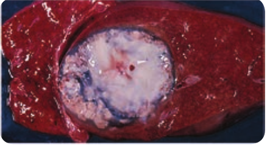
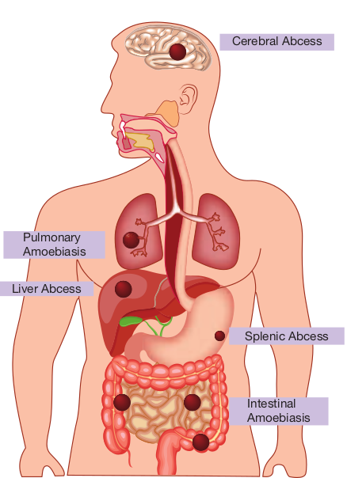
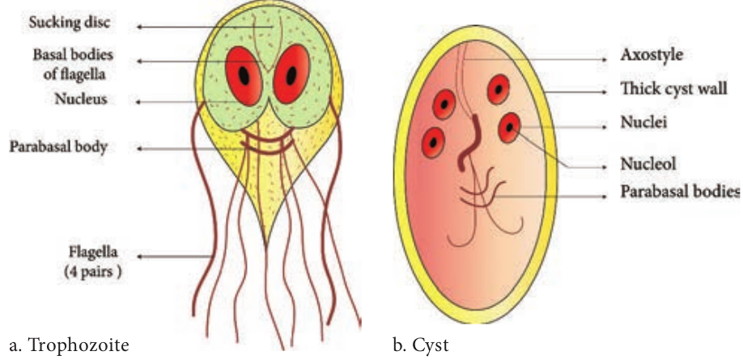
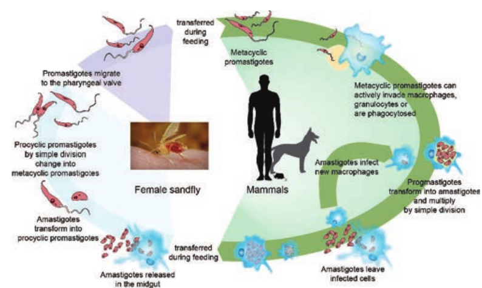
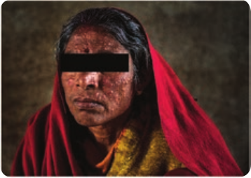
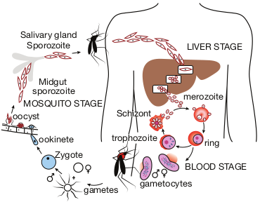
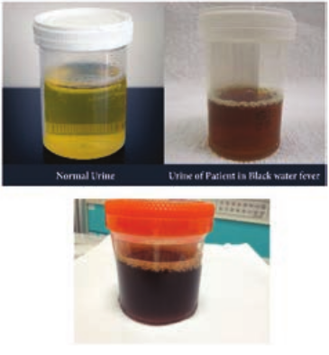
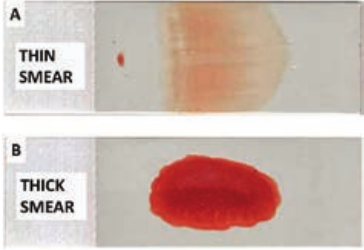

  

**Medica**

**Chapter**

**8**

After studying this chapter the students will be able to,

_- Know the various types of parasites and hosts._

_- Discuss the classification of medically important parasites._

_- Discuss the pathogenesis and clinical aspects of parasitic infections._

_- Describe the general epidemiological aspects and transmission patterns of diseases caused by protozoa and helminths._

_- Identify the methods and procedures of laboratory diagnosis of pathogenic protozoans and helminths in clinical specimens._

_- Know the treatment options for parasitic infections._

_- Implement the preventive and control measures of protozoans and helminthic infections._

**Learning Objectives**

**Chapter Outline**

**8.1** Parasite and Host

**8.2** _Entamoeba histolytica_

**8.3** _Giardia lamblia_

**8.4** _Leishmania donovani_  

**l Parasitology**

**8.5** _Plasmodium falciparum_ and _P. vivax_

**8.6** _Ascaris lumbricoides_

Medical Parasitology is the branch of Medical Science that deals with the study of parasites living in or on the body of human, their geographical

distribution, the diseases caused by them, clinical features and the response generated by human against them. It is also concerned with various methods of their diagnosis, treatment, prevention and their control. Parasitology is a dynamic field, as these parasites constantly change their morphology, hosts, and host relationships. For this reason, Parasitology is an active field of study, which has raised expectations for the development of new drugs, vaccines and other control measures through biotechnology. However, these expectations are reduced by the inherent complexity of parasite and their relationship with host, the firm establishment of parasite and vectors in their environments and the vast socio economic problems in the geographical areas where parasites are most prevalent.

Before learning in detail about a few medically important parasites of human, let us know what is a parasite?

  

## Parasite and Host

Parasites are living organisms, which depend on living host for their nourishment and survival. They multiply or undergo development in the host. Host is defined as an organism, which harbors the parasite, provides nourishment and gives shelter to parasite. Host is relatively larger than the parasite.

### Association between Host and Parasite

The relationship between host and the parasite can be of the following types:

Ԃ Symbiosis Ԃ Commensalism, and Ԃ Parasitism.

Flowchart 8.1 describes the types of host – parasite relationship

### Types and Classification of Parasite

According to the nature of the host- parasite interaction and the environmental factors, the parasite may be one of the following,

**Ectoparasite:** These parasites live on the outer surface or in the superficial

**Host – Parasite r**

Symbiosis/mutualis. 
- Both the host

and parasite are dependent upon each other.

- None of them are harmed.

Commensalis. 
- Only the paras

benefit from th without causin infection to the

- It is capable of independently.

**Flowchart 8.1:** The types of h  

tissues of the host (Example: Lice). The infection by these parasites is called **infestation**.

**Endoparasite:** The parasite which lives within the host is called Endoparasite. Invasion by the parasite is called **Infection**. Most of the protozoan and helminthic parasites causing human diseases are endoparasites.

Endoparasites can be further classified as:

- **Obligate parasite:** This parasite is completely dependent on its host and cannot survive without it. Example: _Hookworms_.

- **Facultative parasite:** This parasite may either live as free living form or as a parasite when the opportunity arises. Example: _Naegleria fowleri_.

- **Opportunistic parasite:** This parasite is capable of producing disease in an immune deficient host (like AIDS and cancer patients). Example: _Toxoplasma gondii_.

- **Zoonotic Parasite:** This parasite primarily infects animals and is

**elationship**

ite derives e association g any host.

living

Parasitis. 
- Always harm the

host due to their association.

- The parasite cannot live an independent life.

ost – parasite relationship

| Hos t – P ar as ite r el ati ons hi p |
|------|------|------|

  

transmittable to humans. Example: Fasciola species.

- **Accidental parasite:** This parasite infect an unusual host are known as accidental parasites. Example: _Echinococcus granulosus_ infects man accidentally.

- **Wandering or Aberrant parasites:** Parasites which infect a host migrate to the site where it cannot live or develop further are called aberrant parasites. Example: Dog roundworm infecting humans.

### Types of Host

**Definite host:** The host which harbour the adult parasites or in which parasites undergo sexual method of reproduction is referred to as a definite host. The definite host may be a human or any other living organism. Example: Mosquito acts as a definite host for _Plasmodium_ spp. in Malaria.

**Intermediate host:** The host in which the larval stages of the parasite live or in which asexual reproduction of parasite takes place is called the intermediate host. Example: Man acts as an intermediate host for _Plasmodium_ spp. in Malaria.

**Reservoir host:** The host which harbour the parasite and acts has an important source of infection to other susceptible hosts is known as reservoir host. It is also called temporary host. Example: Dog is the reservoir host for disease kala azar.

**Natural host:** The host which is naturally infected with a certain species of parasite, is called natural host. Example: Pig is the natural host of _Balantidium coli_.

**Paratenic host or transport host:** some parasites enter a host in which they do not undergo any development  

but remains alive till they gain entry into the definitive host or intermediate host. Such a host is termed as paratenic host or transport host or carrier host.

### Classification of Medical Parasitology

The most acceptable taxonomic classification of human parasites includes Endoparasites and Ectoparasite. Endoparasites are subclassified into protozoan parasite (unicellular organisms) and helminthic parasite (multicellular

Common name of medically important parasite Intestinal flagellates –

_Giardia intestinalis_ Oral Flagellates – _Trichomonas tenax_ Genital flagellates – _Trichomonas vaginalis_ Blood and Tissue flagellates – _Leishmania and Trypanosoma_ Ciliated protozoa – _Balantidium coli_ Dog roundworm – _Toxocara canis_ Cat roundworm – _Toxocara cati_ Roundworm – _Ascaris lumbricoides_ Hookworm – _Ancylostoma duodenale_ Liver fluke – _Fasciola hepatica_ Blood fluke – _Schistosoma haematobium_ Lung fluke – _Paragonimus westermani_ Pork tapeworm – _Taenia solium_ Beef tapeworm – _Taenia saginata_ Eyeworm – _Thelazia spp_ Threadworm or Human pinworm – _Enterobius vermicularis_ Human whipworm – _Trichuris trichiura_

  

organism). Parasites of medical Importance come under the Kingdom called Protista and Animalia. Protista includes the microscopic single- celled eukaryotes known as protozoa. In contrast, helminths are microscopic, multicellular worms possessing well differentiated tissues and complex organs belonging to the kingdom Animalia. Classification of medically important parasites is given in Flowchart 8.2.

### Life Cycle of Parasites

**Direct life cycle** The life cycle of parasite that requires only single host to complete its development, is called direct life cycle. Example: _Entamoeba histolytica_ requires only human host to complete its life cycle.

**Indirect life cycle** The life cycle of parasite that requires two or more species of hosts to complete its development, the life cycle is called as indirect life cycle. Example: Malarial parasite (Plasmodium spp.) requires both human host and mosquito to complete its life cycle.

### Transmission of Parasites

It depends upon Source or reservoir of infection, and mode of transmission.

**1\. Sources of infection** A. Human: Human is the source or

reservoir for a majority of parasitic infection. The condition in which the infection is transmitted from one infected human to another human is called **anthroponoses**.

B. Animals: Animals act as the source of infection in many parasitic diseases.  

The condition where infection is transmitted from animals to humans is called **zoonoses**.

**2\. Mode of transmission** A. Oral transmission: This is through

ingestion of contaminated food, water, vegetables, soiled fingers or fomites contaminated by faeces that contain the infective stage of parasite. This mode of transmission is referred to as faecal-oral route. Example: Cysts of _Entamoeba histolytica_.

B. Skin transmission: This is another important route. The infective larvae of hookworm enter the skin of persons walking bare footed on contaminated soil.

C. Vector transmission: It could be a biological or a mechanical means. Many parasitic diseases are transmitted by insect bite. Example: sandfly is vector for _Leishmania_.

D. Direct transmission by person to person contact. Frequently, _Entamoeba, Giardia_ and _Trichomonas_ are transmitted by sexual contact among homosexuals.

E. Vertical transmission: It is the transmission from mother to fetus. Example: Toxoplasmosis.

So far, we have learnt about the general introduction and classification of parasites. Now, let us learn a few important human parasites in detail.

**Introduction to Protozoa**

General characteristics of protozoa: 1. They are microscopic unicellular

eukaryotes. 2. The single cell has a relatively complex

internal structure and it performs

  

**Flowchart 8.2:** Classification of m

Medical Para

**Protozoa** (Protozoology) Kingdom – Protista (Unicellular)

**Amoebae** (Typically amoeboid and use pseudopodia or protoplasmic flow to move) _Entamoeba histolytica_

**Nematodes** (round worms) They are elongated and tapered at both ends, round in cross section and unsegmented. 
- _Wuchereria bancrofti. 
- _Ascaris_ sp

**Cestodes** (ta have a ribbo chain of segm (proglottids) _Taenia solium T. saginata_

**Flagellates** (have one or more whiplike flagella) Intestinal and genitourinary normal flagellate. 
- _Giardia. 
- _Trichomonas. 
- Blood

and tissue flagellates

- _Leishmania. 
- _Trypanosoma_

**Spo** (un com with sexu repr pha _Plas Tox_  

edically important parasites

sitology

pe worms) n like

ents

**Trematodes** (Flukes) Typically flattened and leaf shaped with 2 muscular sucker They lack cuticle. They are hermaphrodites Fasciola (Liver fluke) Schistosoma(blood fluke)

**rozoa** dergo a plex life cycle alternating al and asexual oductive ses) _modium oplama_

**Ciliates** (Complex protozoa **bearing cilia**) _Balantidum coli_

**Helminthes** (Helminthology) Kingdom – Animalia (Multicellular)

**Platyhelminths** (flatworms)

| o a  (P rotozo olog y) Helmin thes  (H elmin t holog y)rot ist a (U nice l lu l ar) Kin gdo m – A nim a li a (M u lt ice l lu l ar)F l age l l ates Sp or o z o a(h ave o ne o r m ore (un der go aw hi pli ke f l agel l a) co mplex lif e c yclea Intes t in a l a nd w it h a lter nat in ggeni tour in ar y s exu a l a nd a s exu a lno r ma l  f l agel l ate s re pro du c t ivephas e s )- Gi ardi aPla smodium- Tr icho mo na sTox oplama- Bl oodand  t issu ef la gel la te s- L e i shmani a- Tr y pano s oma |
|------|------|------|
| C i li ates(Complex protozoa bearing cilia)B alantidum  c oli |

| Pl aty he lmin ths  ( f l at wo r ms ) |
|------|------|------|

  

**Parasites having direct life cycle Protozoa*. 
- _Giardia lamblia. 
- _Trichomonas vaginalis. 
- _Balantidium coli_

**Hel*. 
- - •

**Parasites having indirect life cycle S.No Protozoa Definite host**

1\. _Plasmodium spp._ Female _Anopheles_ m 2. _Toxoplasma gondii_ Cat 3. Cestodes

_Taenia solium_ Man

4\. Trematodes _Fasciola hepatica_

Man

5\. Nematodes _Wuchereria bancrofti_

Man

**Infobi**

various complex metabolic activities such as digestion, reproduction, respiration and excretion.

3\. Each cell consists of nucleus and cytoplasm.

4\. A protozoa parasite during its life cycle may exist in two stages such as trophozoite and cyst.

**Amoebae** Amoebae are structurally simple protozoans which have no fixed shape. The cytoplasm of amoeba is bounded by a membrane and can be differentiated into an outer ectoplasm and inner endoplasm. Pseudopodia (false foot) are formed by the amoebae by throwing out ectoplasm followed by endoplasm. These are employed for locomotion and engulfment of food by phagocytosis.

Reproduction occurs by fission and budding. Amoebae are classified as either free living or intestinal amoebae.  

**minths** _Ascaris lumbricoides Trichuris trichiura Ancyclostoma duodenale_

**Intermediate host** osquito Man

Man Pig

Snail

Mosquito

**ts**

_Naegleria fowleri_ (Brain eating amoeba) is a thermophilic, free living amoebae occasionally act as human pathogens producing meningoencephalitis known as primary amoebic meningoencephali- tis (PAM). Infections most often occur when water containing _Naegleria fowl- eri_ is inhaled through the nose, where it then enters the nasal and olfactory nerve tissue traveling to the brain. _N. fowleri_ occurs in three forms -as a cyst, tropho- zoite (amoeboid) and a biflagellate (it has two flagella). The flagella form can exist in the cerebrospinal fluid.

**Infobits**

| Pr oto z o a- Gia rdia  la mblia- Tr icho mo na s  v ag ina li s- B alantidium  c oli |Helmin ths- As car i s  l umbr icoi des- Tr ichur i s  t r ichiura- Anc yc lo stoma  d uode nale |

| S.No |Protozoa |Denite host |Intermediate host |
|------|------|------|------|
| 1. |Plasmodium spp. |Female Anopheles mosquito |Man |
| 2. |Toxoplasma gondii |Cat |Man |
| 3. |CestodesTaenia solium |Man |Pig |
| 4. |TrematodesFasciola hepatica |Man |Snail |
| 5. |NematodesWuchereria bancroi |Man |Mosquito |
  

## Intestinal Amoeba – _Entamoeba histolytica_

### Geographical Distribution

It is Worldwide in distribution they are more common in the tropics than elsewhere. It is found wherever sanitation is poor.

### Habitat

Trophozoites of _E.histolytica_ live in the mucous and submucous layers of the large intestine of human.

### Morphology

_E.histolytica_ occurs in 3 forms as Trophozoite, Precyst and Cyst.

**Trophozoite:** It is the growing or feeding stage of the parasite. It is the only form present in tissues. It has no fixed shape. They vary in size from 18 to 40µ, average being 20 to 30µ. The cytoplasm is usually described as outer ectoplasm and inner endoplasm (Figure 8.1). The endoplasm contains nucleus, food vacuoles, erythrocytes, occasionally leucocytes and tissue debris. The nucleus is characterised by evenly arranged chromatin on the nuclear membrane and the presence of a small, compact, centrally located karoyosome (It is a DNA containing body, situated peripherally or centrally within the nucleus). Trophozoites exhibits active crawling or gliding motility by forming finger-like projections called Pseudopodia.

The trophozoite reproduce by binary fission in every 8 hours. Trophozoites survives upto 5 hours at 37°C and are killed by heat, drying and chemical sterilization. Even if live trophozoites from freshly  

passed stools are ingested, they are rapidly destroyed in stomach and cannot initiate infection. Therefore, the infections is not usually transmitted by trophozoites.

**Precyst** Trophozoites undergo encystment in the intestinal lumen. Encystment does not occur in the tissue or in feces outside the body. Precyst is smaller in size about 10 -20 µm in size. It is round or oval in shape. The endoplasm is free of red blood cells and other ingested food particles (Figure 8.1). The nuclear structure retains the characteristics of the trophozoite.

**Cyst** Precyst secretes a highly refractive cyst wall around it and becomes a cyst. A mature cyst is a quadrinucleate spherical body. The cyst begins as a uninucleate body but soon divides by binary fission and develops into binucleate and quadrinucleate bodies (Figure 8.1). The cytoplasm of the cyst is clear and hyaline (translucent) and the nuclear structure retain the characteristic of the trophozoites.

The mature quadrinucleate cyst, passed in the stool, does not undergo any further development and remain alive for several months in the soil or in environment where they were deposited. The mature quadrinucleate cysts are the infective forms of the parasite.

### Life – Cycle of Entamoeba histolytica

_E. histolytica_ passes its life cycle only in one host, the human. **Infective form:** Mature quadrinucleate cyst. **Mode of transmission:** Ingestion of food and water contaminated with cyst.

  

- The cysts that are swallowed along with food and water enter into the alimentary canal. The cyst wall is resistant to action of gastric juice. The cysts pass through the stomach undamaged and enters the small intestine (Figure 8.2).

- When the cyst reaches caecum or lower part of the ileum, due to alkaline

The amoeba infecting man may be classified according to their pathogenicity and

habitat. **A. Pathogenic** Intestinal Amoeba: _Entamoeba histolytica_ **B. Non pathogenic** 1\. Mouth Amoeba: _Entamoeba gingivitis_ 2\. Intestinal Amoeba: _Entamoeba coli_ _Entamoeba nana_  

medium, the cyst wall is damaged by trypsin leading to excystation.

- The cytoplasm gets detached from the cyst wall and an amoeboid movement appear causing a tear in the cyst wall, through which quadrinucleate amoeba is liberated. This stage is called the metacyst.

- The nuclei in the metacyst immediately undergo division to form 8 nuclei, each of which gets surrounded by its own cytoplasm to become 8 small amoebulae or metacystic trophozoites.

- These metacystic trophozoites are carried to the caecum and colon. They invade the tissues and lodge in the submucous tissue of the large intestine which is their normal habitat.

- Trophozoite grow and multiply by binary fission. The trophozoite phase of the parasite is responsible for producing the characteristic lesion of amoebiasis.

d cyst of _Entamoeba histolytica_

  

- Some of the trophozoites in colon develop into precystic forms and cysts, which are passed in feces to repeat the cycle.

### Pathogenesis

_E. histolytica_ causes intestinal and extra intestinal amoebiasis (Flowchart 8.3).

_E. histolytica_ can live in the intestine without causing symptoms. But, they can also cause severe disease. These amoebas may invade the wall of the intestine leading to amoebic dysentery, an illness that causes intestinal ulcers, bleeding, increased mucus production and diarrhoea. The ulcers are strictly confined to the large intestine being most numerous in the caecum and next in the sigmoid-rectal regions. The lesions may be generalized or localised. A typical amoebic ulcer varies from pin’s head to one inch or more in diameter in size. The shape of ulcer may be round or oval. On vertical

section, the ulcer appears like flask, with mouth and neck being narrow and base being large and rounded (Figure 8.3 shows the flask – shaped ulcer). The base of ulcer is generally formed by the muscular coat and filled up by the necrotic material. The ulcers generally do not extend deeper than submucosal layer.

### Clinical Features

Incubation period is highly variable, but is generally 4 to 5 days.

A wide spectrum, from asymptomatic infection (luminal amoebiasis), to invasive intestinal amoebiasis (dysentery, colitis, appendicitis, toxic mega colon, amoebomas), to invasive extraintestinal amoebiasis occurs. Flowchart 8.4 classifies the clinical outcomes of infection with _Entamoeba histolytica_. Only about 10% to 20% of people who are infected with _E. histolytica_ become sick from the infection.

_ntamoeba histolytica_

  

**Infection of _E._**

**Intestinal amoebiasis** Infection is limited entirely to the large intestine, the initial site of infection of the parasite.

**Flowchart 8.3:** Infection C

Symptomatic

Infected host

Asymptomatic

**Flowchart 8.4:** The clinical outcomes of

Superficial Ulcer

Deep Ulcer Per  

**_histolytica_**

**Extra intestinal amoebiasis** The trophozoites migrate and produce lesions in Liver – Hepatic Amoebiasis Lungs – Pulmonary Amoebiasis Brain – Cerebral Amoebiasis Spleen – Splenic Abscess

aused by E._histolytica_

Intestinal

Extra intestinal

Carrier

infection with _Entamoeba histolytica_

testinal amoebiasis

foration

Invasion of Blood Vessel

Mucosa

| E xt r a in tes tina l aTh e t rophozo ites migpro duce lesio ns inL iver – H ep at ic ALun gs – Pu lm onaBra in – C er ebra l ASple en – S plenic A |
|------|------|------|------|
| Intes tina l a mo e bi as isInf e c t io n i s limi te d en t ir ely t o t hel arge in tes t in e, t he ini t i a l si te o finf e c t io n o f t he p ara si te. |mo e bi as isra te a ndmo ebi asi sr y A mo ebi asi smo ebi asi sbs ces s |

| Sy mptomat i c |Intes t in a l |
|------|------|------|------|------|------|------|

| Inf e c te d h os t |E xt ra in tes t in a l |

| C ar r ier |
| As y mptomat i c |

  

The typical manifestation of intestinal amoebiasis is amoebic dysentery. The symptoms are often quite mild and can include loose feaces, stomach pain and stomach cramping. In acute amoebic dysentery, the symptoms include abdominal pain, bloody stool, fever, tenderness, rectal tenesmus and hepatomegaly (enlargement of liver). People affected may develop anemia due to loss of blood. On clinical and laboratory ground, amoebic dysentery should be differentiated from bacillary dysentery. A Table 8.1 shows the difference between the stools of amoebic and bacillary dysentery.

**Extra intestinal amoebiasis** 1\. **Hepatic amoebiasis:** This is the most

common form of extra intestinal invasive amoebiasis. Liver abscess may be multiple or more often solitary, usually located in the upper right lobe of the liver (Figure 8.4). Amoebic liver

**Amoebic dyse Macroscopic observation** Number 6–8 Amount Relatively large Odour Offensive Colour Dark red Nature Blood and mucus m

faeces **Microscopic observation** RBC In clumps, reddish

in colour Pus cells Scanty Parasite Trophozoites of _E._ Charcot – Leyden crystals Present

**Table 8.1:** Difference between the stools of am  

abscess (ALA) contains an odour less and thick chocolate brown pus called anchovy sauce pus. ALA is associated with an abrupt onset of high fever, right upper abdominal pain and tenderness. Anorexia (loss of appetite for food), nausea (the sensation to vomit), vomiting, fatigue (extreme tiredness) and weight loss are also frequent.

2\. **Pulmonary Amoebiasis:** It is very rare, but this may occur by direct hematogenous spread from the colon. The patient presents with severe chest

**ntery Bacillary Dysentery**

Over 10 motions a day Small Odorless Bright red

ixed with Blood and mucus no faeces

– yellow RBC in rouleaux, bright red in colour Numerous

_histolytica_ Nil Nil

oebic and bacillary dysentery

| Amo e bi c dy s enter y |Baci l l ar y D ys enter y |
|------|------|------|
| Macr os c opi c o bs er va ti on |
| Num b er |6–8 |O ver 10 m ot io ns a d ay |
| Amou nt |R el at ive ly  l arge |Small |
| O do ur |Of fen si ve |O do rles s |
| C olo ur |D ark  re d |Br ig ht r e d |
| Natu re |Blo o d a nd m uc us mix e d w it hfae ces |Blo o d a nd m uc us n o fae ces |
| Mi cr os c opi c o bs er va ti on |
| RB C |In c lum ps, r e ddi sh – y el lo win co lo ur |RB C in r ou le aux, b r ig ht r e din co lo ur |
| Pu s ce l ls |S ca nty |Num er ous |
| Para si te |Trophozo ites o f  E .  h i stol y tica |Ni l |
| C harco t – L e yden cr ys t a ls |Pres en t |Ni l |
  

pain and have dyspnoea (shortness of breath). The sputum of patient is chocolate brown. Amoebic trophozoites may be demonstrated in the sputum.

3\. **Cerebral amoebiasis:** The condition is unusual. In cerebral amoebiasis, the abscess is single, small and is located in the cerebral hemisphere. The patient may die of rupture or involvement of cerebellam within 12–72 hours. Biopsy of the brain shows the amoebic trophozoites.

4\. **Cutaneous amoebiasis:** It can be caused by perforation of an amoebic abscess or surgical wound infected with amoebae. It is less frequent condition.

5\. **Genitourinary Amoebiasis:** This condition includes amoebiasis of the kidney and genital organs. Amoebiasis of the genital organs is a rare condition. Lesions of amoebiasis is shown in Figure 8.5.

### Laboratory Diagnosis

**Specimens:** Stool is the specimen of choice. Other specimens collected includes blood, rectal exudates and rectal ulcer tissue collected from the base by endoscopies.

**Methods in examination of stool** A. Direct wet mount examination of

stool: Demonstration of mature quadrinucleate cysts or trophozites in stool is diagnostic of intestinal amoebiasis. The wet mount of stool is prepared in the saline, iodine or lacto phenol cotton blue.

B. Examination of stool after concentration: Demonstration of  

amoebic cysts by Formalin – ether is the method of choice.

C. Examination of stained stool smears: Staining by iron haematoxylin, Periodic Acid – Schiff (PAS) stains demonstrate the presence of both trophozoites and cyst. Amoebic liver abscess (ALA):

Demonstration of amoebic trophozoites in the aspirated liver pus establishes the diagnosis of ALA.

**Serology:** Detection of amoebic antigens in the serum by Enzyme Linked Immunosorbent Assay (ELISA).

**Molecular diagnosis:** PCR (Polymerase chain reaction) is employed to detect amoebic genome in the aspirated liver pus for the diagnosis of ALA.

**Imaging methods:** X – Ray magnetic resonance imaging (MRI) scan and computerized Axial Tomography (CAT) Scan are the imaging methods used.

Liver Abcess

Pulmonary Amoebiasis

Splenic Abcess

Cerebral Abcess

Intestinal Amoebiasis

  

**Treatment:** Eradication of amoebae by the use of amoebicidal drugs and replacement of fluid and electrolyte is the treatment for amoebiasis. Listed below the drugs used in the treatment for amoebiasis.

- Paramomycin and iodoquinol acts in the intestinal lumen but not in tissues.

- Emetine, chloroquine are effective in systemic infection. They act only on trophozoites.

Metronidazole is the drug of choice which acts as both luminal and tissue amoebicides. It is low in toxicity and is effective against intestinal as well as extra -intestinal amoebic infections.

### Prevention and Control

- Proper sanitation is the key to avoid amoebiasis. Washing hands with soap and water after using the bathrooms and before handling food.

- Drinking safe and boiled water.

- Avoid eating unwashed fruits and vegetables.

- Prevention of water supplies from faecal contamination.

- Early rapid detection of diseased people and subsequent treatment with amoebicidal drugs. No vaccine is available yet against amoebiasis in humans.

## Intestinal Flagellates – _Giardia Lamblia_

(Also known as _Giardia duodenalis, Giardia intestinalis_)  

### Geographical Distribution

It is the most common protozoan pathogen and is worldwide in distribution. The disease is very high in areas with low sanitation, especially tropics and subtropics.

### Habitat

_Giardia lamblia_ lives in the duodenum and upper jejunum of human. It is the only protozoan parasite found in the lumen of the human small intestine.

### Morphology

It exists in two form. 
- Trophozoite an. 
- Cyst

Antoine van Leeuwenhoek observed and illustrated _Giardia lamblia_ in his own

loose stool. This was the first protozoan parasite of human that is recorded and the first to be seen under a microscope.

**Trophozoite** The trophozoite is in the shape of a tennis or badminton racket. It is rounded anteriorly and pointed posteriorly. The size of the trophozoite is 14 µ long by 7µ broad. Dorsally, it is convex and ventrally, it has a concave sucking disc which helps in its attachment to the intestinal mucosa. It is bilaterally symmetrical. All the organs of the body are paired. Trophozoite of Giardia possess,

- 1 pair of nucle. 
- 4 pairs of flagell. 
- Parabasal body (Blepharoplast), from

which the flagella arise (4 pairs)

  

- 1 pair of axostyles, running along the midline

- Two sausage – shaped parabasal or median bodies lying transversely posterior to the sucking disc

- The trophozoite is motile, with a slow oscillation about its long axis, often resembling falling leaf (Figure 8.6a).

**Cyst** It is the infective form of the parasite. The cyst is small and oval, measuring 12 µm × 8 µm and is surrounded by a hyaline cyst wall.

Its internal structure includes 2 pairs of nuclei grouped at one end. A young cyst contains 1 pair of nuclei. The axostyle lies diagnonally, forming a dividing line within cyst wall (Figure 8.6b).

### Life Cycle: Giardia Life Cycle in Host (Human)

**Infective form: Mature cyst** Mode of transmission: Human acquires infection by ingestion of cyst in contaminated water and food. Direct

a. Trophozoite b  

person – to person transmission occurs in children. Transmission occurs through oral-anal and oral-genital route in sexually active homosexual males. Within half an hour of ingestion, the cyst hatches out into two trophozoites, which multiply by binary fission and colonize in the duodenum. The trophozoites live in the duodenum and upper part of jejunum, feeding by pinocytosis. When conditions in duodenum are unfavourable, encystment occurs, usually in large intestine. Cysts are passed in stool and remain viable in soil and water for several weeks (Figure 8.7).

### Pathogenicity

_Giardia lamblia_ does not invade the tissue, but remains attached to intestinal epithelium by means of the sucking disc. It causes a disturbance of intestinal function leading to malabsorption of fat.

### Clinical Manifestations

Incubation period is variable, but is usually about 2 weeks.

and cyst of _Giardia_

. Cyst

  

The disease is asymptomatic, but in some cases it may lead to abdominal cramps, flatulence, looseness of bowels, foul smelling stool and mild steatorrhoea (passage of yellowish and greasy stools in which there is excess of fat). The stool contains excess mucus and fat but no blood and pus. Children may develop chronic diarrhoea, malaise (discomfort), nausea, anorexia (loss of appetite for food), malabsorption of fat, vitamin A and protein. Occasionally, Giardia may colonize the gall bladder causing biliary colic and jaundice.

### Laboratory Diagnosis

**Specimens: Stool and blood** Examination of stool sample: Giardiasis can be diagnosed by identification of cysts of _Giardia lamblia_ in the formed stools and the trophozoites and cyst of the parasite in diarrhoeal stools. **Macroscopic examination of stool:** Fecal specimens containing _Giardia lamblia_ may have an offensive odor. It is pale coloured with fatty substance floating in water. **Microscopic examination of stool:** Cysts and trophozoites can be found in

of _Giardia lamblia_

  

diarrheal stools by saline and iodine wet preparations (Figure 8.8). **Serodiagnosis:** Immuno chromatographic strip tests and indirect immunofluorescence (IIF) tests are readily available. For antigen and antigen detection ELISA, Commercially available ELISA kits detects Giardia – Specific antigen. **Molecular methods:** DNA probes and polymerase chain reaction (PCR) have been used to demonstrate parasitic genome in the stool specimen.

### Treatment

Metronidazole and Tinidazole are the drugs of choice.

### Prevention and Control

Giardiasis can be prevented and controlled by. 
- Proper disposal of human faeces,

maintenance of food and personal hygiene and health education.

- After using the bathroom and before eating, the hands should be washed thoroughly with soap and warm water. Boiling of water is the best and effective method in killing the viable cysts.

- To reduce the risk of venereal transmission, patients should avoid risky sexual behavior.

- No vaccine or effective chemo prophylactic drug is available for prevention of Giardiasis.

## Tissue Flagellates – _Leishmania donovani_

The genus is named after the scientist Leishman, who first described the parasite in London in May 1903.  

### Geographical Distribution

Leishmania species is found in the Mediterranean, the Middle East, Africa and Asia including India.

### Habitat

_Leishmania donovani_ is an obligate intracellular parasite of human and other mammalian hosts. They are always found as intracellular amastigotes in the reticuloendothelial cells of the spleen, bone marrow, liver, intestinal mucosa and mesenteric lymph nodes of hosts.

### Morphology

The parasite exists in two forms: **Amastigote:** It is the form found in human and other mammalian hosts. They are found inside monocytes, polymorphonuclear leucocytes or endothelial cells. They are small, round to oval bodies measuring 2–3µm in length (Figure 8.8). They are also known as LD (Leishman donovan) bodies.

  

**Promastigote:** These forms are found in the mid-gut of sand fly and in the culture media. The fully developed promastigotes are long, slender and spindle – shaped. They measure 15µm to 25µm in length and 1.5µm to 3.5µm in breadth. A single nucleus is situated at the centre. The kinetoplast lies near the anterior end. The flagellum is single, delicate and measures 15µm–28µm (Figure 8.8).

There are 3 main forms of Leishmaniases – Visceral (also known as Kala-agar and the most serious form of the disease), cutaneous (the most common) and mucocutaneous. The disease affects some of the poorest people on earth, and is associated with malnutrition, population displacement, poor housing, a weak immune system and lack of financial resources. Leishmaniasis is linked to environmental changes such as deforestation, building of dams, irrigation schemes, and urbanization.

PKDL occurs in all areas endemic for L.donovani but is commonest in East Africa and on the Indian subcontinent, where up to 50% and 10% of patients with kala-azar, respectively develop the condition. The frequency is reported to be declining in India. **Cutaneous Leishmaniasis** The clinical spectrum of cutaneous leishmaniasis ( oriental sore) is broad and may mimic that of other skin conditions, such as staphyloccal or streptococcal infection, mycobacterial ulcer, leprosy, fungal infection, cancer, sarcoidosis and tropical ulcer.

**Infobits**  

### Life – Cycle of Leishmania donovani

_Leishmania donovani_ completes its life cycle in two different hosts. The complete life cycle is given in Figure 8.9.

**Host Forms** Human and other mammals (Example: Dogs)

Amastigote

Sandfly of Genus _Phlebotomus_

Promastigote

**Development in Human** The parasite is transmitted to human and other vertebrate hosts by the bite of blood sucking female sandfly. During the blood meal, the sandfly deposists promastigotes on surface of the skin. These promastigotes are immediately phagocytosed by fixed macrophages of the host, in which they are transformed into amastigotes. The amastigotes multiply by binary fission within the macrophages. As many as 50 to 200 amastigotes may be present inside the enlarged cell. These are called LD bodies. The rupture of cell releases amastigotes in large numbers which inturn are free to infect other cells. Free amastigotes are subsequently carried by circulation. These forms invade monocytes of the blood and macrophages of the spleen, liver, bone marrow, lymph nodes and other tissues of the reticuloendothelial cells.

**Development in sandfly** Female sandfly during a blood meal ingest free, as well as intracellular amastigotes in the blood. In the mid gut of the sandfly, the amastigotes are transformed within 72 hours to flagellated promastigotes.

| Ho st |Forms |
|------|------|
| Hum an a nd o t herma m ma ls(E xa mple: D ogs) |Amas t i gote |
| Sa ndf ly  of G en usPhlebotom u s |Promas t i gote |
  

These promastigotes multiply by binary fission. After a period of 6 to 9 days, these forms migrate from the midgut to the pharynx and buccal cavity of sandfly. Bite of the infected sandfly transmits infection to susceptible persons and the life – cycle is repeated.

### Pathogenesis

_Leishmania donovani_ causes visceral Leishmaniasis. The disease is also known as Dum – Dum fever, Asian fever, Assam fever, or infantile splenomegaly. Leishmaniasis is a disease of the reticuloendothelial system. Proliferation and destruction of reticuloendothelial cells of the internal organs are responsible for the pathological changes in visceral leishmaniasis.

Spleen, liver and lymphnodes are enlarged in this condition. Bone marrow is dark red in colour and shows extensive

proliferation of reticuloendothelial cells. Kidney shows cloudy swelling and is invaded by macrophages parasitized by amastigotes.

### Clinical Features

Incubation period: It is usually 3–6 months but can be months or years.

Visceral Leishmaniasis is a serious and fatal systemic disease. In India, the disease is called Kala – azar meaning “black disease”.

The disease is characterized by the presence of fever, hepatosplenomegaly (Figure 8.10) (the simultaneous enlargement of both liver and the spleen), hypergammaglobulinemia (a condition in which increased levels of a certain immunoglobulin in blood serum), Leucopenia, Thrombocytopenia (deficiency of platelets in the blood), Cachexia (a condition that causes extreme weight loss)

_eishmania donovani_

  

with marked anemia, emaciation and loss of weight. Epistaxis (bleeding from nose) and bleeding from gums are common. In Indian patients, the skin on the hands, feet, abdomen, around the mouth and fore – head becomes grayish and dark coloured. This hypo – pigmentation of the skin is unique in Indian patients giving the disease name Kala – azar.

Post kala – azar dermal leishmaniasis (PKDL): It is a non – ulcerative lesion of the skin, which is seen after completion of treatment of the kala – azar. This condition is characterized by multiple, hypopigmented, erythematous macules involving the face and trunk (Figure 8.11). In Indian forms, PKDL appears after a latent period of 2 years and may even persist as long as 20years, creating a persistent human reservoir of infection.

**Laboratory diagnosis Specimens:** Aspiration from spleen, bone marrow, lymph node, liver biopsy and peripheral blood.  

**Methods of examination:** This includes, microscopy and culture

**1\. Direct microscopy** The amastigotes of _Leishmania donovani_ (known as LD bodies) can be demonstrated in the smears of spleen, bone marrow, liver, lymph node and peripheral blood stained in Leishman, Giemsa or wright stains. Splenic aspiration is the most sensitive method to detect LD bodies. Examination of peripheral blood smear and buffy coat smear is more commonly used to find LD bodies in the circulating monocytes.

**2\. Culture** Promastigotes are found in the culture media. Tissue samples and aspirates are inoculated in the NNN (Novy–MacNeal–Nicolle) medium for demonstration of promastigotes.

Laboratory diagnosis of kala – azar is briefly discussed in Flowchart 8.5.

**Treatment:** Pentavalent antimonials are the drugs of choice. Pentamidine, Amphotericin B and Miltefosine (oral drug) are recommended.

  

D ir

ec t e

vi de

nc e

M ol

ec ul

ar d

ia gn

os is

N on

– sp

ec ifi

c Sk

in te

st Bl

oo d

pi ct

ur e

D em

on st

ra tio

n of

L D

b od

ie s

C ul

tu re

(N N

N )

A ni

m al

in

oc ul

at io

n in

ha

m st

er o

r m ic

e

In di

re ct

e vi

de nc

e

**La bo**

**ra to**

**ry d**

**ia gn**

**os is**

**o f k**

**al a**

**– az**

**ar**  

**Fl ow**

**ch ar**

**t 8 .5**

**:** La

bo ra

to ry

d ia

gn os

is o

f k al

a- az

ar

Se ro

di ag

no si

s •

D N

A p

ro be

- PC

R

D et

ec tio

n of

a nt

ig en

•

EL IS

A

D et

ec tio

n of

a nt

ib od

y •

C FT

se ru

m te

st •

A ld

eh yd

e te

st •

C ho

pr a’s

an

tim on

y te

st

Le is

hm an

in sk

in

te st

A ne

m ia

Pr og

re ss

iv e

le uc

op en

ia

| ceidenvt ecedirnI |eurt ev aic a si enid p res ploo nemi rogB A P leuco |
|------|------|------|------|------|------|------|------|------|------|------|------|------|------|------|------|------|------|------|

| inkt anin seskin t eishm stS L te |

| rla – azaaf kis onosagy dirtoarobaL |

| t tes esicy tpecif est de thy ’spra nolde ho ntimn – s um t A C ao erN . 
- - |

| ydotibnf an oiotce CFTet. 
- |

| l n inmaiAn iotulac r miceter oso min ah |

| sosing ea brolar di  puc NAle D PCRo. 
- - |

| e (NNN)urltuC |

| ceidenvt eceDir |

| entignf an otioce ELISAet. 
- |

| sosingadioerS |
| ntiotras diesonoem of LD bD |

  

### Prevention and Control

Integrated insecticidal spraying (DDT and Malathion) to reduce sandfly population.

Reduction of reservoir by killing all the infected dogs.

Personal prophylaxis by using anti – sandfly measures like using thick clothes, bed nets, window mesh or insect repellants and keeping the environment clean.

No vaccine is available against kala – azar.

## Sporozoa – _Plasmodium_

Protozoan parasites characterised by the production of spore – like oocysts containing sporozoites were known as sporozoa. The parasites belonging to this group of protozoa do not possess any special organs of locomotion, such as flagella or cilia. The medically important parasite of this class that is given in the text is malarial parasite.

**Malaria**

It is the disease condition with seasonal intermittent fevers, chills and shivering. The name malaria (Mal: bad, aria: air) was given in the 18th century in Italy. The

The single most important protozoan disease is malaria, which causes

1.5 million deaths each year. Different species of malaria

parasites can develop in the same mosquito and such an infected mosquito can transmit the infection to man giving rise to cases of “mixed infection” the commonest being _P. falciparum_ with _P. vivax_.  

specific agent of malaria was discovered in RBC’s of a patient in 1880 by Alphonse Laveran. In 1897, Ronald Ross identified the developing stages of malarial parasites in mosquitoes in Secunderabad, India. This led to various measures for the control and possible eradication of malaria by mosquito control. Both Ross (1902) and Laveran (1907) won the Nobel Prize for their discoveries in malaria.

**Three basic types of malaria** 1\. Benign tertian (P. vivax and

P. orale) with a fever every 2nd day (Example: Monday – fever, Tuesday – no fever, Wednesday – fever).

2\. Benign quartan (P. malariae) with a fever every 3rd day. (Example: Monday; fever, Tuesday – no fever, Wednesday – no fever, Thursday – fever.

3\. Malignant tertian (P. falciparum), in which the cold stage is less pronounced and the fever stage is more prolonged and severe. This type of malaria is more dangerous because of the complications caused by capillary blockage (i.e, convulsion, coma, acute pulmonary insufficiency and cardic failure). Large numbers of erythrocytes are parasitized and destroyed, which may result in dark-coloured urine. (black water fever); intravascular hemolysis, hemoglobinuria, and kidney failure). Two species of plasmodium, P. vivax and P. ovale, can remain in the liver, if not treated properly. The organism leave the liver and re-infect erythrocytes, causing the symptoms.

**Infobits**

  

**Causative agents of human malaria:** The organisms: Four species of Plasmodium cause malaria in humans.

- _Plasmodium vivax:_ (Benign Tertian malaria)

- _Plasmodium falciparum:_ (Malignant tertian malaria)

- _Plasmodium malaria:_ (Benign Quartan malaria)

- _Plasmodium ovale:_ (Benign tertian malaria)

The two most common species are P. vivax and P. falciparum, WHO reports (2018) that falciparum being the most pathogenic of all.

### Geographical Distribution

Malarial parasites are found in all countries. In India, malaria continues to be a major public health threat.

### Habitat

The malarial parasites infecting man, after passing through a developmental phase in the parenchyma cells of the liver, reside inside the red blood corpuscles and are carried by the circulating blood to all the organs.

### Vectors

Human malaria is transmitted by over 60 species of female Anopheles mosquito.

**Human malarial parasite – _Plasmodium falciparum_** Of all the human malaria parasites, _P. falciparum_ is the most highly pathogenic and responsible for malignant tertian malaria. This is a form of disease which runs an acute course in non-immune patients and is frequently fatal if untreated.  

### Life Cycle

The malaria parasite passes its life cycle in two different hosts and comprises of two phase as follows,

**Definitive host:** Female Anopheles mosquito (a sexual phase of parasite occurs).

**Intermediatehost:** Human (an asexual phase of parasite occurs).

Thus, life cycle of malaria parasite show alternation of generations- asexual and sexual generation in two different hosts (Figure 8.12).

Salivary gland Sporozoite

Midgut sporozoite

oocyst

ookinete

Zygote

gametes gametocytes

ring

merozoite

trophozoite

SchizontSch nt

BLOOD STAGE

LIVER STAGE

MOSQUITO STAGE

### Human Cycle (Asexual Phase – Schizogony)

Human infection occurs when the sporozoites (the infective forms of the parasite are present in the salivary gland of the mosquito) are injected into blood capillaries when the mosquito feeds on blood after piercing the skin. The malarial parasite multiplies by division and the process designated as Schizogony (schizo: to split, gone: generation).

  

Sporozoites are minute thread-like curved organisms with tapering ends. Measuring 9–12µ in length with a central elongated nucleus while, the cytoplasm reveals no pigment as seen with a light microscope. In human, schizogony occurs in two locations. One in the red blood cells (erythrocytic schizogony) and other in the liver cells (pre – or exoerythrocytic schizogony).

**A. Pre–erythrocytic or Exoerythrocytic schigony**

- Sporozoites do not directly enter the RBC’s to initiate erythrocytic schizogony, but undergo developmental phase in other human tissues.

- This cycle lasts for about 8 days in _Plasmodium vivax_, 6 days in _P. falciparum_ and 9 days in _P. ovale_.

- This pre–erythrocytic schizogony occurs within parenchymal cells of the liver.

- The Sporozoites, which are elongated spindle – shaped bodies, become rounded inside the liver cells.

- They enlarge in size and undergo repeated nuclear division to form several daughter nuclei, each of which is surrounded by cytoplasm.

- This stage of the parasite is called the pre–erythrocytic or exoerthrocytic schizont or merozoites.

- The heptocyte is distended by the enlarging schizont and the liver cell nucleus is pushed to the periphery.

- Mature liver stage schizonts are spherical multinucleate and contain 2000–50,000 uninucleate merozoites.  

- These normally rupture in 6–15 days and release thousands of merozoites into the blood stream.

- They do not return from red blood cells to liver cells. _Plasmodium vivax_ and _P. ovale_ –

parasites in liver tissue are called hypnozoites.

**B. Erythrocyticstage*. 
- The merozoites released by

pre–erythrocytic schizonts invade the red blood cells (Parasitaemia).

- Merozoites are pear – shaped bodies, about 1.5 µm in length.

- In the erythrocyte, the merozoite loses its internal organelles and appears as rounded body having a vacuole in the center with the cytoplasm pushed to the periphery and the nucleus at one pole. These forms are called ring forms or young trophozoites.

- The parasite feeds on the hemoglobin of the erythrocyte. They incompletely metabolize hemoglobin therefore, hematin – globin pigment or haemozoin pigment is left behind.

- The malaria pigment released when the parasitized cells rupture is taken up by recticuloendothelial cells.

- The ring form develops and becomes irregular in shape and shows amoeboid motility. This is called the amoeboid form.

- When the amoeboid form reaches a certain stage of development, its nucleus starts dividing by mitosis followed by a division of cytoplasm to become mature schizonts or merozoites.

  

- A mature schizont contains 8–32 merozoites and haemozoin. The mature schizont bursts releasing the merozoites into the circulation.

- The merozoites invade fresh erythrocytes within which they go through the same process of development. This cycle is called erythrocytic schizogony.

- The rupture of the mature schizont releases large quantities of pyrogens. This is responsible for the febrile paroxysms characterising malaria.

- In _P. falciparum_, erythrocytic schizog- ony always takes place inside the cap- illaries and vascular regions of internal organs. Therefore, in these infections, schizonts and merozoites are usually not seen in the peripheral blood.

**C. Gametogony*. 
- Some of the merozoites, after a few

erythrocytic cycles do not develop into trophozoites and schizonts but they undergo sexual differentiation to develop into the gametocytes.

- Development of gametocytes takes place within the internal organs and only the mature forms appear in circulation.

- The mature gametocytes in _P. falciparum_ are crescent shaped.

- Female gametocytes are generally more numerous and larger.

- Male gametocytes and female gametocytes are called micro gametocytes and macro gametocytes respectively.

- Gametocyte appears in 10–12 days in _P. falciparum_.  

- The gametocytes do not cause any clinical illness in the host, but are essential for transmission of the infection.

- A person who harbors the gametocytes is referred to as a carrier or reservoir.

Sir Ronald Ross Institute of Parasitology is a malaria research institute located in Begumpet, Secunderabad, Hyderabad, India. Established in 1955, the institute is a division of Osmania University. The institute is named after Sir Ronald Ross, winner of Nobel Prize for Physiology or Medicine, 1902. Though he was a surgeon by qualification, Ross was attracted towards research in tropical diseases, especially malaria. During his posting, he worked on his research from a laboratory in the old Begumpet military hospital building. It was in this building on 20 August 1897 that he made the discovery of the malarial parasite inside the body of a mosquito.His study confirmed that mosquitoes were the carriers of malaria parasite.

**Infobits**

### Mosquito Cycle (Sexual Cycle – Sporogony)

- A Female Anopheles mosquito during its blood – meal from an infected person, sucks up both the sexual and asexual forms of parasite. But, only the mature sexual forms develop and the rest die.

- The gametocytes are set free in the midgut (stomach) of mosquito and undergo further development.

  

- The nuclear material and cytoplasm of the male gametocyte divides to produce long, actively motile, whip – like forms of 8 microgametes. This process is called exflagellation of male gametocytes.

- The Exflagellation is completed within 15–30 minutes for _P. falciparum_.

- The female gametocyte does not divide but maturation involves by condensation of nucleus to become the female gamete.

- Female gamete is fertilized by one of the microgametes to produce the zygote. The zygote is formed in 20–120 minutes after the blood meal. The zygote is initially is a non – motile round body, but within 18–24 hours, it gradually elongates into a vermicular motile form. This is called the ookinete.

- Ookinete penetrates the epithelial lining of stomach wall. Their anterior end comes in close contact to the cell membrane by secretion of some proteolytic substances which causes lysis of cell membrane. Later, the ookinete come to lie just beneath the basement membrane.

- It becomes rounded into a sphere with an elastic membrane. This stage is called the oocyst. The oocyst increase in size and undergo numerous nuclear multiplication which develops a large number of sickle shaped bodies known as sporozoites.

- Number of oocysts in the stomach wall varies from a few to over a hundred.

- Around the 10th day of infection the oocyst ruptures, releasing sporozoites in the body cavity of the mosquitos.  

- The sporozoites are distributed through the circulating fluid into various organs and tissues of the mosquito except the ovaries.

- The sporozoites have a special affinity towards the salivary glands. The mosquito at this stage is capable of transmitting infection to man.

### Pathogenesis

In malaria, typical pathological changes are seen primarily in the spleen, liver, bone marrow, lungs, kidney and brain.

**Liver:** The liver is enlarged. The organ becomes more firm and pigmented. Pigments are found in parenchymal cells.

**Spleen:** The spleen is markedly enlarged. If the infection lasts over a long period, the spleen is usually grayish, dark brown or even black and is commonly known as ‘ague cake’.

Bone marrow, Lungs, Kidneys and Brain are enlarged and pigmented. They are filled with parasitized erythrocytes. Anemia is caused by destruction of large number of red cells by complement mediated and autoimmune hemolysis. It is also due to the increased clearance of both parasites and parasitized RBCs by the spleen.

### Clinical Manifestations

The incubation period is generally 9–14 days but, it can be as short as 7 days. The most malignant form of malaria is caused by P. _falciparum_ hence, variable clinical syndromes are associated with falciparum malaria. That include, 1. Prodromal (initial indication of the

onset of disease) period: Non – specific symptoms such as malaise (condition of

  

general weakness or discomfort), myalgia (severe muscle pain) headache and fatigue (feeling of tiredness) are usually seen during the prodromal period.

2\. Malarial paroxysm (sudden onset of disease): It is the classical manifestation of acute malaria. It is characterised by fever, chill and rigor (sudden feelings of cold with shivering).The fever is caused by rupture of red blood cells that contain malarial parasites. The fever occurs every 48 hours in falciparum malaria.

3\. Anemia (A condition in which the blood does not have enough healthy Red Blood cells) and

4\. Hepatosplenomegaly (simultaneously enlargement of both the liver and the spleen) The symptoms are non – specific

with headache, pains in back and limbs, anorexia, nausea and a feeling of chill rather than a distinct cold phase. Hyponatremia (A condition that occurs

**Transfusion Malaria**

Malaria can be transmitted by transfusion of blood from infected donors. First reported in 1911, transfusion malaria is one of the most common transfusion-transmitted infections today. Blood transfusion can accidentally transmit malaria, if the donor is infected with malaria. The parasites may remain viable in blood bank for 1–2 weeks. As this condition is induced by direct infection of red cells by the merozoites. Pre-erythrocytic schizogony and hypnozoites are absent.

**Infobits**  

when the level of Sodium in the blood is too low) occur in both uncomplicated and severe malaria.

### Complications of Severe Falciparum Malaria

**1\. Black water fever** The syndrome is the manifestation of repeated infections of falciparum malaria, which were inadequately treated with quinine. The condition is associated with haemoglobinaemia (excess of hemoglobin in the blood plasma) and haemoglobinuria (excretion of free haemoglobin in the urine). The syndrome is known as black water fever due to the dark red to brown – black appearance of the urine in this condition (Figure 8.13). It is dark due to presence of free haemoglobin as methaemoglobin or oxyhaemoglobin in it. Kidney failure is the immediate cause of death.

**2\. Cerebral malaria** Cerebral malaria is the most common presentation of severe malaria in adult. Cerebral malaria may be sudden in onset. Clinically, the condition manifests with fever for 4–5 days, slowly lapsing into coma, with or without convulsions. It is marked by a severe headache, high fever even above 180°F, and changes in mental status. Death may occur within few hours. Algid malaria and septicemic malaria are also other serious complication of falciparum malaria.

**3\. Pernicious malaria** The term pernicious malaria is referred to as a series of phenomena that occur during the course of an in treated _P. falciparum_ infection within 1 to 3 days.

  

**4\. Anaemia:** An individual suffering from an attack of malaria, after a few paroxysms becomes temporarily anaemic. The reduction in red blood cells is greater in _P. falciparum_ infection than in infection with _P. vivax_ and _P. malariae_. This is because _P. falciparum_ invades young and mature erythrocytes and the infection rate of red blood cells is also greater.

Which stage is infective in Blood transfusion malaria?

**HOTS**

### Recrudescence

In _P. falciparum_ and _P. malariae_ infections after the primary attack, sometimes there is a period of latency, during which there is no clinical illness. But some parasites persist in some erythrocytes and gradually increase in numbers. Fresh malarial attacks then develop. It appears after a period of latency usually within weeks after the primary

attacks. Persistence of the erythrocytic cycle of the parasites are called recrudescences. In _P. falciparum_ infections, recrudescences are seen for 1–2 years, while in _P. malariae_ infection, they may last for long periods, even upto 50 years.

The global technical strategy for malaria 2016-2030 was adopted by the World health Assembly in May 2015. It provides a comprehensive framework to guide countries in their efforts to accelerate progress towards malaria elimination. The strategy sets the target of reducing global malaria incidence and mortality rates by at least 90% by 2030.

**Infobits**

### Plasmodium vivax
 _P. vivax_ shows a similar life cycle in humans and mosquitoes like that of _P. falciparum._ Except in _P. vivax_, a latent tissue stage, the hypnozoites present in the liver parenchyma.

Relapse in vivax malaria is caused by these hypnozoites. Hypnozoites are the dormant stages of the parasites. These are single – nucleated parasites measuring 4µm–6µm in diameter. These become active and develop into tissue schizonts after a short period of dormancy. This relapse may occur at intervals up to 3 years or more after the first attack. _P. vivax_ merozoites invade only young erythrocytes and the reticulocytes.

### Clinical Manifestations

_P. vivax_ is the most wide spread species causing malaria in man. However, unlike

  

falciparum malaria, vivax malaria, is less severe and death from the condition relatively is less common. Table 8.2 describes the comparison of course of infection in Falciparum malaria with Vivax malaria

### Laboratory Diagnosis

Diagnosis of malaria includes: a. Parasitic diagnosis b. Serodiagnosis, and c. Molecular diagnosis

**Parasitic diagnosis – Demonstration of parasite by microscopy Specimen: Blood** Conventional light microscopy of stained blood smear is the gold standard for confirmation of malaria.

Two types of smears are prepared from the peripheral blood. They are thin and

**Stage P. falciparum** Pre – erythrocytic schizogony

Stage lasts for 6 Each Schizont pro about 40,000 mero approximately

Erythrocytic schizogony Each cycle lasts for hours. First tempe peak occurs by 1 of infection. P attack last for days.

Gemotogony Gametocytes peripheral blood be seen on 21st infection.

Exo – erythrocytic schizogony

Absent. Relapses do not o

**Table 8.2:** Comparison of course of infection –  

thick smears (Figure 8.14). Ring forms and gametocytes are most commonly seen in the peripheral blood smear.

**Thin smear** They are prepared from capillary blood of fingertip and spread over a good quality slide by a second slide (spreader slide) held at an angle of 30°–45° from the horizontal such that a tail is formed.

**P. vivax** days. duces zoites

Lasts for 8 days. Each Schizont produces about 12,000 approximately

36–48 rature 2thday

rimary 10–14

Each cycle lasts for 48 hours. First fever peak occur by 16th day of infection. Primary attack lasts for 3–4 weeks.

in may

day of

Gametocytes in peripheral blood may be seen on 16th day of infection.

ccur Present. Can continue for up to 3 years. Relapses often occur.

_P. falciparum_ and _P. vivax_ in man

| Stage |P. f a l ci p ar um |P. v ivax |
|------|------|------|
| Pre – er yt hr o c yt ics chizog ony |St age l asts f or 6 d ays.E ac h S chizo nt p ro ducesab out 40,000 m er ozo itesapprox i mately |L asts f or 8 d ays. E ac h S chizo ntpro duces a b out 12,000approx i mately |
| Er yt hr o c yt ic s chizog ony |E ac h cycle lasts for 36–48hour s. Fir st t em p era tur ep e a k o cc ur s b y 12 d ay of inf e c t io n. P r im ar yatt ac k l ast f or 10–14d ays. th |E ac h  c ycle  l asts  for  48  hour s.Fir st f e ver p e a k o cc ur b y 16  d ay of inf e c t io n. P r im ar y a tt ac k l astsfor 3–4 w e eks.th |
| G em otog ony |Ga met o c yt es inp er iphera l b lo o d m ayb e s e en o n 21  d ay  o f inf e c t io n.st |Ga met o c yt es in p er iphera lblo o d m ay b e s e en o n 16  d ay  o f inf e c t io n.th |
| E xo – er yt hr o c yt ics chizog ony |Abs en t.R el aps es do n ot o cc ur |Pres en t.  C an  co nt in ue  for  up  to3 y e ars. R el aps es o f ten o cc ur. |
  

Thin smears thus prepared are air dried, fixed in alcohol and stained by one of the Romanowsky stains such as Leishman, Giemsa or JSB (Jaswant singh and Bhattacharjee) stain. Thin smears are used for:

a. Detecting parasites, and b. For determining the species of the

infecting parasite.

**Thick smear** They are prepared usually with 3 drops of blood spread over a small area of about 10mm. The thick film is dried. This smears consist of a thick layer of dehemoglobinized (lysed) red blood cells. It is not fixed in methanol.

Thick film is stained similar to thin film. Thick smears have the advantage of concentrating the parasites and therefore increase the sensitivity of diagnosis. Thick smears are used for:

a. Defecting parasites, b. Quantitating parasitaemia, and c. Demonstrating malarial pigments.

**Fluoroscence microscopy** The method is mainly used for mass screening in field laboratory. Fluorescent dyes like acridine orange is used to stain the blood smears. It stains DNA as fluorescent green and cytoplasmic RNA as red.

**QBC (Quantitative Buffy coat smear)** This is a sensitive method for detection of malaria parasites. In this method, blood is collected in a capillary tube coated with fluorescent dye and is subjected to centrifugation. After centrifugation, the Buffy coat in the centrifuged capillary tubes is examined under a fluorescent  

microscope. Acridine orange – stained malaria parasites appear brilliant green.

**Serodiagnosis** It is not helpful in clinical diagnosis. It is used mainly for epidemiological survey and to identify the infected donors in transfusion malaria. The test used are indirect haemagglutination (IHA), Indirect fluorescent antibody (IFA) and Enzyme – linked immunosorbent assay (ELISA) for the detection of serum antibodies.

Rapid Antigen detection tests kits are available commercially like the dipstick, card and cassette bearing monoclonal antibody. These tests are based on the detection of antigens using immune chromatographic methods. These tests can detect plasmodium in 15 minutes.

**Molecular diagnosis** DNA probe and PCR are highly sensitive methods for the diagnosis of malaria. It is more sensitive than that of thick blood smear. It is highly species specific.

Other tests includes the measurement of hemoglobin, total WBC and platelet count in severe falciparum malaria, urine can be tested for free hemoglobin, if black water fever is suspected. Blood urea and serum creatinine has to be monitored for renal failure.

### Treatment

The most commonly used drugs are Chloroquine, Quinine, Pyrimethamine and Doxycycline.

### Prevention and Control

The preventive measures to control malaria mainly depend on treatment of

  

infected individuals and reducing the transmission of malaria.

The control measures include the use of insecticides such as DDT (Di chlorodiphenyl tri chloromethane) or Malathion for controlling the populations of adult mosquitoes.

Proper use of mosquito nets, wearing protective clothings and use of mosquito repellants can prevent the mosquito bite.

**Introduction to Helminths** General characteristics of Helminthic parasite: 1. Helminths are multicellular worms.

They are bilaterally symmetrical animals having 3 germ layers and belong to the kingdom Metazoa.

2\. They are invertebrates characterised by elongated, flat or round bodies.

3\. Helminths develop through egg, larval and adult stages. Flowchart 8.1 describes the classification of helminthes.

## Nematode: _Ascaris Lumbricoides_

### Geographical Distribution

It is the most common of human helminthes and is distributed worldwide.

### Habitat

The adult worms lives in the small intestine particularly in jejunum and in ileum.

### Morphology

**Adult worm** _Ascaris lumbricoides_ resembles and sometimes confused with the earthworm. Its specific name _lumbricoides_ means  

earthworm in Latin. Male and Female worm of Ascaris lumbricoides are shown in Figure 8.15.

- They are large cylindrical worms with tapering ends. The anterior end being thinner than the posterior end. It is the largest intestinal nematode parasitizing man.

- The life – span of the adult worm is less than a year.

**Male worm*. 
- The adult male worm is smaller than

female worms.

The roundworm, _Ascaris lumbricoides_ is the largest nematode parasite

in the human intestine. An editorial in the lancet in 1989 observed, that if all the round worms in all people worldwide were placed end-to-end. They would encircle the world 50 times. Soil-transmitted intestinal nematodes are called Geohelminths.

  

- The tail – end (Posterior end) of the male worm is curved ventrally to form a hook and 2 curved copulatory spicules.

**Female worm*. 
- The adult female worm is larger

(20–40 cm) and thicker (3–6 mm) than male worm.

- The posterior end is conical and straight. The anus is in the sub terminal part and opens like a transverse slit on the ventral surface.

- The vulva is situated mid – ventrally, near the junction of the anterior and middle thirds of the body. This part of the worm is narrow and is called the vulvar waist.

- A single worm lays up to 200,000 eggs per day.

**Egg:** Two types of eggs are passed in feces by the worms.

**Fertilized Egg*. 
- The fertilized eggs are produced by

fertilized females. 
- The eggs are round or oval in shape

and measures 45 µm in length and 35µm to 50µm in breadth.

- They are bile – stained and appear as golden brown (brownish) in colour.

- The egg is surrounded by a thick smooth shell with an outer albuminous coat (corticated eggs). Sometimes this outer coat is lost in few eggs. Those eggs are called as decorticated eggs (Figure 8.16).

- Each egg contains a large unsegmented ovum with a clear crescentic area at each pole. The eggs float in saturated solution of common salt.

ized egg of _Ascaris lumbricoides_

  

**Unfertilized egg*. 
- The female even not fertilized by male

is capable of liberating eggs. These unfertilized eggs are narrower, longer and elliptical in shape.

- These are heaviest of all the helminthic eggs – It measures about 80µm × 105µm in size.

- The eggs have a thinner shell with an irregular coating of albumin (Figure 8.16).

- These eggs do not float in saturated solution of common salt.

What makes worm’s egg float or sink?

**HOTS**  

_Ascaris lumbricoides_

### Life – Cycle

The life – cycle of _A. lumbricoides_ is completed in a single host, human (Figure 8.17).

**Infective form:** Ermbryonated eggs. The fertilized egg passed in feces is not immediately infective. It has to undergo a period of development in soil. The development usually takes from 10–40 days. The embryo moults twice during the time and becomes the infective rhabditiform larva.

**Mode of transmission:** Man acquires the infection by ingestion of food, water or raw vegetables contaminated with embryonated eggs of the round worm.

The ingested eggs reach the duodenum to liberate the larvae by hatching. These

  

larvae then penetrate the intestinal wall and are carried by the portal circulation to the liver. They live in liver for 3 to 4 days. Then they are carried to the right side of the heart, then to lung. In the lung, they grow and moult twice.

After development in the lungs, in about 10–15 days, the larvae pierce the lung capillaries and reach the alveoli. Then they are carried up the respiratory passage to the throat and swallowed back to the small intestine.

In the small intestine, the larvae moult finally and develop into adults. They become sexually mature in about 6–12 weeks. The fertilized female start laying eggs which are passed in the faces to repeat the cycle.

### Pathogenesis

Infection of _A. lumbricoides_ in human is known as ascariasis. The adult worm may produce its pathogenic effects in the following ways.

a. The spoliative or nutritional effects is usually seen when the worm burden is heavy. Presence of enormous numbers (sometime exceeds 500) often interferes with proper digestion and absorption of food. Ascariasis may contribute to protein – energy malnutrition and vitamin A deficiency.

b. The toxic effects is due to the metabolites of adult worm. Ascaris allergens produce various allergic manifestations such as fever, urticaria and conjunctivitis.

c. The mechanical effects are the most important manifestations of ascariasis. In heavy infections, adult  

worms can cause obstruction and inflammation of intestinal tract, particularly of the terminal ileum.

d. Ectopic ascariasis (Wander lust) is due to the adult male worms. They are restless wanderers. The wandering happens when the host temperature rises above 39°C. The worm may wander up or down along the gut. It may enter the biliary or pancreatic duct causing acute biliary obstruction or pancreatitis. It may enter the liver and lead to liver abscesses. The worm may go up the esophagus and come out through mouth or nose. It may crawl into the trachea and the lung causing respirator obstruction or lung abscesses. Migrating downwards, the worm may cause obstructive appendicitis. The worm may also reach kidneys. “Larva migrans” is a term used when the larval sworms migrate to various parts of the body.

### Clinical Manifestations

Incubation Period is 60–70 days. Clinical manifestations due to adult worm vary from asymptomatic to severe and even fatal infection. Clinical manifestation in ascariasis can be caused either by the migrating larvae or by the adult worms.

**Symptoms due to the migrating larvae:** leads to ascaris pneumonia and larvae may enter the general circulation, disturbances have been reported in the brain, spinal cord, heart and kidneys.

**Symptoms due to the adult worms:** Diffuse or epigastric abdominal pain, abdominal cramping, abdominal swelling (especially in children), fever, nausea,

  

vomiting and passing roundworms and their eggs in the stool.

### Laboratory Diagnosis

Specimen collected: Stool, sputum and blood.

**Detection of parasite Adult worm:** It can be detected in stool or sputum of patient by naked eye. Pancreatic or biliary worms can be detected by ultra-sound and endoscope.

**Larvae:** Larvae can be detected in sputum and often in gastric washings. Chest X – ray may show pulmonary infiltrates.

**Eggs:** Detection is through demonstration of eggs in feces. Detection of both fertilized and unfertilized eggs are made after staining. Eggs may be demonstrative in the bile obtained by duodenal aspirates.

**Blood Examination** Complete blood count may show eosinophilia in early stage of infection.

**Serological tests** Ascaris antibody can be detected by IHA, IFA and ELISA

### Treatment

Commonly used drugs are Albendazole and Mebendazole.

### Prevention and Control

a. Proper health education should be given for improved sanitation and personal hygiene.  

b. Avoid eating of uncooked green vegetable, food preparation and fruits that may contain faecal eggs.

c. Treating infected persons especially children. Deworming of school children have been found effective in control of ascariasis.

**Summary**

Medical Parasitology deals with the study of parasites infecting humans. The diseases caused by them and the clinical manifestations produced in infected humans. It is also concerned with various methods of their diagnosis, treatment and their prevention and control. There are different types of parasites and hosts. Parasites lives on its host for its nourishment and survival. The relationship between host and the parasite can be symbiotic,

The National Deworming Day (Febuary 10th) is an initiative of India

to make every child in the country worm free. This is one of the largest public health programs reaching large number of children during a short period.

More than 836 million children are at risk of parasitic worm infections worldwide. According to World Health Organization 241 million children between the ages of 1 and 14years are at risk of parasitic intestinal worms in India, also known as Soil-Transmitted Helminths (STH).

  

commensalic or parasitic. Parasites of medical importance comes under the kingdom called Protista and Animalia. Protista includes the microscopic single – celled eukaryotes known as protozoa. In contrast, helminths are macroscopic, multicellular worms possessing well differentiated tissues and complex organs belonging to the kingdom Animalia. Protozoa includes _Entamoeba_ and _Giardia_ which cause intestinal infections (dysentery and diarrhoea) Leishmania  

donovani, the unicellular tissue flagellatis causes Leishmaniasis. Plasmodium spp., the protozoan parasite which causes malaria are transmitted by female Anopheles mosquito carring sporozoites forms of the parasite. The four species infective to humans are _P. falciparum_, _P. malariae_, _P. vivax_ and _P. ovale_. Multicellular organisms and intestinal worms. The helminths such as Ascaris lumbricoides causes Ascariasis, an infection of the small intestine. Ascariasis is the most common roundworm infection.

  

**Evaluation**

**Multiple choice questions**

1\. A host in which a parasite undergoes asexual reproduction is . a. Definitive host b. Intermediate host c. Reservoir host d. perfect host

2\. Which of the following statement is true concerning Entamoeba histolytica. a. It has no cystic stage b. It is non – pathogenic c. It is not transmitted through faecal

– oral route d. Trophozoites live in large intestine

of human

3\. Animals that are routinely infected with a protozoan or parasite are termed as . a. Definitive b. Intermediate c. Reservoir d. Parasite

4\. The schizonts enter which body part? a. Blood stream b. Spleen c. Mouth d. Liver

5\. Leishmania organism are transmitted to human by a. Sandflies b. tsetse files c. Mosquitoes d. Reduviid bug

6\. The parasite is capable of producing disease in an immune deficient host. a. Entamoeba histolytica b. Toxoplasma gondii  

c. Ascaris d. Taenia

7\. Which of the following parasitic infection can lead to malabsorption of fat. a. Amoebiasis b. Ascariasis b. Hookworm infection d. Giardiasis

8\. Flask shaped ulcers in human intestine are related to . a. Giardiasis b. Amoebiasis c. Leishmanian d. Chaga’s disease

9\. This disease was first observed by Leeuwenhoek often he discovered parasitic organisms in his stool under the microscope. a. Chaga’s diease b. Gardiasis c. Malaria d. Ascariasis

10\. The common name for A. _lumbricoides_ is round worm. a. Round worm b. Pin worm c. Tape worm d. Whip worm

**Answer the following**

1\. Which laboratory findings are diagnostic for leishmaniasis?

2\. How is amoebiasis diagnosed. 3. Following ingestion, what is the life

cycle of E.histolytica? 4. What is the clinical spectrum of

amoebiasis? 5. What is the role of microscopy in the

diagnosis of amoebiasis. 6. What is ALA? 7. How Female Ascaris worm is

differentiable from male worm?

  

8\. Why do some parasites need definitive and intermediate hosts rather than just one host to complete its life-cycle.

9\. What is the difference between reservoir and paratenic hosts?

10\. Why is the mosquito a definitive host in malaria?

11\. A fecal sample was subjected to Saturated salt flotation from a 14 year old boy according to doctor’s advice and check-up. The results of this test are shown under the microscope. Identify the parasite egg and comment on it.

**Human Nematod** Parasite Acquired by Site

Ascaris lumbricoides

Ingestion of eggs  

12\. With neat diagram describe the trophozoite of _Giardia_.

13\. Explain the erythrocytic stage of Plasmodium falciparum.

14\. What complication arises due to inadequately treated patient with quinine suffering from malignant malaria?

15\. Describe the life-cycle of large roundworm which grows to a length of up to 40cm that infects humans.

16\. For which parasite mosquito acts as definitive and intermediate host?

17\. Fill in the blanks in the column given below.

**e Infection** in humans Transmitted

through Person to person

| Huma n N ema to d e I nf e c ti on |
|------|------|------|------|
| Para si te |Acq uir e d b y |Site in h um ans |Tra nsmi tte dt hr oug h |
| As c ar is lum br ico ides |Inges t io n o f eg gs |Per s on t o p er s on |

