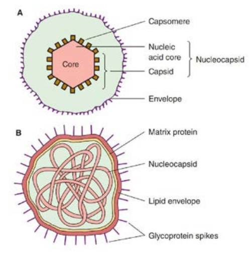
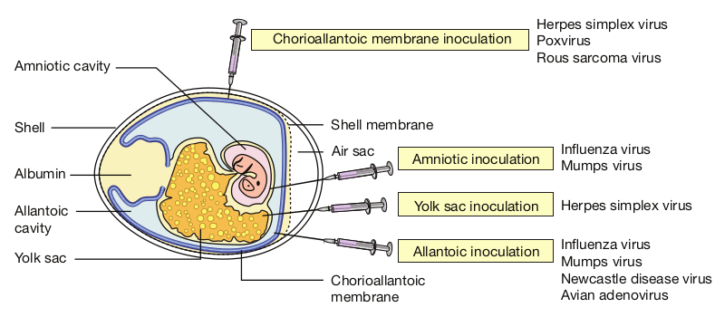
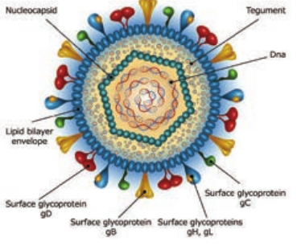
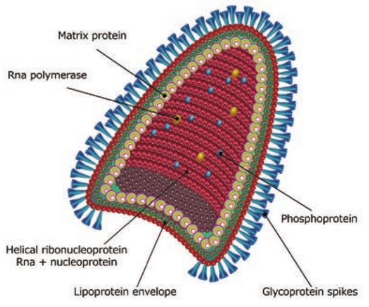
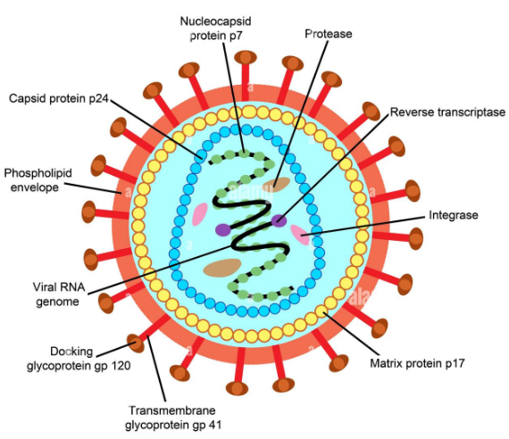
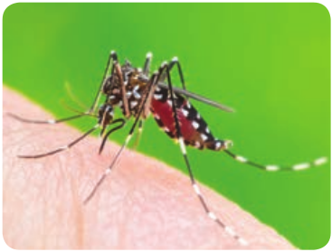
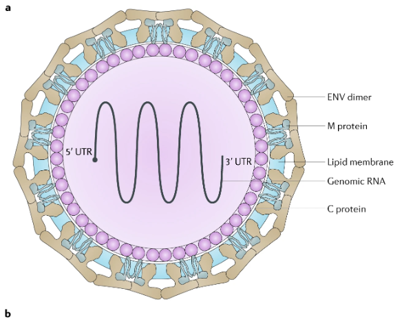

  

**Chapter Outline**

**10.1** Evolutionary Origin of viruses

**10.2** Cultivation of Viruses

**10.3** Herpes Viruses

**10.4** Hepatitis Viruses

**10.5** Rabies Virus

**10.6** Human Immuno Deficiency Virus

**10.7** Arbo Virus

After studying this chapter the students will be able to,

_- Study the importance of viruses causing disease in humans._

_- Study the classification, structure and cultivation of Viruses._

_- Study viruses, their pathogenesis, clinical feature of viral diseases and its treatment and prophylaxis._

_- Study the methods of collection, and processing of the sample and molecular diagnosis of viral infections._

**Learning Objectives**

**Medi**

**Chapter**

**10**  

**cal Virology**

Viruses are **infectious agents** with size ranging from about 20 nm to 300 nm in diameter and contain only **one type of nucleic acid** (RNA or

DNA) as their genome. The nucleic acid is encased in a protein shell, which may be surrounded by a lipid membrane. The entire infectious unit is termed as **virion**. Viruses are obligate intracellular parasite, they replicate only in living cells. The study of virus is called as **virology**. **Martinus Beijerinck** is known as the Father of Virology.

## Evolutionary Origin of Viruses

The origin of viruses is not known, but two theories of vital origin can be summarized as follows; i. Viruses may be **derived from (DNA**

**or RNA)** nucleic acid components of host cells to replicate and evolve independently.

ii. Viruses may be **degenerate forms** of intracellular parasites.

**Morphology**

**Size** Viruses are smaller than bacteria, known as filterable viruses vary widely in size.

  

The **largest** among them is the **Pox virus** measuring about 300nm. The **smallest** virus is **Parvo virus** measuring about 20 nm.

**Structure and Shape**

The virion consists of nucleic acid surrounded by a protein coat, **the capsid**. The capsid with the enclosed **nucleic acids** is known as the nucleo capsid. The capsid is composed of a large number of **capsomers**. The functions of the capsid are to **protect** the **nucleic acid** from the deleterious agents and also to introduce viral genome into host cells by adsorbing readily to cell surfaces (Figure 10.1). Two kinds of symmetry encountered in the virus are **icosahedral** and **helical**. Virions may be **enveloped or non enveloped** (naked). The envelope or outer covering of viruses is derived from the host cell

membrane when the progeny virus is released by budding. The envelope is **lipoprotein** in nature. The lipid is of host cell origin while the protein is virus coded. **Protein subunits** may be seen as **projecting spikes** on the surface of the envelope and are known as Peplomers.

Overall shape of the virus particle varies; mostly animal viruses are roughly spherical. Some are irregular and pleomorphic. The rabies virus is **bullet shaped**, Ebola virus is **filamentous** and pox viruses are **brick shaped**.

**Chemical Properties**

Viral protein determines the **antigenic specificity** of the virus. Some viruses contain small amounts of carbohydrates. Most Viruses do not possess any enzymes but **retro virus** has a unique enzyme, such

ture of Virus

  

as **RNA dependent DNA polymerase or transcriptase** which can synthesise DNA from RNA.

**Resistance**

Viruses are **inactivated** by sunlight, UV rays and ionizing radiations. The most active **antiviral disinfectants** are oxidizing agents such as hydrogen peroxide, potassium permanganate and hypochlorites. Organic iodine compounds are actively **virucidal**. Chlorination of drinking water kills most viruses but its efficacy is influenced by the presence of organic matter. Some viruses such as hepatitis virus, polio viruses are relatively resistant to chlorination.

Antibiotics active against bacteria are completely ineffective against viruses.

**Viral Multiplication**

The genetic information necessary for viral replication is contained in the viral nucleic acid, and also depends on the syn- thetic machinery of the host cell for rep- lication. The Viral replication cycle can be divided into **six steps** and they are as follows, **1\. Adsorption or attachment, 2. Penetration, 3. Uncoating, 4. Bio synthesis, 5. Maturation** and **6. Release.**

**1\. Adsorption** Virions may come into contact with cells by random collision but adsorption takes place only if there is an **affinity** between the **virus and the host**. The cell surface should contain specific receptor site for the virus to attach on to it.  

**2\. Penetration** Bacteria possess rigid cell walls, only the viral nucleic acid is introduced intracellularly by a complex mechanism. Animal cells do not have rigid cell walls and the whole virus can enter and virus particles may be engulfed by a mechanism resembling **phagocytosis**, a process known as **‘Viropexis’**. In case of the **enveloped viruses**, the viral envelope may **fuse** with the plasma membrane of the host cell and release the nucleocapsid into the cytoplasm.

**3\. Uncoating Release of the viral nucleic acid** from the capsid into the host cell. With most viruses, uncoating is affected by the action of lysosomal enzymes of the host cell.

**4\. Biosynthesis** Virus can synthesise viral nucleic acid, capsid protein and also the enzymes necessary in the various stages of viral synthesis, assembly and release. In addition certain regulator proteins are also synthesized. Most **DNA viruses** synthesise their nucleic acid in the **host cell nucleus**. Most **RNA viruses** synthesise all their components in the cytoplasm.

**5\. Maturation Assembly of daughter virions** follows the synthesis of viral nucleic acid and proteins. Virions assembly may take place in the host cell nucleus or cytoplasm. Herpes and adeno viruses are assembled in the **nucleus**, while picorna and pox viruses are assembled in the **cytoplasm**.

**6\. Release** In case of bacterial viruses, the release of progeny virions takes place by the lysis of

  

the infected bacterium. However, in the case of **animal viruses**, release usually occurs **without cell lysis**. **Eclipse phase** is from the stage of penetration till the appearance of mature daughter virions. The virus cannot be demonstrated inside the host cell. The virus seems to disappear (Figure 10.2).

**Viroids**

Viriods are small, single stranded covalently closed circular RNA molecules existing as highly base paired rod like structure. The viroid depends on the host for replication. These are

**Penetration** The cell eng by endocyto

**Attachment** Influenza virus becomes attachedto a target epithelial cell.

**Release** New viral particles are made and released into the extracellular fluid The cell. which is not killed in the process. continues to make new virus.

**Assembly** New phage assembled.

1 2

Epithelial cell

Influenza vitusNucleus

6 5

responsible for some of the transmissible plant diseases.

Which is more dangerous – bacteria or Virus?

**HOTS**

**Prion** Prions are small proteinaceous infectious agents without genetic material. These are responsible for a number of degenerative brain diseases (Example: Creutzfeldt) and hereditary dementia.

ulfs the virus sis.

particles are **Biosynthesis** viral RNA enters the nucleus, where it is replicated by the viral RNA polymerase.

**Uncoating** Viral contents are released.

3

4

iral Life cycle

  

## Cultivation of Viruses

Viruses are **obligate intracellular** parasites; they cannot be grown on any inanimate culture medium. **Three methods** are employed for the cultivation of viruses – **inoculation into animals, embryonated eggs and tissue culture or cell culture**.

**i. Animal Inoculation**

The earliest method for the cultivation of viruses causing human diseases was inoculation into human volunteers. Monkeys were used for the isolation of the polio virus by **Landsteiner and Popper (1909)**. The embryonated hen’s egg was first used for cultivation of viruses by **Good pasture (1931)**. The embryonated egg offers several sites for the cultivation of viruses. Non human primates provide the only method for virus cultivation. Mice are most widely employed animals in Virology.

**ii. Embryonated Eggs**

**a. Chorioallantonic Membrane (CAM)** Inoculation on **the chorioallantonic membrane** produces visible lesions (pocks). Different viruses have different pock morphology. Example: variola or vaccinia

**b. Allantonic Cavity** Inoculation on the **allantonic cavity** provides a rich yield of influenza and some paramyxo viruses.

**c. Amniotic Sac** Inoculation into the **amniotic sac** is for the primary isolation of the influenza virus.  

**d. Yolk Sac** Inoculation into the **yolk sac** is for the cultivation of some viruses like Chlamydiae and Rickettsiae.

Allantonic inoculation is employed for growing influenza virus for vaccine production (Figure 10.3).

**iii. Tissue Culture**

First tissue culture in Virology was maintained by **Steinhardt and colleagues (1913)** for the vaccinia virus in fragments of rabbit cornea. Bacterial contamination was the major limitation. Different types of culture used are:

**a. Organ culture Small bits of organs** can be maintained, used for the isolation of some viruses. Example: Corona virus (respiratory pathogen) cultured on tracheal ring organ culture.

**b. Explant culture Fragments of minced tissue** are grown as ‘explants’. This is also known as tissue culture. Example: Adeno virus cultured on Adenoid tissue explants.

**iv. Cell Culture**

Tissues are dissociated into the component cells by the **action of enzymes** (trypsin) or by mechanical process and are suspended in a growth medium (amino acids, vitamins, salts, glucose) **supplemented** with fetal calf serum of antibiotics and **indicator** (Phenol red). This media is dispensed in bottles, tubes or petridishes. The cells adhere to the glass surface and on incubation divides to form a confluent monolayer sheet of cells covering the

  

surface within about a week. The cell culture is classified into three types.

**a Primary cell cultures** In this culture, **normal cells** are taken from the body and cultured. They are capable of only limited growth in culture. Example: Monkey kidney, Human embryonic kidney, Chick embryo cell culture.

**b. Diploid cell strains** These are cells of a **single type** that retain the original **diploid chromosome number** and serotype during serial sub cultivation for limited number of times. Example: Human fibroblast.

**c. Continuous cell lines** These are **single type, derived from cancer cells** that are capable of continuous serial cultivation. Example: Cells derived from cancers, such as Hela, Hep-2 and KB cell lines.

## Herpes Viruses

The herpes virus family contains more than a hundred species of **enveloped DNA** viruses that affect humans and animals.

Shell me

Amniotic cavity

Chorioallantoic m

Shell

Albumin

Allantoic cavity

Yolk sac

Chorioa membra

Air sac

**Structure**

The herpes virus **capsid is icosahedral**, composed of 162 capsomers and enclosing the core containing the linear **double stranded DNA** genome. The nucleocapsid is surrounded by the lipid envelope derived from the host cell. The envelope carries **surface spikes** (Figure 10.4). **Teguments** are present in between the envelope and capsid. The **enveloped virion** measures about 200nm and the **naked virion** about 100 nm in diameter.

mbrane

embrane inoculation Herpes simplex virus Poxvirus Rous sarcoma virus

Influenza virus Mumps virusAmniotic inoculation

Yolk sac inoculation

Allantoic inoculation

Herpes simplex virus

Influenza virus Mumps virus Newcastle disease virus Avian adenovirus

llantoic ne

irus in Embryonated Egg

  

**Classification**

Herpes virus belongs to the family Herpesviridae.

**i. Alpha herpes viruses** They have relatively **short replicative cycle** (12–18 hours) and a variable host range. They cause latent infection in sensory ganglia. Example: Herpes simplex virus and varicella zoster virus.

**ii. Beta herpes viruses** They **replicate slowly** (more than 24 hours) and have a narrow host range, grow well in fibroblasts. They cause latent infection of salivary gland and other organs. Example: Cytomegalovirus.

**iii. Gamma herpes viruses** They have a **narrow host range** and replicate in lymphoblastoid cells. They are specific for either B or T lymphocytes and causes latent infection in lymphoid tissue Example: Epstein - Barr Virus. Eight different types of herpes viruses are known whose primary hosts are humans. They have been designated as ‘Human herpes virus type 1–8.

**1\. Herpes Simplex**

The herpes simplex virus (HSV) occurs **naturally only in humans**, but it can produce experimental infection in laboratory animals. There are **two types** of the herpes simplex virus. **HSV type 1** (Human herpes virus type 1) is isolated from lesions in and around the mouth and is transmitted by direct contact or droplet spread from carrier. **HSV type 2** (Human herpes virus type 2 or **HHV type**  

**2**) is responsible for the genital herpes infections transmitted venereally.

**Pathogenesis** Herpes simplex is one of the most **common viral infection** in humans, the sources of infection are saliva, skin lesions or respiratory secretions. In type 2, transmission occurs by close contact and may be veneral in genital herpes.

The virus enters through defects in the skin or mucous membranes and multiples locally, with cell to cell spread. The **herpes lesions** are thin walled, umbilicated vesicles, the roof of which breaks down, leaving tiny superficial ulcers. They heal without scarring.

**Clinical features** The clinical manifestations depend on the site of infection, age and immune status of the host and the antigenic type of the virus. They ar. 
- Cutaneous infection. 
- Mucosal infection. 
- Ophthalmic infection. 
- Nervous system infection. 
- Visceral infection. 
- Genital infections

**Laboratory diagnosis Microscopy** Smears are prepared from the lesions, from the vesicles and stained with 1% aqueous solution of **toluidine blue ‘O’** for 15 seconds. Multinucleated giant cells with faceted nuclei with ground glass chromatin (**Tzanck cells**) are observed.

**Virus isolation** Inoculation in mice and on chick embryo CAM is insensitive. Primary human

  

embryonic kidney, human amnion cells are susceptible, but **human diploid fibroblasts** are preferred. Vesicle fluid, spinal fluid, saliva and swabs may be used. Cytopathic changes may appear as early as 24–48 hrs.

**Serology**

Antibodies develop within a few days of infection and **rise in titre of antibodies** may be demonstrated by ELISA, neutralization or complement fixation tests.

**Chemotherapy**

Indoxyuridine used topically in eye and skin infection, acyclovir and vidarabine are given for deep and systemic infections.

**2\. Varicella Zoster**

**In 1889, Von Bokay** had suggested that varicella (Chicken pox) and herpes zoster are **different manifestations** of the same virus infection. The virus is therefore called **Varicella zoster virus** (VZV). The chicken pox follows **primary infection** in a non immune individual, while herpes zoster is a **reaction of the latent virus** when the immunity has fallen to infective levels.

VZV is **similar** to the herpes simplex virus in its morphology. It can be grown in cultures of **human fibroblasts human amnion** or HeLa cells. Chicken pox is one of the mildest and **most common of child hood infections**. The disease may, occur at any age.  

**Herpes gladiatorum** is **spread** through skin-to-skin contact. If you kiss someone

with a herpes cold sore on their lips, you could become infected.

**3\. Cytomegaloviruses**

Cytomegaloviruses (CMV) formerly known as **salivary gland viruses** are a group of ubiquitous herpes viruses of humans and animals. They are characterized by **enlargement of infected cells** and intranuclear inclusions. In 1926, cytomegalia presumed to be due to viral infection was reported in the salivary glands of guinea pigs and children and the viral agent was called the **‘salivary gland virus’.**

CMV is the **largest viruses** in the herpes virus family, being 150–200 nm in size.

**Infobits**

**4\. Epstein – Barr Virus**

A number of different viruses apparently **‘Passenger Viruses’** were isolated from cultured lymphoma cells. **Epstein, Barr and Achong in 1964** observed a new type of herpes virus and named it has **‘EB Virus’** affecting B lymphocytes of only human and some sub human primate **B cells have receptors** ( CD21 molecules) for the virus.

The source of infection is usually the **saliva of infected persons** who shed the virus in oropharyngeal secretions. Intimate oral contact, as in kissing,

  

appears to be the predominant mode of transmission. This accounts for infectious mononucleosis being called as **‘The kissing disease’**.

**5\. Human Herpes Virus Types 6,7,8**

A herpes virus, first isolated in 1986 from the **peripheral blood** of patients with lympho proliforative disease called as **human B lymphotropic virus**, renamed as HHV - 6. HHV- 7 was isolated in 1990 from **peripheral CD4 cells** of a healthy person appears to be widely distributed and transmitted through saliva.

In 1994, DNA sequences presumed to represent a new herpes virus from **tissues of Kaposi’s sarcoma** from AIDS patients was named as HHV8. Later Kaposi’s sarcoma was identified in persons not infected with HIV and referred to as **Kaposi’s Sarcoma- associated Herpes Virus** (KSHV).

## Hepatitis Viruses

The term viral hepatitis refers to a **primary infection of the liver**, hepatitis viruses consists of types A, B, C, D, E and G. Except for **type B** which is a DNA virus all the others are RNA viruses.

Two types of viral hepatitis had been recognised. **Type one** affects mainly children and young adults and transmitted by the fecal-oral route called **as infective or infectious hepatitits or type A hepatitis. Second type** transmitted mainly by receiving serum inoculation or blood transfusion named as **homologous serum jaundice, serum hepatitis transfusion hepatitis or type B hepatitis**.  

**Type A Hepatitis (HAV)**

HAV is a 27nm non enveloped RNA virus belonging to the **picorna virus family**. It is designated as **‘entero virus 72’**, HAV is recognised as new genus **‘Hepatovirus’**. It can be grown in human and simian cell cultures and is the only human hepatitis virus which can be cultivated _in vitro_.

HAV transmission is by the **fecal oral route**. Infection is by ingestion. The virus multiplies in the intestinal epithelium and reaches the liver by **hematogenous spread**. Once jaundice develops, it is rarely detectable in feces. The incubation period is 2- 6 weeks. The clinical disease consists of two stages the **prodromal and the icteric stage**. The onset may be acute with fever, malaise, anorexia, nausea, vomiting and liver tenderness. These usually subside with the onset of jaundice. Recovery is slow, over a period of **4–6 weeks**. The disease is milder in children. Type A hepatitis caused by **contaminated food, water or milk**. Over crowding and poor sanitation favour its spread.

**Laboratory Diagnosis**

Diagnosis of type A hepatitis may be made by **demonstration of the virus** or its **antibody**. Virus can be visualized by **Immunelectron Microscopy (IEM)** in fecal extracts during the late incubation period.

**IgM anti-HAV antibody** appears during the late incubation period disappears after 3-4 months. **IgG** peaks in 3-4 months and persists much longer for life. ELISA kits for detection of IgM and IgG antibodies are available.

  

A safe and effective formalin inactivated, **alum conjugaged vaccine** containing HAV grown in human diploid cell culture is used. Course consists of **two intra muscular injections** of the vaccine. Protection begins **4 weeks** after injection and lasts for **10 to 20 years**. No specific antiviral drug is available.

**Type B Hepatitis (HBV)**

HBV is a 42nm **DNA virus** with an outer envelope and an inner core 27nm in diameter. Enclosing the **viral genome** and a **DNA polymerase**. It belongs to the family Hepadna Viridae HBV is **‘Hepadna Virus type 1’**. **Australia antigen** was found to be associated with serum hepatitis. It was the surface component of HBV, so named as **hepatitis B surface antigen (HBsAg)**.

**3 types of particles** are visualized, most abundant form is a **spherical particle**, 22nm in diameter. The second type of particle is **filamentous** or **tabular** with a diameter of 22nm both are antigenically identical. Third type of particle are fewer in number, is a **double walled spherical**

**Does HSV shorten your lifespan?** Becoming infected with **the herpes**

**virus **seriously complicates your social, emotional and sexual life, but it is not otherwise a terribly dangerous condition to have. Having **genital herpes does **make it easier to get HIV (and thus AIDS), but otherwise, the condition is not disabling, and does not reduce lifespan.  

structure 42 nm in diameter. This particle is the complete **hepatitis B virus**, known as **Dane particle**.

The envelope proteins expressed on the surface contains **hepatitis B surface antigen (HBsAg)**. HBsAg consists of two major polypeptides, one of which is glycosylated. The nucleocapsid or core contains **hepatitis B core antigen (HBcAg A)** (Figure 10.5)**.** Third antigen called the **hepatitis B e antigen (HBeAg)** is a soluble non particulate nucleocapsid protein.

genome consisting of **two linear strands of DNA** held in a circular configuration. One of the strands is **incomplete** (+ strand) DNA appears partially **double stranded** and partially **single stranded**. Associated with the + strand is a **viral DNA polymerase** (has both DNA dependent DNA polymerase and RNA dependent reverse transcriptase functions). This polymerase can **repair the gap** in the plus strand and render the **genome fully double stranded**.

Natural infection occurs **only in humans**. The virus is maintained in

  

carriers whose blood contains **circulating virus** for long periods. Carriers are of two categories, the highly infectious **super carriers** and the simple carriers. Former have high titre HBsAg along with HBsAg, DNA polymerase and HBV in ciruculation. Simple carriers have low infectivity and low titre HBsAg in blood.

HBV is a **blood borne virus** and the infection is transmitted by **parenteral, sexual and perinatal models**. The virus may also be present in other **body fluids and excretions** such as saliva, breast milk, semen, vaginal secretions, urine bile and feces of these semen and saliva are known to transmit the **infection** very commonly. Transfusion of carrier blood once, the most widely known mode of infection has largely been eliminated by donor screening that is strictly enforced. Infection by direct contact with open skin lesions such as pyoderma, eczema, cuts and scratches is very common among **young children** in developing countries. Certain groups and **occupations** carry a high risk of infection. These include medical and paramedical staff of blood banks, dialysis units, barbers, sex workers.

The incubation period is long about 1- 6 months. The onset is insidious and fever is not prominent. Extra hepatic complications like arthralgia, urticaria and glomerulonephritis may occur. About 90-95% of adults with acute hepatitis B infection recover within 1-2months of onset and eliminate the virus from the body. They may be **Asymptomatic carriers** or may progress to recurrent or chronic liver disease.

**Laboratory Diagnosis**  

**Serology** Diagnosis of hepatitis B depends on the **serological demonstration** of the viral markers. **HBsAg** is the first marker to appear in **blood** after infection, being detectable. It remains in circulation throughout the symptomatic course of the disease (2- 6months). Anti HBs is the protective antibody.

**HBcAg** is **not demonstrable** in circulation because it’s **enclosed** within the **HBsAg coat** but its antibody, anti HBc appears in serum a week or two after the appearance of HBsAg. As anti HBc remains life long, it serves as a useful indicator of prior infection with HBV.

**HBeAg** appears in blood concurrently with HBsAg, indicating the **high infectivity**. Molecular methods such as **DNA: DNA hybridization and PCR** at present used for HBV DNA testing are highly sensitive and quantitative.

**Immunization** Both passive and active methods of immunization are available. **Active immunization** is more effective. The currently preferred vaccine is genetically engineered by cloning the **S gene for HBV** in **Baker’s yeast**. A special vaccine containing all antigenic components of HBsAg (Pre-S1, Pre-S2 and s) has been developed. **No specific antiviral treatment** is available for acute HBV infection.

## Rabies Virus

The Family Rhabdoviridae contains viruses that **infects mammals, reptiles, birds, fishes, insects and plants**. The disease in human being is called

  

**hydrophobia** because the patient exhibits **fear of water**, being **incapable** of drinking though subject to **intolerable thirst**.

**Pasteur** established that the rabies virus was present in the **brain of infected animals**. By serial **intracerebral passage** in rabbits, he demonstrated **fixed virus** that could be **rendered immune** by a series of injections. **Vaccine was prepared** by drying pieces of **spinal card** from rabbits infected with the **fixed virus**.

**Joseph Meister** a nine year old boy, severely bitten by a rabid dog and in grave risk of developing rabies, was given a course of **13 inoculations** of the infected cord **vaccine** by Pasteur. The boy **survived**. This dramatic event was a **mile stone** in the development of medicine.

**Morphology**

The rabies virus is **bullet shaped**, with one end rounded or conical and the other planar or concave. The lipoprotein envelope, carries **knob like spikes**, composed of **glycoprotein G** responsible for pathogenesis, virulence and immunity beneath the envelope is the **matrix (M) protein layer** which may be invaginated at the planar end. The membrane may project outwards forming a **bleb**. The genome is unsegmented linear RNA (Figure 10.6).

The rabies virus isolated from natural human or animal infection is termed **‘the street virus’**. Rabies has been recognized from very ancient times as a disease transmitted to humans and animals by the **bite of ‘mad dogs’**. The name rabies comes from the **Latin** word rabidus,  

meaning **‘mad’**, derived from the **Sanskrit** root rabhas, for **frenzy**.

**Pathogenesis**

Human infection is usually caused by the **bite of rabid dogs** or other animals. The virus present in the saliva of the animal is **deposited** in the wound (Figure 10.7). **Rarely**, infection can also occur following non-bite exposures such as licks or aerosols.

The virus appears to **multiply** in the muscles, connective tissue or nerves at the site of deposition for 48-72 hours. It penetrates the **nerve endings** and travels in the axoplasm towards the **spinal cord and brain**, at speed of about 3 mm per hour. The virus multiples and **spreads centrifugally** along the nerve trunks to various parts of the body including the salivary glands. It multiplies in the salivary glands and is **shed** in the **saliva**. The virus reaches every tissue in the body and dissemination may be interrupted at any stage by death. In humans the incubation period is usually from **1–3 months**, short as 7 days or as long as three years. The incubation period is usually short in persons bitten on the face or head and long in those bitten on the legs. This may be related to the distance the virus has to travel to reach the brain. The incubation period is generally shorter in children than in adults.

The **four stages** of the disease are as follows, **prodrome, acute encephalitic phase, coma and death**. The onset is marked by symptoms such as fever, headache, malaise, fatigue and anorexia, anxiety, agitation, irritability, nervousness, insomnia or depression. The neurological

  

phase begins with hyperactivity. Attempts to drink during such painful spasms of the pharynx and larynx produce choking or gagging that patients develop a dread of even the sight or sound of water (hydrophobia).

**Animal Infection**

In dogs, the incubation period is **usually 3–6 weeks** but it may range from 10 days to a year. The initial signs are an **alert, troubled air and restlessness, snapping at imaginary objects, licking** or gnawing at the site of the bite.

After 2–3 days of this prodromal stage, the disease develops into either the furious or dumb types of rabies. In **furious rabies**, dog runs biting without provocation, the lower jaw droops and saliva drools from the mouth. Paralysis convulsions and death follow. **In dumb**

**rabies,** is the paralytic form, animals lies huddled, unable to feed. About 60% of rabid dogs shed the virus in saliva. Rabid dogs usually die in 3-5days.

**Laboratory Diagnosis**

**Human Rabies** The specimens tested are **corneal smears and skin biopsy**. Commonly used method for diagnosis is the demonstration of **rabies virus antigens** by immuno fluorescence. **Direct immunofluorescence** is done using antirabies serum tagged with fluorescein isothiocyanate.

**Negri bodies** in the brain, are demonstrated, Isolation of the virus by intracerebral inoculation in **mice** can be attempted from the brain, CSF, saliva and urine. The mice are examined for **signs of illness**, and their brains are examined after death.

tructure of Rabies Virus

  

**Animal Rabies** The **whole carcass** of the animal suspended to have died of rabies may be sent to the laboratory. The brain may be **removed** sent for biological test and microscopy respectively. The portion of brain sent should include the **hippocampus and cerebellum** as **negri bodies** are most abundant. The following tests are done in the laboratory.

1\. Demonstration of rabies virus antigen by immuno fluorescence

2\. Demonstration of inclusion bodies - Negri bodies are seen as

**Eye**

**Salivary glands**

**Dorsal roo ganglion**

**Skeletal muscle**

7\. Centrifugal spread along nerves to salivary glands, skin, cornea, and other organs

3\. Virus binds to bicotinic acetylcholine receptors at neuromuscular junction at neuromuscular junction

5\. Replication in moto neurons of the spinal and local dorsal root and rapid ascent to b

4\. Virus travels axons in periph nerves via retr tast axonal tra

2\. Viral replication in muscle

1\. Virus inoclated

intracytoplasmic, round or oval purplish pink with characteristic basophilic inner granules. Negribodies vary in size from 3.27 Mm.

**Local Treatment for rabies*. 
- Prompt cauterization of the

wounds helps to destroy the virus. 
- Antirabic serum may be applied

topically. 
- Antitetanus measures and

antibiotics to prevent sepsis.

**Infobits**

**Brain**

**Sensory nerves to skin**

**t**

**Spinal cord**

6\. Infection of brain neurons with neuronal dysfunction

r cord ganglia rain

within eral

ograde nsport

of Rabies Infection

  

**Antirabic Vaccines**

Antirabic vaccines fall into two main categories neural and non-neural.

**Neural Vaccines** Suspension’s of nervous tissues of animals infected with the fixed rabies virus. Following are the modified forms. 1. **Semple Vaccine:** Vaccine developed by

semple (1911). It is a 5% suspension of **sheep brain infected with fixed virus** and inactivated with phenol at 37°C leaving noresidual live virus.

2\. **Beta propiolactone (BPL) Vaccine:** Beta propiolactone is used as the **inactivating agent** instead of Phenol.

3\. **Infant Brain Vaccine:** The enceptalitogenic factor in brain tissue is a basic protein associated with myelin. Vaccines were developed using infant mouse, rat or rabbit brain. Infant brain vaccine is impractical in India.

**Non-neural Vaccines** Non-neural vaccines includes 1. Egg Vaccines 2. Tissue Culture Vaccines 3. Subunit Vaccine

**Passive Immunisation**

Human rabies immune globulin **(HRIG)** is free from the danger of sensitization but should be ensured free from HIV and hepatitis viruses.

**Vaccines for Animals**

**Antirabies immunization** in animals is to be done as pre-exposure prophylaxis concentrated cell culture vaccines – inactivated virus gives good protection  

after a single **Intramuscular** injection. Injections are given at 12 weeks of age and repeated at 1–3 years intervals.

## Human Immuno Deficiency Virus

**Human Immuno Deficiency Virus (**HIV), the etiological agent of AIDS, belongs to the lentivirus subgroup of the family **Retroviridae**.

**Detecting HIV sooner** Fourth generation test helps to detect HIV in blood earlier than previously recommended antibody test. It identifies the viral protein, HIV-1 P24 antigen, which appears in the blood sooner than antibodies. Source: CDC

**Infobits**

**Structure**

HIV is a spherical **enveloped Virus**, about 90-120 nm in size. The nucleo capsid has an outer icosahedral shell and an inner cone shaped core, enclosing the **ribonucleo proteins**. The genome is diploid, composed of two identical single stranded, **positive sense RNA copies**. When the virus infects a cell, the Viral RNA is transcribed by the **reverse transcriptase enzyme**, first into single stranded DNA and then to double stranded DNA (provirus) which is integrated into the host cell chromosome. The virus coded **envelope proteins** are the projecting knob like spikes which binds to the CD4 receptors on susceptible host cells (Figure 10.8).

  

**Viral Genes and Antigens**

The genome of HIV contains the **three structural genes** (gag, pol and env) as well as other nonstructural and regulatory genes specific for the virus. These products of these genes, both structural and non structural act as antigens.

**Genes coding for structural proteins** 1\. The gag gene Determines the

core and shell of the Virus. Precursor protein, p55 and it is cleaved into three proteins p15, p18 and p24. **Major core antigen p24** can be detected in serum

2\. The env gene Determines the syn- thesis of envelope glycoprotein gp160. Cleaved in to gp120 and gp41

3\. The pol gene Codes for the **reverse transcriptase** and other viral enzymes such as protease and endonucleases. It’s expressed as a precursor protein, which is cleaved into protein p31, p51 and p66.

**Pathogenesis**

Infection is transmitted when the Virus **enters the blood or tissues** of a person and  

comes into contact with a suitable host cell, principally the CD4 lymphocyte. The receptor for the virus is the CD4 antigen and therefore the virus may infect any cell bearing the CD4 antigen on the surface. Specific binding of the **virus to CD4 receptor** is by the envelope **glycoprotein gp120**. Cell fusion is brought about by transmembrane gp41. After **fusion \`**with the host cell membrane, the HIV genome is uncoated and internalized into the cell. Viral reverse transcriptase mediate transcription of its RNA into double stranded DNA, which is **integrated into the genome** of the infected cell through the action of the viral enzyme integrase, causing a latent infection. The primary pathogenic mechanism in HIV infection is the damage caused to the CD4+T lymphocyte. The **T4** **cells decrease** is numbers. Infected T4 cells do not release normal amounts of interleukin, gamma interferon and other lymphokines, this is damping effect on cell mediated immune response.

**Clinical Features**

AIDS is only the last stage in the wide spectrum in HIV infection.

**1\. Acute HIV infection** 3–6 weeks of infection, persons experience low grade fever, malaise, headache, lymphadenopathy, with rash. Antibodies are usually negative at the onset of the illness but become positive during its course called **‘Sero conversion illness’**.

**2\. Asymptomatic or latent infection** All HIV infected persons, whether or not they experience Sero conversion illness, pass through a phase of **symptomless**

  

**infection** which may last up to several years. The infection progresses in course of time through various stages, CD4 lymphocytopenia, minor opportunistic infections, AIDS-related complex (ARC), ultimately terminating to AIDS.

**3\. Persistent generalized lymphadenopathy (PGL)** It is defined as the presence of **enlarged lymph nodes** at least 1cm, in diameter in two or more non contiguous extrainguinal, sites that persists for at least three months.

**4\. AIDS related complex (ARC)** This group includes patients with considerable **immunodeficiency**, suffering from various symptoms or minor opportunistic infections. eg. Oral candidiasis, Salmonellosis or Tuberculosis.

**5\. AIDS** End-stage disease, poor immune defence mechanism leading to the opportunistic infection and malignancies.

**a. Commonest symptoms** Drycough, dyspnea and fever. Pheumonia may be viral (cmv) or fungal (Cryptococcus, Histoplasma).

**b. Gastrointestinal system** The mouth is often involved with thrush, stomatitis, gingivitis, hairy leukoplakia. Dysphagia due to esophageal Candidiasis. Intestinal pathogen in AIDS is cryptosporidium. Other pathogens are Salmonellae, Mycobacteria, CMV or adeno viruses. ‘Gay bowel syndrome’ is common among the male homosexuals.  

**c. Central nervous system** The typical CNS opportunistic infections are toxoplasmosis and cryptococcosis. Lymphomas of the CNS are Common.

**d. Malignancies** Kaposi’s Sarcoma was the lesion seen in male homosexuals. The tumours commonly seen are lymphomas, both the Hodgkin and non Hodgkin types.

**e. Cutaneous** Herpes lesions, Candidiasis, Dermatitis, impetigo are common cutaneous lesions.

**6\. Dementia** Direct **cytopathogenic damage** in the CNS. It cross the blood-brain barrier and cause encepthalopathy leading to dementia.

**7\. Pediatric AIDS** Viral transmission may occur to the **fetus in pregnancy**. Many of the infected children may not survive for a year. Children may also acquire the infection from blood transfusion or blood products.

**Laboratory Diagnosis**

Lab diagnosis of HIV infection include tests for immuno deficiency in HIV infection.

**A. Immunological tests** i. Total leukocyte and lymphocyte count

to demonstrate leucopenia and a lymphocyte count usually below 2000/ mm3.

ii. Platelet count will show thrombocytopenia.

iii. Raised IgG and IgA levels.

  

**B. Specific tests for HIV infection 1. Antigen detection** Single massive infection, as by blood transfusion, the **virus antigens** may be detectable in blood after about two weeks. The major core antigen p24 is the virus marker in blood.

**2\. Polymerase Chain reaction**

It is the most **senstitive** and specific test.

**3\. Antibody detection**

Demonstration of **antibodies** is the simplest and widely employed technique. It takes 2–8 weeks to months for antibodies to appear after infection, during this period, the individual may be highly infectious. This sero negative infective stage is known as the ‘window period’. Antibody can be detected by

1\. ELISA

2\. Western blot test.

**Treatment**

The treatment of AIDS include:

1\. The treatment and prophylaxis of infections and tumours

2\. General management

3\. Immunorestrorative measures

4\. Specific anti-HIV agents

Effective drugs are available, they are Zidovudine, Didanosine, Zalcitabine, Lamivudine and Protease inhibitors like Saquinavir, Ritonavir, Indinavir used as monotherapy or in various combination.

## Arbo Virus

Arbo Viruses (arthropod - borne viruses) are viruses of vertebrates biologically  

transmitted by **hematophagous insect vectors**. They multiply in blood sucking insects and are transmitted by bite to vertebrate hosts. Arbo viruses are worldwide in distribution. Arbo viruses have been named according to the disease caused (**yellow fever**), the place of isolation of the virus (**kyasanur forest disease**) or the local name for the disease (**chikungunya**). They are classified into Toga, Flavi, Bunya, Reo and Rhabdovirus families. Arbo viruses have a very wide host range including many species of animals and birds. The most important arbo virus vectors are **mosquitoes**, followed by **ticks**.

The virus enters the body through the **bite** of the insect vector. After multiplication in the **reticuloendothelial system, viremia** of varying duration occurs, or the virus is transported to the target **organs** such as central nervous system in **encephalitis**, the liver in **yellow fever** and the capillary endothelium in **hermorrhagic fever**.

Clinical syndromes are fever with or without rash, encephalitis, hemorrhagic fever, systemic disease and yellow fever.

Diagnosis may be established by virus isolation or serology.

Samples (Blood, CSF) are inoculated intra cerebrally into sucking mice. The animal develop **fatal encephalitis**. Viruses may be isolated in tissue cultures or in eggs. Isolates are identified by hemagglutination inhibition, complement fixation, gel precipitation, immunofluorescence and ELISA. Virus isolated from insect vectors and from reservoir animal.

**Toga Viruses**

Toga viruses are **spherical enveloped viruses** with a diameter of 50-70nm.

  

Single stranded RNA genome. The virus replicates in the **cyloplasm** of the host cell and released by budding through host cell membranes. The name Toga Virus is derived from **‘toga’** meaning the Roman Mantle refers to the **viral envelope**.

The genus Alpha Virus was formerly classified as **Group A arbo viruses** which explains the name Alpha Virus. The genus Alpha Virus contains 32 species of which 13 infect humans. All are **mosquito borne**.

### Chikungunya Virus

The virus was first isolated from human patients of **_Aedes aegypti_** mosquitoes (Figure 10.9) from Tanzania in 1952. The name Chikungunya is derived from the native word for the disease in which the patient lies **‘doubled up due to severe joint pains’**. The virus first appeared in India in 1963 in Calcutta, Madras and Other areas.

The disease presents as a sudden onset of fever, Crippling joint pains, lymphadenopathy and conjunctivitis. A **maculopapular rash** in common. The fever is typically biphasic with a period of remission after 1–6 days of fever. The vector is **_Aedes aegypti_**. No animal reservoir has been identified. Antibody to the virus has been demonstrated in horses, cattle and other domestic animals.

**Flavi viruses** The family flaviviridae contains only one genus **flavivirus**. They are smaller than alpha viruses, being 40nm in diameter. There are over 60 arthropod borne flava viruses classified as **mosquito-borne and tick borne viruses**. Examples of mosquito borne group known as encephalitis  

viruses they are St. Louis encephalitis Virus, Ilheus virus, west nile virus, murray valley encephalitis virus and Japanese encephalitis. Tick borne viruses are classified in to tick borne encephalitis viruses and tick borne hemorrhagic fevers.

The name dengue is derived from the **‘Swahili ki denga pepo’**, meaning a sudden **seizure by a demon**. Dengue fever is similar to the illness caused by chikungunya. Four types of dengue virus exist: **DEN1, DEN2, DEN3 and DEN4**.

What is the best home remedy for dengue fever?

**HOTS**

Dengue presents after an incubation period of 3-14 days as fever of sudden onset with headache, retrobulbarpain, conjunctival injection, pain in the back and limbs (break bone fever), lymphadenopathy and maculopapular rash. The fever is typically **biphasic** (saddle back) and lasts for 5–7 days. Dengue may be more serious forms with **hemorrhagic** manifestations (dengue

  

Hemorrhagic fever) or with shock (dengue shock syndrome).

Dengue virus is transmitted from person to person by **_Aedes aegypti_** mosquitoes. The Incubation period is 8–10days. All four types of dengue virus are identified. Demonstration of circulating IgM antibody provides early diagnosis. IgM ELISA test offers reliable diagnosis. Difference between Dengue and Chikungunya is given in Table 10.2.

### Zika Virus

Zika virus is a mosquito-borne flavivirus that was identified in Uganda in 1947 in **monkeys**. Zika spreads by daytime-active Aedes mosquitoes, such as _A. aegypti_ and _A. albopictus_. The infection is known as **Zika fever** or **Zika virus disease**. Zika is related to the dengue, yellow fever, Japanese encephalitis, and West Nile viruses

Zika virus is **enveloped and icosahedral** and has a non segmented, single-stranded, positive-sense (+) **RNA genome** (Figure 10.10). A positive-sense RNA genome can be directly translated into **viral proteins**, the RNA genome encodes **seven nonstructural proteins** and **three structural proteins**. One of the structural proteins forms the envelope. The RNA genome forms a nucleocapsid along with copies of the 12-kDa capsid protein.

Viral genome replication depends on the making of double-stranded RNA from the single-stranded, positive-sense RNA (ssRNA(+)) genome followed by **transcription** and **replication** to provide viral mRNAs and **new ssRNA(+) genomes**.  

**Pathogenesis and Clinical features** Zika virus replicates in the mosquito’s **mid gut epithelial cells** and then its salivary gland cells. After 5–10 days, the virus can be found in the mosquito’s saliva. If the mosquito’s saliva is inoculated into **human skin**, the virus can infect epidermal keratinocytes, skin fibroblasts in the skin and the Langerhans cells. The pathogenesis of the virus is hypothesized to continue with a **spread to lymph nodes **and the **bloodstream**.

Zika virus is primarily transmitted by the **bite of an infected mosquito** from the _Aedes_ genus, mainly _Aedes aegypti_. The mosquitoes usually bite during the day, peaking during early morning and late afternoon or evening. This is the same mosquito that transmits dengue, chikungunya and yellow fever. Zika virus is also transmitted from mother to fetus during pregnancy, through sexual contact, transfusion of blood and blood products, and organ transplantation.

The incubation period of Zika virus disease is estimated to be **3–14 days**. The majority of people infected with Zika virus **do not develop symptoms**. Symptoms are generally mild including fever, rash, conjunctivitis, muscle and joint pain, malaise, and headache, and usually last

  

**Table 10.2: Difference between Dengue and Chi**

**S.No Factors Chikungunya** 1\. Vector _Aedes aegypti_ 2\. Virus Toga viridae - alphavirus 3. Incubation

Period 3-7 days

4\. Symptoms Chikungunya begins as an **acute febrile** illness. Pain can be severe. Other common symptoms include headache, muscle pain, joint swelling, and rash. Some patients have persistence or relapse of rheumatologic symptoms in the months following acute illness.

5 Major symptom

Tremendous Joint pain

6 Person at risk

Neonates exposed intrapartum, older adults, and persons with underlying medical conditions.

**Which fruit is good to increase platelet count? Pomegranate** is another great fruit you can eat to increase platelets. As with all **red**fruits, the seeds of this **delicious** fruit are packed with iron, an **essential** mineral for combating low platelet count. **Pomegranate** has been used since the ancient times for its healthy and medicinal properties.

**Infobits**  

for 2–7 days. **Zika fever** (also known as

Zika virus disease) is an illness caused by

the Zika virus. Zika virus infection during

pregnancy is a cause of **microcephaly**

and other **congenital abnormalities** in

the developing fetus and newborn. Zika

infection in pregnancy also results in

pregnancy complications such as fetal

loss, stillbirth, and preterm birth.

**Laboratory diagnosis**

kungunya

**Dengue** _Aedes aegypti_ Flavi viridae - flavivirus 4-7 days

Dengue is an **acute febrile** illness. **Febrile Phase:** Lasts 2–7 days Fever with Headache, retro-orbital pain, joint pain, muscle and or bone pain, rash, mild bleeding (nose or gums) **Critical Phase:** Lasts 24–48 hours. Most patients improve but severe disease requiring hospitalization can occur. **Recovery Phase:** Gradual reabsorption of extravasated fluid from plasma leakage over 48–72 hours. Dieresis, hemodynamic status stabilizes,patient can temporarily become bradycardic. Bleeding and breath discomfort

Some patients may develop life threatening consequences and require hospitalization. Infection with each dengue virus type confers lifetime immunity for that specific virus type.

| S.N o |Fac tors |C hi kun g un ya |De ngu e |
|------|------|------|------|
| 1. |Vec tor |Aedes  a eg y pti |Aedes  a eg y pti |
| 2. |Vir us |Toga v ir id ae - a lphav ir us |Fl av i v ir id ae - f l av iv ir us |
| 3. |Inc ub at i onPer io d |3-7 d ays |4-7 d ays |
| 4. |Sy mptoms |C hi kun gun ya b eg in s a s a nac ute f e bri l e  i l ln es s.Pain c an b e s e ver e. O t herco mm on sy mptomsin clude h e ad ac he,  mus clep ain, j oin t sw el lin g , a ndra sh.S ome p at ien ts h avep er si sten ce o r r el aps e o frheum atolog ic sy mptomsin t he m ont hs f ol lo w in gac ute i l ln es s. |D en gue i s a n  ac ute f e bri l e  i l ln es s.Fe bri l e P has e:  L asts 2–7 d ays F e ver w it hHe ad ac he, r et ro-o rb it a l p ain, j oin t p ain,mus cle a nd o r b one p ain, ra sh, mi ldble e din g (n os e o r gum s)C ri ti c a l P has e:  L asts 24–48 h our s. M os tp at ien ts im prove b ut s e ver e di s e as ere quir in g h os pit a liza t io n c an o cc ur.Re c over y P has e:  Grad u a l r e abs or pt io nof  ext ra va s ate d  f luid  f rom  pl asm ale a ka ge  over  48–72  hour s.  Dier esi s,hem o dy namic s t atus s t abi lizes,p at ien tc an t em p ora r i ly b e co me b rad yc ardic. |
| 5 |Maj or s y mptom |Trem en do us J oin t p ain |Ble e din g a nd b re at h di s co mf or t |
| 6 |Per s on a tr isk |Ne onates exp os e din t ra p ar tum, o lderad u lts, a nd p er s ons w it hun der ly in g m e dic a lco ndi t io ns. |S ome p at ien ts m ay de velo p lif e t hr e atenin gco ns e quen ces a nd r e quir e h os pit a liza t io n.Inf e c t io n w it h e ac h den gue v ir us t yp eco nf er s lif et im e imm uni t y f or t hat s p e cif icv ir us t yp e. |
  

Virus can be demonstrated from the blood or other body fluids, such as urine or semen.

Zika virus grow well in a variety of mammalian and insect cell lines. Zika virus is identified by **NAAT−** Nucleic acid Amplification test, Zika Antigen is detected by ELISA and PCR. **Zika Antibody** IgM is detected by MAC - ELISA, IgG by ELISA and by **PRNT**\- plaque reduction neutralization test.

**Prevention and Treatment** Protection against **mosquito bites** during the day and early evening is a key measure to prevent Zika virus infection. It is important to eliminate these mosquito breeding sites, Health authorities may also advise use of **larvicides and insecticides** to reduce mosquito populations and disease spread. There is no treatment available for Zika virus infection or its associated diseases. **No vaccine is yet available for the prevention or treatment of Zika virus infection. Development of a Zika vaccine remains an active area of research.**

**Summary**

This chapter dealt with the history, morphology, chemical properties, viral replication, virus classification, cultivation and detection of cytopathic effects of virus. Most important viruses such as Adeno, herpes, hepatitis, Influenza, rabies, HIV and Arbo virus, its morphology, classification, pathogenesis and its laboratory diagnosis were discussed.  

**Evaluation**

**Multiple choice questions**

1\. is an example for smallest virus a. Pox virus b. Parvo virus c. Rabies virus d. HIV virus

2\. CPE stands for a. cytoplasmic effects b. cytopathogenic effects c. cytopathic effects d. None of these

3\. Cytomegalo viruses also called as a. Salivary gland virus b. Thymus gland virus c. Endocrine gland virus d. None of these

4\. is an example for passenger viruses a. HIV virus b. EB Virus c. Rabies virus d. None of these

5\. Beta propiolactone (BPL. Vaccine is given for a. HIV virus b. Influenza Virus c. Rabies virus d. None of these

6\. is an example for mosquito-borne and tick borne viruses a. Dengu virus b. Flavi virus c. Chikungunya virus d. None of these

  

**Answer the following**

1\. What is Virology? 2. Define virion. 3. Which is the largest virus? 4. What is Nucleocapsid? 5. Brief note on Steps involved in viral

multiplication. 6. What is Viropexis? 7. Define Abortive infection. 8. What are Prions? 9. Write Short note on cultivation of

Virus. 10. What are Cytopathogenic Virus? 11. Classification of Herpes virus. 12. Discuss on HSV-1 and HSV-2 13. Expand VZV 14. What is EB Virus? 15. Define Dane particle 16. Genome structure of HBV  

17\. Give the Structure of Rabies Virus 18. What is Furious and dumb rabies? 19. Define Negri bodies 20. Discuss Vaccine for rabies 21. Note on Viral gene and antigen of

HIV 22. Write about the Clinical features of

HIV 23. Give the Lab diagnosis of HIV 24. Define Arbo Virus 25. Give the Symptoms of hermorrhagic

fever. 26. Short note on Chikungunya virus 27. Account on Mosquito borne virus 28. Write about the Structure of Zika

Virus 29. What is Zika fever

