  

**Micro**

**Chapter**

**12**

**Chapter Outline**

**12.1** Concept of Gene

**12.2** Transcription

**12.3** Genetic Code

After studying this chapter the students will be able to,

_- Define gene, genome, genetic code, genotype, phenotype, mutagen, wildtype_

_- Describe transcription and translatio. 
- Classify mutations and its types and_

_Understand how mutants are forme. 
- Know the mode of action of physical_

_and chemical mutagen. 
- Identify the purpose of and outline the_

_procedure for Ames tes. 
- Compare the gene transfer mechanism. 
- Know the types of cloning vectors used_

_in genetic engineerin. 
- Describe how plasmids and_

_bacteriophages are used to transfer foreign DNA_

_- Explain the role of restriction enzymes in recombinant DNA technology_

_- Know the types of restriction enzyme. 
- Understand agarose gel electrophoresis_

_and PCR technique. 
- Explain RAPD and RFLP_

**Learning Objectives**  

**bial Genetics**

**12.4** Translation

**12.5** Types of Mutation

**12.6** Formation of Mutants

**12.7** Transfer of Genetic Material

**12.8** Recombinant DNA Technology

**12.9** Vectors – Types and Characteristics

**12.10** Restriction Enzymes

**12.11** Techniques in Genetic Engineering

## Concept of Gene

The fundamental unit of information in living systems is the **gene**. **Genome** is the set of all genes and genetic signals of a cell. The information

contained in genes is converted to molecules that determine the metabolism, structure and form of microorganisms. Gene is expressed through a sequence of events. A gene can be defined biochemically as a segment of DNA (or, in a few cases, RNA) that encodes the information required to produce a functional biological product. The final product is usually a protein. Not all genes are involved in protein synthesis; some code instead for rRNA and tRNA.

The central dogma of molecular biology, comprises the three major processes (Figure 12.1). The first is **replication**, the

  

(+) Sense

**Cytoplasm**

m RNA

DNA

**Nucleus**

information

information

Ribosomes

Protein

information

copying of parental DNA to form daughter DNA molecules with identical nucleotide sequences. The information contained in the base sequence of DNA is copied into protein molecule through an RNA molecule. The second is **transcription**, production of mRNA from DNA. It is the process by which the segment corresponding to a particular gene is selected and an RNA molecule is synthesized. The third is **translation**, The production of an amino acid sequence from an RNA base sequence. The genetic message encoded in messenger RNA (mRNA) is translated on the ribosomes into a polypeptide with a particular sequence of amino acids. The order of amino acid in a polypeptide chain is determined by DNA base sequence.

## Transcription
 An important feature of RNA synthesis is that even though the DNA molecule being copied is double stranded, in any particular region of DNA only one strand serves as  

RNA RNA

DNA

Replication DNA replicates

Transcription RNA synthesis

Translation Protein synthesis

Protein

a of molecular biology

a template. The DNA strand copied into RNA molecule is called CODING OR SENSE STRAND.

The synthesis of RNA consists of five discrete stage (Figure 12.2): 1. Promoter recognition: RNA polymerase

binds to DNA within a specific base sequence (20–200 bases long) called a promoter. The sequence TATAAT (or a nearly identical sequence) often called a pribnow box or – 10 region is found as part of all prokaryotic promoters.

The RNA polymerase of the bacterium _E.coli_ consists of five protein subunits. Four of the subunits comprise the core enzyme (catalyzes the joining of the nucleoside triphosphates to the RNA) and fifth subunit, the σ subunit (required for promoter binding).

2\. Local unwinding of DNA occurs and RNA polymerase forms an open promoter complex.

  

DNA

RNA Polymerase

ELONGATION

TERMINATION

Initiation (Binding of RNA Polymerase)

CODING STRAND

DNA Template

Termination Site

5′

5′

5′

5′

5′ 3′

5′

5′

5′

3′

3′

3′

3′

3′

3′

Promoter

Transcription Unit

(Gene to be tanslated)

(sigma factor dissociates from

polymerase)

NEWLY SYNTHESIZED RNA (RNA TRANSCRIPT)

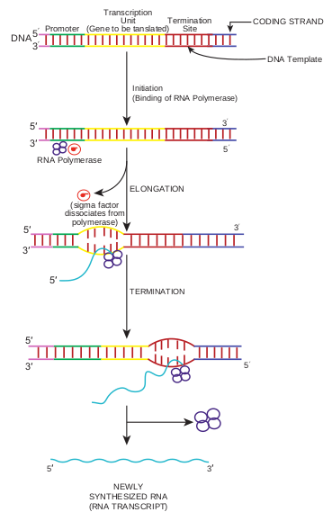

3\. The first nucleoside triphosphate is placed at polymerization start site (near to the initial binding site) and synthesis begins.

4\. RNA polymerase then moves along the DNA, adding ribonucleotides, to the growing RNA chain.

5\. RNA polymerase reaches chain termination sequence and both the newly synthesized RNA and the polymerase are released. Two kinds of termination events are known those that are self – terminating (dependent on the base sequence only) and those that require the presence of the termination protein Rho. Initiation of a second round of

transcription need not await completion of the first, for the promoter becomes available  

once RNA polymerase has polymerized 50–60 nucleotides. In bacteria most mRNA molecules are degraded within a few minutes after synthesis. This degradation enables cells to dispense with molecules that are no longer needed.

In prokaryotes mRNA molecules commonly contain information for the amino acid sequences of several different polypeptide chains. In this case, such a molecule is called polycistronic mRNA. Cistron is a term used to mean a base sequence encoding a single polypeptide chain. The genes contained in polycistronic mRNA molecule (Figure 12.3) often encode the different portions of a metabolic pathway. For example, in _E. coli_ the ten enzymes needed to synthesize histidine are encoded in one mRNA molecule.

Protein 2 Protein 3Protein 1

Protein 1

POLYCISTRONIC mRNA

EUKARYOTIC MARNA

MONOCISTRONIC

5’

5’

5’

3’

3’

3’

PROMOTER OPERATOR CISTRON 1 CISTRON 2 CISTRON 3

MULTIPLE TRANSLATION START SITE

SINGLE TRANSLATION START SITE

In prokaryotes the immediate product of transcription (called the primary transcript) is mRNA, in contrast in eukaryotes the primary transcript must be converted to mRNA. This conversion called RNA processing consists of two types of events- modification of termini and excision of untranslated sequences (non- coding sequence or introns) embedded

|------|------|------|------|

  

within coding sequences (exons). Introns excision and the joining of exons to form an mRNA molecule is called RNA splicing. The introns are present in almost all eukaryotic transcripts but are rare in the free – living unicellular eukaryotes such as yeast. Some bacterial genes do contain introns.

**Synthesis of rRNA and tRNA**

Ribosomal RNA and tRNA are also transcribed from genes. The production of these molecules is not as direct as synthesis of bacterial mRNA. The main difference is that these RNA molecules are excised from large primary transcripts. Highly specific RNA excise rRNA and tRNA from these large transcripts, and other enzymes produce the modified bases in tRNA.

## Genetic Code

A tRNA molecule “reads” the base sequence of mRNA. The language read by the tRNA molecules is called the genetic code, which is a set of relations between sequences of three adjacent bases on an mRNA molecule and particular amino acids. (A RNA base sequence (a set of 3 bases) corresponding to a particular amino acid is called a codon). The genetic code is the set of all codons. Only four bases in DNA serve to specify 20 amino acids in proteins, so some combination of bases is needed for each amino acid. Before the genetic code was elucidated, it was reasoned that if all codons were assumed to have the same number of bases, then each codon would have to contain at least three bases. Codons consisting of pairs of bases would be insufficient because four  

bases can form only 42 = 16 pairs, and there are 20 amino acid. Triplets of bases would suffice because, these can form 43 = 64 triplets. In fact, the genetic code is a triplet code, and all 64 possible codons carry information of some sort. Several different codons designate the same amino acid. Furthermore, in translating mRNA molecules the codons do not overlap but are used sequentially. The same genetic code is used by almost all biological systems and hence is said to be universal (exceptions are mitochondria and a few unusual microorganisms). The codons are by convention written with the 5′ end at the left. The complete code is shown in Table 12.1.

**Features of the Code:**

- Sixtyone codons correspond to amino acids. Four codons are signals. These are the three stop codons – UAA, UAG, UGA – and the one start codons, AUG. The start codons (initiation codon) also specifies the amino acid methionine. In rare cases, certain other codon (E.g. GUG) initiate translation. No normal tRNA molecule has an anticodon (a sequence of three bases on tRNA that can base – pair with a codon sequence in the mRNA) complementary to any of the stop codons UAG, UAA or UGA, which is why these codons are stop signals.

- The code is highly redundant i.e. more than one codons code for an amino acid. Only tryptophan and methionine are specified by one codon. The synonymous codons usually differ only in third base (except for serine, leucine and arginine).

  

1\. How many of the 64 codons can be made from the three nucleotides A, U, and C?

2\. If codons were four bases long, how many codons would exist in a genetic code?

**HOTS**

## Translation
 RNA is translated from the 5′ end of the molecule toward the 3′ end. Polypeptides are synthesized from the amino terminus toward the carboxyl terminus, by adding amino acids one by one to the carboxyl end.

**Table 12.1:** Genetic code  

Not all the base sequences in an mRNA is translated into amino acid sequences of polypeptides. Initiation of polypeptide synthesis may begin hundreds of nucleotides from the 5′ – P terminus of the RNA. The section of untranslated RNA before the region encoding the first polypeptide chain is called a **leader**, which in some cases contains regulatory sequences that influence the rate of protein synthesis. The major events in translation are (Figure 12.4). 1. An mRNA binds to the surface of

a protein synthesizing particle, the **Ribosome**.

2\. The tRNA – amino acid complexes (made by the aminoacyl tRNA synthetases) bind sequentially, one by one, to the mRNA molecule that is attached to the ribosome.

**The 20 amino acids and their abbreviations** Amino acid 3-letter

abbreviation

Alanine Ala Arginine Arg Asparagine Asn Aspatic acid Asp Aspartic acid & Asparagine

Asx

Cysteine Cys Glutamine Gln Glutamic acid Glu Glutaine or Glutamic acid

Glx

Glycine Gly Histidine His Isoleucine IIe Leucine Leu Lysine Lys Methionine Met

| The 20 a mino aci ds a nd the irabbr e v i ati on s |
|------|------|
| Amin o acid |3-let terabbre v i at ion |
| A l anin e |Ala |
| Arg inin e |Arg |
| Asp arag ine |As n |
| Asp at ic acid |Asp |
| Asp ar t ic acid &Asp arag ine |As x |
| Cys tein e |Cy s |
| Glut amine |Gl n |
| Glut amic acid |Glu |
| Glut aine orGlut amic acid |Gl x |
| Glycin e |Gly |
| Hist idin e |Hi s |
| Is oleucin e |IIe |
| L eucin e |L eu |
| Lysin e |Lys |
| Met hio nin e |Met |
  

3\. Peptide bonds are made between successively aligned amino acids.

4\. Finally the chemical bond between the tRNA and its attached amino acids is broken and the completed protein is removed.

- The 3′ terminal of the tRNA molecule (Figure 12.5) is covalently linked to the amino acid corresponding to the particular mRNA codon

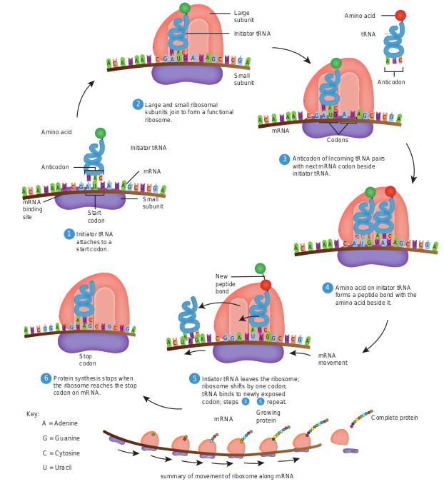

CAU

Larg subu

Sma subu

Large and small ribosomal subunits join to form a functional ribosome.

Initiator tRNA

Amino acid

Anticodon

mRNA binding site Start

codon

Initiator tRNA attaches to a start codon.

Stop codon

Protein synthesis stops when the ribosome reaches the stop codon on mRNA.

Key: A = Adenine

G = Guanine

C = Cytosine

U = Uracil

Intiator tRNA le ribosome shifts tRNA binds to n codon; steps

mRNA

New peptide bond

Small subunit

mRNA

summary of movement of ribos

Initia

2

1

6 5

A U C C CG G A A

AU U CA U

U UG G GG

CAU

CA U

A C C CCA A A U A

AU U UG UG A A G G

A C C CCA A A U A

U U UG UG A A G G

A C CU G A A

A U G G  

- When an amino acid has become attached to a tRNA molecule, the tRNA is said to be acylated or charged

- An important feature of initiation of polypeptide synthesis in both prokaryotes and eukaryotes is the use of a **specific initiating tRNA molecule**. In prokaryotes this tRNA molecule is acylated with the modified amino acid N – formyl methionine (fMet). This

ts in Translation

e nit

ll nit

aves the ribosome; by one codon; ewly exposed repeat.

Growing protein

mRNA Codons

Anticodon of Incoming tRNA pairs with next mRNA codon beside initiator tRNA.

Amino acid on initator tRNA forms a peptide bond with the amino acid beside it.

mRNA movement

Complete protein

ome along mRNA

tor tRNA

Amino acid

Anticodon

tRNA

4

3 5

3

CA U

CAU

CAA

A C C CCA A A U A

AU U UG UG A A G G

A C C CCA A A G A

AU U GU UA U A G G

CCG AAU UU G G

CA U

  

tRNA is often designated **tRNA_fMet_**. Both tRNA_fMet_ and tRNA_Met_ recognize the codon AUG, but only tRNA_fMet_

is used for initiation. All prokaryotic proteins while being synthesized have fMet at the amino terminus. However, this amino acid is frequently deformylated or removed later.

- The usual form of translation unit is a polyribosome or polysome wherein an mRNA is covered with ribosomes.

Amino acid

T loop D loop

Anticodon loop

Anticodon C C

G G G C C A U A GGAU C C

mRNA 5′ 3′

Codon

A

U

3′

5′

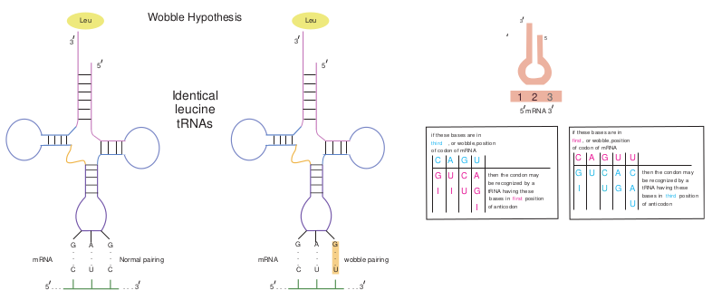

Wobble Hypothesis

G . . . C

G . . . C

A . . . U

Leu

Normal pairingmRNA

. . .. . . 35

3

5

G . . . C

G . . . U

A . . . U

Leu

wobble pmRNA

. . .. . . 3

3

5

5

Identical leucine tRNAs  

**Redundancy and the Wobble Hypothesis**

The identity of the third base of a codon appears to be unimportant. (The first base in a codon is at the 5′ end and the third base is at the 3′ end). Wobble refers to the less stringent requirement for base pairing at the third position of the codon than at the first two positions. That is the first two bases must follow Watson and Crick base pairing rule (A with U, or G with C), but the third base pair can be of a different type (for example, G with U). The Wobble hypothesis explains the pattern of redundancy in the code in that certain anticodons (For example, those containing U and G in the first position of the anticodons) can pair with several codons during translation (Figure 12.6).

## Types of Mutations

The base sequence of DNA determines the amino acid sequence of a protein. The chemical and physical properties of each protein are determined by its amino acid sequence, so a single amino acid change is capable of altering the activity of, or even completely inactivating, a protein. **Genotype** refers to the genetic composition

le hypothesis

3

5

airing

mRNA 35

1 2 3

C

G

I

A

U

I

G

C

U

U

A

G

I

then the condon may be recognized by a tRNA having these bases in first position of anticodon

if these bases are in third , or wobble,position of codon of mRNA

C

G

I

A

U

G

C

U

U

A

G

U

C

A

U

then the condon may be recognized by a tRNA having these bases in third position of anticodon

if these bases are in first , or wobble,position of codon of mRNA

| if these bases are inothfCircod donA, or of wm GobRbNleA U,positionthen the condon maybe rec ognized by atRNA h aving these bases in  first  positionof ant icodon |
|------|------|------|------|------|
| GI |UI |CU |AGI |

| if these bases are inofir fC cst o,door  Anw oobf mRNGble,poA Usition Uthen the condon maybe rec ognized by atRNA h aving thesebase s in third  positionof ant icodon |
|------|------|------|------|------|------|
| G U C A CI U G AU |
  

of an organism. **Phenotype** is an observable property of organism. The functional form of a gene is called **Wildtype** because presumably this is the form found in nature.

**Mutation** is the process by which the sequence of base pairs in a DNA molecule

In 1970 Howard Temin and David Baltimore independently discovered the enzyme **reverse transcriptase** that retroviruses use to produce DNA copies of their RNA genome. This enzyme can be used to construct DNA copy, called **complementary DNA** (cDNA), of any RNA as shown in figure below . Thus genes or major portions of the gene can be synthesized from mRNA.

A

T T T T

AAAAAAA

A

T T T T

AAAA 5

3

5

5

Hairpin loop

cDNA

RNA Poly(A) tail

cDNA from mRNA

Oligo (dT) primer

Viral reverse transcriptase

NaOH degrades mRNA

DNA polymerase I

3

RNA

AAA

T T T T 5

5

3

3

3 5

5

cDNA

S1 nuclease (single strand-specific)

Double-stranded cDNA

**Infobits**  

is altered.The alteration can be a single base pair substitution, insertion or deletion.

**Mutations can be divided into two general categories:** 1\. **Base–pair substitution mutation**

involves a change in the DNA such that one base pair is replaced by another. 
- A mutation from one purine –

pyrimidine base pair to the other purine –pyrimidine base pair is a transition mutation (Figure 12.7a). E.g. AT to GC, CG to TA.

- A mutation from a purine - pyrimdine base pair to a pyrimidine – purine base pair is a transversion mutation (Figure 12.7b). E.g. AT to TA, CG to GC.

2\. **Base pair insertion or deletions** involves the addition or deletion of one base pair. If one or more base pairs are added to or deleted from a protein coding gene, the reading frame of an mRNA can change downstream of the mutation. An addition or deletion of one base pair, for example, shifts the mRNA’s downstream reading frame by one base, so that incorrect amino acids are added to the polypeptide chain after the mutation site. This type of mutation, called a frame shift mutation (Figure 12.8) usually results in a nonfunctional protein.

**Frame shift mutations:*. 
- May generate new stop codons,

resulting in a shortened protein. 
- May result in a read through of the

normal stop codon, resulting in longer than normal proteins

- Or may result in a complete alteration of the amino acid sequence of a protein.

  

**Point mutations** are single base changes, that do not affect the reading frame, that is, the mutation only makes a single change in a single codon, and everything else is undisturbed. **Mutations can also be defined according to their effects on amino acid sequences in proteins. They are** 1\. A missense mutation (Figure 12.9a) is

a gene mutation in which a base – pair change in the DNA changes a codon in an mRNA so that a different amino acid is inserted into the polypeptide.

2\. A neutral mutation (Figure 12.9b) is a subset of missense mutations in which the new codon codes for a different amino acid that is chemically equivalent to the original and therefore does not affect the proteins function. Consequently, the phenotype does not change.

Sequence of part of a normal gene

Transition mutation (AT to GC in this example)

5′ 3′ 5′

3′TCTCAAAAATTTAGG

5′ 3′ 5′

3′

Transversion mutation (CG to GC in this example)

(a)

(b)

TCTCAAAAATTTAGG AGAGTTTTTAAATGC

AGAGTTTTTAAATGC

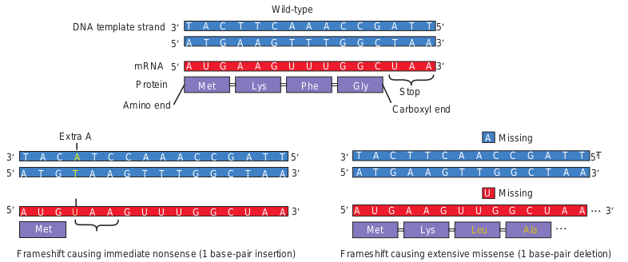

Met

Frameshift causing immediate nonsense (1 base-pair insertion)

T A T A T TA C A A GA C CC C

A T A T A AT G T T CT G GG A

Stop

A U A U A AU G U U CU G GG A

Extra A

Extra U

3

5

5

3

3

5

Met Lys

T T TA A A AC C

A A AT T T TG G

Phe

Wild-type

A A AU U U UG G

3DNA template strand

mRNA

Protein

Amino end

5

5  

3\. A silent mutation (Figure 12.9c) is also a subset of missense mutations that occurs when a base – pair change in a gene alters a codon in the mRNA such that the same amino acid is inserted in the protein. In this case, the protein obviously has a wild type function.

4\. A nonsense mutation (Figure 12.9d) is a gene mutation in which a base – pair change in the DNA, changes a codon in an mRNA to a stop (nonsense) codon (UAG, UAA or UGA). Nonsense mutation cause premature chain termination so instead of complete polypeptides, shorter than normal polypeptide fragments (often nonfunctional) are formed.

ns **(b)** transversion mutations

Sequence of mutated gene

5′ 3′ 5′

3′TCTCAAGAATTTACG AGAGTTCTTAAATGC

5′ 3′ 5′

3′TCTGAAAAATTTACG AGACTTTTTAAATGC

shift mutations

Met Lys Leu Ala

Frameshift causing extensive missense (1 base-pair deletion)

T T T T TA A A C TC G AC C

A A A AT T T G AG C TG G

MissingA

U Missing

A A A AU U U G A 

G C UG G

3

5

5

3

3

5

T TAC C G

A ATG G C

Gly Stop

3

3

A AUG G C

5

Carboxyl end

| TT AA CC TT AA CC G A T |
|------|

|  |AA U GG AA UUU GG C U A |
|------|------|------|------|------|------|
| Stop |
| Met |Lys |Phe |Gly |

| A UG GA U AU UU UG G C AA |
|------|------|
| Met |

| AA UU GG AA UG GC U A |
|------|------|------|------|
| Met |Lys |Leu |Ala |
  

Forward mutations change the genotype from wild type to mutant and reverse mutations (or reversions or back mutations) change the genotype from mutant to wild type or to partially wild type. An organism which has reverted is a Revertant. The effects of mutation may be diminished or abolished by a suppressor mutation. Suppressor mutation is a mutation at a different site from that of the original mutation. A suppressor mutation masks or compensates for the effects of the initial mutation, but it does not reverse the original mutation.

## Formation of Mutants

The term mutant refers to an organism in which either the base sequence of DNA or the phenotype has been changed. A mutant is an organism whose genotype differs from that found in nature. The process of formation of mutant organism is called mutagenesis. In nature and in the laboratory, mutations sometimes arise spontaneously,

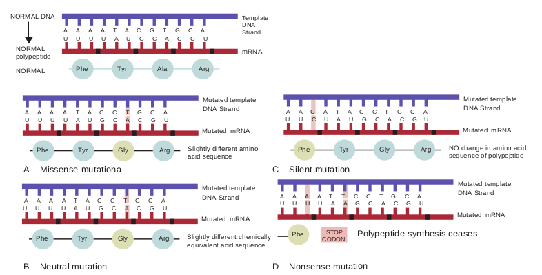

A A A A T A C G T G C A U U U U A U G C A C G U

Template DNA Strand

NORMAL DNA

NORMAL polypeptide

mRNA

NORMAL Phe Tyr Ala Arg

Mutated template DNA Strand

Slightly different amino acid sequence

Mutated mRNA

Phe Tyr Gly Arg

Mutated template DNA Strand

Slightly different chemically equivalent acid sequence

Mutated mRNA

Phe Tyr Gly Arg

A A A A T A C C T G C A U U U U A U G C A C G U

A A A A T A C C T G C A

C

D

A Missense mutationa

B Neutral mutation

A U

U U U U A U G C A C G U  

without any help from the experimenter. This is called spontaneous mutagenesis. The two mechanisms that are most important for spontaneous mutagenesis are 1. Errors occurring during replication

and 2. Spontaneous alteration of bases.

Mutations can also be induced experimentally by application of mutagens. Mutagens are agents that cause mutations.

**Mutagens and their Mode of Action**

**Physical Mutagens UV radiation:** UV light causes mutations because the purine and pyrimidine bases in DNA absorb light strongly in the ultraviolet range (254 to 260 nm). At this wavelength, UV light induces point mutations primarily by causing photochemical changes in the DNA. One of the effects of UV radiation on DNA is the formation of abnormal chemical bonds between adjacent pyrimidine

lent **(d)** nonsense mutation respectively

Mutated template DNA Strand

NO change in amino acid sequence of polypeptide

Mutated mRNA

Phe Tyr Gly Arg

A A G A T A C C T G C A U U C U A U G C A C G U

Mutated template DNA Strand

Polypeptide synthesis ceases

Silent mutation

Nonsense mutation

Mutated mRNA

Phe

A A A T T C C T G C A U U U A A G C A C G U

STOP CODON

  

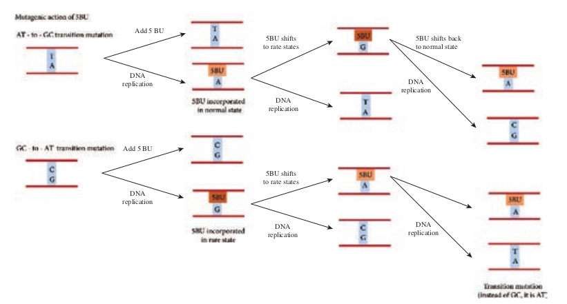

Add 5 BU

Add 5 BU

5BU shifts to rate state

5BU shifts to rate state

DNA replicatio

DNA replicatio

DNA replication

DNA replication

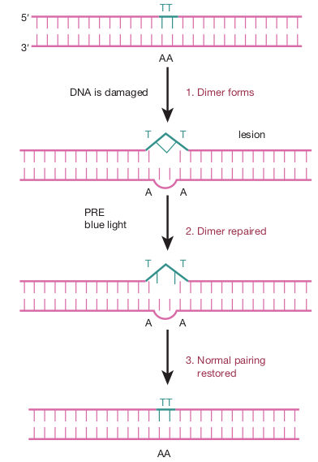

DNA is damaged

5

3

lesion

1\. Dimer forms

2\. Dimer repaired

3\. Normal pairing restored

PRE blue light

AA

A A

A A

AA

TT

T T

T T

TT  

molecules in the same strand, or between pyrimidines on the opposite strands, of the double helix. This bonding is induced mostly between adjacent thymines, forming what are called thymine dimers (Figure 12.10), usually designated TT. This unusual pairing produces a bulge in the DNA strand and disrupts the normal pairing of T’s (thymines) with corresponding A’s(adenines) on the opposite strand. If UV induced genetic damage is not repaired, mutations or cell death may result.

**Chemical Mutagens** Chemical mutagens include both naturally occurring chemicals and synthetic substances. These mutagens can be grouped into different classes on the basis of their mechanism of action. They are i. **Base analogs** are bases that are similar

to the bases normally found in DNA. E.g. 5 – bromouracil (5-BU). TA to CG (Figure 12.11).

ic effects of 5-BU

s

s

5BU shifts back to normal state

n

DNA replication

DNA replicationn

|------|------|

|------|------|

|------|
| DNA |

| to rate states |
|------|
| DNA |

| 5BU shifts backto normal state |
|------|
| DNAreplication |

| Add 5 BU |
|------|
| DNA |

| to rate states |
|------|

|------|
| DNAreplication |
  

Original base Mutagen

Cytosine Nitrous acid (H2NO) Ur

Cytosine Hydroxylamine

(NH2OH) cyst

Guanine

Methylmethane sulfonate(MMS)

(alkylating agent) O-Methy

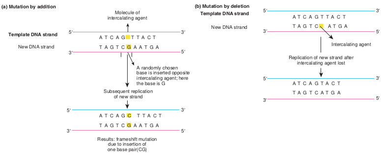

T A G T C G A A T G A

5′

5′3′

5′

5′3′

3′

3′

T A G T C G A A T G A

A T C A G C T T A C T

**(a) Mutation by addition (b**

**Template DNA strand**

New DNA strand

Molecule of intercalating agent

A randomly chosen base is inserted opposite intercalating agent; here the base is G

Subsequent replication of new strand

Results: frameshift mutation due to insertion of one base pair(CG)

A T C A G T T A C T

Not all base analogs are mutagens. For example, AZT (Azidothymidine), one

of the approved drugs given to patients with AIDS, is an analog of thymidine, but it is not a mutagen, because it does not cause base pair changes.

ii. **Base Modifying Agents** are chemical that act as mutagens by modifying the chemical structure and properties of bases. The three types of mutagens that work in this way are

1\. A deaminating agent e.g.: Nitrous acid removes amino groups (- NH2) from the bases guanine, cytosine, and adenine.  

e base modifying agents.

Modified base Pairing partner

Predicted transition

acil Adenine CG TA

Hydroxyl amino osine Adenine CG TA

lguanine Thymine CG TA

e to intercalating agents

5′

3′

5′

3′

5′

3′

5′

3′

T A G T C A T G A

A T C A G T T A C T

T A G T C A T G A

A T C A G T A C T

**) Mutation by deletion**

**Template DNA strand**

New DNA strand

Replication of new strand after intercalating agent lost

Intercalating agent

2\. Hydroxylamine (NH2 OH) is a hydroxylating mutagen that react specifically with cytosine, modifying it by adding a hydroxyl group (OH) so that it can pair solely with adenine instead of with guanine.

3\. Alkylating agents like methymethane sulfonate (MMS) introduces alkyl groups onto the bases at a number of location.

**iii. Intercalating agents** Acridine, proflavin, ethidium bromide are a few examples of intercalating agents. These insert (intercalate) themselves between adjacent bases in one or both strands of the DNA double helix. Intercalating agents can cause either additions or deletions.

| Or ig in a l b as e |Mut age n |Mo dif ie d b as ePair in g p ar t ner |Pre dic te dt ra nsi t io n |
|------|------|------|------|
| Cyt osin e |Nit rous acid (H NO )2 |Uraci l  Adenin e |C G  TA |
| Cyt osin e |Hydr oxy l amin e(NH OH )2 |Hydr oxy l a min oc ys tosin e   Adenin e |C G  TA |
| Gu anin e |Met hy lm et hanesu lf onate(MMS)(a l ky l at in g a gen t) |O-M et hy lgu anin e   Th y min e |C G  TA |

| A |
|------|

  

**Infobi**

**Isolation and detection of Mutants**

Once mutations are induced, then, they mu Selection and screening procedures histor mutants of interest from a heterogenous m When isolating mutants of a particular o or wild type characteristics so as to recog detection system for the mutant phenotype systems in bacteria and other haploid or any new allele should be seen immediately detection of mutants can be direct and com technique is used to detect auxotrophic mu synthesizing a particular biochemical com distinguishes between mutant and wild typ in the absence of a particular biosyntheti auxotroph, for instance, will grow on lysi medium lacking an adequate supply of lys amino acid.

Com con

Bacterial colonies grow. A few may be. lysine auxotrophs. Most are wild type.

Inoculate bacteria onto complete medium containing Iysine

Mutagen

Incubation Bacterial suspension

Stamp sterile velvet onto plate, picking up cells from each colony.

Sterile velvet surface

A

1

2

3  

**ts**

st be detected if they are to be studied. ically have helped geneticists isolate ixture in a mutagenized population.

rganism, one must know the normal nize an altered phenotype. A suitable under study also is needed. Detection ganisms are straightforward because , even if it is recessive mutation. The plex. For example, the replica plating tants (mutants which are deficient in pound). **Replica plating technique**

e strain based on their ability to grow c end product Figure below. A lysine ne supplemented media but not on a ine because it cannot synthesize this

plete medium taining Iysine

Identify auxotroph as colony growing on complete medium but not on lacking medium.

xx

x

Medium lacking Iysine

Stamp replica plates with velvet.

Bacteria

Incubation

Iysine auxotroph cannot grow

ll colonies grow

Inoculate auxotroph colony into complete medium.

4

5

6

  

**The Ames Test: A Screen for Potential Carcinogens** Everyday we are exposed to a wide variety of chemicals in our environment, such as drugs, cosmetics, food additives, pesticides, and industrial compounds. Many of these chemicals can have mutagenic effects, including genetic diseases and cancer. Some banned chemical warfare agents (e.g. mustard gas) also are mutagens.

A number of chemicals (subclass of mutagens) induce mutations that result in tumorous or cancerous growth. These chemical agents are called chemical carcinogens. Directly testing the chemicals for their ability to cause tumors in animals is time consuming and expensive. However, the fact that most chemical carcinogens are mutagens led Bruce Ames to develop a simple, inexpensive, indirect assay for mutagens. In general Ames test is an indicator of whether the chemical is a mutagen. The Ames test assays the ability of chemicals to revert mutant strains of the bacterium _Salmonella typhimurium_ to wild type. The mutant strain of _S.typhimurium_ is auxotrophic to histidine (his-

), that is it requires histidine for its growth and

**DNA Repair** Both prokaryotes and eukaryotes have a numbe kinds of DNA damage. All the systems use en repair systems lesions would accumulate and lesions are repaired, and mutations do appear, mutagens, repair systems are unable to correct a We can group repair systems into different categ Some systems correct damaged areas by reversin direct correction or direct reversal. Other sys repair the gap by new DNA synthesis. Some o. 
- Mismatch repair by DNA polymerase pr. 
- Repair of UV induced pyrimidine dimer. 
- Base excision repai. 
- Nucleotide excision repair

**Infobi**  

cannot grow in the absence of histidine. The mutant strain is grown in a histidine deficient medium containing the chemical to be tested. A control plate is also set up which does not contain the chemical. After incubation the control plates may have few colonies resulting from spontaneous reversion of the his- strain. Compared to the control plates if there are increased number of colonies on test plate, it indicates that the chemical has reverted the mutant strain back to wild type. This chemical is likely to be a carcinogen. Figure 12.14 shows steps in Ames test.

Plate the mixtures onto petri plates that lack histidine.

Rat liver extract

Rat liver extract

Provides a mixture of

enzymes that may activate a

mutagen

The control plate indicates that there is a low

level of spontaneous

mutation

Control

Mix together the salmonella strain, rat liver extract, and suspected mutagen. The suspected mutagen is omitted from the control sample.

Suspected mutagen

Salmonella strain (requires histidine)

Salmonella strain (requires histidine)

Incubate overnight to allow bacterial growth.

A large number of colonies suggests that the suspected mutagen causes mutation.

r of repair systems that deal with different zymes to make correction. Without this

be lethal to the cell or organism. Not all but at low frequencies. At high doses of ll of the damage, and cell death may result. ories on the basis of the way they operate. g the damage. This type of repair is called

tems excise the damaged areas and then the DNA repair systems are ofreading - Photo reactivation or Light repair

**ts**

  

**Methods of DNA Transfe**

1\. Conjugation 2. Bacterial transformation 3. Transposition 4. Phage transduction 5. Retroviral transduction 6. Agrobacterium mediated

transfer

1\. Microinjection 2. Protoplasts fusio 3. Bolistics transfo

**Natural Methods**

**Physical Meth**

Note: The term Transfection is used for the t various physical or chemical means.

With recombinant DNA technology it is possible to mutate a gene at specific posi- tions in the test tube

by SITE SPECIFIC MUTAGENESIS and then introduce the mutated gene back into the cell and investigate the pheno- typic changes produced by the mutation in vivo. Such techniques enable geneti- cists to study, for example, genes with un- known function and specific sequences involved in regulating a gene’s expression.

## Transfer of Genetic Material
 Normally, genes and the characteristics they code for are passed down from parent to progeny. This is called vertical gene transfer. Bacteria and some lower eukaryotes are unique in that they can pass DNA from one cell of the same generation  

**r**

n rmation

1\. DNA transfer by calcium phosphate method

2\. Transfer of DNA by use of polyethylene glycol

3\. Use of DEAE – Dextran for DNA transfer

4\. Liposome mediated transfer

1\. Electroporation 2. Electrofusion

**ods Chemical Methods**

**Electrical Methods**

**Artificial Methods**

ransfer of DNA into eukaryotic cells by

to another. The exchange of genes between two cells of the same generation is referred to as horizontal gene transfer. Mechanisms like transformation, transduction and conjugation takes place naturally and may bring about genetic variation and genetic recombination. These gene transfer mechanisms are also employed in genetic engineering to introduce desired gene into the cells. Introducing a foreign gene or recombinant DNA into the cells is one of the techniques used in genetic engineering. The success of cloning depends on the efficiency of gene transfer process. The most commonly employed gene transfer methods are transformation, conjugation, transduction, electroporation, lipofection and direct transfer of DNA. The choice of the method depends on the type of host cell (bacteria, fungi, plant, animal). Figure 12.15 shows methods of DNA transfer.

| Me tho ds o f D NA Tr an sfer |
|------|------|------|------|------|------|------|------|------|------|------|------|------|------|------|------|------|------|------|------|

| Ar tif i ci a |l M e tho ds |
| Natur a l M e tho ds |P1. M icr2. P rot3.  B oli |
| 1. C onjuga t io n2.  B ac ter i a l t ra3. Tra nsp osi t io4. P hage t ra ns d5. R et rov ira l t ra6.  Ag rob ac ter it ra nsf er |nsf or mat io nnuc t io nns duc t io num m e di ate d |

| hysi c a l Me tho ds |C he mi c a l  Me tho ds |

| 1.  DNA t ra nsf er b y c a lci umpho sphate me t ho d2.  Tra nsf er o f D NA b y u s e o fp olyet hy len e g lyco l3.  Us e o f D EAE – D ext ra n f orDNA t ra nsf er4.  L ip os ome m e di ate d t ra nsf er |
| oinj e c t io nopl asts f usio nst ics t ra nsf or mat io n |

| E l e c tri c a l M e tho ds |
  

### Transformation

Transformation is genetic alteration of a cell resulting from the direct uptake, incorporation and expression of exogenous genetic material (exogenous DNA) from its surroundings. Transformation occurs naturally in some species of bacteria, but it can also take place by artificial means in other cells. For transformation to happen, bacteria must be in a state of competence. Competence refers to the state of being able to take up exogenous DNA from the environment. There are two forms of competence: natural and artificial. Transformation works best with DNA from closely-related species. The naturally-competent bacteria carry sets of genes that provide the protein machinery to bring DNA across the cell membrane(s).

There are some differences in the mechanisms of DNA uptake by gram positive and gram negative cells. However, they share some common features that involve related proteins. The DNA first binds to the surface of the competent cells on a DNA receptor, and passes through the cytoplasmic membrane via DNA translocase. Only single stranded DNA may pass through, one strand is therefore degraded by nucleases in the process, and the translocated single-stranded DNA may then be integrated into the bacterial chromosomes. Figure 12.16 shows mechanism of transformation.

**Artificial competence** can be induced in laboratory by procedures that involve making the cell passively permeable to DNA. Typically, the cells are incubated in a solution containing divalent cations; most commonly, calcium chloride solution under cold condition, which is then exposed to  

a pulse of heat shock. Electroporation is another method of promoting competence. Using this method, the cells are briefly shocked with an electric field of 10–20 kV/ cm which is thought to create holes in the cell membrane through which the plasmid DNA may enter. After the electric shock, the holes are rapidly closed by the cell’s membrane-repair mechanisms.

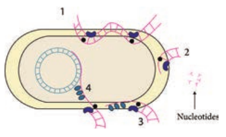

### Conjugation

The initial evidence for bacterial conjugation, came from an experiment performed by Joshua Lederberg and Edward L Tatum in 1946. Later in 1950, Bernard Davis gave evidence that physical contact of the cells was necessary for conjugation. During conjugation, two live bacteria (a donor and a recipient) come together, join by cytoplasmic bridges (e.g. pilus) and transfer single stranded DNA (from donor to recipient).

Inside the recipient cell, the new DNA may integrate with the chromosome (rather rare) or may remain free (as is the case with plasmids). Conjugation can occur among the cells from different genera of bacteria, while transformation takes place among the cells of a bacterial genus.

  

A plasmid called the fertility or F factor plays a major role in conjugation. The F factor is about 100 kilobases long and bears genes responsible for cell attachment and plasmid transfer between specific bacterial strains during conjugation. F factor is made up of **a.** tra region (tra operon / transfer genes):

genes coding the F pilus and DNA transfer,

**b.** Insertion sequence: genes assisting plasmid integration into host cell chromosome.

Thus, the F factor is an **episome** - a genetic material that can exist outside the bacterial chromosome or be integrated into it.

During F+ × F – mating or conjugation

(Figure 12.17a) the F factor replicates by the rolling circle mechanism and a copy moves to the recipient. The channel for DNA transfer could be either the hollow F pilus or a special conjugation bridge formed upon contact. The entering strand is copied to produce double – stranded DNA.

F factor can integrate into the bacterial chromosome at several different locations by recombination between homologous insertion sequences present on both the plasmid and host chromosomes. The integration of F factor into bacterial chromosome results in formation of HFR (High Frequency Recombination) cell. When integrated, the Fplasmid’s tra operon is still functional; the plasmid can direct the synthesis of pili, carry out rolling circle replication, and transfer genetic material to an F- recipient cell. An HFR cell is so called because it exhibits  

a very high efficiency of chromosomal gene transfer in comparison with F+ cells. In F+ cells the independent F factor rarely transfer chromosomal genes hence the recombination frequency is low. Figure 12.17b shows formation of HFR cell. When an HFR cell is mated with F- cell the F- recipient does not become F+ unless the whole chromosome is transferred as explained in Figure 12.17c. The connection usually breaks before this process is finished. Thus, complete F factor usually is not transferred, and the recipient remains F-.

Because the F plasmid is an episome, it can leave (deintegrate) the bacterial chromosome. Sometimes during this process, the plasmid makes an error in excision and picks up a portion of the chromosomal material to form an F′ plasmid. Figure 12.17d shows formation of F′. During F′XF- conjugation (Figure 12.17e) the recipient becomes F′ and is a partially diploid since it has two set of the genes carried by the plasmid.

The natural phenomenon of conjugation is now exploited for gene transfer and Recombinant DNA technology. In general, the plasmids lack conjugative functions and therefore, they are not as such capable of transferring DNA to the recipient cells. However, some plasmids with conjugative properties can be prepared and used.

### Transduction

Transduction is the transfer of bacterial genes from one bacteria to other by viruses. Example: Bacteriophage (Bacterial viruses). To understand the

  

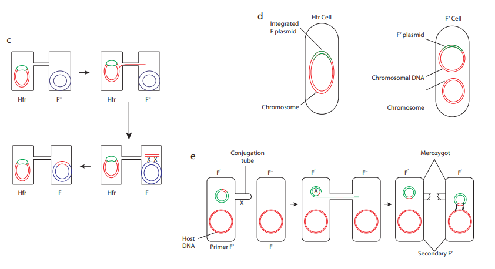

Hfr F– F–

X X

Hfr

Hfr F–

F’

F–Hfr

F plasmid Chromosome a

e

c

Conjugation pilus

F+ cell F– cell

F+ cell F– cell

Donor cell attaches to a recip cell with its pilus. The pilus dr cells together.

The cells contact one another

One strand of plasmid DNA transfers to the recipient.

The recipient synthesizes a complementary strand to bec an F+ cell; the donor synthesi a complementary strand, restoring its complete plasmi

Conjug tub

X

Host DNA Primer F’  

\+ × F– **(b)** HFR cell Formation **(c)** HFR × F–

F– F–F’

A

F’ F’

Merozygot

Secondary F’

b

d

ient aws the

.

ome zes

d.

Bacterial chromosome

F+ cell

F factor

Hfr cell

Crossing over takes place between F factor and chromosome

The F factor is integrated into the chromosome.

Integrated F plasmid

F’ CellHfr Cell

Chromosome

F’ plasmid

Chromosomal DNA

Chromosome

ation e

F

  

role of bacteriophage in gene transfer, the lifecycle of bacteriophage is described below briefly.

After infecting the host cell, a bacteriophage (phage for short) often takes control and forces the host to make many copies of the virus. Eventually the host bacterium bursts or lyses and releases new phages. This reproductive cycle is called a lytic cycle because it ends in lysis of the host.

The lytic cycle (Figure 12.18) has four phases. 1. Attachment - Virus particle attaches to

a specific receptor site on the bacterial surface.

2\. Penetration - the genetic material, which is often double stranded DNA, then enters the cell.

3\. Biosynthesis - After adsorption and penetration, the virus chromosome forces the bacterium to make viral components- viral nucleic acids and proteins.

4\. Assembly - Phages are assembled from the virus components. Phage nucleic acid is packed within the virus’s protein coat.

5\. Release - mature viruses are released by cell lysis.

Phage DNA cyclizes

Reinfection

Phage DNA replicates (rolling circle) Cell lysis

Phage heads, tails, and DNA assemble into

progery phage

Infection (absorption and penetration)

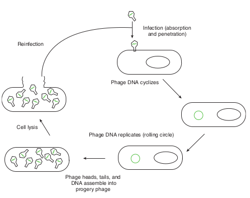

Bacterial viruses that reproduce using a lytic cycle often are called **virulent bacteriophages** (e.g. T phages) because they destroy the host cell. The genome of many DNA phages such as the lambda phage, after adsorption and penetration do not take control of its host and does not destroy the host. Instead the viral genome remains within the host cell and is reproduced along with the bacterial chromosome. The infected bacteria may multiply for long periods while appearing perfectly normal. Each of these infected bacteria can produce phages and lyses under appropriate environmental conditions. This relationship between phage and its host is called lysogeny (Figure 12.19).

Integration of phage DNA to form prophage

Infection (absorption and penetration)

Cell division

Phage DNA cyclizes

Cell division

Lysogenic clone

The latent form of virus genome that remains within the host without destroying the host is called the prophage.

The prophage usually is integrated into the bacterial genome. Sometimes phage reproduction is triggered in a lysogenized culture by exposure to UV radiation or other factors. The lysosomes are then destroyed and new phages released – This phenomenon is called induction (Figure 12.20).

  

Sometimes, bacterial genes are incorporated into a phage capsid because of errors made during the virus life cycle. The virus containing these genes then infects them into another bacterium, resulting in the transfer of genes from one bacterium to the other. Transduction may be the most common mechanism for gene exchange and recombination in bacteria.

There are two very different kinds of transduction. 1. Generalized transduction 2. Specialized transduction

**Generalized transduction** (Figure 12.21a) occurs during the lytic cycle of virulent and temperate phages. During the assembly stage, when the viral chromosomes are packaged into protein capsids, random fragments of the partially degraded bacterial chromosome also may be packaged by mistake. The resulting virus particles often injects the DNA into another bacterial cell but does not initiate a lytic cycle. Thus in generalized transduction any part of the bacterial

Phage DNA cyclizes

Reinfection

Phage DNA replicates (rolling circle) Cell lysis

Phage heads, tails, and DNA assemble into

progery phage

Infection (absorption and penetration)

chromosome can be transferred. Once the DNA has been injected it may integrate into the recipient cell’s chromosome to preserve the transferred genes. About 70 to 90% of the transferred DNA is not integrated but is often able to survive and express itself. However, if the transferred DNA is degraded gene transfer is unsuccessful.

**Specialized Transduction** (Figure 12.21b) is also called restricted transduction in which only specific portions of the bacterial genome is carried by the phage. When a prophage is induced to leave the host chromosome, exicision is sometimes carried out improperly. The resulting phage genome contains portions of the bacterial chromosome next to the integration site. When this phage infects another bacterium, it transfers the bacterial genes from the donor bacterium along with phage DNA. Here only the bacterial genes that are close to the site of prophage are transferred. So, this transduction is called specialized.

Integration of phage DNA to form prophage Cell division

Cell division

u:v

Induction

Lysogenic clone

tion of lysogen

  

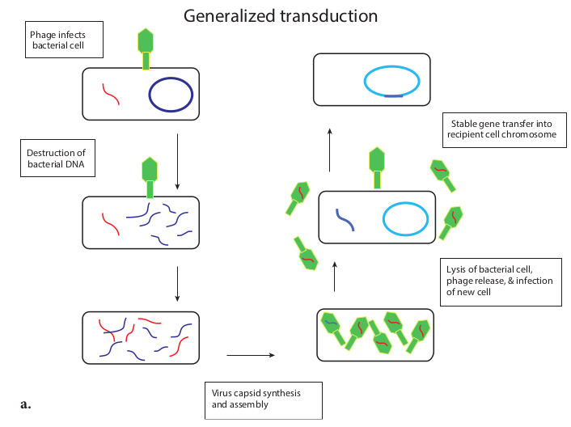
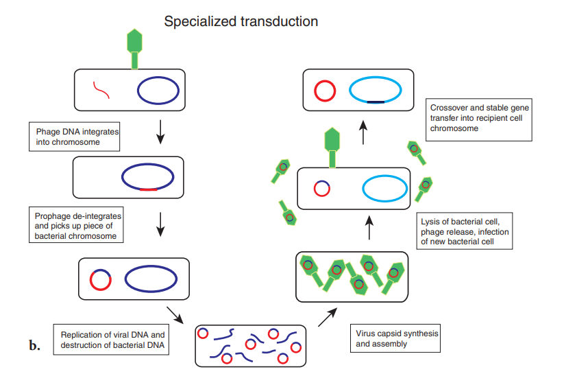

Phage infects bacterial cell

**Generalized tran**

Virus capsid synthesis and assembly

Destruction of bacterial DNA

Specialized transducti

Replication of viral DNA and destruction of bacterial DNA

Prophage de-integrates and picks up piece of bacterial chromosome

Phage DNA integrates into chromosome

**a.**

**b.**  

ction **(b)** Specialized Transduction

Stable gene transfer into recipient cell chromosome

**sduction**

Lysis of bacterial cell, phage release, & infection of new cell

Lysis of bacterial cell, phage release, infection of new bacterial cell

Crossover and stable gene transfer into recipient cell chromosome

on

Virus capsid synthesis and assembly

|------|------|
| Replication of viral DNA anddestruction of bacterial DNA |
  

The chromosomes of bacteria, viruses, and eukaryotic cells contain pieces of DNA that move around the genome. Such movement is called transposition. DNA segments that carry the genes required for this process and consequently move about chromosomes are transposable elements or transposons. Transposons are also called jumping genes because they can jump from one DNA to another, resulting in mutation of the cell. They were first discovered in 1951 by Barbara McClintock whose significant discovery was ignored by scientific community for many years. She was awarded the Nobel Prize in 1983.

**Infobits**

## Recombinant DNA Technology
 One of the practical applications of microbial genetics and the technology arising from it is the recombinant DNA technology. The deliberate modification of an organism’s genetic information by directly changing its nucleic acid genome is called genetic engineering and is accomplished by a collection of methods known as recombinant DNA technology. Recombinant DNA technology opens up totally new areas of research and applied biology. Thus, it is an essential part of biotechnology, which is now experiencing a stage of exceptionally rapid growth and development. In general sense, **recombination** is the process in which one or more nucleic acids molecules are rearranged or combined to produce a new nucleotide sequence. Usually genetic material from two parents is combined to produce a recombinant chromosome with a new, different genotype. Recombination results in a new arrangement of genes or  

parts of genes and normally is accompanied by a phenotypic change.

There are many diverse and complex techniques involved in gene manipulation. However, the basic principles of recombinant DNA technology are reasonably simple, and broadly involve the following stages (Figure 12.22).

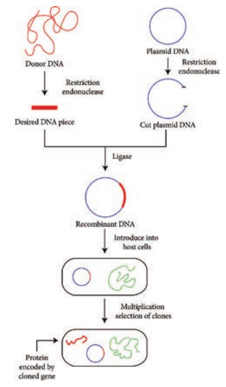

1\. Isolation of DNA from the source (Donor)

2\. Generation of DNA fragments and selection of the desired piece of DNA

3\. Insertion of the selected DNA into a cloning vector (Example: a plasmid) to

  

create a recombinant DNA or chimeric DNA.

4\. Introduction of the recombinant vectors into host cells (Example: bacteria)

5\. Multiplication and selection of clones containing the recombinant molecules

6\. Expression of the gene to produce the desired product.

Cloning in the molecular biology sense (as opposed to cloning whole organisms) is the making of many copies of a segment of DNA, such as a gene. Cloning makes it possible to generate large amounts of pure DNA, such as genes, which can then be manipulated in various ways, including mapping, sequencing, mutating and transforming cells. An overview of cloning strategies in recombinant DNA technology is shown in Figure 12.23.

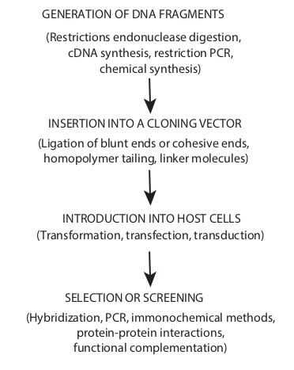

GENERATION OF DNA FRAGMENTS

(Restrictions endonuclease digestion, cDNA synthesis, restriction PCR,

chemical synthesis)

(Ligation of blunt ends or cohesive ends, homopolymer tailing, linker molecules)

INSERTION INTO A CLONING VECTOR

INTRODUCTION INTO HOST CELLS (Transformation, transfection, transduction)

SELECTION OR SCREENING

(Hybridization, PCR, immonochemical methods, protein-protein interactions,

functional complementation)  

## Vectors, Types and Characteristics

Vectors are the DNA molecules, which carry a foreign DNA fragment to be cloned. They are cloning vehicles, examples of which are Plasmids, Bacteriophages, cosmids, phagemids and artificial chromosomes. The vector types differ in the molecular properties they have and in the maximum size of DNA that can be cloned into each.

Characteristics of an ideal vector. 1. Should be small in size 2. Should contain one or more restriction site 3. Should be self replicating 4. Should contain an origin of replication

sequence (ori) 5. Should possess genetic markers (to

detect the presence of vectors in recipient cells)

**Plasmid Cloning Vectors**

Bacterial plasmids are extra chromosomal elements that replicate autonomously in cells. Their DNA is circular and double stranded and carries sequences required for plasmid replication (ori sequence) and for the plasmid’s other functions. (Note: A few bacteria contain linear plasmids. Example: _Streptomyces species, Borellia burgdorferi_). The size of plasmids varies from 1to 500 kb. Plasmids were the first cloning vectors. DNA fragments of about 570kb are efficiently cloned in plasmid cloning vectors. Plasmids are the easiest to work with. They are easy to isolate and purify, and they can be reintroduced into a bacteria by transformation. Naturally occurring plasmid vectors rarely possess all the characteristics of an ideal vector. Hence plasmid cloning vectors are

  

derivatives of natural plasmids and are “engineered” to have features useful for cloning DNA.

Examples of plasmid cloning vectors : pBR 322 (plasmid discovered by Bolivar and Rodriguez 322) and pUC 19 (plasmid from University of California). Herbert Boyer and Stanley Cohen in 1973 showed it was possible to transplant DNA segments from a frog into a strain of _Escherichia coli_ using pSC101, a genetically modified plasmid, as the vector. The work laid the foundation for the birth of Genetech, the first company dedicated to commercialization of recombinant DNA.

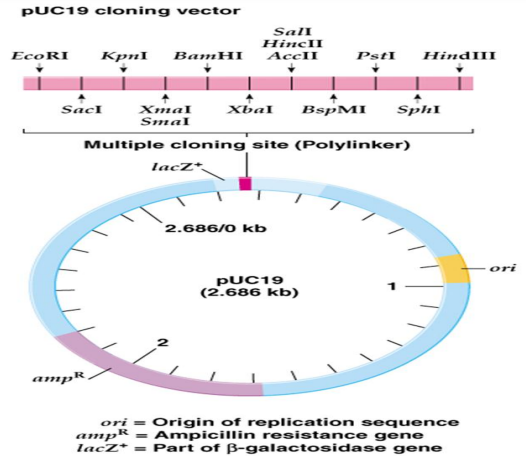

Figure 12.24a and 12.24b shows genetic maps of plasmid cloning vectors PUC19 and PBR322 respectively.

Plasmid cloning vector PUC 19 has 2,686 –bp and has following features: 1. It has a high copy number; so many

copies of a cloned piece of DNA can be generated readily.

2\. It has amp R (ampicillin resistant) selective marker

3\. It has a number of unique restriction sites clustered in one region, called a multiple cloning site (MCS) or polylinker

4\. The MCS is inserted into part of the E.coli β – galactosidase (lac Z+) gene. Figure 12.25 illustrates how a piece of DNA can be inserted into a plasmid cloning vector such as pUC19

C19 **(b)** PBR322

EcoRI

Pstl Ampicillin resistance (AmpR)

Tetracycline resistance (TetR)

pBR322 (4361 bp)

Origin of replication (ori)

BamHI

Sall

Pvull

  

**Bacteriophage as Cloning Vectors**

They are viruses that replicate within the bacteria. A phage can be employed as vector since a foreign DNA can be spliced into phage DNA, without causing harm to phage genes. The phage will reproduce (replicate the foreign DNA) when it infects bacterial cell. Both single and double stranded phage vectors have been employed in recombinant DNA technology. Derivatives of phage can carry fragments up to about 45 kb in length. Example PI bacteriophage and phage λ.

The main advantage of using phage vectors is that foreign DNA can be packed into the phage (invitro packaging), the latter in turn can be injected into

Restriction cut in polylinPlasmid confers resistance to ampicillin and can make functional b-galactosidase

DNA fragmen

3’ 3’ 5’

5’

Plasmid pUC19

_lacZ_\+ gene (part)

_amp_R _amp_R

ker Plasmid confers ampicillin resistance, but cannot make functional b-galactosidase

DNA insertion in disrupted lacZ genets

3’

5’

_amp_R

to the plasmid cloning vector pUC19 to

**Terms associated with plasmids:** 1\. Low copy number plasmids are

plasmids that occur low in number in each cell.

2\. High copy number are plasmids that occur high in number in each cell.

3\. Conjugative plasmids carry a set of transfer genes (tra genes) that facilities bacterial conjugation.

4\. Non – conjugative plasmidsare plasmids that do not possess transfer genes.

5\. Stringent plasmids are plasmids that are present in a limited number (1–2 per cell).

6\. Relaxed plasmids are plasmids that occur in large number in each cell.

7\. F plasmids possess genes for their own transfer from one cell to another

8\. R plasmids carry genes resistance to antibiotics.

**Infobits**

the host cell very effectively (Note: no transformation is required). Figure 12.28 shows how a λ phage is used for cloning.

  

**Cosmids:** Cosmids are the vectors possessing the characteristics of both plasmid and bacteriophage. The advantage with cosmids is that they carry larger fragments of foreign DNA (35–45 kb) compared to plasmids.

**Phagemids:** Phagemids are the combination of plasmid and phage and can function as either plasmid or phage. Since they posses functional origins of replication of both plasmid and phage λ they can be propagated (as plasmid or phage) in appropriate E.coli.

**Artificial chromosome Vectors:** Artificial chromosomes are cloning vectors that can accommodate very large

Circular DN

Replication

**LYTIC CYCLE**

Cleavage

Phage packaging

Phage particles

Host lysis

pieces of DNA, producing recombinant DNA molecules resembling small chromosomes. Example: Yeast Artificial Chromosome (YAC), Bacterial Artificial Chromosomes (BACs)

**Plasmid shuttle Vectors:** The plasmid vectors that are specifically designed to replicate in two or more different host organisms(say in E.coli and yeast) are referred to as shuttle vectors. The origins of replication for two hosts are combined in one plasmid.

**Expression vectors:** An expression vector is a cloning vector containing the

Excision integration

_E. coli_ chromosome

**Lysogenic cycle**

cos

A

Replication

cycle of phage λ

  

EcoRI

cos

EcoRI Left arm

Recombinant D

EcoRI

EcoR

EcoR

Add

+

regulatory sequences (promoter sequence) necessary to allow the transcription and translation of a cloned gene or genes.

## Restriction Enzymes

In 1960s Swiss microbiologist Werner Arber and American microbiologists Hamilthon Othanel Smith and Daniel Nathans discovered restriction enzymes. The discovery, for which the three men shared the 1978 Nobel Prize for Physiology or Medicine. Restriction enzymes or restriction endonucleases are one of the most important groups of enzymes for the manipulation of DNA. It is one of the important molecular tools used by a genetic engineer. These are the bacterial enzymes that recognize a specific base sequence in a DNA molecule (from any source) and make two cuts one in each strand generating 3′  

( (

cos

NA

Recombinant DNA

l Packaging system

Infectious phages

Infect E.coli

EcoRI

I

I

insert & ligate

g using a λ phage

– OH and 5′ – P termini. They were first discovered in E._coli_. E._coli_ produces the restriction enzyme to cut the viral DNA and protect itself. The host E.coli DNA is protected by its own restriction enzyme since its methylated. Since these enzymes restrict the viral replication the word restriction is added to these enzymes. Hind II was the first discovered restriction endonuclease.

The site where the DNA is cut by a restriction enzyme is called recognition sequence. Restriction endonucleases can specifically recognize DNA with a particular sequence of 4-8 nucleotides and cleave. Each recognition sequence has two fold rotational symmetry i.e. the same nucleotide sequence occurs on both strands of DNA which run in opposite direction. Such sequences are referred to as palindromes, since they read similar in both directions (forwards and backwards). Majority

  

**Type No of Enzyme and sub units**

**Cleavage site**

I One with 3 sub units for recognition cleavage and methylation

1000 bp from recognition site

II Two different enzymes to cleave or modify the recognition sequence

Same as recognit or close to recognition site

III One with 2 subunits 24- 26 bp from recognition site

**Table 12.2:** Types and features of restriction enzy of restriction endonucleases (particularly type II) cut DNA at defined sites within recognition sequence. Type II restriction enzymes make two single – stand breaks) one break in each strand. There are two distinct arrangements of these breaks 1. both breaks at the center of symmetry (generating flush or blunt ends) or 2. breaks that are symmetrically placed around the line of symmetry generating cohesive ends. Figure 12.29 shows two types of cuts made by restriction enzymes. The arrow indicates the cleavage site.  

s made by restriction enzymes

**Examples Bacterial source**

EcoK1 _Escherichia coli_

Cfr A1 _Citrobacter fruendii_

ion Eco R1 _Escherichia coli_

Alu I _Arthrobacter luteus_

Hinf III _Haemophilus influenzae_

Pst II _Providencia stuarti_

me The dashed line is the center of symmetry of the sequence (Table 12.2).

**Application of Recombinant DNA Technology**

a. Production of medically useful proteins such as somatostain, insulin, human growth hormone and interferon. It decreases the dependency on human tissues and solves problem of limited production.

| Typ e |No o f E nzy meand s ub uni ts |C l e avage s ite |E xa mpl es |Bac teri a l s our c e |
|------|------|------|------|------|
| I |On e w it h 3 s ub uni ts f orre cog ni t io n c le ava ge a ndmet hy l at io n |1000 b p f romre cog ni t io n si te |E coK1 |E s ch e r ichia  c oli |
| Cf r A1 |Citrob ac te r  f r ue ndii |
| II |Two dif fer en t enzy mesto c le ave o r m o dif y t here cog ni t io n s e quen ce |Sa me a s r e cog ni t io nor c los e t ore cog ni t io n si te |E co R1 |E s ch e r ichia  c oli |
| A lu  I |Ar throbac ter l uteu s |
| III |On e w it h 2 s ubuni ts |24- 26 b p f romre cog ni t io n si te |Hinf III |Haem ophilu s i nf luenz ae |
| Pst II |Prov ide nc ia  s tua r ti |
  

b. Development of synthetic vaccines for instance, vaccines for malaria and rabies a recombinant hepatitis vaccine is already commercially available.

c. Gene therapy d. Diagnosis of infection diseases. e. To manufacture industrially important

products like enzymes using bacteria, fungi and cultured mammalian cells.

## Techniques in Genetic Engineering
 There are several techniques used in recombinant DNA technology or gene manipulation. The most frequently used methods are agarose gel electrophoresis, isolation and purification of nucleic acids, nucleic acid blotting techniques, DNA sequencing, chemical synthesis of DNA, gene transfer methods, polymerase chain reaction, construction of gene library, radiolabeling of nucleic acids etc, few of them are discussed here.

### Agarose Gel Electrophoresis

Electrophoresis refers to the movement of charged molecules in an electric field. The negatively charged molecules move towards the positive electrode while the positively charged molecules migrate towards the negative electrode. Gel electrophoresis is a routinely used analytical technique for the separation and purification of specific DNA fragments. The gel is composed of either polyacrylamide or agarose. Polyacrylamide gel electrophoresis (PAGE) is used for the separation of smaller DNA fragments while agarose electrophoresis is convenient for the separation of DNA fragments ranging in size from 100 base pairs to 20 kilobase pairs.  

Gel electrophoresis can also be used for the separation of RNA molecules. A diagramatic view of the agarose gel electrophoresis unit is shown in Figure 12.30a.

**Steps**

1\. Gel is set with wells on one end.

2\. The gel is placed in an electrophoresis apparatus and covered with buffer solution.

3\. The DNA samples along with tracer dye are placed in the wells of gel.

A genomic library is a collection of clones that contains at least one copy of

every DNA sequence in an organism’s genome. Like libraries with books, genomic libraries are a great source of information; in this case, the information is about the genome. Specific sequences in cDNA libraries and genomic libraries can be identified via a number of approaches, including the use of specific antibodies, cDNA probes and oligonucleotide probes

Human artificial chromosome (HAC)-based vectors offer a promising system for delivery and expression of full-length human genes of any size into human cells, and a tool for determining human chromosome function. It does not have the problem of limited cloning capacity of other vectors, and it also avoids possible insertional mutagenesis caused by integration into host chromosomes by viral vector.

  

4\. Power supply is switched on and gel is run till the tracer dye reaches the end of the gel.

As the DNA is negatively charged, DNA fragments move through the gel towards the positive electrode. The rate of migration of DNA is dependent on the size and shape. In general, smaller linear fragments move faster than the larger ones. Hence, gel electrophoresis can be conveniently used for the separation of a mixture of DNA fragments, based on their size. The bands of the DNA can be detected by soaking the gel in ethidium bromide solution (Ethidium bromide can also be added to molten agarose prior to setting the gel). When activated by ultraviolet radiation, DNA base pairs in association with ethidium bromide, emit orange fluorescence. And in this way the DNA fragments separated in agarose electrophoresis can be identified (Figure 12.30b).

PAGE is composed of chains of acryl amide monomers crosslinked with methylene

bisacryalmide units. The pore size of the gel is dependent on the total concentration of monomers and the cross links. PAGE is used for the separation of single stranded DNA molecules that differ in length by just one nucleotide. Agarose gels cannot be used for this purpose. This is because polyacrylamide gels have smaller pore sizes than agarose gels and allow precise separation of DNA molecule from 10–1500 bp.

1\. Explain how gel electrophoresis can be used to determine the size of a PCR product.

**HOTS**

### Polymerase Chain Reaction (PCR)

The PCR technique has already proven exceptionally valuable in many areas of molecular biology, medicine, and biotechnology. PCR technique has great practical importance and impact

esis unit **(b)** DNA electrophoresis gel

  

on biotechnology. Between 1983 and 1985 American biochemist Kary Mullis developed PCR technique that made it possible to synthesize large quantities of a DNA fragment without cloning it. Mullis received the 1993 Nobel Prize for Chemistry for his invention. PCR is a cell free amplification technique.

Figure 12.31 outlines how PCR technique works. To amplify (make large quantities) a particular DNA sequence by PCR a reaction mixture (often 100μl or less in volume) containing the following are required.

Heat briefly to separate DNA strands

Nucleotides: dATP dCTP dGTP dTTP

Targeted sequenceSTART

Cool to allow primers to hydrogen- bond

four pieces of DNA

two pieces of DNA

heat, cool polymerize

heat, cool polymerize

one piece of DNA

primer has base sequence homology to DNA

DNA STRAND

3’5’ T A

T G C

PRIMER

Primers:

A C G G T ETC

DNA polymerase adds nucleotides to the 3’ end of each primer

1

2

3

Cycle 1 yields

2 molecules

Cycle 2 yields

4 molecules

Cycle 3 yields

8 molecules

eight pieces of DNA

DNA 5’ 3’

5’

5’

3’ 5’

Primers

3’

3’

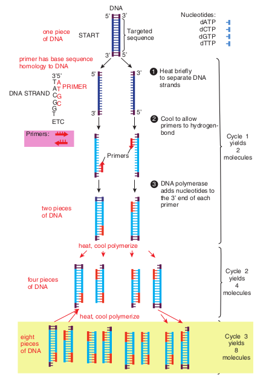

oligonucleotides, usually about 20 nucleotides long. These are  

Cloned genes and other DNA sequences often are analyzed to determine the arrangement and specific locations of restriction sites. The analytical process involves cleavage of the DNA with restriction enzymes, followed by separation of the resulting DNA fragments by agarose gel electrophoresis. The sizes of the DNA fragments are calculated, enabling restriction maps to be constructed. The many DNA fragments produced by cleaving genomic DNA show a wide range of sizes, resulting in a continuous smear of DNA fragments in the gel. In this case, specific gene fragments can be visualized only by transferring them to membrane filter by southern blotting, hybridizing a specific labelled probe with the DNA fragments, and detecting the hybrids. A similar procedure, Northern blotting is used to analyze the sizes and quantities of RNAs isolated from cell.

**Infobits**

fragments with sequences identical to those flanking the targeted sequence.

3\. **Thermostable DNA polymerase**– Two popular enzymes employed in the PCR technique are Taq polymerase from the thermophilic bacterium _Thermus aquaticus_ and the vent polymerase from _Theromococcus litoralis_. These polymerases employed in PCR technique are able to function at high temperatures.

4\. **Four deoxyribonucleoside triphosphates** (dNTPs)- dCTP, dATP, dGTP, dTTP

  

Taq polymerase lacks proof reading exonuclease (3′–5′) activity which might

contribute to errors in the products of PCR. Some other thermostable DNA polymerases with proof reading activity have been identified. Example: Tma DNA polymerase from _Thermotoga maritana_.

**Steps in PCR**

1\. **Denaturation:** The target DNA containing the sequence to be amplified is heat denatured to separate its complementary strands at temperature 94 °C–95 °C.

2\. **Annealing:** The temperature is lowered to 37 °C–55 °C so that the primers can hydrogen bond or anneal to the DNA on both sides of the target sequence. Because the primes are present in excess the targeted DNA strands normally anneal to the primers rather than to each other.

3\. **Extension:** Heat resistant DNA polymerase extends the primers and synthesizes copies of the target DNA sequence using the deoxyribonucleoside triphosphate’s at 70 °C–75 °C.

The three – step cycle (Figure 12.32) is repeated to obtain copies of target DNA in large numbers. At the end of one cylcle, the targeted sequences on both strands have been copied. When the three – step cycle is repeated, the four strands from the first cycle are copied to produce eight fragments. The third cycle yields 16 products. Theoretically, 20 cycles will  

produce about one million copies of the target DNA sequence. Each cycle of PCR takes about 3 – 5 minutes.

ElongationAnnealing

Denaturation

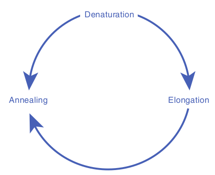

The PCR technique has now been automated and is carried out by a specially designed machine (Figure 12.33) PCR machines are now fully automated and microprocessor controlled. They can process up to 96 samples at a time. PCR machines can carry out 25 cycles and amplify DNA 105 times in as little as 57 minutes.

The PCR has many applications in research and in commercial arena, including generating specific DNA segments for cloning or sequencing, amplifying DNA to detect specific genetic defects, and amplifying DNA for fingerprinting in crime scene investigation.

PCR technology is improving continually. Various forms of PCR are available. RNA too can be efficiently used in PCR procedures. Cellular RNAs and RNA viruses may be studied even when the RNA is present in very small amounts (as few as 100 copies can be transcribed and amplified). Quantitative PCR is quite valuable in virology and gene impression studies. PCR is

  

modified as per the specific demands of the situation. Thus there are many variations in the original PCR Examples nested PCR, inverse PCR, reverse transcription PCR, time quantitative PCR, RAPD, RFLP, AFLP.

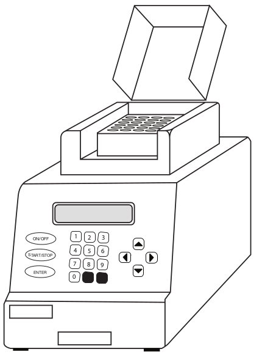

1 2 3

4 5 6

7

0

8 9

ON/OFF

START/STOP

ENTER

Both PCR and Cloning allow for the production of many copies of a DNA sequence. What are the advantages of using PCR instead of cloning to amplify a DNA template?

What advantages are there to using a DNA polymerase for PCR that has proofreading activity?

**HOTS**  

In 1970s American molecular biologists Allan M. Maxam and Walter Gilbert and English biochemist Frederick Sanger developed some of the first techniques for DNA sequencing. Gilbert and Sanger shared the 1980 Nobel Prize for Chemistry for their work. Dideoxy procedure is one of the procedure used to sequence DNA.

**Infobits**

**Summary** The fundamental unit of information in living systems is the gene. Genome is the set of all genes and genetic signals of a cell. Gene is expressed through a sequence of events. The central dogma of molecular biology, comprises the three major processes replication, transcription and translation. The genetic message encoded in messenger RNA (mRNA) is translated on the ribosomes into a polypeptide with a particular sequence of amino acids. An RNA base sequence (a set of 3 bases) corresponding to a particular amino acid is called a codon. The genetic code is the set of all codons. The genetic code is a triplet code, and all 64 possible codons carry information of some sort. The code is highly redundant. Polypeptides are synthesized from the amino terminus toward the carboxyl terminus, by adding amino acids one by one to the carboxyl end. An important feature of intiation of polypeptide synthesis in both prokaryotes and eukaryotes is the use of a specific initiating tRNA molecule.

Mutation is the process by which the sequence of base pairs in a DNA molecule is altered. Mutations can be divided into

  

base pair substitution mutation and base pair insertion or deletions.

Frame shift mutation usually results in a nonfunctional protein. An addition or deletion of one base pair, for example, shifts the mRNA’s downstream reading frame by one base, so that incorrect amino acids are added to the polypeptide chain after the mutation site. Point mutations are single base changes, that do not affect the reading frame, that is, the mutation only makes a single change in a single codon,

**DNA Fingerprinting Or DNA Profiling:** DNA fingerprinting is the present day gene medical forensics. The underlying princip described.

The structure of each person’s genome monozygotic identical twins (twins develop unique nature of genome structure provide identification of an individual. The DNA fing base sequence in the DNA of an individual.

The original DNA fingerprinting techni 1985. Although the DNA fingerprinting is co profiling is preferred. This is due to the fact out by DNA sequencing with improved techn **Applications of DNA fingerprinting:** The amount of DNA required for DNA finge quantities of DNA from blood strains, bod are enough. Polymerase chain reaction is fingerprinting. DNA profiling has wide rang to medical forensics. Some important ones a. 
- Identification of criminals, rapists, thiev. 
- Settlement of paternity disputes. 
- Use in immigration test cases and dispute

In general, the fingerprinting technique is a suspect (or a person in a paternity of immig of a reference sample (from the victim of a cr

**Infobi**  

Mutations can also be defined according to their effects on amino acid sequences in proteins. They are missense mutation, silent mutation, nonsense mutation. Forward mutations change the genotype from wild type to mutant and reverse mutations (or reversions or back mutations) change the genotype from mutant to wild type or to partially wild type.

The term mutant refers to an organism in which either the base sequence of DNA or the phenotype has been changed. The

tic detective in the practice of modern les of DNA fingerprinting are briefly

is unique. The only exception being ed from a single fertilized ovum). The s a good opportunity for the specific erprint is an analysis of the nitrogenous

que was developed by Alec Jaffreys in mmonly used, a more general term DNA that a wide range of tests can be carried ology.

rprint is remarkably small. The minute y fluids, hair fiber or skin fragments

used to amplify this DNA for use in e of applications – most of them related e listed below.

s etc.

s. carried out by collecting the DNA from ration dispute) and matching it with that ime, or a close relative in a civil case).

**ts**

  

process of formation of mutant organism is called mutagenesis. Ames test is an indicator of whether the chemical is a mutagen. The Ames test assays the ability of chemicals to revert mutant strains of the bacterium Salmonella typhimurium to wild type. The most commonly employed gene transfer methods are transformation, conjugation, transduction, electroporation, lipofection and direct transfer of DNA. Transformation is genetic alteration of a cell resulting from the direct uptake, incorporation and expression of exogenous genetic material (exogenous DNA) from its surroundings. Competence refers to the state of being able to take up exogenous DNA from the environment. During conjugation, two live bacteria (a donor and a recipient) come together, join by cytoplasmic bridges (e.g. pilus) and transfer single stranded DNA (from donor to recipient). Transduction is the transfer of bacterial genes from one bacteria to other by viruses, e.g. Bacteriophage (Bacterial viruses). **Recombination** is the process in which one or more nucleic acids molecules are rearranged or combined to produce a new nucleotide sequence. Cloning in the molecular biology sense (as opposed to cloning whole organisms) is the making of many copies of a segment of DNA, such as a gene. Cloning makes it possible to generate large amounts of pure DNA, such as genes, which can then be manipulated in various ways

Vectors are the DNA molecules, which carry a foreign DNA fragment to be cloned. They are cloning vehicles, examples of which are Plasmids, Bacteriophages, cosmids, phagemids and artificial chromosomes. Bacterial plasmids are extra chromosomal  

elements that replicate autonomously in cells. They are viruses that replicate within the bacteria. Cosmids are the vectors possessing the characteristics of both plasmid and bacteriophage. Phagemids are the combination of plasmid and phage, and can function as either plasmid or phage. The plasmid vectors that are specifically designed to replicate in two or more different host organisms (say in E. _coli_ and yeast) are referred to as shuttle vectors. An expression vector is a cloning vector containing the regulatory sequences (promoter sequence) necessary to allow the transcription and translation of a cloned gene or genes. Restriction enzymes are the bacterial enzymes that recognize a specific base sequence in a DNA molecule (from any source) and make two cuts one in each strand generating 3′ – OH and 5′ – P termini.

There are several techniques used in recombinant DNA technology or gene manipulation. The most frequently used methods are agarose gel electrophoresis, isolation and purification of nucleic acids, nucleic acid blotting techniques, DNA sequencing, chemical synthesis of DNA, gene transfer methods, polymerase chain reaction, construction of gene library, radiolabeling of nucleic acids etc. Gel electrophoresis is a routinely used analytical technique for the separation and purification of specific DNA fragments. PCR is a cell free amplification technique. The three – step cycle is repeated to obtain copies of target DNA in large numbers.

The DNA markers are highly useful for genetic mapping of genomes. RFLPS (Restriction Fragment Length Polymorphisms), VNTRs (mini satellites or Variable Number Tandem Repeats),

  

STRs (Microsatellites or Simple Random Repeats), SNPs (Single Nucleotide Polymorphisms) are types of DNA sequences (stretch of DNA) which can be used as markers. These markers are used in disease diagnosis and DNA fingerprinting.

**Evaluation**

**Multiple choice questions**

1\. Which of the fol- lowing properties is essential for the function of a tRNA molecule? a. Recognition of a codon b. Recognition of an anticodon c. Ability to distinguish one amino

acid from another d. Recognition of DNA molecule

2\. Which chain termination codon could be formed by a single base change from UCG, UGG and UAU? a. UAA b. UAG c. UGA d. AUG

3\. Which of the following base-pair changes are transitions? a. AT → TA b. AT → GC c. Both a and b d. GC → AT

4\. UV light usually causes mutations by a mechanism involving a. One-strand breakage in DNA b. Deletion of DNA segments c. Induction of thymine dimers and

their persistence d. Inversion of DNA segments

5\. The form of genetic information used directly in protein synthesis is  

a. DNA b. mRNA c. rRNA d. tRNA

6\. display one anticodon each a. eukaryotic mRNAs b. transfer RNAs c. ribosomal RNAs d. mRNAs

7\. contains exons and introns. a. Eukaryotic mRNAs b. rRNA c. tRNAs d. primers

8\. The symbol lac+ refer to a. genotype b. phenotype c. both a & b d. none

9\. sequence terminates protein synthesis a. UAA b. UAG c. UGA d. All the above

10\. The principal start codon corresponds to which amino acid? a. Valine b. arginine c. Methionine d. Isoleucine

11\. Number of nucleoprotein subunit in a prokaryotic ribosome a. 2 b. 4 c. 5 d. 6

12\. A deletion occurs that eliminates a single amino acid in a protein. How many base pairs were deleted? a. 1 b. 2 c. 3 d. 4

13\. During conjugation plasmids undergo a. Theta replication

  

b. rolling circle replication c. sigma replication d. gamma replication

14\. If a plasmid is mobilizable but nonconjugative, what function does it lack? a. Antibiotic resistance b. Fertility c. Colicinogenic d. Restriction sequences

15\. The uptake of naked DNA from the surrounding is known as a. Transduction b. Conjugation c. Transformation d. Lysis

16\. The F plasmid makes a cell a. Donor b. Recipient c. Resistant d. None

17\. Which of the following is more efficient in transferring chromosomal DNA a. F+cell b. F-cell c. Hfr cell d. R+cell

18\. Which of the following statement is true a. Protein is the only gene product b. A functional gene product is

protein or might also be one of several classes of RNA molecules

c. Carbohydrate is the only gene product

d. Lipids are the only gene product 19. DNA is transcribed into

a. mRNA b. tRNA c. sRNA d. hnRNA

20\. Which of the following is found as part of all prokaryotic promoters  

a. Pribnow box b. Shine dalgarno sequence c. AUG sequence d. UAG sequence

**Answer the following**

1\. What is the direction of synthesis of RNA?

2\. Define coding strand. 3. What parts of a mRNA molecule not

translated? Ans. Leader & Introns 4. How many codons could be contained

in a four-letter code? Ans 44=256 5. What is the principal start codon

and to what amino acid does it correspond?

6\. Restriction endonucleases are naturally found in bacteria. What purpose do they serve?

7\. There are many varieties of cloning vectors that are used to propagate cloned DNA. One type of cloning vector used in E.coli is a plasmid vector. What features does a plasmid vector have that makes it useful for constructing and cloning recombinant DNA molecules?

8\. What is shuttle vector and why is it used?

9\. What information and materials are needed to amplify a segment of DNA using PCR?

10\. In most PCR reactions, a DNA polymerase that can withstand short periods of very high (near boiling) temperatures is used. why?

  

11\. The sequence of nucleotides in an mRNA is 5′-AUG-ACCCAUU- CAUUGGUCUCGUUAG-3′. Assum- ing that ribosomes could translate this mRNA, how many amino acids long would you expect the resulting polypeptide chain to be?

12\. The N-terminus of a protein has the sequence Met-His-Arg-Lys-Val-His- Cys-Gly. A molecular Biologist wants to synthesize a DNA chain that can encode this portion of the protein. How many DNA sequences can encode this polypeptide?

13\. Explain the process by which an infected bacterium releases progeny phage.

14\. Define coding strand. 15. Distinguish a missense and a nonsense

mutation. 16. By what mechanism does

5-bromouracil induce mutations?  

17\. Define the term conjugative. 18. How does an Hfr cell differ from F+ cell? 19. How are F′ plasmids produced? 20. Define a lysogen. 21. Restriction enzymes generate two

types of termini. What are they? 22. Explain cosmids and the advantages

resulting from the use of a cosmid? 23. Explain the use of bacteriophage in

cloning DNA fragment. 24. What are expression vectors? 25. Diagramatically describe the plasmid

cloning vector PUC19. 26. How is the natural phenomenon of

conjugation used to transfer foreign gene?

27\. List the stages involved in Recombinant DNA technology.

28\. Discuss RAPD and RFLP.

