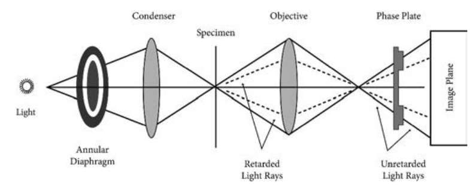
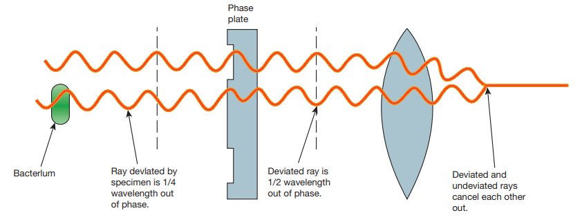
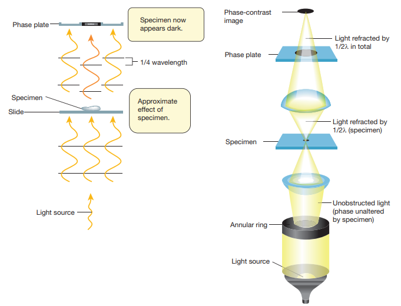
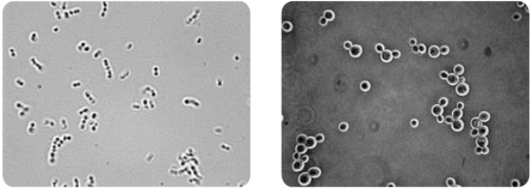
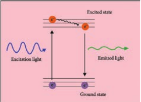
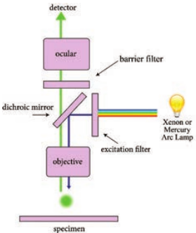
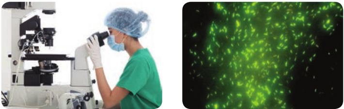
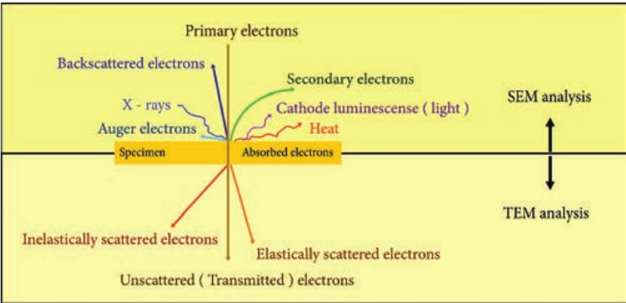
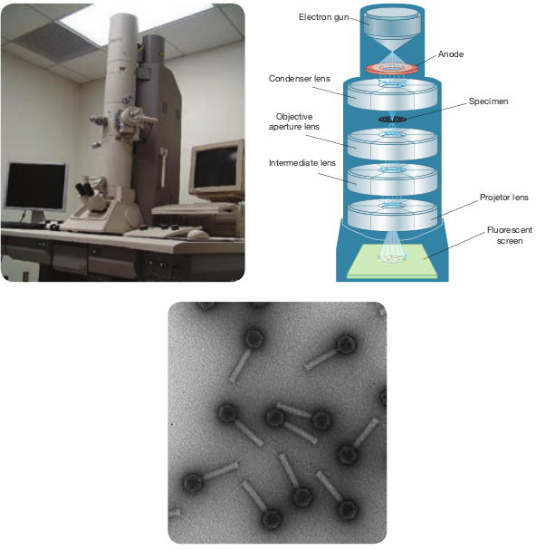
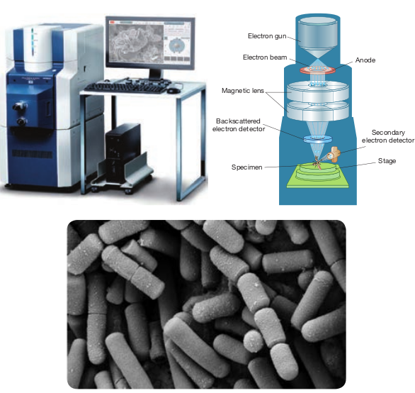

  

**Chapter Outline**

**2.1** Phase Contrast Microscope

**2.2** Fluorescence Microscope

**2.3** Electron Microscope

After studying this chapter the students will be able to,

_- Identify the principle components of Phase Contrast, Fluorescence and Electron Microscope._

_- Understand the optics in different light microscope and image formation mechanism._

_- Know the principle, working mechanism of Phase Contrast, Fluorescent Microscope and Electron Microscope._

_- Differentiate Light and Electron Microscope._

_- Appreciate the applications of Phase Contrast, Fluorescence and Electron Microscopes._

**Learning Objectives**

**M**

**Chapter**

**2**

Microscopes are specialized optical instruments designed to produce magnified visual or photographic images of objects or specimens that are too small to be seen with naked eye. Today, more  

**icroscopy**

sophisticated compound light microscopes are routinely used in microbiology laboratories. In the previous year, we have

learnt about light microscopes that includes bright field and Dark-field microscopes. This year we are going to learn about other types of light microscopes such as phase contrast and fluorescence microscopes. Yet another well advanced microscope which uses electron as source rather than light – the electron microscope is also discussed in detail in this chapter.

## Phase Contrast Microscope

Frits Zernike a Dutch Physicist invented the Phase Contrast Microscope and was awarded Nobel Prize in 1953. It is the microscope which allows the observation of living cell. This microscopy uses special optical components to exploit fine differences in the refractive indices of water and cytoplasmic components of living cells to produce contrast.

### Principle

The phase contrast microscopy is based on the principle that small phase changes in the light rays, induced by differences in the thickness and refractive index of the different parts of an object, can be transformed into

  

differences in brightness or light intensity. The phase changes are not detectable to human eye whereas the brightness or light intensity can be easily detected.

### Optical Components of Phase Contrast Microscope (PCM)

The phase contrast microscope is similar to an ordinary compound microscope in its optical components. It possesses a light source, condenser system, objective lens system and ocular lens system (Figure 2.1).

A phase contrast microscope differs from bright field microscope in having, i. Sub-stage annular diaphragm (phase

condenser) An annular aperture in the diaphragm is placed in the focal plane of the sub-stage which controls the illumination of the object. This is located below the condenser of the microscope. This annular diaphragm helps to create a narrow, hollow cone of light to illuminate the object.

ii. Phase – plate (diffraction plate or phase retardation plate)

This plate is located at the back focal plane of the objective lenses. The phase plate has two portions, in which one is coated with light retarding material (Magnesium fluoride) and the other portion devoid of light retarding material but can absorb light. This plate helps to reduce the phase of the incident light (Figure 2.2).

### Working Mechanism of Phase Contrast Microscopy

The unstained cells cannot create contrast under the normal microscope. However, when the light passes through an unstained

cell, it encounters regions in the cell with different refractive indexes and thickness. When light rays pass through an area of high refractive index, it deviates from its normal path and such light rays experience phase change or phase retardation (deviation). Light rays pass through the area of less refractive index

hase contrast microscope

  

remain non-deviated (no phase change). Figure 2.3 shows the light path in phase contrast microscope.

Deviated 1/2 wave out of ph

Phase plate

Ray devlated by specimen is 1/4 wavelength out of phase.

Bacterlum

Approximate effect of specimen.

1/4 wavelength

Specimen now appears dark.

Light source

Specimen

Slide

Phase plate

How does phase contrast microscope differ from Bright Field microscope?

**HOTS**

ray is length ase.

Deviated and undeviated rays cancel each other out.

se contrast microscopy by phase plate

Specimen

Annular ring

Unobstructed light (phase unaltered by specimen)

Light source

Light refracted by 1/2 in total

Light refracted by 1/2 (specimen)

Phase plate

Phase-contrast image

hase contrast microscopy

|------|------|

  

The difference in the phases between the retarded (deviated) and un-retarded (non-deviated) light rays is about ¼ of original wave length (i.e., λ/4). Human eyes cannot detect these minute changes

Whenever light (or any wave in general) goes from one medium to another, some of the energy of the wave is “reflected” back through the first medium cut the same angle as the incident wave and some of the energy is refracted (bent). Through the second medium when light goes from a low refractive index medium to a high refractive index medium such as air to water the reflection undergoes a 180° phase change. Light waves that are in phase (that is, their peaks and valleys exactly coincide) reinforce one another and their total intensity increases.

Light waves that are out of phase by exactly one-half wavelength cancel each other and result in no intensity. That is darkness wavelengths that are out of phase by any amount will produce some degree of cancellation and result in brightness less than maximum, but more than darkness. Thus, contrast is provided by differences is light intensity that result from differences in refractive indices in parts of the specimen that put light waves indices in parts of the specimen that put light waves more or less out of phase. As a result, the specimen appears as various levels of darks against a bright background.

**Infobits**  

in the phase of light. The phase contrast microscope has special devices such as annular diaphragm and phase plate, which convert these minute phase changes into brightness (amplitude) changes, so that a contrast difference can be created in the final image. This contrast difference can be easily detected by human eyes.

In phase contrast microscope, to get contrast, the diffracted waves have to be separated from the direct waves. This separation is achieved by the sub-stage annular diaphragm.

The annular diaphragm illuminates the specimen with a hollow cone of light. Some rays (direct rays) pass through the thinner region of the specimen and do not undergo any deviation and they directly enter into the objective lens. The light rays passing through the denser region of the specimen get regarded and they run with a delayed phase than the non- deviated rays. Both the deviated and non deviated light has to pass through the phase plate kept on the back focal plane of the objective to form the final image. The difference in phase (Wavelength) gives the contrast for clear visibility of the object. Figure 2.4 Microscopic image comparing phase and bright field microscopy.

### Applications

- Phase contrast microscope enables the visualization of unstained living cells.

- It makes highly transparent objects more visible.

  

- It is used to examine various intracellular components of living cells at relatively high resolution.

- It helps in studying cellular events such as cell division.

- It is used to visualize all types of cellular movements such as chromosomal and flagellar movements.

## Fluorescence Microscope

Fluorescence microscope is a very powerful analytical tool that combines the magnifying properties of light microscope with visualization of fluorescence.

Fluorescence microscope is a type of light microscope which instead of utilizing visible light to illuminate specimens, uses a higher intensity (lower wavelength) light source that excites a fluorescent molecule called a fluorophore (also known as fluorochrome). Fluorescence is a phenomenon that takes place when the substances (fluorophore) absorbs light at a given wavelength and emits light at a higher wavelength. Thus, fluorescence microscopy combines the magnifying  

eld microscope **(b)** _Saccharomyces_ under

British scientist Sir George G. Stokes first described fluorescence in 1852. He observed that the fluorophore emitted red light, when it was illuminated by ultraviolet excitation. Stokes noted that fluorescence emission always occurred at a longer wavelength than of the excitation light. This shift towards longer wavelength is known as stokes shift.

**Infobits**

properties of the light microscope with fluorescence technology.

  

The fluorophore absorbs photons leading to electrons moving to a higher energy state (excited state). When the electrons return to the ground state by losing energy, the fluorophore emits light of a longer wavelength (Figure 2.5). Three of the most common fluorophores used are Diamidino – phenylindole (DAPI) (emits blue), Fluorescein isothiocyanate (FITC) (emits green), and Texas Red (emits red).

### Principle

Light source such as Xenon or Mercury Arc Lamp which provides light in a wide range of wavelength, from ultraviolet to the infrared is directed through an exciter filter (selects the excitation wavelength). This light is reflected toward the sample by a special mirror called a dichroic mirror, which is designed to reflect light only at the excitation wavelength. The reflected light passes through the objective where it is focused onto the fluorescent specimen. The emissions from the specimen are in turn, passed back up through the objective where magnification of the image occurs and through the dichroic mirror.

This light is filtered by the barrier filter, which selects for the emission wavelength and filters out contaminating light from the arc lamp or other sources that are reflected off from the microscope components. Finally, the filtered fluorescent emission is sent to a detector where the image can be digitized.

### Components of Fluorescence Microscope

The main components of the fluorescent microscope resemble the traditional light microscope. However, the two main  

difference are the type of light source used and the use of the specialized filter elements (Figure 2.6).

**Light source** Fluorescence microscopy requires a very powerful light source such as a Xenon or Mercury Arc Lamp. The light emitted from the Mercury Arc Lamp 10–100 times brighter than most incandescent lamps and provides light in a wide range of wavelengths from ultra-violet to the infrared. Lasers or high-power LEDs were mostly used for complex fluorescence microscopy techniques.

**Filter elements** A typical fluorescence microscope consists of three filters: excitation, emission and the dichroic beam splitter.

Excitation filters: It is placed within the illumination path of a fluorescence microscope. Its purpose is to filter out all

  

wavelength of the light source, except for the excitation range of the fluorophore in the sample or specimen of interest.

Emission filters: The emission filter is placed within the imaging path of a fluorescence microscope. Its purpose is to filter out the entire excitation range and to transmit the emission range of the fluorophore in the specimen.

Dichroic filter or beam splitter: The dichroic filter or beam splitter is placed in between the excitation filter and emission filter, at 45° angle. Its purpose is to reflect the excitation wavelength towards the fluorophore in the specimen, and to transmit the emission wavelength towards the detector.

Fluorescence is called “cold light” because it does not come from a hot source like an

incandescent light bulb.

### Working Mechanism

The specimen to be observed are stained or labeled with a fluorescent dye and then illuminated with high intensity ultra violet light from mercury arc lamp. The light passes through the exciter filter that allows only blue light to pass through. Then the blue light reaches dichroic mirror and reflected downward to the specimen. The specimen labeled with fluorescent dye absorbs blue light (shorter wavelength) and emits green light. The emitted green light goes upward and passes through dichroic mirror, reflects back blue light and allows only green light to pass the objective lens,  

then it reaches barrier filter which allows only green light. The filtered fluorescent emission is sent to a detector where the image can be digitized Figure 2.7.

.

The Two Types of Fluorescence Microscopes includes diascopic fluorescene and episcopic fluorescene. **Diascopic Fluorescence:** K. Reichert and O. Heimstadt demonstrated a fluorescence microscope using auto fluorescent specimens in 1911.

This first type of fluorescence microscopy used transmitted light. Light from the illumination source first passes through an excitor filter and subsequently to the specimen through a dark field condenser. This eliminates most of the excitation light from the imaging side of the system. **Episcopic Fluorescence:** In episcopic fluorescence microscopy, the excitation light comes from above the specimen through the objective lens. This is the most common form of fluorescence microscopy today. In this microscope, objective lens acts as both condenser and objective. Quartz objective lenses are required for deep ultraviolet excitation.

**Infobits**

### Application

- Fluorescence microscope has become one of the most powerful techniques in biomedical research and clinical pathology.

  

- Fluorescence microscope allows the use of multicolour staining, labeling of structures within cells, and the measurement of the physiological state of a cell.

- Fluorescence microscope helps in observing texture and structure of coal.

- To study porosity in ceramics, using a fluorescent dye.

- To identify the Mycobacterium tuberculosis.

## Electron Microscope

Examining the ultra structure of cellular components such as nucleus, plasma membrane, mitochondria and others requires 10,000X plus magnification which was just not possible using Light Microscopes. This is achieved by Electron microscopes which have greater resolving power than light microscopes and can obtain higher magnifications.

In an electron microscope, a focused electron beam is used instead of light to examine objects. Electrons are considered as radiation with wavelength in the range 0.001–0.01 nm compared to 400–700 nm wavelength of visible light used in an optical microscope. Optical microscopes

have a maximum magnification power of 1000X, and resolution of 0.2 μm compared to resolving power of the electron microscope that can reach 1,000,000 times and resolution of 0.2 nm. Hence, electron microscopes deliver a more detailed and clear image compared to optical microscopes. Table 2.1 differentiate electron microscope from light microscope.

In 1924, a French sci- entist, Dr. De Broglie, showed that an elec- tron beam behaved

like waves and had a wavelength much shorter than the sizes of mole- cules and atom when accelerated.

**Types of Electron Microscopes**

- Transmission electron microscopes (TEM)

- Scanning electron microscopes (SEM. 
- Scanning transmission electron

microscopes (STEM) The electron microscope was invented

in 1931 by two German scientists, Ernst Ruska and Max Knoll. Ernst Ruska later

**(b)** Tubercule bacilli stained using Fluorescent dye observed under Fluorescence microscope

  

**Table 2.1: Difference between light and electron**

**S.No Light microscope**

1\. Light is the illuminating source

2\. Specimen preparation takes usually few minutes to hours. Live or dead specimen may be seen

3\. Condenser, objective and eye piece lenses are made up of glasses

4\. Specimen is stained by coloured dyes

5\. It has low resolving power (0.25µm to 0.3 µm). It has a magnification of 500X to 1500X

6\. Vacuum is not required

7\. Image is seen by eyes through ocular lens

received Nobel Prize for his work in 1986. The Transmission Electron Microscope (TEM) was the first type of Electron Microscope to be developed.

### Principle

The fundamental principle of electron microscope is similar to light microscope. In electron microscope, a high velocity beam of electrons is used instead of photons. In the electron gun, electrons are emitted from the surface of the cathode and accelerated towards the anode by high voltage to form a high energy electron beam. All lenses in the electron microscope are electromagnetic. Charged electrons interact with the magnetic fields and magnetic force focuses an electron beam. The condenser lens system controls the beam diameter and convergence  

angles of the beam incident on a specimen. The image is formed either by using the transmitted beam or by using the diffracted beam. The image is magnified and focused onto an imaging device, such as a fluorescent screen, on a layer of photographic film, or to be detected by a sensor.

**Sample Preparation** Preparation of specimens is the most complicated and skillful step in EM. The material to be studied under electron microscopy must be well preserved, fixed, completely dehydrated, ultrathin and impregnated with heavy metals that sharpen the difference among various organelles.

The material is preserved by fixation with glutaraldehyde and then with

microscope

**Electron microscope**

The beam of electrons is the electron source Specimen preparation takes usually takes a few days. Only dead or dried specimen are seen All lenses are electromagnetic

Specimen is coated with heavy metals in order to reflect electrons

It has high resolving power (0.001µm), about 250 times higher than light microscope. It has a magnification more than 100,000X Vacuum is essential for its operation

Image is produced on fluorescent screen or photographic plate

| S.N o |L ig ht mi cr os c op e |E l e c tron mi cr os c op e |
|------|------|------|
| 1. |L ig ht i s t he i l lumin at in g s our ce |Th e b e am o f e le c t rons i s t he e le c t rons our ce |
| 2. |Sp e cim en p rep ara t io n t a kes u su a l lyfe w min utes t o h our s. L ive o r de adsp e cim en m ay b e s e en |Sp e cim en p rep ara t io n t a kes u su a l lyt a kes a f e w d ays. On ly de ad o r dr ie dsp e cim en a re s e en |
| 3. |C onden s er, o bj e c t ive a nd e ye p ie celen s es a re m ade u p o f g l ass es |A l l len s es a re e le c t romag net ic |
| 4. |Sp e cim en i s s t ain e d b y co lo ur e d d yes |Sp e cim en i s co ate d w it h h e av y m et a lsin o rder t o r ef le c t e le c t rons |
| 5. |It h as lo w r es olv in g p ower (0.25µm t o0.3 µm). I t h as a m ag nif ic at io n o f 500Xto 1500X |It h as hig h r es olv in g p ower (0.001µm),ab out 250 t im es hig her t han lig htmicr os co p e. I t h as a m ag nif ic at io nmore t han 100,000X |
| 6. |Vac uum i s n ot r e quir e d |Vac uum i s es s en t i a l f or i ts o p era t io n |
| 7. |Image i s s e en b y e yes t hr oug h o c u l arlen s |Image i s p ro duce d o n f luo res cen ts cr e en o r p hotog ra phic p l ate |
  

osmium tetroxide. The fixed material is dehydrated and then embedded in plastic (epoxy resin) and sectioned with the help of diamond or glass razor of ultra-microtome.

In TEM, sample sections are ultrathin about 50–100 nm thick. These sections are placed on a copper grid and exposed to electron dense materials like lead acetate, uranylacetate, phosphotungstate. In SEM, samples can be directly imaged by mounting them on an aluminum stub.

**Electron–Sample Interactions** Interaction of electron beam with the sample results in different types of electrons: Elastic scattered electrons, Inelastic scattered electrons, secondary electrons and backscattered electrons. Almost all types of electron interactions can be used to retrieve information about

the specimen. Depending on the kind of radiation or emitted electrons which are used for detection, different properties of the specimen such as topography, elemental composition can be concluded. Figure 2.8 shows the interaction of the electron beam with the specimen.

In Transmission electron microscope (TEM), a beam of electrons is transmitted through an ultrathin specimen, interacting with the specimen as it passes through. An image is formed from the interaction of the transmitted unscattered electrons through the specimen.

Secondary electrons are mainly used in scanning electron microscope (SEM) for imaging the surface topography of biological specimens. The interaction of electron beam with samples results in secondary electrons and backscattered electrons that are detected by standard SEM equipment.

lectron beams with specimen

  

### Working Principle and Instrumentation of TEM

The optics of the TEM is similar to conventional transmission light microscope. A transmission electron microscope has the following components, 1. Electron gun 2. Condenser lens 3. Specimen stage 4. Objective lens and projector lens 5. Screen/photographic film/Charged

Coupled Device (CCD) camera Electron Gun consists of a tungsten

filament or cathode that emits electrons on receiving high voltage electric current (50,000–100,000 volts). A high voltage between the electron source (cathode) and an anode plate is applied leading to an electrostatic field through which the electrons are accelerated.

The emitted electrons travel through vacuum in the microscope column. Vacuum is essential to prevent strong scattering of electrons by gases. Electromagnetic condenser lenses focus the electrons into a very thin beam. Electron beam then travels through the specimen and then through the electromagnetic objective lenses. In a TEM microscope, the sample is located in the middle of the column. At the bottom of the microscope, unscattered electrons hit the fluorescent screen giving image of specimen with its different parts displayed in varied darkness, according to their density. The image can be studied directly, photographed or digitally recorded. Figure 2.9 show the arrangement  

of components for transmission electron microscope.

Information that can be obtained using TEM include,

- Topography: surface features, texture

- Morphology: shape and size of the particles

- Crystallographic arrangement of atoms

- Composition: elements and the their relative amounts

### Working Principle and Instrumentation of SEM

It is first built by Knoll in 1935. It is used to study the three dimensional images of the surfaces of cells, tissues or particles. The SEM allows viewing the surfaces of specimens without sectioning. The specimen is first fixed in liquid propane at-180°C and then dehydrated in alcohol at-70°C. The dried specimen is then coated with a thin film of heavy metal, such as platinum or gold, by evaporation in a vacuum provides a reflecting surface of electrons. In SEMs, samples are positioned at the bottom of the electron column and the scattered electrons (back- scattered or secondary) are captured by electron detectors.

In SEM, there are several electromagnetic lenses, including condenser lenses and one objective lens. Electromagnetic lenses are for electron probe formation, not for image formation directly, as in TEM. Two condenser lenses reduce the crossover diameter of the electron beam. The objective lens

  

further reduces the cross-section of the electron beam and focuses the electron beam as probe on the specimen surface (Figure 2.10). Objective lens thus functions like a condenser. This is in contrast to TEM where objective lens does the magnification. Major difference between SEM and TEM are given in Table 2.2. SEMs are equipped with an energy dispersive spectrometer (EDS) detection

Inte

O ape

Co

system which is able to detect and display most of the X-ray spectrum. The detector normally consists of semiconducting silicon or germanium.

**Scanning transmission electron microscopy (STEM)** combines the principles of transmission electron microscopy and scanning electron microscopy and can be performed on either type of instrument. Like TEM,

Electron gun

Anode

Specimen

Projetor lens

Fluorescent screen

rmediate lens

bjective rture lens

ndenser lens

omponents of TEM **(c)** image under TEM

  

**Foldscope – origami based paper microscope** A foldscope is an optical microscope that can be

assembled from simple components, including a sheet of paper and a lens. It was developed by an Indian Manu Prakash. It consists of the following parts which are as follows: Lens stage, sample stage, panning guide, ramp, lens and magnetic cuppler. It has the magnification of 140X and maximum of 2400X

el

STEM requires very thin samples and the primary electron beam is transmitted by the sample. One of its principal advantages over TEM is in enabling the use of other of signals that cannot be spatially correlated in TEM, including secondary electrons, scattered beam electrons, characteristic X-rays, and electron energy loss.

**Summary**

Microscopes are specialized optical instruments designed to produce magnified visual or photographic images of objects or specimens that are too small to be seen with

Secondary electron detector

Electron gun

Electron beam Anode

Stage Specimen

Backscattered ectron detector

Magnetic lens

**)** Components of SEM **(c)** image under SEM

  

**Table 2.2: Difference between SEM and TEM**

**S.no Properties SE**

1\. Types of electrons It is based electrons that from the su specimen

2\. Sample preparation Sample can thickness an with a thin lay metal such palladium and an aluminum s

3\. Resolution The resolution

4\. Magnification The magnifyi SEM is up to 1

5\. Image formation SEM provi dimensional Secondary or b electrons ar detected and computer scre

6\. Application SEM is used topography composition o  

**M TEM**

on scattered are emitted rface of a

It is based on transmitted electrons

be of any d is coated er of a heavy as gold or mounted on lab

Laborious sample preparation is required. The sample has to be cut into thin sections so as to allow electrons to pass through it and are supported on TEM grids

is up to 20nm TEM has much higher resolution than SEM. It can resolve objects as close as 1nm

ng power of 00,000X

The magnifying power of TEM is up to 5,000,000X

des a 3 image.

ack scattered e captured, displayed on

en

TEM provides a 2 dimensional image. Transmitted electrons hit a fluorescent screen giving rise to a shadow image. The image can be studied directly by the operator or photographed with a camera

to study the and atomic f specimens

TEM is used to study the interior of cells, the structure of protein molecule, the organization of molecules in viruses and cytoskeletal filaments and the arrangement of protein molecules in cell membranes

| S.no |Prop er ti e s |SE M |TEM |
|------|------|------|------|
| 1. |Typ es o f e le c t rons |It i s b as e d o n s c atter e dele c t rons t hat a re emi tte df rom t he s ur face o f asp e cim en |It i s b as e d o n t ra nsmi tte del ec tr ons |
| 2. |Sa mple p rep ara t io n |Sa mple c an b e o f a nyt hic k nes s a nd i s co ate dw it h  a t hin  l ayer o f  a  he av ymet a l  suc h  as  gold o rp a l l adi um a nd m oun te d o nan a lumin um s l ab |L ab or io us s ampleprep ara t io n i s r e quir e d.Th e s ample h as t o b ec ut in to t hin s e c t io ns s oas t o a l lo w e le c t rons t op ass t hr oug h i t a nd a resupp or te d o n TEM g r id s |
| 3. |R e s olut i on |Th e res olut io n is up to 20nm |TEM h as m uc h hig herres olut io n t han S EM. I tc an r es olve o bj e c ts a sclos e a s 1nm |
| 4. |Mag nif ic at io n |Th e m ag nif y in g p ower o fSEM i s u p t o 100,000X |Th e m ag nif y in g p ower o fTEM i s u p t o 5,000,000X |
| 5. |Image  f or mat i on |SEM p rov ides a 3dim en sio na l im age.S e co nd ar y o r b ac k s c atter e dele c t rons a re c aptur e d,det e c te d a nd di spl aye d o nco mputer s cr e en |TEM p rov ides a 2dim en sio n a l im a ge .Tra nsmi tt e d e le c t ronshi t a f luo res cen t s cr e eng i v in g r i s e t o a s h ado wim a ge . Th e im a ge c an b es tudie d dir e c t l y b y t h eop era t or or ph ot og ra p h e dw it h a c am era |
| 6. |Applic at io n |SEM i s u s e d t o s tud y t hetop og ra phy a nd a tomicco mp osi t io n o f s p e cim en s |TEM i s u s e d t ostud y t he in ter io r o fce l ls, t he s t r uc tur eof  protein  mole c u le ,t he  orga niza t io n  ofmole c u les in v ir us es a ndc yt os kelet a l f i l amen tsand t he a r ra ngem en t o fprotein m ole c u les in ce l lmem bra nes |
  

naked eye. Frits Zernike a Dutch Physicist invented the Phase Contrast Microscope and was awarded Nobel Prize in 1953. It is the first microscopic method which allows the observation of living cell. The image of the aperture is formed at the rear focal plane of the objective. In this plane there is a phase shifting element or phase plate. Deviated rays from object form structures due to different refractive index. Light waves that are in phase (that is, their peaks and valleys exactly coincide) reinforce one another and their total intensity increases. Light waves that are out of phase by exactly one-half wavelength cancel each other and result in no intensity. Fluorescence microscopy is a very powerful analytical tool that combines the magnifying properties of light microscopy with visualization of fluorescence. Examining the ultra structure of cellular components such as nucleus, plasma membrane, mitochondria and others requires 10,000x plus magnification which was just not possible using Light Microscopes. It is first built by Knoll in 1935. It is used to study the three dimensional images of the surfaces of cells, tissues or particles. The SEM allows viewing the surfaces of specimens without sectioning. The specimen is first fixed in liquid propane at-180°C and then dehydrated in alcohol at-70°C. **Scanning transmission electron microscopy (STEM)** combines the principles of transmission electron microscopy and scanning electron microscopy and can be performed on either type of instrument. One of its principal advantages over TEM is in enabling the use of other of signals that cannot be spatially correlated in TEM, including secondary electrons, scattered beam electrons, characteristic X-rays, and electron energy loss.  

**Evaluation**

**Multiple choice questions**

1\. Who invented phase contrast microscope? a. Robert Koch b. Frits Zernike c. George Strokes d. Alexander Fleming

2\. The component that makes the difference between phase contrast microscope and Bright Field microscope is a. Objective b. Phase plate c. Condenser d. Occular

3\. Tumor cells can be diagnosed by a. PCM b. BFM c. Light Microscope d. Electron Microscope

4\. In electron microscope light source is a. Electric light b. Electron Beam c. Sun light d. Fluorescent

light 5. What is the medium used in electron

microscope? a. Air b. Water c. Vacuum d. Light

6\. are mainly used in scanning electron microscope a. Transmitted electrons b. Primary electrons c. Secondary electrons d. Elastically scattered electrons

7\. Lenses used in TEM a. Objective lens b. Electromagnetic lens c. Glass lenses d. Condensor lenses

  

8\. is used to illuminate specimen in fluorescent microscope a. Mercury arc lamp b. Sunlight c. Tungsten lamp d. LED

9\. Which among the following help us in getting a 3-D picture of specimen? a. TEM b. SEM c. Compound microscope d. Simple microscope

10\. Dye used to stain specimen in fluroscent microscopic view a. Acridine dye b. Rezazurin c. Methylene Blue d. Flurochrome

**Answer the following** 1\. Principle of PCM 2. Write about the special features of

TEM 3. List out the dyes used for fluorescence

microscopy 4. What are the different types of filters

used in fluorescence microscopy 5. Define flurochromes. 6. Write the functions of Barrier filter 7. Write the components of PCM 8. What are the Application of EM 9. Write about TEM – Introduction and

Principle 10. Write a brief account on the

application of fluorescent microscopy 11. Explain in detail about the principle

construction and working of PCM. 12. Explain the Principle, Components

and Mechanism of EM.

